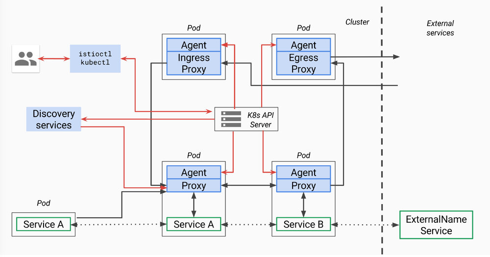

本文分析的istio代码版本为0.8.0，commit为0cd8d67，commit时间为2018年6月18日。

本文为`Service Mesh深度学习系列`之一：

- [Service Mesh深度学习系列part1—istio源码分析之pilot-agent模块分析](/blog/istio-service-mesh-source-code-pilot-agent-deepin)
- [Service Mesh深度学习系列part2—istio源码分析之pilot-discovery模块分析](/blog/istio-service-mesh-source-code-pilot-discovery-module-deepin)
- [Service Mesh深度学习系列part3—istio源码分析之pilot-discovery模块分析（续）](/blog/istio-service-mesh-source-code-pilot-discovery-module-deepin-part2)

## pilot总体架构 

上面是[官方关于pilot的架构图](https://github.com/istio/old_pilot_repo/blob/master/doc/design.md)，因为是old_pilot_repo目录下，可能与最新架构有出入，仅供参考。所谓的pilot包含两个组件：pilot-agent和pilot-discovery。图里的agent对应pilot-agent二进制，proxy对应envoy二进制，它们两个在同一个容器中，discovery service对应pilot-discovery二进制，在另外一个跟应用分开部署的单独的deployment中。   

1. **discovery service**：从Kubernetes apiserver list/watch service/endpoint/pod/node等资源信息，监听istio控制平面配置信息（Kubernetes CRD），翻译为envoy可以直接理解的配置格式。
2. **proxy**：也就是envoy，直接连接discovery service，间接地从Kubernetes apiserver等服务注册中心获取集群中微服务的注册情况
3. **agent**：本文分析对象pilot-agent，生成envoy配置文件，管理envoy生命周期
4. **service A/B**：使用了istio的应用，如Service A/B的进出网络流量会被proxy接管

> 对于模块的命名方法，本文采用模块对应源码main.go所在包名称命名法。其他istio分析文章有其他命名方法。比如pilot-agent也被称为istio pilot，因为它在Kubernetes上的部署形式为一个叫istio-pilot的deployment。


## pilot-agent的部署存在形式
pilot-agent在pilot/cmd包下面，是个单独的二进制。 

pilot-agent跟envoy打包在同一个docker镜像里，镜像由Dockerfile.proxy定义。Makefile（include了tools/istio-docker.mk）把这个dockerfile build成了`${HUB}/proxy:${TAG}`镜像，也就是Kubernetes里跟应用放在同一个pod下的sidecar。非Kubernetes情况下需要把pilot-agent、envoy跟应用部署在一起，这个就有点“污染”应用的意思了。  

> 支持v2 api的sidecar镜像为proxyv2，镜像中包含的pilot-agent和envoy二进制文件和proxy镜像中的完全相同，只是使用不同的envoy bootstrap配置（envoy_bootstrap_tmpl.json vs. envoy_bootstrap_v2.json）。但是当前仅完成部分开发工作，makefile中build proxyv2镜像的target默认也不会自动执行。

> 以上的HUB和TAG是编译istio源码过程中makefile中的一些变量，HUB对应镜像保存的仓库，TAG默认为istio版本号，如0.8.0。

## pilot-agent功能简述
在proxy镜像中，pilot-agent负责的工作包括：

1. 生成envoy的配置
2. 启动envoy
2. 监控并管理envoy的运行状况，比如envoy出错时pilot-agent负责重启envoy，或者envoy配置变更后reload envoy

而envoy负责接受所有发往该pod的网络流量，分发所有从pod中发出的网络流量。  

> 根据代码中的sidecar-injector-configmap.yaml（用来配置如何自动化地inject istio sidecar），inject过程中，除了proxy镜像作为sidecar之外，每个pod还会带上initcontainer（Kubernetes中的概念），具体镜像为proxy_init。proxy_init通过注入iptables规则改写流入流出pod的网络流量规则，使得流入流出pod的网络流量重定向到proxy的监听端口，而应用对此无感。

## pilot-agent主要功能分析之一：生成envoy配置
envoy的配置主要在pilot-agent的init方法与proxy命令处理流程的前半部分生成。其中init方法为pilot-agent二进制的命令行配置大量的flag与flag默认值，而proxy命令处理流程的前半部分负责将这些flag组装成为envoy的配置ProxyConfig对象。下面分析几个相对重要的配置。

### role
pilot-agent的role类型为model包下的Proxy，决定了pilot-agent的“角色”，role包括以下属性：

1. Type
	pilot-agent有三种运行模式。根据role.Type变量定义，类型为model.Proxy，定义在context.go文件中，允许的3个取值范围为：
	1.	"sidecar"
	默认值，可以在启动pilot-agent，调用proxy命令时覆盖。Sidecar type is used for sidecar proxies in the application containers
	2. "ingress" 
	Ingress type is used for cluster ingress proxies
	3. "router" 
	Router type is used for standalone proxies acting as L7/L4 routers
2. IPAddress, ID, Domain 
	它们都可以通过pilot-agent的proxy命令的对应flag来提供用户自定义值。如果用户不提供，则会在proxy命令执行时，根据istio连接的服务注册中心（service registry）类型的不同，会采用不同的配置方式。agent当前使用的服务注册中心类型保存在pilot-agent的registry变量里，在init函数中初始化为默认值Kubernetes。当前只处理以下三种情况：
	1. Kubernetes
	2. Consul
	3. Other

| registry值 | role.IPAddress | rule.ID |role.Domain  |
|:--|:--|:--|:--|
|Kubernetes  | 环境变量INSTANCE_IP | 环境变量POD_NAME.环境变量POD_NAMESPACE | 环境变量POD_NAMESPACE.svc.cluster.local |
|Consul  | private IP,默认127.0.0.1 | IPAddress.service.consul |  service.consul|
|Other  |private IP,默认127.0.0.1  | IPAddress | “” |

其中的private ip通过`WaitForPrivateNetwork`函数获得。

Istio需要从服务注册中心（service registry）获取微服务注册的情况。当前版本中istio可以对接的服务注册中心类型包括：  

**Mock**

MockRegistry is a service registry that contains 2 hard-coded test services

**Config**

ConfigRegistry is a service registry that listens for service entries in a backing ConfigStore

**Kubernetes**

KubernetesRegistry is a service registry backed by k8s API server

**Consul**

ConsulRegistry is a service registry backed by Consul

**Eureka**

EurekaRegistry is a service registry backed by Eureka

**CloudFoundry**

CloudFoundryRegistry is a service registry backed by Cloud Foundry.

> [官方文档](https://istio.io/zh/docs/concepts/what-is-istio/)说当前支持Kubernetes、Nomad with Consul，未来准备支持 Cloud Foundry、Apache Mesos。另外根据[官方的feature成熟度文档](https://istio.io/zh/about/feature-stages/)，当前只有Kubernetes的集成达到stable程度，Consul、Eureka和Cloud Foundry都还是alpha水平。

### envoy配置文件及命令行参数
agent.waitForExit会调用envoy.Run方法启动envoy进程，为此需要获取envoy二进制所在文件系统路径和flag两部分信息：

1. envoy二进制所在文件系统路径：evony.Run通过proxy.config.BinaryPath变量得知envoy二进制所在的文件系统位置，proxy就是envoy对象，config就是pilot-agent的main方法在一开始初始化的proxyConfig对象。里面的BinaryPath在pilot-agent的init方法中被初始化，初始值来自`pilot/pkg/model/context.go`的`DefaultProxyConfig`函数，值是`/usr/local/bin/envoy`
2. envoy的启动flag形式为下面的startupArgs，包含一个`-c`指定的配置文件，还有一些flag。除了下面代码片段中展示的这些flag，还可以根据启动agent时的flag，再加上`--concurrency`, `--service-zone`等flag。

```go
startupArgs := []string{"-c", fname,
		"--restart-epoch", fmt.Sprint(epoch),
		"--drain-time-s", fmt.Sprint(int(convertDuration(proxy.config.DrainDuration) / time.Second)),
		"--parent-shutdown-time-s", fmt.Sprint(int(convertDuration(proxy.config.ParentShutdownDuration) / time.Second)),
		"--service-cluster", proxy.config.ServiceCluster,
		"--service-node", proxy.node,
		"--max-obj-name-len", fmt.Sprint(MaxClusterNameLength), 
	}
```
关于以上启动envoy的flag及其值的解释：

1. `--restart-epoch`：epoch决定了envoy hot restart的顺序，在后面会有详细描述，第一个envoy进程对应的epoch为0，后面新建的envoy进程对应epoch顺序递增1
2. `--drain-time-s`：在pilot-agent init函数中指定默认值为2秒，可通过pilot-agent proxy命令的drainDuration flag指定
3. `--parent-shutdown-time-s`：在pilot-agent init函数中指定默认值为3秒，可通过pilot-agent proxy命令的parentShutdownDuration flag指定
4. `--service-cluster`：在pilot-agent init函数中指定默认值为”istio-proxy"，可通过pilot-agent proxy命令的serviceCluster flag指定
5. `--service-node`：将agent.role的Type,IPAddress,ID和Domain用”~"连接起来

而上面的`-c`指定的envoy配置文件有几种生成的方式：  

1. 运行pilot-agent时，用户不指定customConfigFile参数（agent init时默认为空），但是制定了templateFile参数（agent init时默认为空），这时agent的main方法会根据templateFile帮用户生成一个customConfigFile，后面就视作用户制定了customConfigFile。这个流程在agent的main方法里
2. 如果用户制定了customConfigFile，那么就用customConfigFile
3. 如果用户customConfigFile和templateFile都没指定，则调用pilot/pkg包下的bootstrap_config.go中的WriteBootstrap自动生成一个配置文件，默认将生成的配置文件放在`/etc/istio/proxy/envoy-rev%d.json`，这里的`%d`会用epoch序列号代替。WriteBootstrap在envoy.Run方法中被调用

举个例子的话，根据参考文献中某人实验，第一个envoy进程启动参数为：

```bash
-c /etc/istio/proxy/envoy-rev0.json --restart-epoch 0
--drain-time-s 45 --parent-shutdown-time-s 60
--service-cluster sleep 
--service-node sidecar~172.00.00.000~sleep-55b5877479-rwcct.default~default.svc.cluster.local 
--max-obj-name-len 189 -l info --v2-config-only
```

如果使用第三种方式自动生成默认的envoy配置文件，如上面例子中的envoy-rev0.json，那么pilot-agent的proxy命令处理流程中前半部分整理的大量envoy参数中的一部分会被写入这个配置文件中，比如`DiscoveryAddress`，`DiscoveryRefreshDelay`，`ZipkinAddress`，`StatsdUdpAddress`。

### 证书文件
agent会监控chainfile，keyfile和rootcert三个证书文件的变化，如果是Ingress工作模式，则还会加入ingresscert、ingress key这两个证书文件。


## pilot-agent主要功能分析之二：envoy监控与管理

为envoy生成好配置文件之后，pilot-agent还要负责envoy进程的监控与管理工作，包括：

1. 创建envoy对象，结构体包含proxyConfig（前面步骤中为envoy生成的配置信息），role.serviceNode(似乎是agent唯一标识符），loglevel和pilotsan（service account name）
2. 创建agent对象，包含前面创建的envoy结构体，一个epochs的map，3个channel：configCh, statusCh和abortCh
3. 创建watcher并启动协程执行watcher.Run 
	watcher.Run首先启动协程执行agent.Run（**agent的主循环**），然后调用watcher.Reload(kickstart the proxy with partial state (in case there are no notifications coming))，**Reload会调用agent.ScheduleConfigUpdate，并最终导致第一个envoy进程启动，见后面分析**。然后监控各种证书，如果证书文件发生变化，则调用ScheduleConfigUpdate来reload envoy，然后watcher.retrieveAZ(TODO)
4. 创建context，调用cmd.WaitSignal以等待进程接收到SIGINT, SIGTERM信号，接受到信号之后通过context通知agent，agent接到通知后调用terminate来kill所有envoy进程，并退出agent进程

> 上面的pilot/pkg/proxy包下的agent中采用Proxy接口管理pilot/pkg/proxy/envoy包下的envoy对象，从理论上来说也可以把envoy换成其他proxy实现管理。不过此事还牵扯discovery service等其他组件。

上面第三步启动协程执行的agent.Run是agent的主循环，会一直通过监听以下几个channel来监控envoy进程：  

1. agent的configCh:如果配置文件，主要是那些证书文件发生变化，则调用agent.reconcile来reload envoy  
2. statusCh:这里的status其实就是exitStatus，处理envoy进程退出状态，处理流程如下：
	0. 把刚刚退出的epoch从agent维护的两个map里删了，后面会讲到这两个map。把agent.currentConfig置为agent.latestEpoch对应的config，因为agent在reconcile的过程中只有在desired config和current config不同的时候才会创建新的epoch，所以这里把currentConfig设置为上一个config之后，必然会造成下一次reconcile的时候current与desired不等，从而创建新的envoy   
	1. 如果exitStatus.err是errAbort，表示是agent让envoy退出的（这个error是调用agent.abortAll时发出的），这时只要log记录epoch序列号为xxx的envoy进程退出了 
	2. 如果exitStatus.err并非errAbort，则log记录epoch异常退出，并给所有当前正在运行的其他epoch进程对应的abortCh发出errAbort，所以后续其他envoy进程也都会被kill掉，并全都往agent.statusCh写入exitStatus，当前的流程会全部再为每个epoch进程走一遍
	3. 如果是其他exitStatus（什么时候会进入这个否则情况？比如exitStatus.err是wait epoch进程得到的正常退出信息，即nil），则log记录envoy正常退出
	4. 调用envoy.Cleanup，删除刚刚退出的envoy进程对应的配置文件，文件路径由ConfigPath和epoch序列号串起来得到
	5. 如果envoy进程为非正常退出，也就是除了“否则”描述的case之外的2中情况，则试图恢复刚刚退出的envoy进程（可见前面向所有其他进程发出errAbort消息的意思，并非永远停止envoy，pilot-agent接下来马上就会重启被abort的envoy）。恢复方式并不是当场启动新的envoy，而是schedule一次reconcile。如果启动不成功，可以在得到exitStatus之后再次schedule（每次间隔时间为 $2^n*200$ 毫秒 ），最多重试10次（budget），如果10次都失败，则退出整个golang的进程（os.Exit）,由容器环境决定如何恢复pilot-agent。所谓的schedule，就是往agent.retry.restart写入一个预定的未来的某个时刻，并扣掉一次budget（budget在每次reconcile之前都会被重置为10），然后就结束当前循环。在下一个开始的时候，会检测agent.retry.restart，如果非空，则计算距离reconcile的时间delay
3. time.After（delay）:监听是否到时间执行schedule的reconcile了，到了则执行agent.reconcile  
4. ctx.Done:执行agent.terminate 
	terminate方法比较简单，向所有的envoy进程的abortCh发出errAbort消息，造成他们全体被kill（Cmd.Kill），然后agent自己return，退出当前的循环，这样就不会有人再去重启envoy

## pilot-agent主要功能分析之三：envoy启动流程

1. 前面pilot-agent proxy命令处理流程中，watcher.Run会调用agent.ScheduleConfigUpdate，这个方法只是简单地往configCh里写一个新的配置，所谓的配置是所有certificate算出的sha256哈希值
2. configCh的这个事件会被agent.Run监控到，然后调用agent.reconcile。
3. reconcile方法会**启动协程执行agent.waitForExit从而启动envoy** 
  看reconcile方法名就知道是用来保证desired config和current config保持一致的。reconcile首先会检查desired config和current config是否一致，如果是的话，就不用启动新的envoy进程。否则就启动新的envoy。在启动过程中，agent维护两个map来管理一堆envoy进程，在调用waitForExit之前会将desiredConfig赋值给currentConfig，表示reconcile工作完成：
  1. 第一个map是agent.epochs，它将整数epoch序列号映射到agent.desiredConfig。这个序列号从0开始计数，也就是第一个envoy进程对应epoch 0，后面递增1。但是如果有envoy进程异常退出，它对应的序列号并非是最大的情况下，这个空出来的序列号不会在计算下一个新的epoch序列号时（agent.latestEpoch方法负责计算当前最大的epoch序列号）被优先使用。所以从理论上来说序列号是会被用光的
  2. 第二个map是agent.abortCh，它将epoch序列号映射到与envoy进程一一对应的abortCh。abortCh使得pilot-agent可以在必要时通知对应的envoy进程推出。这个channel初始化buffer大小为常量10，至于为什么需要10个buffer，代码中的注释说buffer aborts to prevent blocking on failing proxy，也就是万一想要abort某个envoy进程，但是envoy卡住了abort不了，有buffer的话，就不会使得管理进程也卡住。
4. waitForExit会调用agent.proxy.Run，也就是**envoy的Run方法**，**这里会启动envoy**。envoy的Run方法流程如下：  
  1. 调用exec.Cmd.Start方法(启动了一个新进程)，并将envoy的标准输出和标准错误置为os.Stdout和Stderr。  

  2. 持续监听前面说到由agent创建并管理的，并与envoy进程一一对应的abortCh，如果收到abort事件通知，则会调用Cmd.Process.Kill方法杀掉envoy，如果杀进程的过程中发生错误，也会把错误信息log一下，然后把从abortCh读到的事件返回给waitForExit。waitForExit会把该错误再封装一下，加入epoch序列号，然后作为envoy的exitStatus，并写入到agent.statusCh里

  3. 启动一个新的协程来wait刚刚启动的envoy进程，并把得到的结果写到done channel里，envoy结构体的Run方法也会监听done channel，并把得到的结果返回给waitForExit 

这里我们总结启动envoy过程中的协程关系：agent是全局唯一一个agent协程，它在启动每个envoy的时候，会再启动一个waitForExit协程，waitForExit会调用Command.Start启动另外一个进程运行envoy，然后waitForExit负责监听abortCh和envoy进程执行结果。

> Cmd.Wait只能用于等待由Cmd.Start启动的进程,如果进程结束并范围值为0，则返回nil，如果返回其他值则返回ExitError，也可能在其他情况下返回IO错误等，Wait会释放Cmd所占用的所有资源  

每次配置发生变化，都会调用agent.reconcile，也就会启动新的envoy，这样envoy越来越多，老的envoy进程怎么办？agent代码的注释里已经解释了这问题，原来agent不用关闭老的envoy，同一台机器上的多个envoy进程会通过unix domain socket互相通讯，即使不同envoy进程运行在不同容器里，也一样能够通讯。而借助这种通讯机制，可以自动实现新envoy进程替换之前的老进程，也就是所谓的envoy hot restart。

> 代码注释原文：Hot restarts are performed by launching a new proxy process with a strictly incremented restart epoch. It is up to the proxy to ensure that older epochs gracefully shutdown and carry over all the necessary state to the latest epoch.  The agent does not terminate older epochs. 

而为了触发这种hot restart的机制，让新envoy进程替换之前所有的envoy进程，新启动的envoy进程的epoch序列号必须比之前所有envoy进程的最大epoch序列号大1。

> 代码注释原文：The restart protocol matches Envoy semantics for restart epochs: to successfully launch a new Envoy process that will replace the running Envoy processes, the restart epoch of the new process must be exactly 1 greater than the highest restart epoch of the currently running Envoy processes.  


## 参考文献
1. [下一代 Service Mesh -- istio 架构分析](https://juejin.im/post/5afad93ef265da0b7e0c6cfb)  
2. [istio源码分析——pilot-agent如何管理envoy生命周期](https://segmentfault.com/a/1190000015171622)  

## 本文作者

丁轶群博士，谐云科技CTO

2004年作为高级技术顾问加入美国道富银行(浙江)技术中心，负责分布式大型金融系统的设计与研发。2011年开始领导浙江大学开源云计算平台的研发工作，是浙江大学SEL实验室负责人，2013年获得浙江省第一批青年科学家称号，CNCF会员，多次受邀在Cloud Foundry, Docker大会上发表演讲，《Docker：容器与容器云》主要作者之一。
