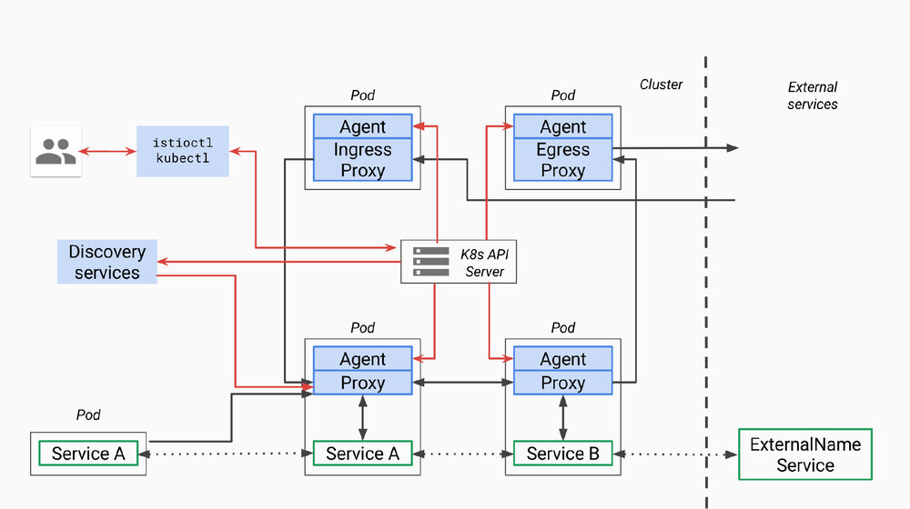
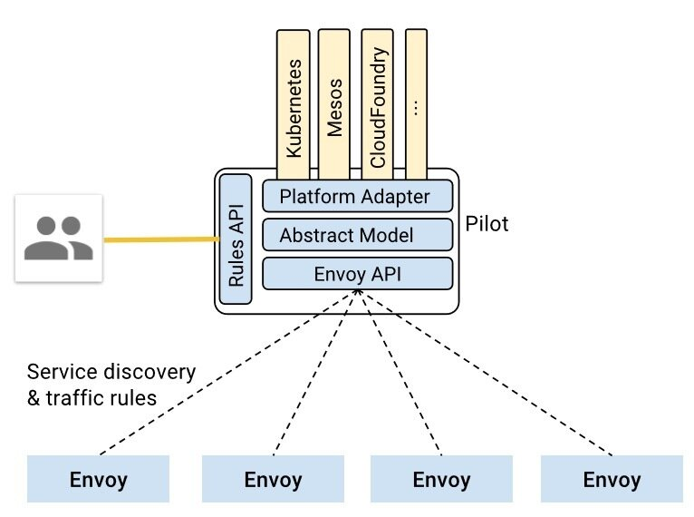

本文为`Service Mesh深度学习系列`之一：

- [Service Mesh 深度学习系列 part1—istio 源码分析之 pilot-agent 模块分析](/blog/istio-service-mesh-source-code-pilot-agent-deepin)
- [Service Mesh 深度学习系列 part2—istio 源码分析之 pilot-discovery 模块分析](/blog/istio-service-mesh-source-code-pilot-discovery-module-deepin)
- [Service Mesh 深度学习系列 part3—istio 源码分析之 pilot-discovery 模块分析（续）](/blog/istio-service-mesh-source-code-pilot-discovery-module-deepin-part2)

本文分析的 istio 代码版本为 0.8.0，commit 为 0cd8d67，commit 时间为 2018 年 6 月 18 日。

## pilot 总体架构



首先我们回顾一下 pilot 总体架构，上面是[官方关于 pilot 的架构图](https://github.com/istio/old_pilot_repo/blob/master/doc/design.md)，因为是 old_pilot_repo 目录下，可能与最新架构有出入，仅供参考。所谓的 pilot 包含两个组件：pilot-agent 和 pilot-discovery。图里的 agent 对应 pilot-agent 二进制，proxy 对应 Envoy 二进制，它们两个在同一个容器中，discovery service 对应 pilot-discovery 二进制，在另外一个跟应用分开部署的单独的 deployment 中。

1. **discovery service**：从 Kubernetes API Server list/watch `service`、`endpoint`、`pod`、`node`等资源信息，监听 istio 控制平面配置信息（如 VirtualService、DestinationRule 等），翻译为 Envoy 可以直接理解的配置格式。
2. **proxy**：也就是 Envoy，直接连接 discovery service，间接地从 Kubernetes 等服务注册中心获取集群中微服务的注册情况
3. **agent**：生成 Envoy 配置文件，管理 Envoy 生命周期
4. **service A/B**：使用了 istio 的应用，如 Service A/B，的进出网络流量会被proxy接管

> 对于模块的命名方法，本文采用模块对应源码 main.go 所在包名称命名法。其他 istio 分析文章有其他命名方法。比如 pilot-agent 也被称为 istio pilot，因为它在 Kubernetes 上的部署形式为一个叫 istio-pilot 的 deployment。

## pilot-discovery 的统一存储模型（Abstract Model）



根据上面官方的 pilot-discovery 架构图，pilot-discovery 有两个输入信息（黄色部分）

1. 来自 istioctl 的控制面信息，也就是图中的 Rules API，如 route rule、virtual service 等，这些信息以 Kubernetes CRD 资源形式保存
2. 来自服务注册中心的服务注册信息，也就是图上的 Kubernetes、Mesos、Cloud Foundry 等。在 Kubernetes 环境下包括`pod` 、`service`、`node`、`endpoint`

为了实现 istio 对不同服务注册中心的支持，如 Kubernetes、consul、Cloud Foundry 等，pilot-discovery 需要对以上两个输入来源的数据有一个统一的存储格式，也就是图中的 Abstract Model，这种格式就定义在 pilot/pkg/model 包下。

举例，下面列表罗列了 istio Abstract Model 中 service 的一些成员如何跟根据 Kubernetes 服务注册信息中的 service 对象转化得到：

1. `HostName`：`<name>.<namespace>.svc.cluster.local`
   其中`name`和`namespace`分别为 Kubernetes service 对象的 name 和所属的 namespace。cluster.local 为默认 domain suffix，可以通过 proxy-discovery `discovery`命令的`domain` flag 提供自定义值。
2. `Ports`：对应 Kubernetes service 的 spec.ports。
3. `Address`: 对应 Kubernetes service 的 spec.ClusterIP。
4. `ExternalName`: 对应 Kubernetes service 的 spec.ExternalName。
5. `ServiceAccounts`: 对应 Kubernetes service 的 annotation 中 key 值为 alpha.istio.io/kubernetes-serviceaccounts 和 alpha.istio.io/canonical-serviceaccounts 的 annotation 信息。
6. `Resolution`: 根据情况可以设置为 client side LB、DNS Lb 和 Passthrough。比如对于 ClusterIP 类型的 Kubernetes service，Resolution 设置为 client side LB，表示应用发出的请求由 sidecar（也就是 Envoy）负责做负载均衡，而对于 Kubernetes 中的 headless service 则设置为 Passthrough。

上面 pilot-discovery 架构图中的 Platform Adaptor 负责实现服务注册中心数据到 Abstract Model 之间的数据转换，在代码里，Platform Adaptor 包含两部分：

1. pilot/pkg/serviceregistry/kube/conversion.go里包括一系列将Kubernetes服务注册中心中的`label`、`pod`、`service`、`service port`等 Kubernetes 资源对象转换为 Abstract Model 中的对应资源对象的函数
2. pilot/pkg/config/kube/crd/conversion.go里包括将`DestinationRule`等 CRD 转换为 Abstract Model 中的`Config`对象的函数

在`pilot/pkg/bootstrap`包下的`Server`结构体代表 pilot-discovery，其中包含 3 个重要成员负责这两类信息的获取、格式转换、以及构建数据变更事件的处理框架：

1. `ConfigStoreCache` `ConfigStoreCache`对象中 embed 了`ConfigStore`对象。`ConfigStore`对象利用 client-go 库从 Kubernetes 获取 route rule、virtual service 等 CRD 形式存在控制面信息，转换为 model 包下的`Config`对象，对外提供`Get`、`List`、`Create`、`Update、Delete`等 CRUD 服务。而`ConfigStoreCache`在此基础之上还允许注册控制面信息变更处理函数。
2. `IstioConfigStore`
   IstioConfigStore 封装了 embed 在 ConfigStoreCache 中的同一个 ConfigStore 对象。其主要目的是为访问 route rule、virtual service 等数据提供更加方便的接口。相对于 ConfigStore 提供的`Get`、`List`、`Create`、`Update、Delete`接口，IstioConfigStore 直接提供更为方便的 RouteRules、VirtualServices 接口。
3. `ServiceController`
   利用 client-go 库从 Kubernetes 获取`pod` 、`service`、`node`、`endpoint`，并将这些 CRD 转换为 model 包下的 Service、ServiceInstance 对象。

> 在 istio 中，使用 istioctl 配置的 VirtualService、DestinationRule 等被称为 configuration，而从 Kubernetes 等服务注册中心获取的信息被称为 service 信息。所以从名称看`ConfigStoreCache`、`IstioConfigStore`负责处理第一类信息，`ServiceController`负责第二类。

## pilot-discovery 为 Envoy 提供的`xds`服务

### 所谓`xds`

基于上面介绍的统一数据存储格式 Abstract Model，pilot-discovery 为数据面（运行在 sidecar 中的 Envoy 等 proxy 组件）提供控制信息服务，也就是所谓的 discovery service 或者`xds`服务。这里的 x 是一个代词，类似云计算里的 XaaS 可以指代 IaaS、PaaS、SaaS 等。在 istio 中，`xds`包括`cds`(cluster discovery service)、`lds`(listener discovery service)、`rds`(route discovery service)、`eds`(endpoint discovery service)，而`ads`(aggregated discovery service) 是对这些服务的一个统一封装。

以上 cluster、endpoint、route 等概念的详细介绍和实现细节可以参考 Envoy 在社区推广的 data plane api（<https://github.com/envoyproxy/data-plane-api>），这里只做简单介绍：

1. endpoint：一个具体的“应用实例”，对应 ip 和端口号，类似 Kubernetes 中的一个 pod。
2. cluster：一个 cluster 是一个“应用集群”，它对应提供相同服务的一个或多个 endpoint。cluster 类似 Kubernetes 中 service 的概念，即一个 Kubernetes service 对应一个或多个用同一镜像启动，提供相同服务的 pod。
3. route：当我们做灰度发布、金丝雀发布时，同一个服务会同时运行多个版本，每个版本对应一个 cluster。这时需要通过 route 规则规定请求如何路由到其中的某个版本的 cluster 上。

以上这些内容实际上都是对 Envoy 等 proxy 的配置信息，而所谓的 cluster discovery service、route discovery service 等 xxx discovery service 就是 Envoy 等从 pilot-discovery 动态获取 endpoint、cluster 等配置信息的协议和实现。为什么要做动态配置加载，自然是为了使用`istioctl`等工具统一、灵活地配置 service mesh。

而为什么要用`ads`来“聚合”一系列`xds`，并非仅为了在同一个 gRPC 连接上实现多种`xds`来省下几个网络连接，`ads`还有一个非常重要的作用是解决`cds`、`rds`信息更新顺序依赖的问题，从而保证以一定的顺序同步各类配置信息，这方面的讨论可以详见[Envoy 官网](https://www.envoyproxy.io/docs/envoy/latest/configuration/overview/v2_overview#aggregated-discovery-service)。

> Envoy 有篇博客叫 The universal data plane API。按照 Envoy 的设想，社区中无论是是实现控制面的团队（比如 istio 自己），还是实现数据面的团队（比如 Envoy、nginx 等），大家都能参与并采用 github.com/envoyproxy/data-plane-api 上规定的这套控制面与数据面之间的 data plane api 接口。所以虽然 repo 叫 data plane api，但博客的名字加上了 universal 这个形容词。

### `xds`在 pilot-discovery 中的实现框架

pilot-discovery 在初始化 discovery service（`xds`服务）的过程中（`initDiscoveryService`方法），创建了 discovery server 对象，由它负责启动了两个 gRPC 服务：`eds`（endpoint discovery service）和`ads`（aggregated discovery service）。其中单独存在的`eds` gRPC 服务仅仅是为了向后兼容老版本 istio 而存在，0.8 版本的 istio 主要对外的 discovery service 就是指`ads`，而其中已经整合了`eds`。本文主要的分析的`xds`就是指`ads`。

> 本系列文章的上一篇中说明，pilot-discovery 在初始化 discovery service 的过程中创建了两个服务对象，其中第一个 discovery server 对象负责为 Envoy 提供 gRPC 协议的 discovery service，而第二个 discovery service 对象则负责为 Envoy 提供 REST 协议的 discovery service。

根据 Envoy 的 data plane api 定义，`ads`需要对外提供的 gRPC 接口`AggregatedDiscoveryServiceServer`只有`StreamAggregatedResources`一个方法。在 discovery service初始化过程中创建的pilot/pkg/proxy/envoy/v2包下的`DiscoveryServer`对象实现了 gRPC server 端接口。

> envoy 为方便第三方开发者开发控制面，提供了 go-control-plane 库。基于 go-control-plane 库，开发者可以方便地实现基于 gRPC 协议的 discovery service。istio 0.8 版使用的 go-control-plane 版本 commit 号为`bc01fbf`，在这个版本中`AggregatedDiscoveryServiceServer`接口就只有`StreamAggregatedResources`一个方法。但是在 go-control-plane 2018 年 7 月的一次 commit 中又为`AggregatedDiscoveryServiceServer`接口增加了`IncrementalAggregatedResources`方法，支持更为灵活的 discovery service 和 Envoy 之间的交互。

discovery server 的主要逻辑，就是在与每一个 Envoy 建立一个双向 streaming 的 gRPC 连接（Bidirectional streaming RPC）之后：

1. 启动一个协程从 gRPC 连接中读取来自 Envoy 的请求
2. 在原来的协程中处理来自各 gRPC 连接的请求。

discovery server 从 Envoy 收到的请求类型为 go-control-plane 库下的`DiscoveryRequest`。`DiscoveryRequest`几个相对重要的成员如下：

1. `VersionInfo`
   Envoy 在收到一个`DiscoveryResponse`之后会马上再发送一个`DiscoveryRequest`作为ACK/NACK，从而告诉discovery service 消息是否成功处理。`VersionInfo`用来表示 Envoy 端到目前为止成功处理的最新的消息版本。
2. `Node.Id`
   连上 discovery service 的 Envoy 的唯一标识。标识符当 istio 部署在不同的服务注册中心（service registry）时会有不同的形式。在 Kubernetes 作为服务注册中心时，一个可能的 Id 值为`sidecar~172.00.00.000~sleep-55b5877479-rwcct.default~default.svc.cluster.local`。以“~”为分割符，可以将`Node.Id`解析为 4 部分：
   1. Type：表示 Envoy sidecar 扮演的角色，如 Sidecar，Ingress，Router 等
   2. IPAddress：Envoy sidecar 所在 pod 的 IP 地址
   3. ID：Envoy sidecar 所在 pod 的 name 和 namespace，中间用"."连接，也就是上面例子中的 sleep-55b5877479-rwcct.default
   4. Domain：Envoy sidecar 所在 pod 的 namespace 加 svc.cluster.local，中间用“.”连接，也就是上面例子中的`default.svc.cluster.local`
      关于这四个域的说明的更多信息，详见本系列文章第一篇中关于pilot-agent中role的说明。
3. `ResourceName`
   Envoy sidecar 关注的资源列表，对于`cds`、`lds`来说，`ResourceName`通常是空的，因为 Envoy 总是需要知道所有的相关数据。而对于`eds`，`rds`来讲，Envoy 则可以选择性的指明需要监控的资源对象列表。
4. `TypeUrl`
   `ads`服务将原来分开的单独`xds`服务，如`cds`、`lds`等，合并在同一个双向 streaming 的 gRPC 连接上。所以当 Envoy 向 discovery server 发送`DiscoveryRequest`时，需要使用`TypeUrl`来指明当前请求的服务类型。`TypeUrl`值可以是`cds`、`lds`等。
5. `ReponseNonce`
   discovery service 的`StreamAggregatedResources`方法提供的双向 streaming `ads`服务中，discovery service 可以连续向 Envoy 发送多个`DiscoveryResponse`。当 Envoy 收到`DiscoveryResponse`后，会发送`DiscoveryRequest`来 ACK 之前的`DiscoveryResponse`。为了减少歧义，Envoy 使用`ReponseNonce`指定当前`DiscoveryRequest`ACK 的是之前的哪个`DiscoveryResponse`。具体设置方式就是把`ReponseNonce`指定为需要 ACK 的`DiscoveryResponse`中的`Nonce`值，关于 discovery server 如何在`DiscoveryResponse`中设置`Nonce`，详见下文的分析。
6. `ErrorDetail`
   当 Envoy 处理来自 discovery server 的`DiscoveryResponse`的过程中发生错误时，会在 ACK/NACK 的`DiscoveryRequest`中带上具体错误信息`ErrorDetail`。

根据 discovery server 收到的`DiscoveryRequest`中指定的请求服务类型（`TypeUrl`），istio 的`ads`服务统一封装了`cds`、`lds`、`rds`和`eds`4 种服务，即在同一个双向 streaming 的 gRPC 连接上提供这 4 种服务。

接下来本文按照`ads`在配置发生变更时对外的 push `xds`信息的顺序，分别描述`cds`、`eds`。由于篇幅限制，`rds`和`lds`且听下回分解。

### `cds`服务

如本文前面介绍，`cds`，即 cluster discovery service，是 pilot-discovery 为 Envoy 动态提供 cluster 相关信息的协议。Envoy 可以向 pilot-discovery 的 gRPC server 发送一个`DiscoveryRequest`，并将需要获取的配置信息类型（`TypeUrl`）设置为`cds`。discovery server，即`ads`服务的实现类，在收到`DiscoveryRequest`后，将 Abstract Model 中保存的相关信息组装成 cluster，然后封装在`DiscoveryResponse`返回给 Envoy。

discovery server 为了组装出 cluster 信息，需要从 Abstract Model 中提取以下两类信息类型；

1. 服务注册信息：如从 Kubernetes 中的服务注册信息转化而来的 service
2. 通过 istioctl 提供的配置信息，如`DestinationRule`

discovery server 将这两类信息组装成 cluster 信息的流程大致如下：

1. 获取 abstract model 中保存的 service 信息，为每个 service 创建一个“空白”的 cluster 对象
   以 Kubernetes 作为服务注册中心的情况为例，abstract model 中的 service 信息主要有两个来源：

   1. 在 Kubernetes 中定义的 service 资源对象
   2. 通过 istioctl 配置的`ServiceEntry` 资源对象，用来代表那些没有注册在服务注册中心的服务，比如运行在 Kubernetes 之外的一个数据库。这些资源对象也保存在 Kubernetes 中，以 CRD 的形式存在。

2. 设置 cluster 名称，形式为：`outbound|service端口号||Hostname`
   其中的 service 端口号对应 Kubernetes 中 service 对象的端口号，而 Hostname 就是 service mesh 中客户端方用来访问服务方的地址，形式为`<name>.<namespace>.svc.cluster.local`。其中`name`和`namespace`分别为 Kubernetes service 对象的 name 和所属的 namespace，`cluster.local`为默认 domain suffix。其中第三项对 cluster 来说是空白信息，只对 subcluster 有效，详见下面的分析。

3. 设置 cluster 的默认流量控制策略，如：默认的负载均衡策略为 round robin，默认的 timeout 时间等。

4. 配置与该 cluster 相关的`eds`更新方式。istio 中每个 cluster 都可以[单独配置相关`eds`的更新方式](https://groups.google.com/forum/#!topic/envoy-users/DDn_R6Tfiks)，即告诉 Envoy 下次请求`eds`信息时，应该采用何种方式。从 istio 2018 年 4 月的一个 commit（67be0412）开始统一使用`ads`作为`eds`更新方法，而不是单独与 discovery server 建立 gRPC 连接来更新`eds`信息。

5. 根据 service 的`HostName`属性查找对应的`DestinationRule`。根据`DestinationRule`中定义的`subset`创建 subcluster。
   使用 istioctl 创建的`DestinationRule`资源可以用来表达同一个服务的多个版本。比如下面的 DestinationRule 定义了`reviews`服务的 3 个`subset`，每个`subset`对应`reviews`服务的一个版本：v1、v2 和 v3。在 Kubernetes 环境下翻译过来就是具有 label version=v1 的 service 是 v1 版本的 reviews 服务，具有 label version=v2 的 service 是 v2 版本的 reviews 服务，以此类推。
   针对这里的每个版本（subset），需要创建一个单独的 subcluster（其实就是一个独立的 cluster），subcluster 具有跟前面创建的 cluster 有类似的名称，形式为`outbound|service端口号|subset名称|Hostname`，注意这里的第三项不再是空白。

   ```yaml
   apiVersion: networking.istio.io/v1alpha3
   kind: DestinationRule
   metadata:
     name: reviews
   spec:
     host: reviews
     trafficPolicy:
       loadBalancer:
         simple: RANDOM
     subsets:
     - name: v1
       labels:
         version: v1
     - name: v2
       labels:
         version: v2
       trafficPolicy:
         loadBalancer:
           simple: ROUND_ROBIN
     - name: v3
       labels:
         version: v3
   ```

_6_.   根据 DestinationRule 里定义的 traffic policy，为 cluster、subcluster 配置流量控制策略，包括 connection pool、outlier detection、负载均衡策略，upstream tls 设置等。
   仔细看上面定义的叫`reviews`的`DestinationRule`，我们可以看到里面定义了 2 个 traffic policy，第一个 traffic policy 定义了整体负载均衡策略为`RANDOM`，第二个 traffic policy 专门针对 subset v2，设置负载均衡为 ROUND_ROBIN。定义在顶层的`RANDOM`整体负载均衡策略会影响到每个 subcluster。


discovery server 在组装完成上述 cluster 对象之后，将得到的所有 cluster 封装在一个`DiscoveryResponse`中，将`DiscoveryResponse`的类型（即`TypeUrl`）设置为`type.googleapis.com/envoy.api.v2.Cluster`， `Nonce`设置为当前时间（nonce 的解释见本文前面部分）, 启动单独的协程通过与 Envoy 建立的双向 stream gRPC 连接发送给 Envoy，发送超时为 5 秒。

### `eds`服务

Envoy 通过`cds`服务获取 service mesh 中的 cluster（应用集群）信息之后，还需要知道每个 cluster 所代表的应用集群中的成员信息，即 endpoint。因此，Envoy 可以在向 discovery server 调用`cds`服务之后，继续向 discovery server 发送`TypeUrl`为`eds`的`DiscoveryRequest`，从而请求 endpoint 信息。

Envoy 发给 discovery server 的`DiscoveryRequest`中会在`ResourceNames`成员中包含它所关注的 cluster 的名称列表，当前 istio 支持两种 cluster 命名方法：

1. `outbound|<port>|<subset name>|<name>.<namespace>`
   其中`port`为 int 型的服务端口号，subset name 来自对应的 DestinationRule 中定义的 subset 的名称，`name`和`namespace`分别为 service 的名称和所属的 namespace。
2. `<name>.<namespace>.svc.cluster.local|<port name>|<label>`
   这是被 deprecated 的 cluster 命名方法，在代码中被戏称为是来自古希腊时代的命名方式。其中`name`和`namespace`是对应 service 的 name 和所属的 namespace，`cluster.local`是 domain suffix，`port name`是用“,”分隔的一个或多个端口名称，`label`是用“;”分隔的`key=value`形式的一个或多个键值对。

Discovery server 处理`eds`类型的`DiscoveryRequest`的逻辑相对简单，流程如下：

1. 根据 cluster 的名称，把对应 Kubernetes 中 service 对象的 name 和所属的 namespace 解析出来。使用 Kubernetes 的 client-go 库中的`SharedIndexInformer`获取 Kubernetes 中的 service 对象。
2. 使用`SharedIndexInformer`获取 Kubernetes 中的 endpoint 所有对象（`SharedIndexInformer`包含了本地缓机制，所以并非每次处理`eds`类型的`DiscoveryRequest`都需要从 Kubernetes 同步大量数据），选择其中 name 和 namespace 匹配的 endpoint。
3. 使用 subset 中的 label（不知道 subset 中的 label 代表什么意思的同学，请回忆前面分析`cds`中关于 subcluster 构建过程），比如`version=v1`，再次过滤上步被筛选过的 endpoint。
4. 获取 endpoint 的 ip、端口和可用域（availability zone）等信息。其中的可用域由 endpoint 对应的 pod 所运行的 node 上的两个“著名”label 的 value 构成（中间用"/"分隔），label 的 key 分别为：`"failure-domain.beta.kubernetes.io/region"`和`"failure-domain.beta.kubernetes.io/zone"`。
5. 根据可用域信息（locality）将 endpoint 分组，每个 locality 对应一个`LocalityLbEndpoints`对象

Discovery server 在获取 endpoint 之后，将他们封装在`DiscoveryResponse`中，将`DiscoveryResponse`的类型（即`TypeUrl`）设置为`type.googleapis.com/envoy.api.v2.ClusterLoadAssignment`，`Nonce`设置为当前时间（nonce 的解释见本文前面部分）, 启动单独的协程通过与 Envoy 建立的双向 stream gRPC 连接发送给 Envoy，发送超时为 5 秒。

## 本文作者

丁轶群博士

谐云科技 CTO

2004 年作为高级技术顾问加入美国道富银行 (浙江) 技术中心，负责分布式大型金融系统的设计与研发。2011 年开始领导浙江大学开源云计算平台的研发工作，是浙江大学 SEL 实验室负责人，2013 年获得浙江省第一批青年科学家称号，CNCF 会员，多次受邀在 Cloud Foundry, Docker 大会上发表演讲，《Docker：容器与容器云》主要作者之一。

**原创文章，未经允许，不得转载！**
