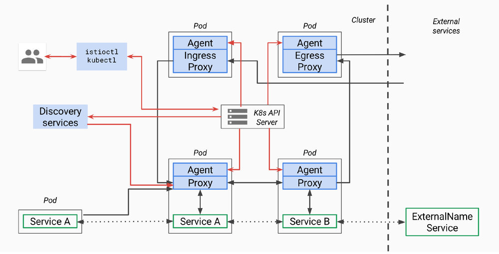

本文分析的istio代码版本为0.8.0，commit为0cd8d67，commit时间为2018年6月18日。 

本文为`Service Mesh深度学习系列`之一：

- [Service Mesh深度学习系列part1—istio源码分析之pilot-agent模块分析](/blog/istio-service-mesh-source-code-pilot-agent-deepin)
- [Service Mesh深度学习系列part2—istio源码分析之pilot-discovery模块分析](/blog/istio-service-mesh-source-code-pilot-discovery-module-deepin)
- [Service Mesh深度学习系列part3—istio源码分析之pilot-discovery模块分析（续）](/blog/istio-service-mesh-source-code-pilot-discovery-module-deepin-part2)

## pilot总体架构 

首先我们回顾一下pilot总体架构，上面是[官方关于pilot的架构图](https://github.com/istio/old_pilot_repo/blob/master/doc/design.md)，因为是old_pilot_repo目录下，可能与最新架构有出入，仅供参考。所谓的pilot包含两个组件：pilot-agent和pilot-discovery。图里的agent对应pilot-agent二进制，proxy对应Envoy二进制，它们两个在同一个容器中，discovery service对应pilot-discovery二进制，在另外一个跟应用分开部署的单独的deployment中。   

1. **discovery service**：从Kubernetes apiserver list/watch `service`、`endpoint`、`pod`、`node`等资源信息，监听istio控制平面配置信息（Kubernetes CRD）， 翻译为Envoy可以直接理解的配置格式。
2. **proxy**：也就是Envoy，直接连接discovery service，间接地从Kubernetes apiserver等服务注册中心获取集群中微服务的注册情况
3. **agent**：本文分析对象pilot-agent，生成Envoy配置文件，管理Envoy生命周期
4. **service A/B**：使用了istio的应用，如Service A/B的进出网络流量会被proxy接管

> 对于模块的命名方法，本文采用模块对应源码main.go所在包名称命名法。其他istio分析文章有其他命名方法。比如pilot-agent也被称为istio pilot，因为它在Kubernetes上的部署形式为一个叫istio-pilot的deployment。

## pilot-discovery的部署存在形式
pilot-discovery是单独二进制，被封装在`Dockerfile.pilot`里，在`istio-docker.mk`里被build成`$(HUB)/pilot:$(TAG)`镜像。

根据`istio-pilot.yaml.tmpl`，在Kubernetes环境下，pilot镜像并非sidecar的一部分，也不是daemonset在每个机器上都有，而是单独部署成一个replica=1的deployment。  

## pilot-discovery的功能简述
pilot-discovery扮演服务注册中心、istio控制平面到Envoy之间的桥梁作用。pilot-discovery的主要功能包括：

1. 监控服务注册中心（如Kubernetes）的服务注册情况。在Kubernetes环境下，会监控`service`、`endpoint`、`pod`、`node`等资源信息。监控istio控制面信息变化，在Kubernetes环境下，会监控包括`RouteRule`、`VirtualService`、`Gateway`、`EgressRule`、`ServiceEntry`等以Kubernetes CRD形式存在的istio控制面配置信息。
2. 将上述两类信息合并组合为Envoy可以理解的（即遵循Envoy data plane api的）配置信息，并将这些信息以gRPC协议提供给Envoy

## pilot-discovery主要功能分析之一：初始化

pilot-discovery的初始化主要在pilot-discovery的`init`方法和在`discovery`命令处理流程中调用的`bootstrap.NewServer`完成：

1. pilot-discovery的`init`方法为pilot-discovery的`discovery`命令配置一系列flag及其默认值。flag值被保存在bootstrap包的`PilotArgs`对象中 
2. `bootstrap.NewServer`利用`PilotArgs`构建bootstrap包下的`server`对象

`bootstrap.NewServer`工作流程如下。

### 1. 创建Kubernetes apiserver client（initKubeClient方法）

根据服务注册中心配置是否包含Kubernetes（一个istio service mesh可以连接多个服务注册中心）创建`kubeClient`，保存在`Server.kubeClient`成员中。`kubeClient`有两种创建方式：

1. 用户提供kubeConfig文件，可以在pilot-discovery的`discovery`命令的`kubeconfig` flag中提供文件路径，默认为空。
2. 当用户没有提供kubeConfig配置文件时，使用in cluster config配置方式，也就是让pilot-discovery通过所在的运行环境，也就是运行着的Kubernetes pod环境，感知集群上下文，自动完成配置。client-go库的注释说这种方式可能有问题：Using the inClusterConfig.  This might not work

### 2. 多集群Kubernetes配置（initClusterRegistryies方法）

istio支持使用一个istio control plane来管理跨多个Kubernetes集群上的service mesh。这个叫“multicluster”功能的具体描述参考[官方文档](https://istio.io/docs/setup/Kubernetes/multicluster-install/)，当前此特性成熟度仅是[alpha水平](https://istio.io/about/feature-stages/)。Istio的控制平面组件（如pilot-discovery）运行所在的Kubernetes集群叫本地集群，通过这个istio控制面板连接的其他Kubernetes集群叫远程集群（remote cluster）。remote cluster信息被保存在`Server.clusterStore`成员中，里面包含一个map，将`Metadata`映射成`RemoteCluster`对象。`clusterStore`的具体创建流程如下：

1. 检测上一步骤是否创建好`kubeClient`。否，则直接报错返回

2. 检测服务注册中心中是否包含Mock类型，是的话直接返回

3. 如果pilot-discovery `discovery`命令的flag `clusterRegistriesConfigMap`不为空，则从本地Kubernetes集群中读取一个包含远程Kubernetes集群访问信息的configmap（configmap所在的默认命名空间为`“istio-system”`，名字通过discovery命令flag `clusterRegistriesConfigMap`设定）。 

  这个configmap包含Kubernetes远程集群的访问信息，其形式为键值对。其key为cluster唯一标识符，value为一个使用yaml或json编码的`Cluster`对象。  `Cluster`对象的Annotations指定一个本地Kubernetes集群中的secret（secret所在命名空间对应的annotation key为`config.istio.io/accessConfigSecret`，默认为`istio-system`，secret名称对应annotation key为`config.istio.io/accessConfigSecretNamespace`）。 
  到本地Kubernetes集群中读取secret内容，根据这个内容构建保存在`clusterStore`中的RemoteCluster对象，对应一个远程Kubernetes集群。 

### 3. 读取mesh配置（initMesh方法） 

mesh配置由`MeshConfig`结构体定义，包含`MixerCheckServer`、`MixerReportServer`、`ProxyListenPort`、`RdsRefreshDelay`、`MixerAddress`等一些列配置。这里读取默认mesh配置文件"/etc/istio/config/mesh"（用户可以通过discovery命令的flag `meshConfig`提供自定义值）。如果配置文件读取失败，也可以从Kubernetes集群中读取configmap获得默认的配置。作为测试，这里也读取flag来覆盖mesh配置的`MixerCheckServer`和`MixerReportServer`（但是这两个flag在pilot-discovery的init方法中并没有配置）

### 4. 配置MixerSan（initMixerSan方法） 

如果mesh配置中的控制平面认证策略为mutual TLS(默认为none)，则配置mixerSan

### 5. 初始化与配置存储中心的连接（initConfigController方法）  

对istio做出的各种配置，比如route rule、virtualservice等，需要保存在配置存储中心（config store）内，istio当前支持2种形式的config store:

**i) 文件存储**

通过pilot-discovery `discovery`命令的`configDir` flag来设置配置文件的文件系统路径，默认为`“configDir”`。后续使用pilot/pkg/config/memory包下的controller和pilot/pkg/config/monitor持续监控配置文件的变化。

**ii) Kubernetes CRD**

以Kubernetes apiserver作为config store的情况下，config store的初始化流程如下：

1. 读取pilot-discovery `discovery`命令的`kubeconfig` flag配置的kubeconfig配置文件，flag默认为空。

2. 注册Kubernetes CRD资源。注册的资源类型定义在bootstrap包下的全局变量`ConfigDescriptor`变量里，包括:`RouteRule`、 `VirtualService`、 `Gateway`、 
  `EgressRule`、 `ServiceEntry`、 `DestinationPolicy`、 `DestinationRule`、 `HTTPAPISpec`、 `HTTPAPISpecBinding`、 `QuotaSpec`、 `QuotaSpecBinding`、 `AuthenticationPolicy`,
  `AuthenticationMeshPolicy`、 `ServiceRole`、 `ServiceRoleBinding`、 `RbacConfig`。其中`RouteRule`、 `EgressRule`、 `DestinationPolicy`、 `HTTPAPISpec`、 `HTTPAPISpecBinding`、 `QuotaSpec`、 `QuotaSpecBinding`、 `ServiceRole`、 `ServiceRoleBinding`、 `RbacConfig`对应istio v1alpha2版本api，`VirtualService`、`Gateway`、`ServiceEntry`、`DestinationRule`对应istio v1alpha3版本api

  以文件作为config store显然不灵活，所以我们可以说istio的流量管理策略等控制面信息存储依赖Kubernetes的apiserver。那么当使用cloud foundry等其他非Kubernetes平台作为服务注册中心的时候，istio就需要实现一个“假的”Kubernetes apiserver，不过目前这个工作并没完成，详见社区的一些[相关讨论](https://groups.google.com/forum/#!topic/istio-dev/bhMpHikwrp0)。  

  CRD资源注册完成之后将创建config controller，搭建对CRD资源Add、Update、Delete事件的处理框架。对该框架的处理会在本文"pilot-discovery主要功能分析之二：istio控制面信息监控与处理"中描述。

### 6. 配置与服务注册中心（service registry）的连接（initServiceControllers方法）

istio需要从服务注册中心（service registry）获取服务注册的情况。代表pilot-discovery的server对象包含一个`ServiceController`对象，一个`ServiceController`对象包含一个或多个service controller(是的，这两个名字只有大小写区别)。每个service controller负责连接服务注册中心并同步相关的服务注册信息。

当前istio支持的服务注册中心类型包括ConfigRegistry, MockRegistry, Kubernetes, Consul, Eureka和CloudFoundry。不过仅对Kubernetes服务注册中心的支持成熟度达到stable水平，其他服务注册中心的集成工作成熟度还都处于alpha水平。

`ServiceController`对象的结构体定义在aggregate包下，从包名可以看出一个`ServiceController`对象是对多个service controller的聚合。所谓聚合，也就是当对`ServiceController`操作时，会影响到其聚合的所有service controller。比如，当我们向`ServiceController`注册一个服务注册信息变更事件处理handler时，实际上会将handler注册到所有的service controller上。

具体service controller对服务注册信息的变更处理流程框架将在本文“pilot-discovery主要功能分析之三：服务注册信息监控与处理”中描述。

### 7. 初始化discovery服务（initDiscoveryService）

istio service mesh中的envoy sidecar通过连接pilot-discovery的discovery服务获取服务注册情况、流量控制策略等控制面的控制信息。discovery服务的初始化主要包括如下几步：

**i) 创建对外提供REST协议的discovery服务的discovery service对象**

istio代码在2018年6月的一次commit （e99cad5）中删除了大量与Envoy v1版本的data plane api相关代码。当前版本的istio中，作为sidecar的Envoy已经不再使用REST协议获取控制面信息。与v1版本Envoy data plane api相关的`cds`、`rds`、`lds`相关代码都已被删除，仅残留`sds`部分代码。因此作为`sds`的残留功能，用户依然可以访问`"/v1/registration"`URL访问与服务`endpoint`相关的信息，但Envoy并不会访问这个URL。discovery service默认通过8080端口对外提供服务，可以通过pilot-discovery的`discovery`命令的`httpAddr` flag自定义端口

**ii) 创建对外提供gRPC协议discovery服务的Envoy xds server**

所谓的`xds`代表Envoy v2 data plane api中的`eds`、 `cds`、 `rds`、 `lds`、 `hds`、 `ads`、 `kds`等一系列api。Envoy xds server默认通过15010和15012端口对外提供服务，可以通过pilot-discovery的`discovery`命令的`grpcAddr` 、`secureGrpcAddr`flag自定义端口。  

与Envoy xds server相关代码分析我们将在系列文章的下一篇分析。

### 8. 打开运行情况检查端口（initMonitor方法）

pilot-discovery默认打开9093端口（端口号可以通过pilot-discovery discovery命令的`monitoringAddr` flag自定义），对外提供HTTP协议的自身运行状态检查监控功能。当前提供`/metrics`和`/version`两个运行状况和基本信息查询URL。

### 9. 监控多Kubernetes集群中远程集群访问信息变化（initMultiClusterController方法）

当使用一个istio控制面构建跨多个Kubernetes集群的service mesh时，远程Kubernetes集群的访问信息保存在secret中，此处使用list/watch监控secret资源的变化。

> 关于上面第五点说的两种config store，代码里实际上还有第三种，通过`PilotArgs.Config.Controller`配置。但pilot-discovery的`init`函数里没找到对应flag。  

以上一系列初始化不候通过bootstrap包的`NewServer`函数带起，在此过程中pilot-discovery已经启动一部分协程，开始一些控制逻辑的循环执行。比如在上述第九步中的多Kubernetes集群访问信息（secret资源）的监控，在`initMonitor`方法中，实际上已经启动协程，利用client-go库开始对secret信息的监控（list/watch）与处理。

而pilot-discovery的其他控制逻辑则要在bootstrap包下的`Server.Start`方法启动，而`Start`方法的逻辑是顺序执行之前初始化过程中在`server`对象上注册的一系列启动函数（`startFunc`）。 本文接下来分析pilot-discovery的其他主要控制逻辑。 TODO 整理有哪些startfunc

## pilot-discovery主要功能分析之二：istio控制面信息监控与处理

istio的用户可以通过istioctl创建`route rule`、`virtualservice`等实现对服务网络中的流量管理等配置建。而这些配置需要保存在config store中。在当前的istio实现中，config store以Kubernetes CRD的形式将`virtualservice`等存储在Kubernetes apiserver之后的etcd中。

在前面pilot-discovery初始化第五步骤中pilot-discovery已经完成了`RouteRule`、`VirtualService`等CRD资源在Kubernetes apiserver上的注册，接下来pilot-discovery还需要在initConfigController方法中通过config controller搭建CRD资源对象处理的框架。config controller包含以下3个部分：

**1. client**

client是一个rest client集合，用于连接Kubernetes apiserver，实现对istio CRD资源的list/watch。具体而言，为每个CRD资源的group version (如`config.istio.io/v1alpha2`、`networking.istio.io/v1alpha3`)创建一个rest client。该rest client里包含了连接Kubernetes apiserver需要用到的`apimachinary`、`client-go`等库里的对象，如`GroupVersion`、`RESTClient`等。

**2. queue**

用于缓存istio CRD资源对象（如`virtual-service`、`route-rule`等）的Add、Update、Delete事件的队列，等待后续由config controller处理。详见本文后续描述

**3. kinds**

为每种CRD资源（如`virtual-service`、`route-rule`等）创建一个用于list/watch的SharedIndexInformer（Kubernetes client-go库里的概念）。

pilot-discovery在完成config controller的创建之后，向server对象注册`startFunc`，从而在后续server start的时候启动config controller的主循环逻辑（config controller的Run方法），完成与istio控制面信息相关的监控与处理。config controller主循环主要包括两方面：

1. 利用`client-go`库里的SharedIndexInformer实现对CRD资源的list/watch，为每种CRD资源的Add、Update、Delete事件创建处理统一的流程框架。 这个流程将Add、Update、Delete事件涉及到的CRD资源对象封装为一个Task对象，并将之push到config controller的queue成员里。Task对象除了包含CRD资源对象之外，还包含事件类型（如Add、Update、Delete等），以及处理函数ChainHandler。ChainHandler支持多个处理函数的串联。 
2. 启动协程逐一处理CRD资源事件（queue.run），处理方法是调用每个从queue中取出的Task对象上的ChainHandler

这个流程执行结束之后，只是搭建了CRD资源对象变更事件的处理框架，真正CRD变更事件的处理逻辑要等到下面在discovery service中将相应的handler注册到ChainHandler当中。

## pilot-discovery主要功能分析之三：服务注册信息监控与处理

istio需要从服务注册中心（service registry）获取服务注册的情况。当前版本中istio可以对接的服务注册中心类型包括Kubernetes、Consul等。本小节以Kubernetes服务注册中心为例，分析istio对服务注册信息的变更处理流程框架。

pilot-discovery初始化第六步中通过构建service controller实现对Kubernetes服务注册信息的监控。pilot-discovery在完成service controller的创建之后，会向server对象（server对象代表pilot-discovery组件）注册`startFunc`，从而在后续server start的时候启动service controller的主循环逻辑（service controller的Run方法），完成服务注册信息的监控与处理。service controller主循环主要包括两方面：

**1.** 利用`client-go`库里的`SharedIndexInformer`监控Kubernetes中的`service`，`endpoints`, `node`和`pod`资源（默认resync间隔为60秒，可以通过pilot-discovery discovery命令的`resync` flag配置）。与config controller对于CRD资源的处理方式类似，所有`service`，`endpoints`等资源的Add，Update和Delete事件都采用统一处理框架。

**i) 将事件封装为Task对象，包含：**

​	a) 事件涉及的资源对象

​	b) 事件类型：Add、Update和Delete

​	c) Handler：ChainHandler。ChainHandler支持多个处理函数的串联

**ii) 将Task对象push到service controller的queue成员里。**

**2.** 启动协程逐一处理服务注册信息变更事件（queue.run），处理方法是调用每个从queue中取出的Task对象上的ChainHandler

这个流程执行结束之后，只是搭建了服务注册信息变更事件的处理框架，真正服务注册变更事件的处理逻辑要等到下面在discovery service中将相应的handler注册到ChainHandler当中。
## pilot-discovery主要功能分析之四：Envoy控制面信息服务
pilot-discovery创建Envoy xds server对外提供gRPC协议discovery服务。所谓的`xds`代表Envoy v2 data plane api中的`eds`、 `cds`、 `rds`、 `lds`、 `hds`、 `ads`、 `kds`等api。与Envoy xds server相关代码分析我们将在系列文章的下一篇分析。

## 本文作者

丁轶群博士

谐云科技CTO

2004年作为高级技术顾问加入美国道富银行(浙江)技术中心，负责分布式大型金融系统的设计与研发。2011年开始领导浙江大学开源云计算平台的研发工作，是浙江大学SEL实验室负责人，2013年获得浙江省第一批青年科学家称号，CNCF会员，多次受邀在Cloud Foundry, Docker大会上发表演讲，《Docker：容器与容器云》主要作者之一。
