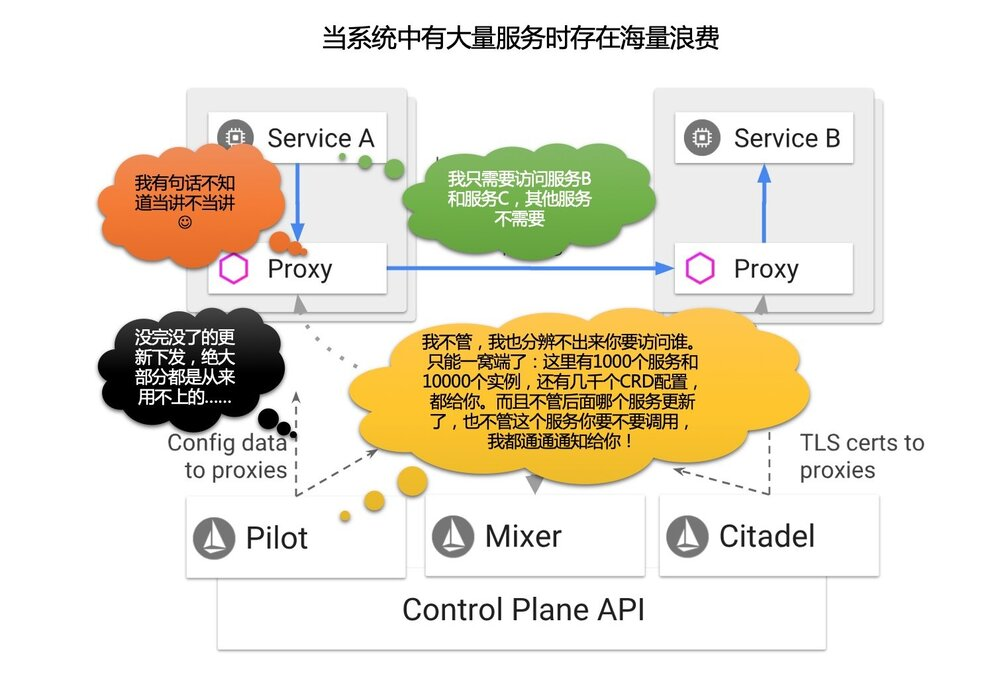
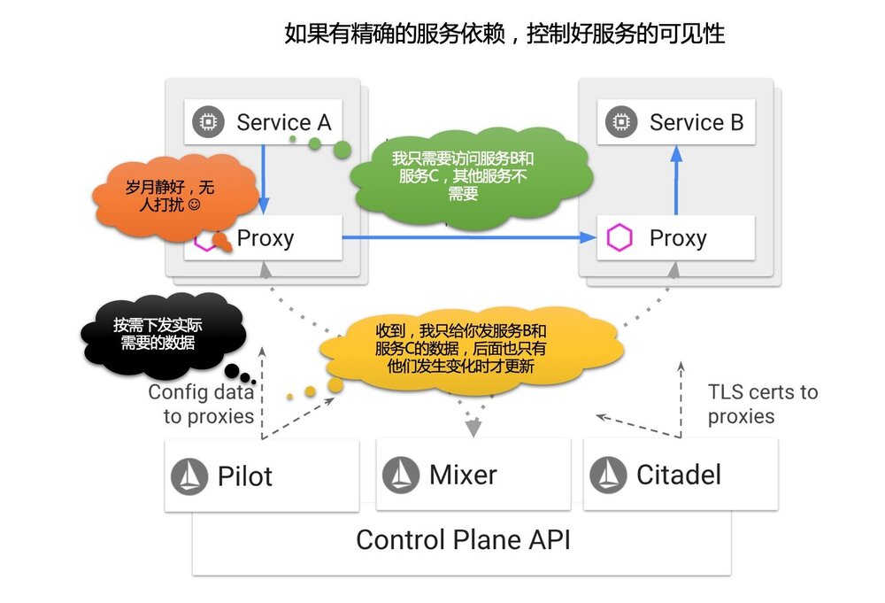
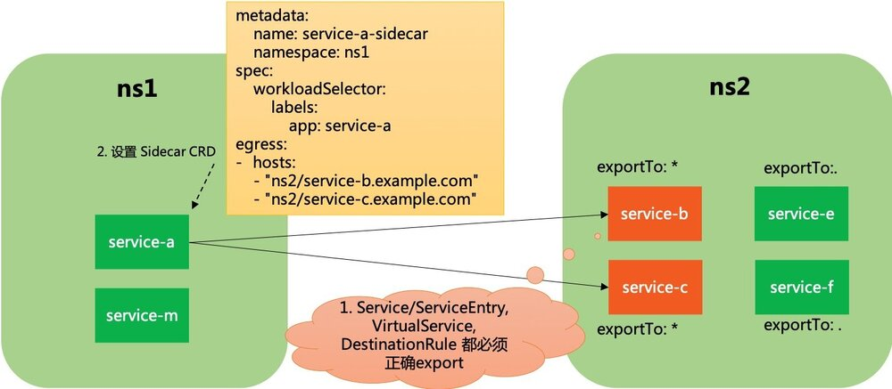

## 背景

对于服务的可见性，在 Istio 设计之初，是没有特别考虑的，或者说，Istio 一开始的假定，就是建立在如下这个前提下的：

**Istio 中的每个服务都可以访问 Mesh 中的任意服务**

即在服务发现/请求转发这个层面，对服务访问的可见性不做任何限制，而通过安全机制来解决服务间调用权限的问题，如RBAC的使用。在这个思想的指导下，Pilot组件是需要将全量的服务信息（服务注册信息和服务治理信息）下发到 Sidecar，这样 Sidecar 才能在做到不管服务要请求的目标是哪个服务，都可以做到正确的路由。

这个机制在 demo 和小规模使用时不是问题，但是，在实际项目落地时，如果服务数量比较多，数以百计/数以千计，则立即显露出来：

- 下发的信息量太大：因此 Pilot 和 Sidecar 的 CPU 使用会很高，因为每次都要将全量的数据下发到每一个 sidecar，需要编解码。Sidecar 的内存使用也会增加。
- 下发的频度非常密集：系统中任何一个服务的变动，都需要通知到每一个 Sidecar，即使这个 Sidecar 所在的服务完全不访问它


试想：假定 A 服务只需要访问 B/C 两个服务，但是在一个有 1000 个服务的系统中，A 服务的 Sidecar 会不得不接收到其他 998 个服务的数据和每一次的变化通知。其所需有效数据和实际得到数据的比例高达 2:1000！



因此，在没有服务可见性控制的情况下，Pilot 到 Sidecar 的数据下发的有效性低得可谓令人发指！

理想模式：同样假定 A 服务只需要访问 B/C 两个服务，如果能通过某个方式将这个信息（成为服务依赖或者服务可见性）提供出来，让 Istio 得到这个信息，那么在 Pilot 往 A 服务的 Sidecar 下发数据时，就可以做一个简单的过滤：只发送 B/C 服务的信息，和只在 B/C 服务发生变更时通知 A。而这个简单过滤所带来的 Pilot 和 Sidecar 之间数据下发的性能提升，是和系统内服务数量成线性关系，很容易就实现两个或者三个数量级的提升。



在 Istio 问世快 2 年之际，Istio 终于开始正视这个问题——好吧，我坦白，在这一点上，我是有怨言的：Istio 的工程实现中，对实际生产问题的考虑，非常不到位。

## Istio1.1 新动态

Istio 1.1 即将发布，这几天陆续看到新文章介绍 istio1.1 的新功能：

- [Istio1.1 功能预告](https://mp.weixin.qq.com/s?__biz=MzIzNzU5NTYzMA==&mid=2247486344&idx=1&sn=342514c520f8977b4c4ab73b81c099e9&chksm=e8c77509dfb0fc1fa5fc9480988a1a93ad501a6bf981c4ed4fcab86db0fed65b169270fc2193&mpshare=1&scene=1&srcid=&pass_ticket=MpgumPaw3Tf881FIiIQQD8PBdu7hskmvp3ANufYG3jLs0TogoH8jvKON9IUTqvt8#rd)
- [鸿沟前的服务网格—Istio 1.1 新特性预览](https://mp.weixin.qq.com/s?__biz=MzIxMDY5ODM1OA==&mid=2247484493&idx=1&sn=57e1637d309257ae43bacd0e4d9b2b6f&chksm=9761ed54a01664429e2c9c2fb74a2e183f6caac2fb927bc3ccd6528f591df7f9de5b97faef5a&mpshare=1&scene=1&srcid=&pass_ticket=MpgumPaw3Tf881FIiIQQD8PBdu7hskmvp3ANufYG3jLs0TogoH8jvKON9IUTqvt8#rd)

其中和服务可见性直接相关的内容主要是 Sidecar CRD 和 ExportTo 属性。

引用上面文章的内容，"鸿沟前的服务网格—Istio 1.1 新特性预览" 的介绍如下：

- 新增 Sidecar 资源

  目前版本中，Sidecar 会包含整个网格内的服务信息，在 1.1 中，新建了 Sidecar 资源，通过对这一 CRD 的配置，不但能够限制 Sidecar 的相关服务的数量，从而降低资源占用，提高传播效率；还能方便的对 Sidecar 的代理行为做出更多的精细控制——例如对 Ingress 场景中的被代理端点的配置能力。

- ExportTo

  多个路由管理对象加入了这一字段，用于指定该资源的生效范围。

"Istio1.1 功能预告" 一文的介绍是：

- 新的 sidecar：资源：在指定命名空间中使用 sidecar 资源时，支持定义可访问的服务范围，这样可以降低发给 proxy 的配置数量。在大规模的集群中，我们推荐给每个 namespace 增加 sidecar 对象。这个功能主要是为了提升性能，减轻 proxy 计算的负担。

- 限制网络资源的生效范围：为所有的网络资源增加了 exportTo 的字段，用来表示此网络资源在哪些 namespace 中生效。这个字段目前只有两个值：

    - `. ` 表示此网络资源只在自己定义的 namespace 生效；

    - `* ` 表示此网络资源在所有的 namespace 生效。

我们来围绕服务可见性，对 Istio1.1 新特性做一个深入了解。

## ExportTo 属性

Istio 1.1 在 DestinationRule / ServiceEntry / VirtualService 三个 CRD 上新增加了 export_to 字段（忽略其他字段）：

```protobuf
message DestinationRule {
    repeated string export_to = 4;
}
message ServiceEntry {
    repeated string export_to = 7;
}
message VirtualService {
    repeated string export_to = 6;
}
```

下面是 exportTo 的字段说明，以 destination rule 为例：

| 字段       | 类型       | 描述                                                         |
| ---------- | ---------- | ------------------------------------------------------------ |
| `exportTo` | `string[]` | 当前 destination rule 要导出的 namespace 列表。应用于 service 的 destination rule 的解析发生在 namespace 层次结构的上下文中。destination rule 的导出允许将其包含在其他 namespace 中的服务的解析层次结构中。此功能为服务所有者和网格管理员提供了一种机制，用于控制跨 namespace 边界的 destination rule 的可见性。<br/><br/>如果未指定任何 namespace，则默认情况下将 destination rule 导出到所有 namespace。<br/><br/>值`.` 被保留，用于定义导出到 destination rule 被声明所在的相同 namespace，类似的值`*`保留，用于定义导出到所有 namespaces. <br/><br/>NOTE：在当前版本中，exportTo 值被限制为`.`或`*`（即，当前 namespace 或所有 namespace）。 |

从此，对以上三个 CRD 的使用，都必须满足 exportTo 对 namespace 的要求，才能被正确引用。如 gateway CRD 的说明：

```protobuf
  // NOTE: Only virtual services exported to the gateway's namespace
  // (e.g., `exportTo` value of `*`) can be referenced.
  // Private configurations (e.g., `exportTo` set to `.`) will not be
  // available. Refer to the `exportTo` setting in `VirtualService`,
  // `DestinationRule`, and `ServiceEntry` configurations for details.
  repeated string hosts = 2;
```

### k8s 原生 service

前面 exportTo 只能用于 DestinationRule / ServiceEntry / VirtualService，对于我们最关注的 k8s 原生的 service 对象没有涉及。而日常大多数服务都还是普通 k8s 服务，既然 ServiceEntry 这样 Istio 管理之外的服务都有可见性支持，没有理由不控制 Istio 内的服务。

在 ServiceEntry 的定义中，发现注释部分有如下说明：

```properties
message ServiceEntry {
    // For a Kubernetes Service, the equivalent effect can be achieved by setting
    // the annotation "networking.istio.io/exportTo" to a comma-separated list
    // of namespace names.
    repeated string export_to = 7;
}
```

对于 k8s 原生 service，上面的注释说用 annotation "networking.istio.io/exportTo" 可以达到同样的效果。

翻了一下 Istio 最新的代码，`install/kubernetes/helm/istio/charts/mixer/templates/service.yaml` 的例子：

```yaml
apiVersion: v1
kind: Service
metadata:
  name: istio-{{ $key }}
  namespace: {{ $.Release.Namespace }}
  annotations:
    networking.istio.io/exportTo: "*"
```

在`pilot/pkg/serviceregistry/kube/conversion.go` 文件中有这个 annotation 的常量定义：

```go
// ServiceExportAnnotation specifies the namespaces to which this service should be exported to.
//   "*" which is the default, indicates it is reachable within the mesh
//   "." indicates it is reachable within its namespace
ServiceExportAnnotation = "networking.istio.io/exportTo"
```

只在 `pilot/pkg/serviceregistry/kube/conversion.go` 的 convertService() 方法中使用，这个方法将 k8s 的 api core 中的 v1.Service 转为 istio 抽象模型中的 service：

```go
func convertService(svc v1.Service, domainSuffix string) *model.Service {
  ......
  if svc.Annotations[ServiceExportAnnotation] != "" {
    exportTo = make(map[model.Visibility]bool)
    for _, e := range strings.Split(svc.Annotations[ServiceExportAnnotation], ",") {
      exportTo[model.Visibility(e)] = true
    }
  }
}
```

逻辑很简单：用","将 annotation "networking.istio.io/exportTo" 的值拆开，然后转成对应 Visibility 对象作为 key，以 value 为 true 保存起来。

Visibility 类型定义如下：

```go
// Visibility defines whether a given config or service is exported to local namespace, all namespaces or none
type Visibility string
const (
  // VisibilityPrivate implies namespace local config
  VisibilityPrivate Visibility = "."
  // VisibilityPublic implies config is visible to all
  VisibilityPublic Visibility = "*"
  // VisibilityNone implies config is visible to none
  VisibilityNone Visibility = "~"
)
```

这里有三个特殊值，除了前面描述到的 `.` 和 `*` 之外，还有一个 `~` 表示 none，不过目前没有使用。

理论上说，这里可以通过 exportTo 字段（或者等效的  annotation "networking.istio.io/exportTo" ）指定特定的 namespace，比如".,namespace1,namespace2"。但是目前文档中明确指出，只能使用  `.` 和 `*` 。

```go
// NOTE: in the current release, the `exportTo` value is restricted to
// "." or "*" (i.e., the current namespace or all namespaces).
```

## Sidecar CRD

在 Istio 1.1 中增加了新的 CRD Sidecar，具体的定义可见 https://github.com/istio/api/blob/8463cba039d858e8a849847b872ecea50b0994df/networking/v1alpha3/sidecar.proto

从中摘录部分内容：

> Sidecar 描述了 sidecar 代理的配置，sidecar 代理调解与其连接的工作负载的 inbound 和 outbound 通信。默认情况下，Istio 将为网格中的所有 Sidecar 代理服务，使其具有到达网格中每个工作负载所需的必要配置，并在与工作负载关联的所有端口上接收流量。Sidecar 资源提供了一种的方法，在向工作负载转发流量或从工作负载转发流量时，微调端口集合和代理将接收的协议。 **此外，可以限制代理在从工作负载转发 outbound 流量时可以达到的服务集合。**

Sidecar CRD 的其他功能我们暂时不展开，只看和服务可见性相关的内容，看看 Sidecar CRD 是如何限制可以到达的服务结合的。文档中给出了下面这个简单例子：

```yaml
apiVersion: networking.istio.io/v1alpha3
kind: Sidecar
metadata:
  name: default
  namespace: prod-us1
spec:
  egress:
  - hosts:
    - "prod-us1/*"
    - "prod-apis/*"
    - "istio-system/*"
```

这个示例在 prod-us1 命名空间中声明了 Sidecar 资源，该资源配置命名空间中的 sidecars，允许出口流量到 prod-us1，prod-apis 和 istio-system 命名空间中的公共服务。

但是注意这个 CRD 需要配合前面的 exportTo 字段使用：即如果 A 服务 (namespace 为 ns1) 要访问 B 服务 (namespace 为 ns2)，则需要：

1. 首先需要 B 服务申明 exportTo 到 ns1 中
2. 然后再通过 Sidecar CRD 设置 ns1 的 egress 的 hosts 为 `"ns2/*"`

这样通过 exportTo 字段 + Sidecar.egress.hosts 字段的配合，实现了对服务可见性的限制。

基本原理不复杂，具体实现时还有一些细节需要注意。

### WorkloadSelector

上面的例子没有使用 WorkloadSelector，因此设置的是整个 namespace 下所有的 Sidecar 的行为，或者说默认行为。可以通过带有 WorkloadSelector 的 Sidecar 资源来覆盖默认设置，hosts 中也可以不用通配符，实现精确控制。

例如下面的例子，就明确限制了 ns1 下的 服务 service-a 可以访问 ns2 下的服务：

```yaml
apiVersion: networking.istio.io/v1alpha3
kind: Sidecar
metadata:
  name: service-a-sidecar
  namespace: ns1
spec:
  workloadSelector:
    labels:
      app: service-a
  egress:
  - hosts:
    - "ns2/*"
```

### hosts 字段

hosts 字段也是可以灵活设置的。文档中描述 hosts 字段为：

> 必需：以 namespace/dnsName 格式被监听器暴露的的一个或多个服务主机。在指定 namespace 内与 dnsName 匹配的服务将被暴露（也就是可以访问）。相应的服务可以是服务注册表中的服务（例如，Kubernetes 或 cloud foundry 服务）或使用 ServiceEntry 或 VirtualServicec 配置指定的服务。还可以使用同一名称空间中的任何关联的 DestinationRule。
>
> 应使用 FQDN 格式指定 dnsName，在最左侧的组件中可以包含通配符（例如，prod / * .example.com）。将 dnsName 设置为 * 可以从指定的命名空间中选择所有服务（例如，prod/*.example.com）。命名空间也可以设置为 * 以从任何可用的命名空间中选择特定服务（例如，"*/ foo.example.com"）。

前面的例子我们使用了通配符，也可以不使用通配符而明确的指定特定可以访问的服务：

```yaml
apiVersion: networking.istio.io/v1alpha3
kind: Sidecar
metadata:
  name: service-a-sidecar
  namespace: ns1
spec:
  workloadSelector:
    labels:
      app: service-a
  egress:
  - hosts:
    - "ns2/service-b.example.com"
    - "ns2/service-c.example.com"
```

当然，记得有个前提条件：service-b/service-c 的 k8s service 和相关的 CRD（DestinationRule / ServiceEntry / VirtualService）都必须正确的设置 exportTo。



> 备注：这里设计的有点复杂，按照这个思路，如果要实现上述的精确限制，多个环节都必须明确设置。一旦有一个地方出错，就会无法访问，然后 debug 的过程估计不会轻松。

小结：Istio1.1 通过 exportTo 字段 + Sidecar.egress.hosts 字段的配合，实现了对服务可见性的约束

## 代码实现

`pilot/pkg/model/push_context.go` 中，PushContext 在保存 Service 和 VirtualService 信息时，都分为 private 和 public 两个结构：

```go
type PushContext struct {
    // privateServices are reachable within the same namespace.
    privateServicesByNamespace map[string][]*Service
    // publicServices are services reachable within the mesh.
    publicServices []*Service

    privateVirtualServicesByNamespace map[string][]Config
    publicVirtualServices             []Config
}
```

以服务为例，会按照 ExportTo 字段的可见性设置来进行区分，将服务分别存放：

```go
// Caches list of services in the registry, and creates a map
// of hostname to service
func (ps *PushContext) initServiceRegistry(env *Environment) error {
    ......
    for _, s := range allServices {
        ns := s.Attributes.Namespace
        if len(s.Attributes.ExportTo) == 0 {
            if ps.defaultServiceExportTo[VisibilityPrivate] {
               ps.privateServicesByNamespace[ns]
                   = append(ps.privateServicesByNamespace[ns], s)
            } else if ps.defaultServiceExportTo[VisibilityPublic] {
                ps.publicServices = append(ps.publicServices, s)
            }
        } else {
            if s.Attributes.ExportTo[VisibilityPrivate] {
                ps.privateServicesByNamespace[ns] =
                   append(ps.privateServicesByNamespace[ns], s)
            } else {
               ps.publicServices = append(ps.publicServices, s)
            }
        }
    }
    ps.ServiceByHostname[s.Hostname] = s
    ps.ServicePort2Name[string(s.Hostname)] = s.Ports
    ......
}
```

当给具体的 proxy 下发数据时：

```go
// Services returns the list of services that are visible to a Proxy in a given config namespace
func (ps *PushContext) Services(proxy *Proxy) []*Service {
    // 如果 proxy 有 sidecar scope，则从 sidecar scope 获取 service 列表
    if proxy != nil && proxy.SidecarScope != nil && proxy.SidecarScope.Config != nil && 		   proxy.Type == SidecarProxy {
        return proxy.SidecarScope.Services()
    }

    out := []*Service{}

    // 没有 sidecar scope，就只考虑 exportTo 的影响
    if proxy == nil {
        for _, privateServices := range ps.privateServicesByNamespace {
            out = append(out, privateServices...)
        }
    } else {
        // 只给当前 proxy 所在 namespace 的 private 服务
        out = append(out, ps.privateServicesByNamespace[proxy.ConfigNamespace]...)
    }

    // 和 public 的服务
    out = append(out, ps.publicServices...)
    return out
}
```

SidecarScope 的说明，来自代码注释：

> SidecarScope 是 Sidecar resource 的包装器，带有一些预处理数据，用于确定给定 Sidecar 可访问的 Service，VirtualService 和 DestinationRule。预先计算 Sidecar 的 Service，VirtualService 和 DestinationRule 可以提高性能，因为我们不再需要为每个 Sidecar 计算此列表。我们只需将 Sidecar 与 SidecarScope 相匹配。

```go
type SidecarScope struct {
    // Union of services imported across all egress listeners for use by CDS code.
    services []*Service
}
```

预处理的细节就不继续展开了。

## 分析

从目前 Istio1.1 给出的信息看，Istio 开始着手限制服务间可见性，以“**降低资源占用，提高传播效率**”——虽然我个人认为这个本应该是设计伊始就应该考虑的问题，但是无论如何，有比没有好。

对于目前 Istio1.1 在限制服务可见性的做法，聊一下个人看法（保留后续更新修改的权利）：

1. 总算提供了一个避免全量数据下发的方式，理论上在服务数量比较多时，通过严格约束服务间的可见性，是可以让 Pilot 到 Sidecar 的数据下发数量起码降低一到两个数量级（1/10 到 1/100），Pilot 的 CPU 使用/Sidecar 的 CPU 使用/Sidecar 的内存占用 应该都可以有明显改善。当然这是理论推断，具体是否做到了还要看 Istio 1.1 的实际测试结果。拭目以待吧，希望是个惊喜。
2. 可见性的边界，是 namespace，这一点我有些担心：k8s 的 namespace 在实践中一般不会做非常细致的细分，搞不好一个体系里面可能就几个甚至一个 namespace，以 namespace 为边界来决定服务的可见性我个人觉得粒度太大——这一点稍后咨询一下各方情况再做更新。
3. 设置上有些麻烦，从上面的分析上看，要实现服务 A 对服务 B 的精确限制，需要设置服务 B 的 exportTo，包括 k8s Service/Istio VitualService/Istio Destination Rule，还要设置服务 A 的 Sidecar CRD，至少要设置 4 个地方。繁琐且容易出错，而且语义也不直白：我相信大部分同学如果没有看过类似本文这样的讲解，恐怕很难一下就把这里面的条条道道梳理清楚。
4. 只是限制服务的可见性，而不是明确的强制要求管理服务间的静态依赖关系，后者其实是我，或者说我们团队想要的。服务可见性和服务静态依赖关系之间有语义上的明确差别：服务可见性不具备强制性的，是笼统的，是可以含糊一点的，从 Istio 的意图看主要是为了效率的提升（毕竟之前的做法太浪费资源）；而服务静态依赖关系是强制性的，依赖明确，设置精准，目标是为体系中的服务调用关系进行强力管控。

先写到这，稍后深入后再补充。
