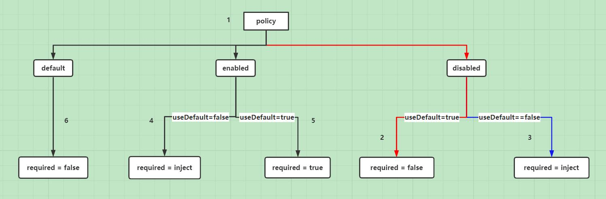
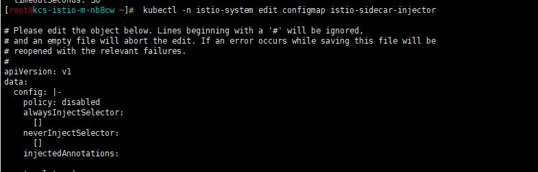

## 背景

我们团队对 Istio 进行相关研究与探索，并在生产环境进行了相应的应用，初期我们使用 Istio 主要做产品的灰度发布，同时我们团队也有相关研发人员基于 Istio，进行生产环境业务流量管理及可观测性追踪的研究。在做 Istio 灰度发布的实践中，遇到的第一个问题就是怎么在已经大规模部署产品的 Kubernetes 集群里，选择性的注入 Sidecar。下面详细的介绍下我们遇到的问题以及解决思路，供大家参考。

## 遇到的问题

我们知道如果想把一个服务纳入 Istio 的网格中，需要在 pod 中注入 Sidecar 进行流量的劫持处理，通用的做法就是在 namespace 上打上 istio-injection=enabled 标签，这样只要在此 namespace 下创建或重启 pod 都会导致 pod 被注入 Sidecar，当然为了不让指定 pod 注入 Sidecar，可以在 pod 的 annotations 里加上 `sidecar.istio.io/inject: "false"`。线上产品是以 namespace 进行隔离的，并且产品 namespace 下正常运行的 pod 数较多，这样引入 Istio 后一个个修改不需要注入 Sidecar 的 pod 配置并重启，肯定不是一个好的方案。那么有什么比较好的策略呢？

## 方案调研

Kubernetes 提供了自定义资源类型和自定义控制器来扩展功能，还提供了动态准入控制 Webhook，其实我理解这个动态准入控制就是一个回调，在 Istio 的配置里可以看到回调的 url 路径 /inject，Kubernetes 通过 Webhook 来实现准入控制，分为两种：验证性质的准入 Webhook (Validating Admission Webhook) 和修改性质的准入 Webhook (Mutating Admission Webhook)，Istio 主要使用的是 Mutating Admission Webhook，在资源持久化到 ETCD 之前进行资源的修改，增加 Init Container 和 Sidecar Container。但是 Istio 在进行资源修改前，需要满足一些条件，这些条件可以通过配置进行修改。


首先我们看下 Istio 的 `mutatingwebhookconfiguration` 配置


通过配置我们看到，`namespaceSelector` 会去 match 标签为 `istio-injection: enabled` 的 namespace，并且根据请求规则，去匹配所有 pod 的创建 CREATE 请求。当 apiserver 收到一个符合规则的请求时，apiserver 会给 Webhook 服务发送一个通过审核的请求，Istio 中的这个 Webhook 服务是 Istiod 的 service，请求地址为 /inject。从代码 [/pkg/kube/inject/webhook.go](https://github.com/istio/istio/blob/release-1.8/pkg/kube/inject/webhook.go)，中我们查看 Istio 是如何处理自动注入的，在 Discovery Server 中注册了两个用来处理自动注入的请求 handler，`p.Mux.HandleFunc ("/inject", wh.serveInject)`、`p.Mux.HandleFunc ("/inject/", wh.serveInject)`，`wh.serveInject` 就是实现自动注入的主要逻辑。在这里我们不详细讲解自动注入的代码逻辑。只讲解下，在满足什么样的条件才会进行自动注入。

通过查看自动注入的代码，我们可以得到如下注入条件的流程图 1


1. 判断 pod 的 spec 中没有设置 `hostNetwork:true`
2. 判断待注入的 pod 不在系统 namespace 里，如 `kube-system`、kube-public
3. 设置三个临时变量，`useDefault=false`、`inject=false`、required=false，判断是否配置 `sidecar.istio.io/inject`
4. 如果 `sidecar.istio.io/inject` 的值设置为 y, yes, true, on，则 inject=true
5. `sidecar.istio.io/inject` 为其他值，则 `useDefault=true`
6. 判断 `neverInjectSelector` 是否有匹配到的条件，如果匹配到则设置 useDefault = false、inject = false
7. 判断 `alwaysInjectSelector` 是否有匹配到的条件，如果匹配到则设置 useDefault = false、inject = true，`alwaysInjectSelector` 优先级高于 neverInjectSelector

经过上述判断，我们得到了 `useDefault` 、inject 的结果值，后面我们根据 policy 的取值以及上述结果值，判断 pod 是否能够注入 Sidecar，继续查看自动注入的流程图 2





1. 判断 policy 的取值
2. 如果 policy 取值为 disabled，并且上述得到的 useDefault=true，则 required=false，不进行注入
3. 如果 policy 取值为 disabled，并且上述得到的 useDefault=false，则需要根据 inject 的值判断是否需要注入
4. 如果 policy 取值为 enabled，并且上述得到的 useDefault=false，则需要根据 inject 的值判断是否需要注入
5. 如果 policy 取值为 enabled，并且上述得到的 useDefault=true，则 required=true，进行注入
6. policy 为其他值，不进行注入

在上面的自动注入流程图 1、自动注入流程图 2 中，有几个配置 `neverInjectSelector`、`alwaysInjectSelector`、policy，这几个值可以根据需求在 `istio-sidecar-injector` configmap 进行修改。

## 生产应用

通过上面的分析，可以看到为了最后满足注入条件，需要多种判断条件。结合我们在生产使用中遇到的问题，尽量少修改配置，在这里我们给产品的 namespace 打上 `istio-injection=enabled`，并且通过 `kubectl -n istio-system edit configmap istio-sidecar-injector` 修改 policy 的值为 disable。




因为引入 Istio 之前启动的 pod 中没有 `sidecar.istio.io/inject` 的值，所以在上面的流程图里会走红色线标志的路径，最后得到 required=false，不会注入 Sidecar。

如果希望注入 Sidecar，则需要在 pod 里添加 `sidecar.istio.io/inject=true` 注解，这样添加完注解的 pod 会走蓝色线标志的路径，最后 required=inject，而 inject 的值为 true，满足注入条件进行 Sidecar 的注入。

下面演示一下经过上述修改后的实际应用效果，我们给 namespace 打上标签，并且配置应用的 Deployment，我们给 foo-v1 添加 sidecar.istio.io/inject: "true" 的注解，作为对比 foo-v2 不做任何操作，如下

```yaml
apiVersion: apps/v1
kind: Deployment
metadata:
  name: foo-v1
spec:
  template:
    metadata:
      annotations:
        sidecar.istio.io/inject: "true"
      labels:
        app: foo
        version: v1
---
apiVersion: apps/v1
kind: Deployment
metadata:
  name: foo-v2
spec:
  template:
    metadata:
      labels:
        app: foo
        version: v2
```

执行上面的配置后，查询相应的 pod 如下图


从图中看到，通过正确的配置 Istio 的 Configmap，即使产品所在的 namespace 打上了 `istio-injection=enabled` 标签，引入 Istio 之前启动的 pod 也不会因为重启被注入 Sidecar，同时又可以选择性的对新服务进行 Sidecar 的注入，配置的改动量小，应用起来简单方便。

## 总结

通过对 Istio 自动注入的条件进行探索和研究，我们总结了一套满足共享 Kubernetes 引入 Istio 进行服务治理的方法，根据此方法进行生产实施，不会对已有服务造成影响，对新服务可以选择性的自动注入。以上的调研基于 Istio 1.8 版本，内容可能存在错误或不准确的地方，欢迎大家交流指正。
