作者：钟华，腾讯云容器团队高级工程师，热衷于容器、微服务、service mesh、istio 等领域。

今天分享的内容主要包括以下4个话题:

- 1 Service Mesh: 下一代微服务
- 2 Istio: 第二代 Service Mesh
- 3 Istio 数据面
- 4 Istio 控制面

首先我会和大家一起过一下 Service Mesh的发展历程, 并看看Istio 为 Service Mesh 带来了什么, 这部分相对比较轻松. 接下来我将和大家分析一下Istio的主要架构, 重点是数据面和控制面的实现, 包括sidecar的注入, 流量拦截, xDS介绍, Istio流量模型, 分布式跟踪, Mixer 的适配器模型等等, 中间也会穿插着 istio的现场使用demo.

------

# 1. Service Mesh: 下一代微服务

- 应用通信模式演进
- Service Mesh(服务网格)的出现
- 第二代 Service Mesh
- Service Mesh 的定义
- Service Mesh 产品简史
- 国内Service Mesh 发展情况

------

## 1.1 应用通信模式演进: 网络流控进入操作系统

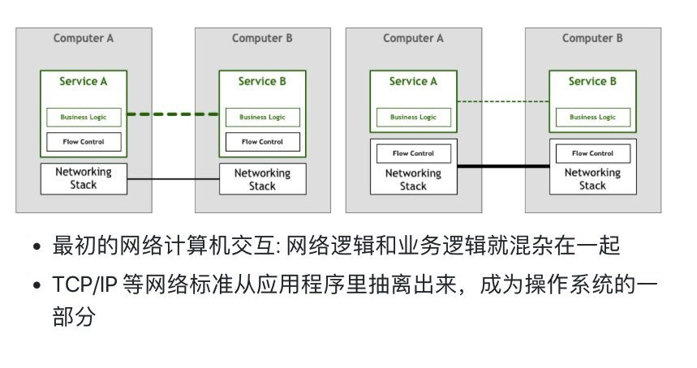

在计算机网络发展的初期, 开发人员需要在自己的代码中处理服务器之间的网络连接问题, 包括流量控制, 缓存队列, 数据加密等. 在这段时间内底层网络逻辑和业务逻辑是混杂在一起.

随着技术的发展，TCP/IP 等网络标准的出现解决了流量控制等问题。尽管网络逻辑代码依然存在，但已经从应用程序里抽离出来，成为操作系统网络层的一部分, 形成了经典的网络分层模式.

------

## 1.2 应用通信模式演进: 微服务架构的出现

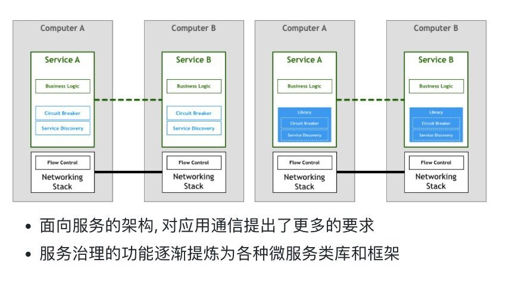

微服务架构是更为复杂的分布式系统，它给运维带来了更多挑战, 这些挑战主要包括资源的有效管理和服务之间的治理, 如:

- 服务注册, 服务发现
- 服务伸缩
- 健康检查
- 快速部署
- 服务容错: 断路器, 限流, 隔离舱, 熔断保护, 服务降级等等
- 认证和授权
- 灰度发布方案
- 服务调用可观测性, 指标收集
- 配置管理

在微服务架构的实现中，为提升效率和降低门槛，应用开发者会基于微服务框架来实现微服务。微服务框架一定程度上为使用者屏蔽了底层网络的复杂性及分布式场景下的不确定性。通过API/SDK的方式提供服务注册发现、服务RPC通信、服务配置管理、服务负载均衡、路由限流、容错、服务监控及治理、服务发布及升级等通用能力, 比较典型的产品有:

- 分布式RPC通信框架: COBRA, WebServices, Thrift, GRPC 等
- 服务治理特定领域的类库和解决方案: Hystrix, Zookeeper, Zipkin, Sentinel 等
- 对多种方案进行整合的微服务框架: SpringCloud、Finagle、Dubbox 等

实施微服务的成本往往会超出企业的预期(内容多, 门槛高), 花在服务治理上的时间成本甚至可能高过进行产品研发的时间. 另外上述的方案会限制可用的工具、运行时和编程语言。微服务软件库一般专注于某个平台, 这使得异构系统难以兼容, 存在重复的工作, 系统缺乏可移植性.

Docker 和Kubernetes 技术的流行, 为Pass资源的分配管理和服务的部署提供了新的解决方案, 但是微服务领域的其他服务治理问题仍然存在.

------

## 1.3 Sidecar 模式的兴起

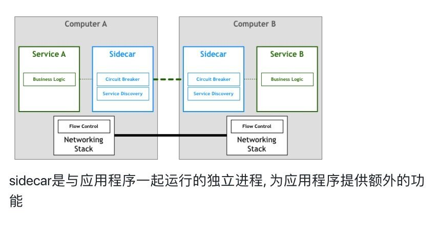

Sidecar(有时会叫做agent) 在原有的客户端和服务端之间加多了一个代理, 为应用程序提供的额外的功能, 如服务发现, 路由代理, 认证授权, 链路跟踪 等等.

业界使用Sidecar 的一些先例:

- 2013 年，Airbnb 开发了Synapse 和 Nerve，是sidecar的一种开源实现
- 2014 年, Netflix 发布了Prana，它也是一个sidecar，可以让非 JVM 应用接入他们的 NetflixOSS 生态系统

------

## 1.4 Service Mesh(服务网格)的出现


直观地看, Sidecar 到 Service Mesh 是一个规模的升级, 不过Service Mesh更强调的是:

- 不再将Sidecar(代理)视为单独的组件，而是强调由这些代理连接而形成的网络
- 基础设施, 对应用程序透明

------

## 1.5 Service Mesh 定义

以下是Linkerd的CEO [Willian Morgan](https://twitter.com/wm)给出的Service Mesh的定义:

> A Service Mesh is a dedicated infrastructure layer for handling service-to-service communication. It’s responsible for the reliable delivery of requests through the complex topology of services that comprise a modern, cloud native application. In practice, the Service Mesh is typically implemented as an array of lightweight network proxies that are deployed alongside application code, without the application needing to be aware.

服务网格（Service Mesh）是致力于解决服务间通讯的**基础设施层**。它负责在现代云原生应用程序的复杂服务拓扑来可靠地传递请求。实际上，Service Mesh 通常是通过一组**轻量级网络代理**（Sidecar proxy），与应用程序代码部署在一起来实现，且**对应用程序透明**。

------

## 1.6 第二代 Service Mesh


控制面板对每一个代理实例了如指掌，通过控制面板可以实现代理的访问控制和度量指标收集, 提升了服务网格的可观测性和管控能力, Istio 正是这类系统最为突出的代表.

------

## 1.7 Service Mesh 产品简史


- 2016 年 1 月 15 日，前 Twitter 的基础设施工程师 [William Morgan](https://twitter.com/wm) 和 Oliver Gould，在 GitHub 上发布了 Linkerd 0.0.7 版本，采用Scala编写, 他们同时组建了一个创业小公司 Buoyant，这是业界公认的第一个Service Mesh
- 2016 年，[Matt Klein](https://twitter.com/mattklein123)在 Lyft 默默地进行 Envoy 的开发。Envoy 诞生的时间其实要比 Linkerd 更早一些，只是在 Lyft 内部不为人所知
- 2016 年 9 月 29 日在 SF Microservices 上，“Service Mesh”这个词汇第一次在公开场合被使用。这标志着“Service Mesh”这个词，从 Buoyant 公司走向社区.
- 2016 年 9 月 13 日，Matt Klein 宣布 Envoy 在 GitHub 开源，直接发布 1.0.0 版本。
- 2016 年下半年，Linkerd 陆续发布了 0.8 和 0.9 版本，开始支持 HTTP/2 和 gRPC，1.0 发布在即；同时，借助 Service Mesh 在社区的认可度，Linkerd 在年底开始申请加入 CNCF
- 2017 年 1 月 23 日，Linkerd 加入 CNCF。
- 2017 年 3 月 7 日，Linkerd 宣布完成千亿次产品请求
- 2017 年 4 月 25 日，Linkerd 1.0 版本发布
- 2017 年 7 月 11 日，Linkerd 发布版本 1.1.1，宣布和 Istio 项目集成
- 2017 年 9 月, nginx突然宣布要搞出一个Servicemesh来, Nginmesh: <https://github.com/nginxinc/nginmesh>, 可以作为istio的数据面, 不过这个项目目前处于不活跃开发(This project is no longer under active development)
- 2017 年 12 月 5 日，Conduit 0.1.0 版本发布

Envoy 和 Linkerd 都是在数据面上的实现, 属于同一个层面的竞争, 是用 C++ 语言实现的，在性能和资源消耗上要比采用 Scala 语言实现的 Linkerd 小，这一点对于延迟敏感型和资源敏的服务尤为重要.

Envoy 对 作为 Istio 的标准数据面实现, 其最主要的贡献是提供了一套[标准数据面API](https://github.com/envoyproxy/data-plane-api/blob/master/API_OVERVIEW.md), 将服务信息和流量规则下发到数据面的sidecar中, 另外Envoy还支持热重启. Istio早期采用了Envoy v1 API，目前的版本中则使用V2 API，V1已被废弃.

通过采用该标准API，Istio将控制面和数据面进行了解耦，为多种数据面sidecar实现提供了可能性。事实上基于该标准API已经实现了多种Sidecar代理和Istio的集成，除Istio目前集成的Envoy外，还可以和Linkerd, Nginmesh等第三方通信代理进行集成，也可以基于该API自己编写Sidecar实现.

将控制面和数据面解耦是Istio后来居上，风头超过Service mesh鼻祖Linkerd的一招妙棋。Istio站在了控制面的高度上，而Linkerd则成为了可选的一种sidecar实现.

Conduit 的整体架构和 Istio 一致，借鉴了 Istio 数据平面 + 控制平面的设计，而且选择了 Rust 编程语言来实现数据平面，以达成 Conduit 宣称的更轻、更快和超低资源占用.

------

## 1.8 似曾相识的竞争格局

|              | Kubernetes                      | Istio                    |
| ------------ | ------------------------------- | ------------------------ |
| 领域         | 容器编排                        | 服务网格                 |
| 主要竞品     | Swarm, Mesos                    | Linkerd, Conduit         |
| 主要盟友     | RedHat, CoreOS                  | IBM, Lyft                |
| 主要竞争对手 | Docker 公司                     | Buoyant 公司             |
| 标准化       | OCI: runtime spec, image spec   | XDS                      |
| 插件化       | CNI, CRI                        | Istio CNI, Mixer Adapter |
| 结果         | Kubernetes 成为容器编排事实标准 | ?                        |

google 主导的Kubernetes 在容器编排领域取得了完胜, 目前在服务网格领域的打法如出一辙, 社区对Istio前景也比较看好.

Istio CNI 计划在1.1 作为实验特性, 用户可以通过扩展方式定制sidecar的网络.

------

## 1.9 国内Service Mesh 发展情况

- 蚂蚁金服开源SOFAMesh：
  - https://github.com/alipay/sofa-mesh
  - 从istio fork
  - 使用Golang语言开发全新的Sidecar，替代Envoy
  - 为了避免Mixer带来的性能瓶颈，合并Mixer部分功能进入Sidecar
  - Pilot和Citadel模块进行了大幅的扩展和增强
  - 扩展RPC协议: SOFARPC/HSF/Dubbo
- 华为:
  - go-chassis: <https://github.com/go-chassis/go-chassis> golang 微服务框架, 支持istio平台
  - mesher: <https://github.com/go-mesh/mesher> mesh 数据面解决方案
  - 国内首家提供Service Mesh公共服务的云厂商
  - 目前(2019年1月)公有云Istio 产品线上已经支持申请公测, 产品形态比较完善
- 腾讯云 TSF:
  - 基于 Istio、envoy 进行改造
  - 支持 Kubernetes、虚拟机以及裸金属的服务
  - 对 Istio 的能力进行了扩展和增强, 对 Consul 的完整适配
  - 对于其他二进制协议进行扩展支持
- 唯品会
  - OSP (Open Service Platform)
- 新浪:
  - Motan: 是一套基于java开发的RPC框架, Weibo Mesh 是基于Motan

------

# 2. Istio: 第二代 Service Mesh

Istio来自希腊语，英文意思是「sail」, 意为「启航」

- 2.1 Istio 架构
- 2.2 核心功能
- 2.3 Istio 演示: BookInfo

------

## 2.1 Istio 架构

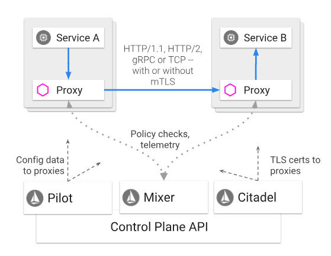

Istio Architecture（图片来自[Isio官网文档](https://istio.io/docs/concepts/what-is-istio/))


- 数据面
  - Sidecar
- 控制面
  - Pilot：服务发现、流量管理
  - Mixer：访问控制、遥测
  - Citadel：终端用户认证、流量加密

------

### 2.2 核心功能

- 流量管理
- 安全
- 可观察性
- 多平台支持
- 集成和定制

下面是我对Istio架构总结的思维导图:

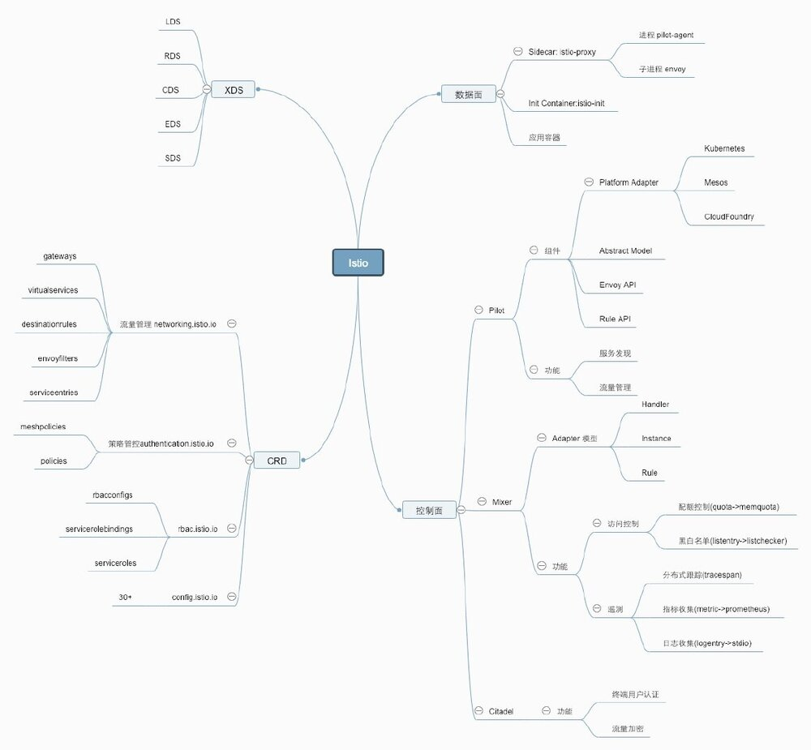

------

## 2.3 Istio 演示: BookInfo

以下是Istio官网经典的 BookInfo Demo, 这是一个多语言组成的异构微服务系统:

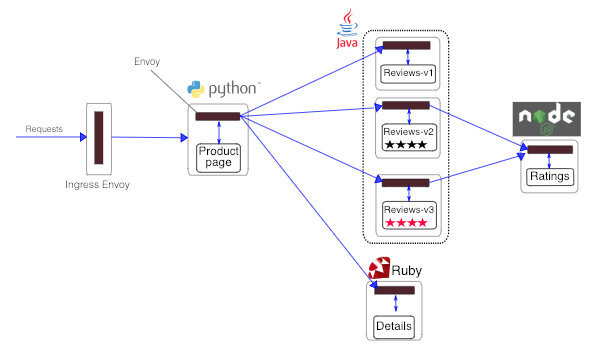

Bookinfo Application（图片来自[Isio官网文档](https://istio.io/docs/examples/bookinfo/))


下面我将现场给大家进行演示, 从demo安装开始, 并体验一下istio的流控功能:

#### 使用helm管理istio

下载istio release: <https://istio.io/docs/setup/kubernetes/download-release/>

##### 安装istio:

```bash
kubectl apply -f install/kubernetes/helm/istio/templates/crds.yaml
helm install install/kubernetes/helm/istio --name istio --namespace istio-system
```

注意事项, 若要开启sidecar自动注入功能, 需要:

- 确保 kube-apiserver 启动参数 开启了ValidatingAdmissionWebhook 和 MutatingAdmissionWebhook
- 给namespace 增加 label: `kubectl label namespace default istio-injection=enabled`
- 同时还要保证 kube-apiserver 的 aggregator layer 开启: `--enable-aggregator-routing=true` 且证书和api server连通性正确设置.

##### 如需卸载istio:

```bash
helm delete --purge istio
kubectl delete -f install/kubernetes/helm/istio/templates/crds.yaml -n istio-system
```

更多安装选择请参考: <https://istio.io/docs/setup/kubernetes/helm-install/>

#### 安装Bookinfo Demo:

Bookinfo 是一个多语言异构的微服务demo, 其中 productpage 微服务会调用 details 和 reviews 两个微服务, reviews 会调用ratings 微服务, reviews 微服务有 3 个版本. 关于此项目更多细节请参考: <https://istio.io/docs/examples/bookinfo/>

##### 部署应用:

```bash
kubectl apply -f samples/bookinfo/platform/kube/bookinfo.yaml
```

这将创建 productpage, details, ratings, reviews 对应的deployments 和 service, 其中reviews 有三个deployments, 代表三个不同的版本.

```bash
 % kubectl get pod
NAME                           READY     STATUS    RESTARTS   AGE
details-v1-6865b9b99d-mnxbt    2/2       Running   0          1m
productpage-v1-f8c8fb8-zjbhh   2/2       Running   0          59s
ratings-v1-77f657f55d-95rcz    2/2       Running   0          1m
reviews-v1-6b7f6db5c5-zqvkn    2/2       Running   0          59s
reviews-v2-7ff5966b99-lw72l    2/2       Running   0          59s
reviews-v3-5df889bcff-w9v7g    2/2       Running   0          59s

 % kubectl get svc
NAME          TYPE        CLUSTER-IP       EXTERNAL-IP   PORT(S)    AGE
details       ClusterIP   172.18.255.240   <none>        9080/TCP   1m
productpage   ClusterIP   172.18.255.137   <none>        9080/TCP   1m
ratings       ClusterIP   172.18.255.41    <none>        9080/TCP   1m
reviews       ClusterIP   172.18.255.140   <none>        9080/TCP   1m
```

对入口流量进行配置:

```bash
kubectl apply -f samples/bookinfo/networking/bookinfo-gateway.yaml
```

该操作会创建bookinfo-gateway 的Gateway, 并将流量发送到productpage服务

```bash
kubectl get gateway
NAME               AGE
bookinfo-gateway   1m
```

此时通过bookinfo-gateway 对应的LB或者nodeport 访问/productpage 页面, 可以看到三个版本的reviews服务在随机切换

#### 基于权重的路由

通过CRD DestinationRule创建3 个reviews 子版本:

```bash
kubectl apply -f samples/bookinfo/networking/destination-rule-reviews.yaml
```

通过CRD VirtualService 调整个 reviews 服务子版本的流量比例, 设置 v1 和 v3 各占 50%

```bash
kubectl apply -f samples/bookinfo/networking/virtual-service-reviews-50-v3.yaml
```

刷新页面, 可以看到无法再看到reviews v2的内容, 页面在v1和v3之间切换.

#### 基于内容路由

修改reviews CRD, 将jason 登录的用户版本路由到v2, 其他用户路由到版本v3.

```bash
kubectl apply -f samples/bookinfo/networking/virtual-service-reviews-jason-v2-v3.yaml
```

刷新页面, 使用jason登录的用户, 将看到v2 黑色星星版本, 其他用户将看到v3 红色星星版本.

更多BookInfo 示例, 请参阅: <https://istio.io/docs/examples/bookinfo/>, 若要删除应用: 执行脚本 `./samples/bookinfo/platform/kube/cleanup.sh`

------

# 3. Istio 数据面

- 3.1 数据面组件
- 3.2 sidecar 流量劫持原理
- 3.3 数据面标准API: xDS
- 3.4 分布式跟踪

## 3.1 数据面组件

Istio 注入sidecar实现:

- 自动注入: 利用 [Kubernetes Dynamic Admission Webhooks](https://kubernetes.io/docs/reference/access-authn-authz/extensible-admission-controllers/) 对 新建的pod 进行注入: init container + sidecar
- 手动注入: 使用`istioctl kube-inject`

注入Pod内容:

- istio-init: 通过配置iptables来劫持Pod中的流量
- istio-proxy: 两个进程pilot-agent和envoy, pilot-agent 进行初始化并启动envoy

#### Sidecar 自动注入实现

Istio 利用 [Kubernetes Dynamic Admission Webhooks](https://kubernetes.io/docs/reference/access-authn-authz/extensible-admission-controllers/) 对pod 进行sidecar注入

查看istio 对这2个Webhooks 的配置 ValidatingWebhookConfiguration 和 MutatingWebhookConfiguration:

```bash
% kubectl get ValidatingWebhookConfiguration -oyaml
% kubectl get mutatingWebhookConfiguration -oyaml
```

可以看出:

- 命名空间`istio-system` 中的服务 `istio-galley`, 通过路由`/admitpilot`, 处理config.istio.io部分, rbac.istio.io, authentication.istio.io, networking.istio.io等资源的Validating 工作
- 命名空间istio-system 中的服务 `istio-galley`, 通过路由`/admitmixer`, 处理其他config.istio.io资源的Validating 工作
- 命名空间istio-system 中的服务 `istio-sidecar-injector`, 通过路由`/inject`, 处理其他`v1/pods`的CREATE, 同时需要满足命名空间`istio-injection: enabled`

#### istio-init

数据面的每个Pod会被注入一个名为`istio-init` 的initContainer, initContrainer是K8S提供的机制，用于在Pod中执行一些初始化任务.在Initialcontainer执行完毕并退出后，才会启动Pod中的其它container.

```yaml
initContainers:
- image: docker.io/istio/proxy_init:1.0.5
  args:
  - -p
  - "15001"
  - -u
  - "1337"
  - -m
  - REDIRECT
  - -i
  - '*'
  - -x
  - ""
  - -b
  - "9080"
  - -d
  - ""
```

istio-init ENTRYPOINT 和 args 组合的启动命令:

```bash
/usr/local/bin/istio-iptables.sh -p 15001 -u 1337 -m REDIRECT -i '*' -x "" -b 9080 -d ""
```

istio-iptables.sh 源码地址为 <https://github.com/istio/istio/blob/master/tools/deb/istio-iptables.sh>

```bash
$ istio-iptables.sh -p PORT -u UID -g GID [-m mode] [-b ports] [-d ports] [-i CIDR] [-x CIDR] [-h]
  -p: 指定重定向所有 TCP 流量的 Envoy 端口（默认为 $ENVOY_PORT = 15001）
  -u: 指定未应用重定向的用户的 UID。通常，这是代理容器的 UID（默认为 $ENVOY_USER 的 uid，istio_proxy 的 uid 或 1337）
  -g: 指定未应用重定向的用户的 GID。（与 -u param 相同的默认值）
  -m: 指定入站连接重定向到 Envoy 的模式，“REDIRECT” 或 “TPROXY”（默认为 $ISTIO_INBOUND_INTERCEPTION_MODE)
  -b: 逗号分隔的入站端口列表，其流量将重定向到 Envoy（可选）。使用通配符 “*” 表示重定向所有端口。为空时表示禁用所有入站重定向（默认为 $ISTIO_INBOUND_PORTS）
  -d: 指定要从重定向到 Envoy 中排除（可选）的入站端口列表，以逗号格式分隔。使用通配符“*” 表示重定向所有入站流量（默认为 $ISTIO_LOCAL_EXCLUDE_PORTS）
  -i: 指定重定向到 Envoy（可选）的 IP 地址范围，以逗号分隔的 CIDR 格式列表。使用通配符 “*” 表示重定向所有出站流量。空列表将禁用所有出站重定向（默认为 $ISTIO_SERVICE_CIDR）
  -x: 指定将从重定向中排除的 IP 地址范围，以逗号分隔的 CIDR 格式列表。使用通配符 “*” 表示重定向所有出站流量（默认为 $ISTIO_SERVICE_EXCLUDE_CIDR）。

环境变量位于 $ISTIO_SIDECAR_CONFIG（默认在：/var/lib/istio/envoy/sidecar.env）
```

istio-init 通过配置iptable来劫持Pod中的流量:

- 参数`-p 15001`: Pod中的数据流量被iptable拦截，并发向15001端口, 该端口将由 envoy 监听
- 参数`-u 1337`: 用于排除用户ID为1337，即Envoy自身的流量，以避免Iptable把Envoy发出的数据又重定向到Envoy, UID 为 1337，即 Envoy 所处的用户空间，这也是 istio-proxy 容器默认使用的用户, 见Sidecar `istio-proxy` 配置参数`securityContext.runAsUser`
- 参数`-b 9080` `-d ""`: 入站端口控制, 将所有访问 9080 端口（即应用容器的端口）的流量重定向到 Envoy 代理
- 参数`-i '*'` `-x ""`: 出站IP控制, 将所有出站流量都重定向到 Envoy 代理

Init 容器初始化完毕后就会自动终止，但是 Init 容器初始化结果(iptables)会保留到应用容器和 Sidecar 容器中.

#### istio-proxy

istio-proxy 以 sidecar 的形式注入到应用容器所在的pod中, 简化的注入yaml:

```yaml
- image: docker.io/istio/proxyv2:1.0.5
  name: istio-proxy
  args:
  - proxy
  - sidecar
  - --configPath
  - /etc/istio/proxy
  - --binaryPath
  - /usr/local/bin/envoy
  - --serviceCluster
  - ratings
  - --drainDuration
  - 45s
  - --parentShutdownDuration
  - 1m0s
  - --discoveryAddress
  - istio-pilot.istio-system:15007
  - --discoveryRefreshDelay
  - 1s
  - --zipkinAddress
  - zipkin.istio-system:9411
  - --connectTimeout
  - 10s
  - --proxyAdminPort
  - "15000"
  - --controlPlaneAuthPolicy
  - NONE
  env:
    ......
  ports:
  - containerPort: 15090
    name: http-envoy-prom
    protocol: TCP
  securityContext:
    runAsUser: 1337
    ......
```

istio-proxy容器中有两个进程pilot-agent和envoy:

```bash
~ % kubectl exec productpage-v1-f8c8fb8-wgmzk -c istio-proxy -- ps -ef
UID        PID  PPID  C STIME TTY          TIME CMD
istio-p+     1     0  0 Jan03 ?        00:00:27 /usr/local/bin/pilot-agent proxy sidecar --configPath /etc/istio/proxy --binaryPath /usr/local/bin/envoy --serviceCluster productpage --drainDuration 45s --parentShutdownDuration 1m0s --discoveryAddress istio-pilot.istio-system:15007 --discoveryRefreshDelay 1s --zipkinAddress zipkin.istio-system:9411 --connectTimeout 10s --proxyAdminPort 15000 --controlPlaneAuthPolicy NONE
istio-p+    21     1  0 Jan03 ?        01:26:24 /usr/local/bin/envoy -c /etc/istio/proxy/envoy-rev0.json --restart-epoch 0 --drain-time-s 45 --parent-shutdown-time-s 60 --service-cluster productpage --service-node sidecar~172.18.3.12~productpage-v1-f8c8fb8-wgmzk.default~default.svc.cluster.local --max-obj-name-len 189 --allow-unknown-fields -l warn --v2-config-only
```

可以看到:

- `/usr/local/bin/pilot-agent` 是 `/usr/local/bin/envoy` 的父进程, Pilot-agent进程根据启动参数和K8S API Server中的配置信息生成Envoy的初始配置文件(`/etc/istio/proxy/envoy-rev0.json`)，并负责启动Envoy进程
- pilot-agent 的启动参数里包括: discoveryAddress(pilot服务地址), Envoy 二进制文件的位置, 服务集群名, 监控指标上报地址, Envoy 的管理端口, 热重启时间等

Envoy配置初始化流程:

1. Pilot-agent根据启动参数和K8S API Server中的配置信息生成Envoy的初始配置文件envoy-rev0.json，该文件告诉Envoy从xDS server中获取动态配置信息，并配置了xDS server的地址信息，即控制面的Pilot
2. Pilot-agent使用envoy-rev0.json启动Envoy进程
3. Envoy根据初始配置获得Pilot地址，采用xDS接口从Pilot获取到Listener，Cluster，Route等d动态配置信息
4. Envoy根据获取到的动态配置启动Listener，并根据Listener的配置，结合Route和Cluster对拦截到的流量进行处理

查看envoy 初始配置文件:

```bash
kubectl exec productpage-v1-f8c8fb8-wgmzk -c istio-proxy -- cat /etc/istio/proxy/envoy-rev0.json
```

------

## 3.2 sidecar 流量劫持原理

sidecar 既要作为服务消费者端的正向代理，又要作为服务提供者端的反向代理, 具体拦截过程如下:

- Pod 所在的network namespace内, 除了envoy发出的流量外, iptables规则会对进入和发出的流量都进行拦截，通过nat redirect重定向到Envoy监听的15001端口.
- envoy 会根据从Pilot拿到的 XDS 规则, 对流量进行转发.
- envoy 的 listener 0.0.0.0:15001 接收进出 Pod 的所有流量，然后将请求移交给对应的virtual listener
- 对于本pod的服务, 有一个http listener `podIP+端口` 接受inbound 流量
- 每个service+非http端口, 监听器配对的 Outbound 非 HTTP 流量
- 每个service+http端口, 有一个http listener: `0.0.0.0+端口` 接受outbound流量

整个拦截转发过程对业务容器是透明的, 业务容器仍然使用 Service 域名和端口进行通信, service 域名仍然会转换为service IP, 但service IP 在sidecar 中会被直接转换为 pod IP, 从容器中出去的流量已经使用了pod IP会直接转发到对应的Pod, 对比传统kubernetes 服务机制, service IP 转换为Pod IP 在node上进行, 由 kube-proxy维护的iptables实现.

------

## 3.3 数据面标准API: xDS

xDS是一类发现服务的总称，包含LDS，RDS，CDS，EDS以及 SDS。Envoy通过xDS API可以动态获取Listener(监听器)， Route(路由)，Cluster(集群)，Endpoint(集群成员)以 及Secret(证书)配置

xDS API 涉及的概念:

- Host
- Downstream
- Upstream
- Listener
- Cluster

Envoy 配置热更新: 配置的动态变更，而不需要重启 Envoy:

1. 新老进程采用基本的RPC协议使用Unix Domain Socket通讯.
2. 新进程启动并完成所有初始化工作后，向老进程请求监听套接字的副本.
3. 新进程接管套接字后，通知老进程关闭套接字.
4. 通知老进程终止自己.

#### xDS 调试

Pilot在9093端口提供了下述调试接口:

```bash
# What is sent to envoy
# Listeners and routes
curl $PILOT/debug/adsz

# Endpoints
curl $PILOT/debug/edsz

# Clusters
curl $PILOT/debug/cdsz

```

Sidecar Envoy 也提供了管理接口，缺省为localhost的15000端口，可以获取listener，cluster以及完整的配置数据

可以通过以下命令查看支持的调试接口:

```bash
kubectl exec productpage-v1-f8c8fb8-zjbhh -c istio-proxy curl http://127.0.0.1:15000/help

```

或者forward到本地就行调试

```bash
kubectl port-forward productpage-v1-f8c8fb8-zjbhh 15000

```

相关的调试接口:

```bash
http://127.0.0.1:15000
http://127.0.0.1:15000/help
http://127.0.0.1:15000/config_dump
http://127.0.0.1:15000/listeners
http://127.0.0.1:15000/clusters

```

使用istioctl 查看代理配置:

```bash
istioctl pc {xDS类型}  {POD_NAME} {过滤条件} {-o json/yaml}

eg:
istioctl pc routes productpage-v1-f8c8fb8-zjbhh --name 9080 -o json

```

xDS 类型包括: listener, route, cluster, endpoint

#### 对xDS 进行分析: productpage 访问 reviews 服务

查看 product 的所有listener:

```bash
% istioctl pc listener  productpage-v1-f8c8fb8-zjbhh
ADDRESS            PORT      TYPE
172.18.255.178     15011     TCP
172.18.255.194     44134     TCP
172.18.255.110     443       TCP
172.18.255.190     50000     TCP
172.18.255.203     853       TCP
172.18.255.2       443       TCP
172.18.255.239     16686     TCP
0.0.0.0            80        TCP
172.18.255.215     3306      TCP
172.18.255.203     31400     TCP
172.18.255.111     443       TCP
172.18.255.203     8060      TCP
172.18.255.203     443       TCP
172.18.255.40      443       TCP
172.18.255.1       443       TCP
172.18.255.53      53        TCP
172.18.255.203     15011     TCP
172.18.255.105     14268     TCP
172.18.255.125     42422     TCP
172.18.255.105     14267     TCP
172.18.255.52      80        TCP
0.0.0.0            15010     HTTP
0.0.0.0            9411      HTTP
0.0.0.0            8060      HTTP
0.0.0.0            9080      HTTP
0.0.0.0            15004     HTTP
0.0.0.0            20001     HTTP
0.0.0.0            9093      HTTP
0.0.0.0            8080      HTTP
0.0.0.0            15030     HTTP
0.0.0.0            9091      HTTP
0.0.0.0            9090      HTTP
0.0.0.0            15031     HTTP
0.0.0.0            3000      HTTP
0.0.0.0            15001     TCP
172.18.3.50        9080      HTTP 这是当前pod ip 暴露的服务地址, 会路由到回环地址, 各个pod 会不一样

```

envoy 流量入口的listener:

```bash
% istioctl pc listener  productpage-v1-f8c8fb8-zjbhh --address 0.0.0.0 --port 15001 -o json
[
    {
        "name": "virtual",
        "address": {
            "socketAddress": {
                "address": "0.0.0.0",
                "portValue": 15001
            }
        },
        "filterChains": [
            {
                "filters": [
                    {
                        "name": "envoy.tcp_proxy",
                        "config": {
                            "cluster": "BlackHoleCluster",
                            "stat_prefix": "BlackHoleCluster"
                        }
                    }
                ]
            }
        ],
        "useOriginalDst": true # 这意味着它将请求交给最符合请求原始目标的监听器。如果找不到任何匹配的虚拟监听器，它会将请求发送给返回 404 的 BlackHoleCluster
    }
]

```

以下是reviews的所有pod IP

```bash
 % kubectl get ep reviews
NAME      ENDPOINTS                                            AGE
reviews   172.18.2.35:9080,172.18.3.48:9080,172.18.3.49:9080   1d

```

对于目的地址是以上ip的http访问, 这些 ip 并没有对应的listener, 因此会通过端口9080 匹配到listener `0.0.0.0 9080`

查看listener `0.0.0.0 9080`:

```bash
% istioctl pc listener  productpage-v1-f8c8fb8-zjbhh --address 0.0.0.0 --port 9080 -ojson
    {
        "name": "0.0.0.0_9080",
        "address": {
            "socketAddress": {
                "address": "0.0.0.0",
                "portValue": 9080
            }
        },
        ......

                            "rds": {
                                "config_source": {
                                    "ads": {}
                                },
                                "route_config_name": "9080"
                            },
                            ......

```

查看名为`9080` 的 route:

```bash
% istioctl pc routes  productpage-v1-f8c8fb8-zjbhh --name 9080 -o json

[
    {
        "name": "9080",
        "virtualHosts": [
            {
                "name": "details.default.svc.cluster.local:9080",
                "domains": [
                    "details.default.svc.cluster.local",
                    "details.default.svc.cluster.local:9080",
                    "details",
                    "details:9080",
                    "details.default.svc.cluster",
                    "details.default.svc.cluster:9080",
                    "details.default.svc",
                    "details.default.svc:9080",
                    "details.default",
                    "details.default:9080",
                    "172.18.255.240",
                    "172.18.255.240:9080"
                ],
                "routes": [
                    {
                        "match": {
                            "prefix": "/"
                        },
                        "route": {
                            "cluster": "outbound|9080||details.default.svc.cluster.local",
                            "timeout": "0.000s",
                            "maxGrpcTimeout": "0.000s"
                        },
                        ......
            {
                "name": "productpage.default.svc.cluster.local:9080",
                "domains": [
                    "productpage.default.svc.cluster.local",
                    "productpage.default.svc.cluster.local:9080",
                    "productpage",
                    "productpage:9080",
                    "productpage.default.svc.cluster",
                    "productpage.default.svc.cluster:9080",
                    "productpage.default.svc",
                    "productpage.default.svc:9080",
                    "productpage.default",
                    "productpage.default:9080",
                    "172.18.255.137",
                    "172.18.255.137:9080"
                ],
                "routes": [ ...... ]
            },
            {
                "name": "ratings.default.svc.cluster.local:9080",
                "domains": [
                    "ratings.default.svc.cluster.local",
                    "ratings.default.svc.cluster.local:9080",
                    "ratings",
                    "ratings:9080",
                    "ratings.default.svc.cluster",
                    "ratings.default.svc.cluster:9080",
                    "ratings.default.svc",
                    "ratings.default.svc:9080",
                    "ratings.default",
                    "ratings.default:9080",
                    "172.18.255.41",
                    "172.18.255.41:9080"
                ],
                "routes": [ ...... ]
            },
            {
                "name": "reviews.default.svc.cluster.local:9080",
                "domains": [
                    "reviews.default.svc.cluster.local",
                    "reviews.default.svc.cluster.local:9080",
                    "reviews",
                    "reviews:9080",
                    "reviews.default.svc.cluster",
                    "reviews.default.svc.cluster:9080",
                    "reviews.default.svc",
                    "reviews.default.svc:9080",
                    "reviews.default",
                    "reviews.default:9080",
                    "172.18.255.140",
                    "172.18.255.140:9080"
                ],
                "routes": [
                    {
                        "match": {
                            "prefix": "/",
                            "headers": [
                                {
                                    "name": "end-user",
                                    "exactMatch": "jason"
                                }
                            ]
                        },
                        "route": {
                            "cluster": "outbound|9080|v2|reviews.default.svc.cluster.local",
                            "timeout": "0.000s",
                            "maxGrpcTimeout": "0.000s"
                        },
                        ......
                    },
                    {
                        "match": {
                            "prefix": "/"
                        },
                        "route": {
                            "cluster": "outbound|9080|v3|reviews.default.svc.cluster.local",
                            "timeout": "0.000s",
                            "maxGrpcTimeout": "0.000s"
                        },
                        .......
                    }
                ]
            }
        ],
        "validateClusters": false
    }
]

```

可以看到, 在9080 这个route 中, 包含所有这个端口的http 路由信息, 通过virtualHosts列表进行服务域名分发到各个cluster.

查看virtualHosts `reviews.default.svc.cluster.local:9080` 中的routes信息, 可以看到jason 路由到了cluster `outbound|9080|v2|reviews.default.svc.cluster.local`

查看该cluster:

```bash
% istioctl pc cluster productpage-v1-f8c8fb8-zjbhh --fqdn reviews.default.svc.cluster.local --subset v2 -o json
[
    {
        "name": "outbound|9080|v2|reviews.default.svc.cluster.local",
        "type": "EDS",
        "edsClusterConfig": {
            "edsConfig": {
                "ads": {}
            },
            "serviceName": "outbound|9080|v2|reviews.default.svc.cluster.local"
        },
        "connectTimeout": "1.000s",
        "lbPolicy": "RANDOM",
        "circuitBreakers": {
            "thresholds": [
                {}
            ]
        }
    }
]

```

查看其对应的endpoint:

```bash
 % istioctl pc endpoint productpage-v1-f8c8fb8-zjbhh --cluster 'outbound|9080|v2|reviews.default.svc.cluster.local'
ENDPOINT             STATUS      CLUSTER
172.18.2.35:9080     HEALTHY     outbound|9080|v2|reviews.default.svc.cluster.local

```

该endpoint 即为 reviews 服务 V2 对应的 pod IP

#### XDS服务接口的最终一致性考虑

遵循 make before break 模型

------

## 3.4 分布式跟踪

以下是分布式全链路跟踪示意图:

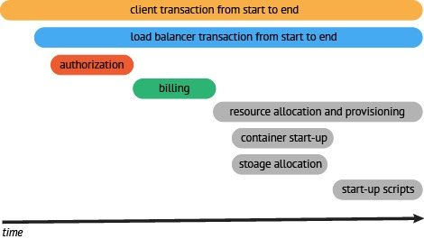

一个典型的Trace案例（图片来自[opentracing文档中文版](https://wu-sheng.gitbooks.io/opentracing-io/content/))

------

Jaeger 是Uber 开源的全链路跟踪系统, 符合OpenTracing协议, OpenTracing 和 Jaeger 均是CNCF 成员项目, 以下是Jaeger 架构的示意图:

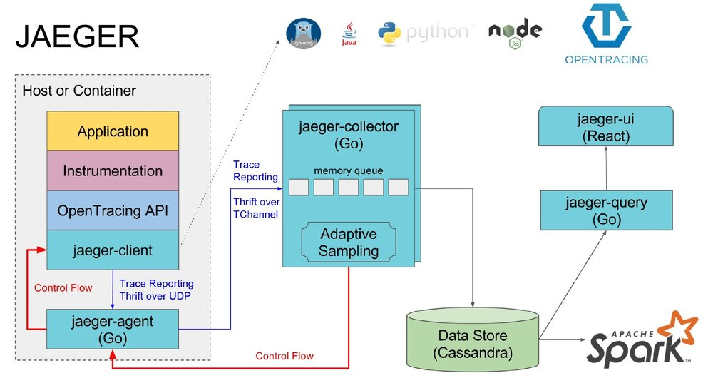

Jaeger 架构示意图（图片来自[Jaeger官方文档](https://www.jaegertracing.io/docs/1.6/architecture/))

分布式跟踪系统让开发者能够得到可视化的调用流程展示。这对复杂的微服务系统进行问题排查和性能优化时至关重要.

Envoy 原生支持http 链路跟踪:

- 生成 Request ID：Envoy 会在需要的时候生成 UUID，并操作名为 [x-request-id] 的 HTTP Header。应用可以转发这个 Header 用于统一的记录和跟踪.
- 支持集成外部跟踪服务：Envoy 支持可插接的外部跟踪可视化服务。目前支持有:
  - LightStep
  - Zipkin 或者 Zipkin 兼容的后端（比如说 Jaeger）
  - Datadog
- 客户端跟踪 ID 连接：x-client-trace-id Header 可以用来把不信任的请求 ID 连接到受信的 x-request-id Header 上

#### 跟踪上下文信息的传播

- 不管使用的是哪个跟踪服务，都应该传播 x-request-id，这样在被调用服务中启动相关性的记录
- 如果使用的是 Zipkin，Envoy 要传播的是 [B3 Header](https://www.envoyproxy.io/docs/envoy/latest/configuration/http_conn_man/headers#config-http-conn-man-headers-b3)。（x-b3-traceid, x-b3-spanid, x-b3-parentspanid, x-b3-sampled, 以及 x-b3-flags. x-b3-sampled）
- 上下文跟踪并非零修改, 在调用下游服务时, 上游应用应该自行传播跟踪相关的 HTTP Header

------

# 4. Istio 控制面

- 4.1 Pilot 架构
- 4.2 流量管理模型
- 4.3 故障处理
- 4.4 Mixer 架构
- 4.5 Mixer适配器模型
- 4.6 Mixer 缓存机制

------

## 4.1 Pilot 架构

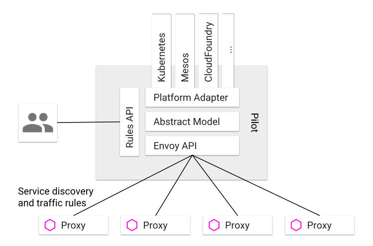

Pilot Architecture（图片来自[Isio官网文档](https://istio.io/docs/concepts/traffic-management/))


- Rules API: 对外封装统一的 API，供服务的开发者或者运维人员调用，可以用于流量控制。
- Envoy API: 对内封装统一的 API，供 Envoy 调用以获取注册信息、流量控制信息等。
- 抽象模型层: 对服务的注册信息、流量控制规则等进行抽象，使其描述与平台无关。
- 平台适配层: 用于适配各个平台如 Kubernetes、Mesos、Cloud Foundry 等，把平台特定的注册信息、资源信息等转换成抽象模型层定义的平台无关的描述。例如，Pilot 中的 Kubernetes 适配器实现必要的控制器来 watch Kubernetes API server 中 pod 注册信息、ingress 资源以及用于存储流量管理规则的第三方资源的更改

------

## 4.2 流量管理模型

- VirtualService
- DestinationRule
- ServiceEntry
- Gateway

#### VirtualService

VirtualService 中定义了一系列针对指定服务的流量路由规则。每个路由规则都是针对特定协议的匹配规则。如果流量符合这些特征，就会根据规则发送到服务注册表中的目标服务, 或者目标服务的子集或版本, 匹配规则中还包含了对流量发起方的定义，这样一来，规则还可以针对特定客户上下文进行定制.

#### Gateway

Gateway 描述了一个负载均衡器，用于承载网格边缘的进入和发出连接。这一规范中描述了一系列开放端口，以及这些端口所使用的协议、负载均衡的 SNI 配置等内容

#### ServiceEntry

Istio 服务网格内部会维护一个与平台无关的使用通用模型表示的服务注册表，当你的服务网格需要访问外部服务的时候，就需要使用 ServiceEntry 来添加服务注册, 这类服务可能是网格外的 API，或者是处于网格内部但却不存在于平台的服务注册表中的条目（例如需要和 Kubernetes 服务沟通的一组虚拟机服务）.

#### EnvoyFilter

EnvoyFilter 描述了针对代理服务的过滤器，用来定制由 Istio Pilot 生成的代理配置.

#### Kubernetes Ingress vs Istio Gateway

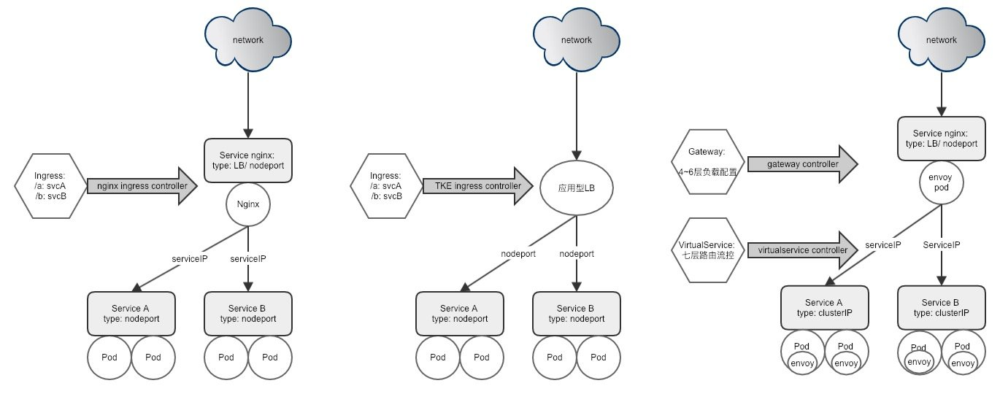

- 合并了L4-6和L7的规范, 对传统技术栈用户的应用迁入不方便
- 表现力不足:
  - 只能对 service、port、HTTP 路径等有限字段匹配来路由流量
  - 端口只支持默认80/443

Istio Gateway:·

- 定义了四层到六层的负载均衡属性 (通常是SecOps或NetOps关注的内容)
  - 端口
  - 端口所使用的协议(HTTP, HTTPS, GRPC, HTTP2, MONGO, TCP, TLS)
  - Hosts
  - TLS SNI header 路由支持
  - TLS 配置支持(http 自动301, 证书等)
  - ip / unix domain socket

#### Kubernetes, Istio, Envoy xDS 模型对比

以下是对Kubernetes, Istio, Envoy xDS 模型的不严格对比

|              | Kubernetes | Istio           | Envoy xDS        |
| ------------ | ---------- | --------------- | ---------------- |
| 入口流量     | Ingress    | GateWay         | Listener         |
| 服务定义     | Service    | -               | Cluster+Listener |
| 外部服务定义 | -          | ServiceEntry    | Cluster+Listener |
| 版本定义     | -          | DestinationRule | Cluster+Listener |
| 版本路由     | -          | VirtualService  | Route            |
| 实例         | Endpoint   | -               | Endpoint         |

#### Kubernetes 和 Istio 服务寻址的区别:

**Kubernetes**:

1. kube-dns: service domain -> service ip
2. kube-proxy(node iptables): service ip -> pod ip

**Istio**:

1. kube-dns: service domain -> service ip
2. sidecar envoy: service ip -> pod ip

------

## 4.3 故障处理

随着微服务的拆分粒度增强, 服务调用会增多, 更复杂, 扇入 扇出, 调用失败的风险增加, 以下是常见的服务容错处理方式:

|      | 控制端 | 目的                                   | 实现                                                         | Istio                                   |
| ---- | ------ | -------------------------------------- | ------------------------------------------------------------ | --------------------------------------- |
| 超时 | client | 保护client                             | 请求等待超时/请求运行超时                                    | timeout                                 |
| 重试 | client | 容忍server临时错误, 保证业务整体可用性 | 重试次数/重试的超时时间                                      | retries.attempts, retries.perTryTimeout |
| 熔断 | client | 降低性能差的服务或实例的影响           | 通常会结合超时+重试, 动态进行服务状态决策(Open/Closed/Half-Open) | trafficPolicy.outlierDetection          |
| 降级 | client | 保证业务主要功能可用                   | 主逻辑失败采用备用逻辑的过程(镜像服务分级, 调用备用服务, 或者返回mock数据) | 暂不支持, 需要业务代码按需实现          |
| 隔离 | client | 防止异常server占用过多client资源       | 隔离对不同服务调用的资源依赖: 线程池隔离/信号量隔离          | 暂不支持                                |
| 幂等 | server | 容忍client重试, 保证数据一致性         | 唯一ID/加锁/事务等手段                                       | 暂不支持, 需要业务代码按需实现          |
| 限流 | server | 保护server                             | 常用算法: 计数器, 漏桶, 令牌桶                               | trafficPolicy.connectionPool            |

Istio 没有无降级处理支持: Istio可以提高网格中服务的可靠性和可用性。但是，应用程序仍然需要处理故障（错误）并采取适当的回退操作。例如，当负载均衡池中的所有实例都失败时，Envoy 将返回 HTTP 503。应用程序有责任实现必要的逻辑，对这种来自上游服务的 HTTP 503 错误做出合适的响应。

------

## 4.4 Mixer 架构

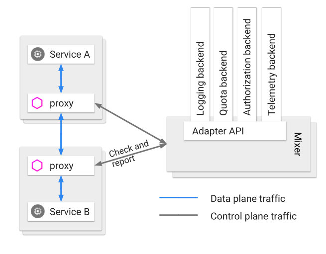

Mixer Topology（图片来自[Isio官网文档](https://istio.io/docs/concepts/policies-and-telemetry/))


Istio 的四大功能点连接, 安全, 控制, 观察, 其中「控制」和「观察」的功能主要都是由Mixer组件来提供, Mixer 在Istio中角色:

- 功能上: 负责策略控制和遥测收集
- 架构上:提供插件模型，可以扩展和定制

------

## 4.5 Mixer Adapter 模型

- Attribute
- Template
- Adapter
- Instance
- Handler
- Rule

#### Attribute

Attribute 是策略和遥测功能中有关请求和环境的基本数据, 是用于描述特定服务请求或请求环境的属性的一小段数据。例如，属性可以指定特定请求的大小、操作的响应代码、请求来自的 IP 地址等.

- Istio 中的主要属性生产者是 Envoy，但专用的 Mixer 适配器也可以生成属性
- 属性词汇表见: [Attribute Vocabulary](https://istio.io/docs/reference/config/policy-and-telemetry/attribute-vocabulary/)
- 数据流向: envoy -> mixer

#### Template

Template 是对 adapter 的数据格式和处理接口的抽象, Template定义了:

- 当处理请求时发送给adapter 的数据格式
- adapter 必须实现的gRPC service 接口

每个Template 通过 `template.proto` 进行定义:

- 名为`Template` 的一个message
- Name: 通过template所在的package name自动生成
- template_variety: 可选Check, Report, Quota or AttributeGenerator, 决定了adapter必须实现的方法. 同时决定了在mixer的什么阶段要生成template对应的instance:
  - Check: 在Mixer’s Check API call时创建并发送instance
  - Report: 在Mixer’s Report API call时创建并发送instance
  - Quota: 在Mixer’s Check API call时创建并发送instance(查询配额时)
  - AttributeGenerator: for both Check, Report Mixer API calls

Istio 内置的Templates: <https://istio.io/docs/reference/config/policy-and-telemetry/templates/>

#### Adapter

封装了 Mixer 和特定外部基础设施后端进行交互的必要接口，例如 Prometheus 或者 Stackdriver

- 定义了需要处理的模板(在yaml中配置template)
- 定义了处理某个Template数据格式的GRPC接口
- 定义 Adapter需要的配置格式(Params)
- 可以同时处理多个数据(instance)

Istio 内置的Adapter: <https://istio.io/docs/reference/config/policy-and-telemetry/adapters/>

#### Instance

代表符合某个Template定义的数据格式的具体实现, 该具体实现由用户配置的 CRD, CRD 定义了将Attributes 转换为具体instance 的规则, 支持属性表达式

- Instance CRD 是Template 中定义的数据格式 + 属性转换器
- 内置的Instance 类型(其实就是内置 Template): [Templates](https://istio.io/docs/reference/config/policy-and-telemetry/templates/)
- 属性表达式见: [Expression Language](https://istio.io/docs/reference/config/policy-and-telemetry/expression-language/)
- 数据流向: mixer -> adapter 实例

#### Handler

用户配置的 CRD, 为具体Adapter提供一个具体配置, 对应Adapter的可运行实例

#### Rule

用户配置的 CRD, 配置一组规则，这些规则描述了何时调用特定(通过Handler对应的)适配器及哪些Instance

------

## 结语

> 计算机科学中的所有问题，都可以用另一个层来解决，除了层数太多的问题

Kubernetes 本身已经很复杂, Istio 为了更高层控制的抽象, 又增加了很多概念. 复杂度堪比kubernetes.

可以看出istio 设计精良, 在处理微服务的复杂场景有很多优秀之处, 不过目前istio目前的短板还是很明显, 高度的抽象带来了很多性能的损耗, 社区现在也有很多优化的方向, 像蚂蚁金服开源的SofaMesh 主要是去精简层, 试图在sidecar里去做很多mixer 的事情, 减少sidecar和mixer的同步请求依赖, 而一些其他的sidecar 网络方案, 更多的是考虑去优化层, 优化sidecar 这一层的性能开销.

在Istio 1.0 之前, 主要还是以功能的实现为主, 不过后面随着社区的积极投入, 相信Istio的性能会有长足的提升.

笔者之前从事过多年的服务治理相关的工作, 过程中切身体会到微服务治理的痛点, 所以也比较关注 service mesh的发展, 个人对istio也非常看好, 刚好今年我们中心容器产品今年也有这方面的计划, 期待我们能在这个方向进行一些产品和技术的深耕.

------


------

参考资料:

- [Service Mesh年度总结：群雄逐鹿烽烟起](https://skyao.io/publication/201801-service-mesh-2017-summary/)
- [Why You Should Care About Istio Gateways](https://thenewstack.io/why-you-should-care-about-istio-gateways/)
- [Pattern: Service Mesh](http://philcalcado.com/2017/08/03/pattern_service_mesh.html)
- [Mixer Out Of Process Adapter Dev Guide](https://github.com/istio/istio/wiki/Mixer-Out-Of-Process-Adapter-Dev-Guide)
- [Mixer Out of Process Adapter Walkthrough](https://github.com/istio/istio/wiki/Mixer-Out-Of-Process-Adapter-Walkthrough)
- [Envoy 中的 xDS REST 和 gRPC 协议详解](http://www.servicemesher.com/blog/envoy-xds-protocol)
- [Delayering Istio with AppSwitch](https://preliminary.istio.io/blog/2018/delayering-istio/delayering-istio/)
- [servicemesher 中文社区](http://www.servicemesher.com)


