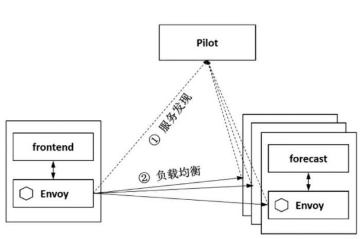
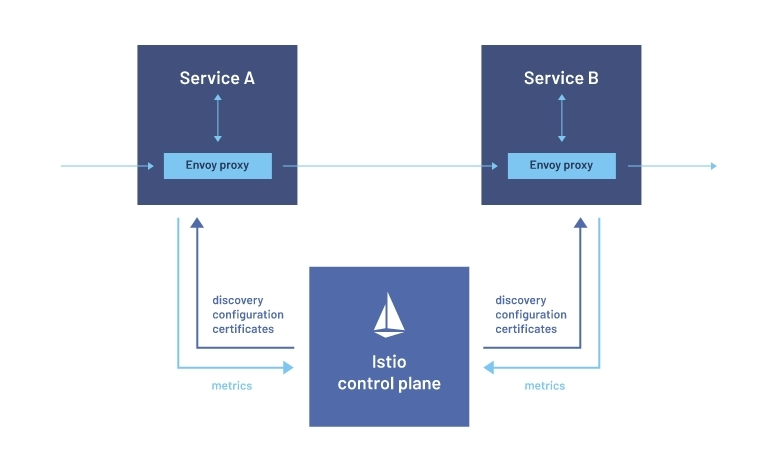
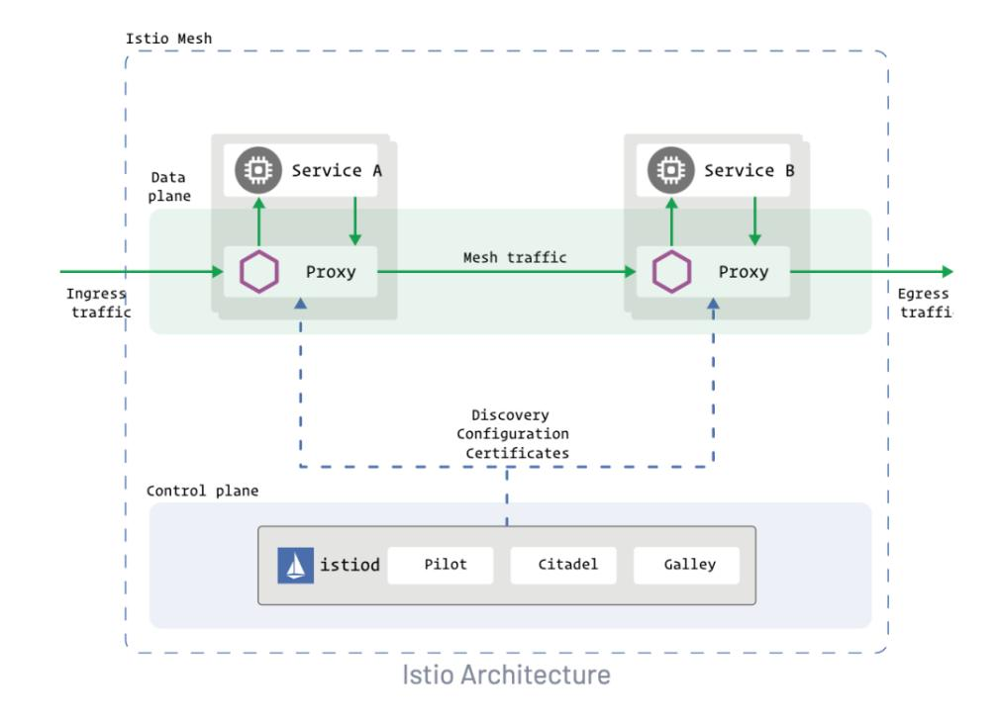
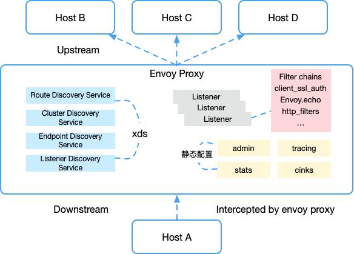
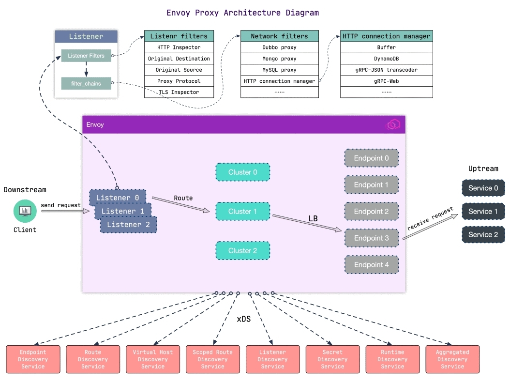

## 前言

在浅析 Istio系列的[上篇文章](https://cloudnative.to/blog/istio-traffic-management-series-route-management/)中，我们介绍了Istio的流量路由管理相关内容，并基于此实践了灰度发布相关技术。本篇文章，我们继续扩展探讨Istio服务治理的相关技术和原理。

## 服务治理概念

应用从单体架构向微服务架构演进的过程中，由于细粒度的微服务应用数量大幅增长，微服务之间的服务发现、负载均衡、熔断限流等服务治理需求显著提高。

在微服务场景下，每个服务有多个服务实例，需要一种机制将请求的服务名解析到服务实例地址上，这就需要服务发现和负载均衡机制。负载均衡一般和服务发现配合使用，服务发现负责从服务名中解析一组服务实例的列表，负载均衡负责从中选择一个实例发起请求。

传统架构下负载均衡一般由服务端提供的，比如访问一个Web网站时，一般在网站入口处有一个负载均衡器来做请求的汇聚和转发（也称作反向代理）。服务的虚拟IP和后端实例映射通过配置文件维护，负载均衡器通过健康检查保证客户端的请求被路由到健康的服务实例。


微服务架构下，服务发现和负载均衡相关功能包含以下工作流程：
**服务注册**：各服务将服务名和服务实例的对应信息注册到服务注册中心。
**服务发现**：发起服务调用时，从服务注册中心获取服务对应的实例列表。
**负载均衡**：根据配置的负载均衡策略，从实例集合中选择一个服务实例来处理业务请求。

Istio中的服务注册和发现由控制面的Pilot和数据面的Envoy协作完成，Pilot通过K8s ApiServer接口获取service和 endpoint等服务资源信息，将其转化为xDS消息下发给数据面的Envoy组件。Envoy在收到请求后根据配置的负载均衡策略选择一个服务实例进行请求的转发。实际上，控制面加数据面架构是Istio为代表的第二代服务网格相对第一代服务网格的独特优势，控制面可以实现集中高效的分发配置和服务信息，数据面依据这些信息可实现服务发现，负载均衡，服务状态监控，限流熔断等多种服务治理能力。



微服务中自动**重试**也是服务间调用的一项常见配置，当上游服务返回特定类型的错误代码时可重新尝试调用。由于错误可能是暂时的环境抖动引起，一般很快恢复，所以重试是一个有用的策略。重试是解决一些异常请求的直接、简单的方法，尤其是网络质量不稳定的场景下，可提高服务质量。但是重试使用不当也会有问题，特定情况下重试可能一直不成功，反而增加延迟和性能开销。因此根据系统运行环境和服务特点，配置适当的重试规则非常必要。Istio中支持配置细粒度的配置服务重试策略，支持设置重试超时和重试次数等参数，能较好的达到重试的目标效果。

在微服务架构下服务之间的调用链路相比单体应用时代更长，微服务化拆分带来系统整体能力提升的同时，也增加了服务间级联故障出现的概率。多个服务之间存在依赖调用，如果某个服务无法及时响应请求，故障向调用源头方向传播，可能引发集群的大规模级联故障，造成整个系统不可用。为应对这种情况，可以引入**熔断**策略。为了防止故障范围的扩大，熔断的基本逻辑就是隔离故障。通过不断探测和周期性统计服务失败调用次数，如果服务的健康状况低于设定阈值则启动熔断，剔除错误服务实例。熔断机制虽然解决不了故障，但却能在故障发生时尽量保全非故障链路上的服务接口能被正常访问，将故障范围控制在局部。被熔断的服务也不会一直处于熔断状态，在熔断机制中还会执行故障恢复，探测到服务正常后关闭熔断。Istio支持较全面的故障检测，熔断开启和熔断恢复机制。

**限流**功能也是保护服务的重要手段，熔断的主要目的是隔离故障，而引起故障的原因除了系统服务内部的问题外，还有可能是请求量超过了系统处理能力的极限，后续新进入的请求会持续加重服务负载，导致资源耗尽发生服务出错。限流的目的就是拒绝过多的请求流量，保证服务整体负载处于合理水平。系统的吞吐量一般是可以被测算的，为了保证系统的稳定运行，一旦达到的需要限制的阈值，就需要采取措施限制流量，比如延迟处理，拒绝处理，或者部分拒绝处理等。Istio支持基于服务连接数，请求排队数等设置限流，还支持经典的令牌限流模式，主动保护上游服务。

微服务中为方便系统进行可靠性测试和调参优化，可以模拟出应用的故障场景。**故障注入**就是通过一定的机制实现服务故障模拟，但不破坏服务本身。比如可以对某种请求返回一个特定的HTTP故障码，对于访问的客户端来说，就跟服务发生异常一样。还可以注入指定的延时，模拟客户端访问服务端响应慢，而无须为了达到这种效果在服务端的代码里添一段延迟响应代码。Istio中的故障注入中还可以对故障的条件进行设置，例如只对某些特定请求注入故障，其他请求保持正常，以支持特定访问场景的故障响应测试。

**流量转移**的概念是配置不同规则给不同的服务版本分配流量，常见的配置规则包括不同服务版本分配不同的访问流量比例，以及基于请求的消息头参数将流量分配到不同服务实例等。流量转移的典型应用是灰度发布，其核心要求是提供一种机制满足多个不同版本同时在线，并能够配置规则给不同的版本分配流量，使新版本流量在可控范围的线上环境中经受充分测试，即使新版本失败也很容易回退。传统的灰度发布方式是在入口的负载均衡器上配置流量策略，这种方式要求负载均衡器必须支持相应的流量策略，并且只能对入口的服务做灰度发布，不支持对后端服务单独做灰度发布。K8s中依靠Kube-proxy 把流量分发到目标后端，限制也比较明显：首先不同服务版本分配的流量必须和Pod数量成比例，其次这种方式不支持根据请求消息头来分配流量，比如让移动端发来的请求和PC端发来的请求分别访问不同的服务版本。Istio通过引入服务版本路由声明，以及流量匹配和路由转发机制，很好的支持了流量转移的场景，可提供全链路灰度发布功能支持。

综上所述，微服务架构带来开发运维模式巨大变革的同时，也引入了服务治理的诸多问题：一个应用由多个服务组成，每个服务有多个实例，每个实例的运行状态不断变化。这对服务间流量管理和服务治理功能提出了巨大需求。以Istio为代表的服务网格，通过接管服务发送和接收的所有流量，可以轻松承载微服务应用间的通信功能。Istio通过控制平面下发服务治理配置，然后根据配置在各个服务之间路由流量，并提供的服务发现和故障处理策略等服务治理功能。同时Istio还记录网格内流量交互信息，提供对服务的可观察性支持，很好的满足了微服务系统服务治理的需求。下一章中我们一起探讨服务网格实现服务流量治理的原理。

## 服务治理原理

### 流量代理转发模式

如何将服务联通起来，是服务治理首先要解决的问题。通常的做法是将通讯层基础功能以 SDK 的形式嵌入业务代码中，但是这种强耦合的方案会增加开发的难度，增加维护成本，增加质量风险。SDK 增加新特性做版本升级，业务侧配合 SDK 进行升级成本很高。SDK一般绑定具体语言， 对多语言服务开发的支持不健全。另外对SDK调用的代码多处冗余出现，从服务治理的角度来看，这样的方式侵入了业务，并且分散于应用，不利于微服务体系的整体管控。

通过将原来在SDK中的逻辑转移到Sidecar 中，提供了另一种可行方案。Sidecar就是在应用节点上部署的代理进程，应用将请求发给代理，由代理完成路由转发。


从整体看代理间流量调用关系形成完整的网络，代表服务间复杂的调用关系，承载着系统内的应用通信。各个具体的微服务之间不再直接发生连接，而是转由各自的Sidecar代理通信实现，在应用形态上形成了一组由代理所组成的网状交互结构，这也是服务网格名称的由来。


服务网格的本质是将通用流量治理的功能沉淀至 Sidecar 中，由 Sidecar 接管服务流量并对其进行治理。可以通过流量劫持的手段，做到无代码侵入实现流量治理，让开发者更聚焦业务功能，降低微服务的代码复杂性，提高开发效率。通过将服务治理功能从应用本身剥离出来，做到了控制与逻辑的分离。Sidecar模式允许我们向应用无侵入添加多种功能，避免了为满足功能扩展需求而向应用添加额外的代码。


如下图右侧所示，当外部请求调用服务实例接口时，其发送的网络请求会经过它们各自的网络代理，那么代理就可以为其提供服务熔断相关的机制，当调用服务实例持续出错时，就不再将外部请求发送到服务实例，而是直接返回配置的错误码。同样，Proxy代理可以为其提供限流功能，当外部请求流量过大时，代理会对其中一部分请求进行限流，拒绝部分请求，只将部分请求转发下游服务。


将微服务治理逻辑从原先具体的微服务进程中抽离出来，实现由统一控制面管理和代理数据面执行的体系结构，是Istio Service Mesh体系与Spring Cloud传统微服务体系在架构上最大的区别。各种服务治理逻辑，也是在这样的架构模式下实现的。Service Mesh架构总体上由控制面(Control Plane)和数据面(Data Plane)两部分组成。其中控制面主要承担整个微服务体系治理信息的集中管控分发，而数据面则负责具体执行由控制面下发的各类服务治理信息及规则。


对于代理程序的部署问题，Istio中通过开启自动注入，在部署应用时可以把代理程序自动部署到用户应用相同的Pod下，用户无需担心代理程序的部署问题。

### 流量策略生效原理



Istio 作为Service Mesh 中的标杆，其流量管理的核心组件是Pilot。Pilot 主要功能就是管理和配置部署在Istio 中的所有 Sidecar 代理实例，它管理 Sidecar 代理之间的路由流量规则，并配置故障恢复功能，如超时、重试和熔断等。

Istio流量治理的概要流程如下：在控制面方面，管理员通过命令或API在控制面创建流量管理规则，然后Pilot将流量规则转为Envoy可理解的标准格式，Pilot将规则下发给Envoy。在数据面方面，Envoy 拦截Pod上本地容器的Inbound流量和Outbound流量，在流量经过Envoy时执行对应的流量规则，对流量进行治理。


为了支持对不同服务注册中心（Kubernetes、consul、nacos等），Istio设计了统一的数据存储模型（Abstract Model）和适配器 Platform Adapter。Pilot 基于Platform adapters可以实现服务注册中心数据到抽象模型之间的数据转换。除了注册中心的服务信息外，Platform Adapter 还将流量治理配置信息转换成 Abstract Model。基于统一数据存储模型 Abstract Model，Pilot-discovery 进程通过xDS api接口为数据面提供了控制信息服务，将控制信息下发到数据面 Envoy。比如Kubernetes 适配器通过 Kubernetes API 服务器获取 Kubernetes 中 service 和 pod 的相关信息，然后翻译为抽象模型提供给Envoy 使用。通过适配器Pilot 还可以从 CloudFoundry等平台中获取服务信息，同样通过开发适配器可以将其他提供服务发现的组件集成到 Pilot 中。

K8s平台上定义了Istio使用的流量管理相关CRD资源类型，作为承载用户进行流量管理的抽象实体。运维人员通过操作CRD来配置流量规则并下发到 Pilot ，这些规则被 Pilot 翻译成数据面的配置，再通过标准数据面 API 分发到 Sidecar 实例，可以在运行期对微服务的流量进行控制和调整。通过运用不同的流量规则，可以对网格中微服务进行精细化的流量控制，如按版本分流、断路器、故障注入、灰度发布等。

CDR中典型的几个配置介绍如下：VirtualService 可以理解为对 service 的一层抽象，用于定义路由规则，控制流量路由到匹配的 service 子集(VirtualService)。同时可以为每个 VirtualService 设置一些独立的网络弹性属性，例如超时、重试等。DestinationRule定义目的服务的策略，包括断路器、负载均衡等。同时定义可路由子集，即 VirtualService 中的路由规则可以完全委托给 DestinationRule。ServiceEntry用于将 Istio 服务网格外部的服务添加到内部服务注册的，可通过其定义和访问外部服务。Gateway是用于控制流量的网关，将Gateway绑定到VirtualService 上，可以控制进出集群的流量。EnvoyFilter 主要为 Envoy 配置过滤器，用于动态扩展 Envoy 的能力。以上CRD配置详细用法可参考Istio官方文档，这里只简单介绍直观概念。

Pilot 主要包含 2 个组件，即Pilot Agent和Discovery services，分别对应服务网格的数据面和控制面。

Pilot Agent的进程名称为Pilot-agent，负责生成Envoy配置文件和管理 Envoy 生命周期。它和 Envoy以及具体应用在同一Pod 中，以Sidecar模式部署。Pilot Agent主要生成少部分初始化配置，其他动态配置通过标准 xDS 接口从 Pilot 获取。同时还负责 Envoy 进程的监控与管理工作， Envoy故障退出后负责重启Envoy，配置变更后负责 reload Envoy。Envoy是基于C++语言开发的高性能代理工具，内置服务发现、负载均衡、TLS终止、HTTP/2、GRPC代理、熔断器、健康检查、灰度发布、故障注入等功能，可用于协调服务网格中所有服务的入站和出站流量。

Discovery services进程对应的是 Pilot-discovery，扮演服务注册中心和Istio 控制平面到 Sidecar 之间的桥梁，负责 Pilot 中关键的管理逻辑，包括服务发现与流量管理等。Discovery services 使用单独的服务部署的。它会访问两种类型的数据。一是k8s API Server 中的服务信息，即 service、endpoint、pod、node 等资源；二是配置信息，比如K8s API Server 中CRD 资源，包括上述的 VritualService等 Istio 控制面的流量规则配置信息。然后将这两部分数据转换为数据面可以理解的格式（遵循Envoy xDS Api），并通过标准的 API将这些信息以 gRPC 接口下发到各个数据面下Envoy组件中。

xDS 概念如下：Pilot 使用了一套起源于 Envoy 项目的标准数据面API 来将服务信息和流量规则下发到数据面的 Sidecar 中，这套标准数据面 API叫 xDS。Envoy通过 xDS API 可以动态获取 Listener （监听器）、Route （路由）、Cluster （集群）及 Endpoint （集群成员）配置。LDS指Listener 发现服务：Listener 监听器控制 Sidecar 启动端口监听，并配置 L3/L4 层过滤器，当网络连接达到后，配置好的网络过滤器堆栈开始处理后续事件。RDS指Router 发现服务：用于 HTTP 连接管理过滤器动态获取路由配置，其路由配置包含 HTTP 头部修改，虚拟主机以及虚拟主机的各个路由条目。CDS指Cluster 发现服务：用于动态获取 Cluster 信息。EDS指Endpoint 发现服务：用与动态维护服务节点信息，还包括负载均衡权重、金丝雀状态等，基于这些信息，Sidecar 可以做出智能的负载均衡决策。xDS中的每种类型都对应一个发现资源，服务治理中的熔断限流逻辑则是由RDS配置实现。

下图中，当下游主机A发送请求至上游主机（B，C，D），Envoy 拦截请求，Listener监听到下游主机请求后从请求内容抽象出Filter Chains，然后根据流量策略相关的配置路由请求至对应的上游主机集群(Cluster)，从而完成路由转发、负载均衡、流量策略等能力。流量策略相关的配置信息以动态配置的方式由 xDS Api 获取。Pilot-discovery 与每一个 Envoy 建立双向 gRPC 连接，Envoy会通过 xDS 接口按照调用逻辑发起请求，并将 Pilot 的流量管理配置VirtualService、DestinationRule 等组装成 cluster、endpoint、router、listener 等 Envoy 配置。最终这些动态配置会作用在 Envoy 上，当 Envoy Listener 监听到下游主机请求时，就可以根据这些配置完成实际的动态服务发现、流量管理等功能。



基于以上流程，我们就可以通过编写VirtualService、DestinationRule和EnvoyFilter等CRD资源来实现对运行于网格上的微服务提供无侵入的流量治理能力。         

另外，对于进出服务的流量如何被Envoy接管，需要了解Envoy流量劫持原理。简单讲主要通过使用iptable工具，通过Linux Netfilter模块操纵流量。限于篇幅这里不展开叙述，具体原理可参考Istio相关资料。

### Envoy过滤器

Envoy的核心工作是对业务进行透明的请求拦截，依据配置对所有进出流量进行管理，包括监听，过滤，消息修改，转发等。对拦截的请求进行一定的控制，比如进行安全访问控制、流量控制等多方面处理后，发送给应用程序。通过使用Envoy，开发者可以专注于应用功能的开发，不用考虑复杂的网络通讯实现。



Envoy流量管理是通过EnvoyFilter提供的机制来定制 Istio Pilot 生成的 Envoy 配置。使用 EnvoyFilter 来修改某些字段的值，添加特定的过滤器，甚至添加全新的 listener、cluster 等。这个功能必须谨慎使用，因为不正确的配置可能破坏整个网格的稳定性。与其他 Istio  CRD配置对象不同，EnvoyFilter 是累加应用。对于特定命名空间中的特定工作负载，可以存在任意数量的 EnvoyFilter，EnvoyFilter 的应用顺序为首先配置根命名空间中的所有 EnvoyFilter，其次是工作负载命名空间中的所有匹配的EnvoyFilter。

EnvoyFilter 对象定义了Envoy代理的过滤器，这些过滤器可以定制由 Istio Pilot 生成的代理配置。主要包括workloadLabels配置（工作负载实例筛选）和filters配置（包括要加入指定监听器之中的 Envoy网络过滤器和HTTP 过滤器配置信息）。Envoy 内部对请求的处理流程大致相同，即对请求的处理流程基本是不变的，而对于变化的部分全部抽象为 Filter。例如对请求的读写是 ReadFilter和WriteFilter，对 HTTP 请求数据的编解码是 StreamEncoderFilter和StreamDecoderFilter，对TCP 的处理是 TcpProxyFilter，对HTTP 的逻辑处理是 HTTP ConnectionManager，各个 Filter 最终会组织成一个 FilterChain，在收到请求后首先走 FilterChain，然后路由到指定集群并做负载均衡获取一个目标地址，最后转发出去完成一次服务调用过程。


Envoy配置信息，主要包括如下关键字段：

listener : Envoy的监听地址，负责接入工作负载。Envoy 会暴露一个或多个 Listener 来监听客户端的请求。

filter : 过滤器（如上图）。在 Envoy 中指的是一些“可插拔”和可组合的逻辑处理层，是 Envoy 核心逻辑处理单元。利用Filter机制，Envoy理论上可以实现任意协议的支持以及协议之间的转换，可以对请求流量进行全方位的修改和定制。强大的Filter机制带来的不仅仅是强大的可扩展性，Filter机制让Envoy的使用者可以在不侵入社区源码的基础上对Envoy做各个方面的增强。

route : 路由规则配置，即将请求路由到后端的哪个集群。Listener可以接收来自下游的连接，Cluster可以将流量发送给具体的上游服务，而Router则决定Listener在接收到下游连接和数据之后，应该将数据交给哪一个Cluster处理。它定义了数据分发的规则，说到Router大部分时候可以理解为HTTP路由，此外Envoy还支持多种协议，如Dubbo、Redis等，所以此处Router可泛指所有用于桥接Listener和后端服务的规则与资源集合。Router中最核心配置包含匹配规则和目标Cluster，此外，也可能包含重试、分流、限流等。

cluster : 服务提供方集群。Envoy 通过服务发现定位集群成员并获取服务，具体路由到哪个集群成员由负载均衡策略决定。

```yaml
static_resources:
  # 1. 监听器
  listeners:
  - name: listener_0
    address:
      socket_address: { address: 0.0.0.0, port_value: 10000 }

	# 2. 过滤器
    filter_chains:
    - filters:
      - name: envoy.http_connection_manager
        config:
          stat_prefix: ingress_http
          route_config:
            name: local_route
            virtual_hosts:
            - name: local_service
              domains: ["*"]
              routes:
              - match: { prefix: "/" }
                route: { host_rewrite: www.baidu.com, cluster: service_baidu }
          http_filters:
          - name: envoy.router       
  # 3. 集群
  clusters:
  - name: service_baidu
    connect_timeout: 1s
    type: LOGICAL_DNS
    dns_lookup_family: V4_ONLY
    lb_policy: ROUND_ROBIN
    hosts: [{ socket_address: { address: www.baidu.com, port_value: 443 }}]
    tls_context: { sni: baidu.com }

# 4. 管理    
admin:
  access_log_path: /tmp/admin_access.log
  address:
    socket_address: { address: 0.0.0.0, port_value: 9901 }

```

以上示例是一个典型的示例配置文件，实现将所有流量代理到www.baidu.com，配置完成后通过请求 Envoy 的端点就可以直接看到百度的主页，而无需使用真实URL 地址。

关于EnvoyFilter和Envoy的更多技术请参考Envoy官方文档。

### 流量匹配和转移

```yaml
apiVersion: networking.istio.io/v1alpha3
kind: VirtualService
metadata: 
  name: forecast
spec:
  hosts:
  - forecast
  http:
  - match:
    - headers:
      location:
        exact: north
    route:
    - destination:
        host: forecast
        subset: v2
  - route:
    - destination:
        host: forecast
        subset: v1
```

Istio 的服务治理功能都是通过编写和应用Kubernetes 的CRD实现，CRD语法描述性较强。可以很直观理解以上配置的意思：对于forecast 服务访问，如果在请求的Header中location取值是north，则将请求转发到服务的v2版本上，其余请求都转发到服务的v1版本上。

VirtualService 定义了对特定目标服务的一组流量规则，在形式上表示一个虚拟服务，将满足条件的流量都转发到对应的服务后端。服务后端可以是一个独立服务，也可以是在DestinationRule中定义的服务的子集。

hosts字段列举虚拟服务的主机，表示流量发送的目标。定义路由规则的的标识，用于匹配访问地址。http字段定义了HTTPRoute类型的路由集合，用于处理HTTP的流量，对应服务的端口协议是HTTP、HTTP2、GRPC。Istio同时还支持Tls和Tcp服务的路由定义。

HTTPRoute规则的功能是满足HTTPMatchRequest条件的流量都被路由到HTTPRouteDestination。HTTPRoute中最重要的字段是条件字段Match，为一个HTTPMatchRequest类型的数组，表示HTTP请求满足条件，支持将HTTP属性如headers、uri、scheme、method、authority、port等作为条件来匹配请求。headers匹配请求中的Header，是一个map类型。map的key是字符串类型，value是StringMatch类型。即对于每一个Header的值，都可以使用精确、前缀和正则三种方式进行匹配。示例为自定义Header中location的取值为“north”的请求。port表示请求服务的端口，大部分服务只开放一个端口，这也是在微服务中推荐的做法，在这种场景下可以不指定port。

sourceLabels是一个map类型的键值对，表示请求来源负载匹配标签。这在很多情况有用，可以对一组服务都打一个相同的标签，然后使用sourceLabels字段对这些服务实施相同的流量规则。在Kubernetes平台上，这里的Label就是Pod上的标签。如下所示表示请求来源是testA服务的v2版本的负载。

```yaml
http:
- match:    
  - sourceLabels:
      app: testA
      version: v2
```

在HTTPRoute的匹配条件中，每个HTTPMatchRequest中的诸多属性是“与”逻辑，几个元素之间的关系是“或”逻辑。在VirtualService中match字段都是数组类型。HTTPMatchRequest中的诸多属性如uri、header、method等都是“与”逻辑，而数组中几个元素间关系是“或”逻辑。在下面的例子中，match包含两个HTTPMatchRequest元素，其条件的语义是：headers中的source取值为“north”，且uri以“/advertisment”开头的请求，或者uri以“/forecast”开头的请求。

```yaml
- match:
  - heraders:
      source:
        exact: north
    uri:
      prefix: "/advertisment"
  - uri:
      prefix: "/forecast"
```

HTTPRoute上的route字段是一个HTTPRouteDestination类型的数组，表示满足条件的流量目标。在HTTPRouteDestination中主要由三个字段：destination（请求目标）、weight（权重）、和headers（HTTP头操作），destination、weight是必选字段。

destination字段指定了符合此条件的流量的实际目标地址。在Virtualservice 上执行一组规则，最终的流量要被送到这个目标上。destination类型结构，通过host、subset和port三个属性来描述。host是Destination必选字段，表示在Istio中注册的服务名，不但包括网格内的服务，也包括通过ServiceEntry方式注册的外部服务。与host配合来表示流量路由后端的是另一个重要字段subset，它表示在host上定义的一个子集。例如，在灰度发布中将版本定义为subset，配置路由策略会将流量转发到不同版本的subset上。HTTPRouteDestination上的另一个必选字段是weight，表示流量分配的比例，在一个route下多个destination的weight总和要求是100。如果一个route只有一个destination，那么可以省略weight，默认就是100。

下面示例，配置20%的流量到v2版本，其余流量到v1版本，这也是灰度发布常用的一个流量策略，即不区分请求内容，从总流量中切出一部分流量给新版本做灰度测试。

```yaml
spec:
  hosts:
  - forecast
  http:
  - route:
    - destination:
        host: forecast
        subset: v2
      weight: 20
    - destination:
        host: forecast
        subset: v1
      weight: 80
```

## 总结

本文我们介绍了Istio服务治理的基本概念，以及实现流量治理功能的相关技术。通过阅读本文读者可以初步理解Istio流量治理的概念和相关知识框架。限于篇幅，Istio服务治理相关实践介绍请关注后续文章。