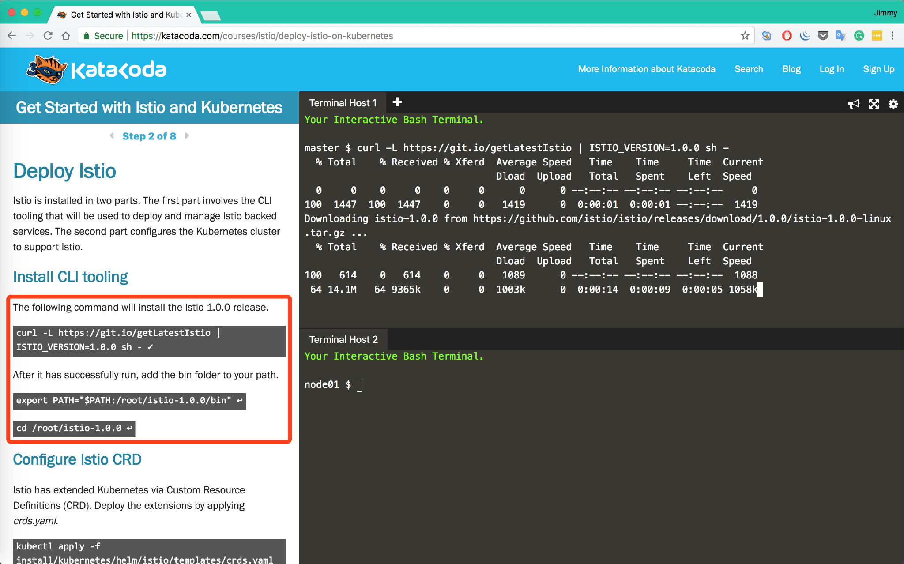
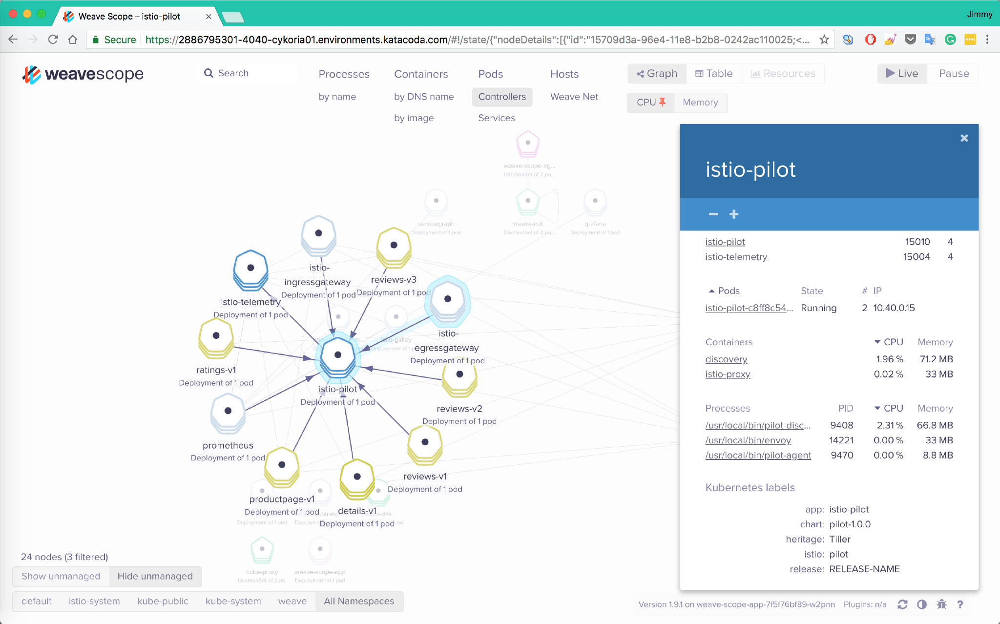
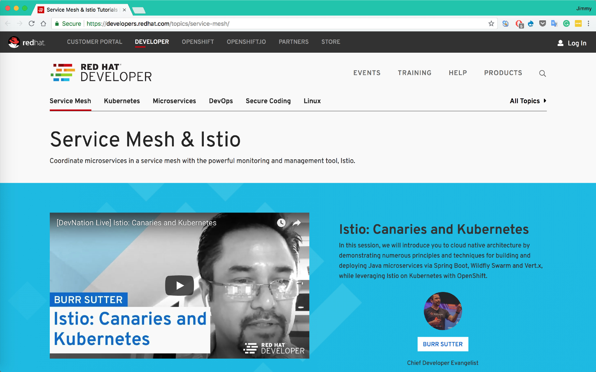
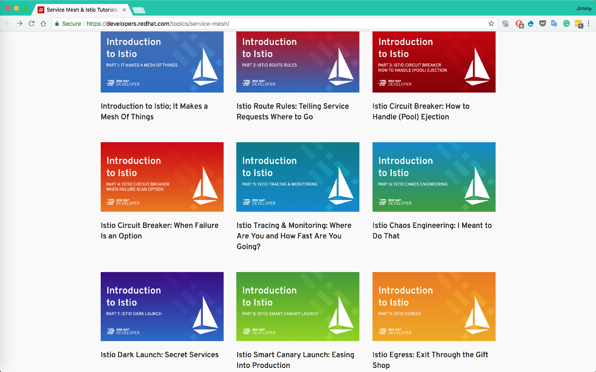
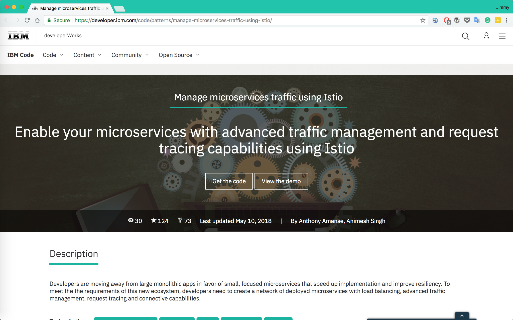
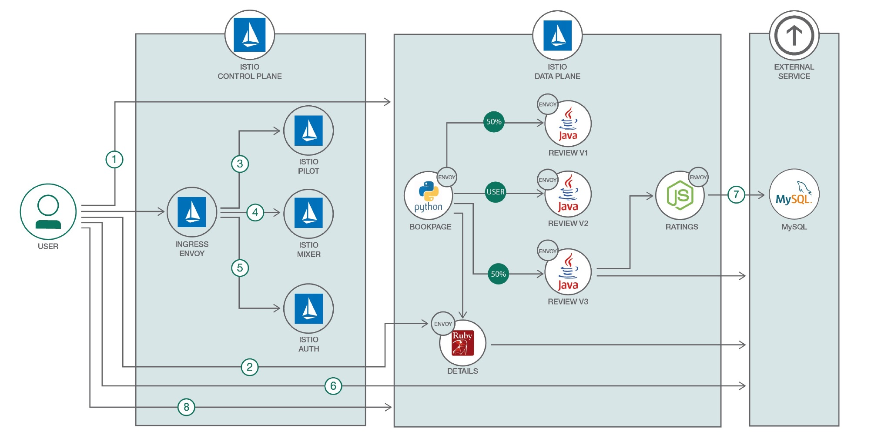
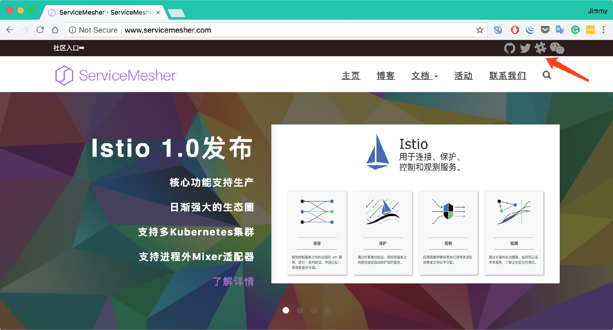

8 月 1 日 0 点，[Istio 1.0 发布，已生产就绪！](/blog/announcing-istio-1.0/)大家都已经跃跃欲试了，几天前我发布了[一键在本地搭建运行 Istio 1.0 的分布式 Kubernetes 集群](https://github.com/rootsongjc/kubernetes-vagrant-centos-cluster)教程，在本地搭建起来还是有些门槛，稍显复杂，现在我推荐几个可以在线上学习的地方。这是目前搜集的比较完整的 Istio 学习环境和包含代码的示例教程有如下几个：

目前搜集的比较完整的 Istio 学习环境和包含代码的示例教程有如下几个：

- Katacoda 的学习环境
- Istio 官方的 bookinfo 教程
- IBM 的 Istio 示例教程
- 我 Fork 的 RedHat 的 Demo，Christian Posta 在 OSCON 上的 Istio workshop

## Katacode 上的 Istio 学习环境

推荐指数：⭑⭑⭑⭑⭑

推荐原因：使用简单，使用官方示例，免费，快速，无需注册，可直接通过互联网访问示例应用页面，支持最新版的 Istio。

Katacoda 已支持 Istio 1.0 的学习环境。

地址：https://www.katacoda.com/courses/istio/deploy-istio-on-kubernetes

只要傻瓜式操作就可以部署一个 Istio 出来，同时还提供了 Weave scope 可以对 service mesh 的中的服务关系做可视化呈现。

同时还能提供部分监控功能，比如服务状态，CPU 和内存使用情况。

## Red Hat 提供的 Istio 教程

推荐指数：⭑⭑⭑⭑

推荐原因：教程 topic 划分简洁得当，RedHat 大力加持，未来的频繁更新可以预期。

## IBM 的 Istio 示例教程

推荐指数：⭑⭑⭑

推荐原因：IBM 作为 Istio 项目的联合创始公司，在 Istio 中也有大量的投入，未来可能会有更多的示例放出。

https://developer.ibm.com/code/patterns/manage-microservices-traffic-using-istio

最后更新于 2018 年 5 月 10 号，是基于 Istio 0.8 的。

GitHub 地址：https://github.com/IBM/microservices-traffic-management-using-istio/

## 其他

推荐指数：⭑⭑⭑

推荐原因：个人演示项目，方便定制和修改代码。

- 我个人 Fork 的 RedHat 的 Java 微服务中使用 Istio 的教程的 demo（中文），目前基于 Istio 0.8，未来将支持 1.0：https://github.com/rootsongjc/istio-tutorial
- Christian Posta 在 OSCON 上的使用的 Istio workshop：https://github.com/christian-posta/istio-workshop

------

📣ServiceMesher 社区新增 Slack 和 Twitter 关注方式，欢迎 follow。

网址：<http://www.servicemesher.com/>

Slack：https://servicemesher.slack.com 需要邀请才能加入，有志于加入 ServiceMesher 社区为 Service Mesh 作出贡献的同学可以联系我。

Twitter: https://twitter.com/servicemesher
