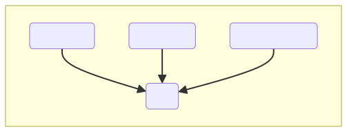
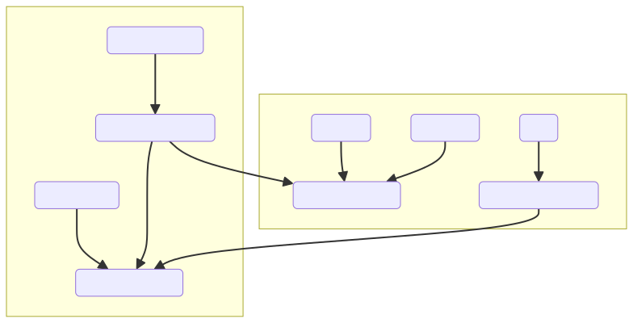
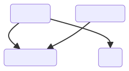
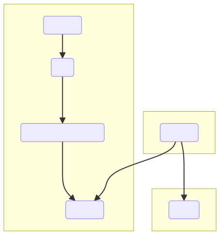
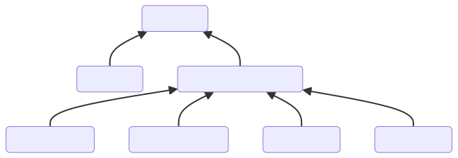

本文档描述了 Istio 控制平面——Istiod 的高层架构。Istiod 是一个模块化的单体应用，涵盖了从证书签名、代理配置（XDS）、传统的 Kubernetes 控制器等多种功能。

## 代理配置 {#proxy-configuration}

Istiod 的主要角色——以及大部分代码——是动态配置代理（Envoy sidecar、入口、gRPC、ztunnel 等）。这大致包括 3 个部分：
1. 配置摄取（系统的输入）
1. 配置翻译
1. 配置服务（XDS）

### 配置摄取

Istio 从超过 20 种不同的资源类型读取，并将它们聚合在一起构建代理配置。这些资源可以来自 Kubernetes（通过观察）、文件或通过 xDS；尽管如此，Kubernetes 是最常用的。

主要出于历史原因，摄取分为几个组件。

#### ConfigStore

`ConfigStore` 读取多种资源，并通过标准接口（Get、List 等）暴露它们。这些类型被包装在通用的 `config.Config` 结构中，与通常使用每种资源类型的 Kubernetes 客户端形成对比。最常见的是通过 `crdclient` 包从 Kubernetes 读取。

#### 服务发现 {#ServiceDiscovery}

另一个主要接口是 ServiceDiscovery。类似于 ConfigStore，它也是对多种资源进行聚合。然而，它不提供通用资源访问，而是预计算了多种服务导向的内部资源，如 `model.Service` 和 `model.ServiceInstance`。

这由两个控制器组成——一个由核心 Kubernetes 类型驱动（“Kube Controller”），一个由 Istio 类型驱动（“ServiceEntry 控制器”）。

大部分情况下这是相当直接的。然而，我们支持 `ServiceEntry` 选择 `Pod`，以及 `Service` 选择 `WorkloadEntry`，这导致跨控制器通信。

注意：`Pods` 不贡献给 Kube 控制器的 `ServiceInstances` 是因为使用了 `Endpoints`，它本身是从 Kubernetes 核心的 `Pod` 派生的。

#### PushContext

`PushContext` 是当前全局状态（SotW）的一个不可变快照。它在每次配置推送时（下面会详细讨论）通常是部分地重新生成的。由于是快照，大多数查找都是无锁的。

`PushContext` 是通过查询上述层构建的。对于一些简单的用例，这和存储类似于 `configstore.List(SomeType)` 的东西一样简单；在这种情况下，与直接暴露 configstore 的唯一区别是要快照当前状态。在其他情况下，一些预计算和索引被计算出来，以便后续访问效率。

#### 端点

端点有一个优化的代码路径，因为它们是迄今为止更新最频繁的资源——在一个稳定的集群中，这通常是*唯一*的变化，由扩缩容引起。

因此，它们不经过 `PushContext`，变化也不会触发 `PushContext` 的重新计算。相反，当前状态是基于来自 `ServiceDiscovery` 的事件增量计算的。

#### 结论

总体而言，配置摄取流程如下：

### 配置翻译

配置翻译将上述输入转换为连接的 XDS 客户端（通常是 Envoy）消费的实际类型。这通过 `Generators` 完成，这些生成器注册一个函数来构建给定类型。例如，有一个 `RouteGenerator` 负责构建 `Routes`。除了核心 Envoy XDS 类型外，还有一些自定义的 Istio 类型，例如我们用于 DNS 的 `NameTable` 类型，以及调试接口。

`Generators` 的输入是 `Proxy`（当前客户端的表示）、当前的 `PushContext` 快照以及导致更改的配置更新列表。

将 `Proxy` 作为输入参数是重要的，并且与其他一些 XDS 实现的主要区别。我们无法在没有每个客户端信息的情况下静态翻译输入到 XDS。例如，我们依赖于客户端的标签来确定应用的政策集。虽然这是实现 Istio API 的必要条件，但它确实大大限制了性能。

#### 缓存

配置翻译通常占用了 Istiod 的绝大部分资源使用，尤其是 protobuf 编码。因此，引入了缓存，存储给定资源的已编码 `protobuf.Any`。

这种缓存依赖于声明所有输入到给定生成器作为缓存键的一部分。这极其容易出错，因为没有任何东西阻止生成器使用*不*是键部分的输入。当这种情况发生时，不同的客户端将不确定地获得错误的配置。这种类型的错误在历史上导致了 CVE。

有几种方法可以防止这些问题：
* 只将缓存键本身传入到生成逻辑中，这样就不能使用其他未计入的输入。不幸的是，今天还没有任何生成器这样做。
* 非常非常小心。
* 缓存有一个内置测试，通过设置 `UNSAFE_PILOT_ENABLE_RUNTIME_ASSERTIONS=true` 启用，该测试在 CI 中运行。如果任何键以不同的值写入，这将引发 panic。

#### 部分计算

与缓存一样，部分计算是确保我们不需要在每次更改时为每个代理构建（或发送）每个资源的关键性能优化。这将在配置服务部分中更详细讨论。

### 配置服务

配置服务是实际接受代理客户端的层，这些客户端通过双向 gRPC 流连接，并为它们提供所需的配置。

我们将有两种触发发送配置的方式——请求和推送。

#### 请求

来自客户端的请求特别要求一组资源。这可能是在新连接上请求初始资源集，或者来自新的依赖。例如，`Cluster X` 的推送引用 `Endpoint Y` 可能导致请求 `Endpoint Y`（如果客户端尚未知道的话）。

注意客户端实际上可以发送三种类型的消息——请求、对先前推送的 ACKs 和对先前推送的 NACKs。不幸的是，这些在 API 中没有清晰地区分，因此有一些逻辑来分解这些（`shouldRespond`）。

#### 推送

当 Istiod 检测到需要某些配置更新时，会发生推送。这大致与请求的结果相同（新配置推送到客户端），只是由不同的来源触发。

在配置摄取中描述的各种组件可以触发配置更新。这些被批量处理（"debounced"），以避免在连续多次更改时活动过度，并最终排队在推送队列中。

推送队列大部分是一个正常的队列，但它有一些特殊逻辑来合并每个给定代理的推送请求。这导致每个代理有 0 或 1 个未完成的推送请求；如果有更多更新进来，现有的推送请求就会扩展。

另一个任务轮询这个队列并触发每个客户端开始推送。

在高层次上，每个客户端任务将找到正确的生成器来处理请求，生成所需的配置，并发送。

#### 优化

一个简单的实现将简单地重新生成每个客户端的所有订阅类型的所有资源，无论配置是否更改。然而，这种方式扩展性很差。因此，我们有许多级别的优化以避免做这些工作。

首先，我们有一个 `Full` 推送的概念。只有在更改时 `Full` 推送会重新计算 `PushContext`；否则，这将被跳过，重用最后一个 `PushContext`。注意：即使是 `Full`，我们也尽可能从上一个 `PushContext` 复制。例如，如果只有一个 `WasmPlugin` 发生了变化，我们不会重新计算服务索引。

注意：`Full` 只是指是否需要重新计算 `PushContext`。即使在 `Full` 推送中，我们也会跟踪触发此的配置更新，因此我们可以有 "Config X 的完整更新" 或 "所有配置的完整更新"。

接下来，对于单个代理，我们将检查它是否可能受到更改的影响。例如，我们知道一个 sidecar 从不受 `Gateway` 更新的影响，我们还可以查看限制更新范围的分流（来自 `Sidecar.egress.hosts`）。

一旦我们确定代理可能受到影响，我们将确定哪些*类型*可能受到影响。例如，我们知道 `WasmPlugin` 不影响 `Cluster` 类型，所以在这种情况下我们可以跳过生成 `Cluster`。警告：Envoy 当前有一个错误，*要求* 每当推送对应的 `Cluster` 时必须推送 `Endpoints`，因此这个优化在这个特定情况下故意关闭了。

最后，我们确定我们需要生成类型的哪个子集。XDS 有两种模式 - "State of the World (SotW)" 和 "Delta"。在 SotW 中，我们通常需要生成类型的所有资源，即使只有一个发生了变化。注意我们实际上需要*生成*所有这些，通常是因为我们不存储先前生成的资源（主要因为它们是每个客户端生成的）。这也意味着每当我们确定是否需要更改时，我们都是基于仔细的代码分析，而不是在运行时。

尽管在 SotW 中有这样的期望，由于协议的一个特点，我们实际上可以启用我们最重要的优化之一。XDS 类型形成一棵树，CDS 和 LDS 是 Envoy 的树根。对于根类型，我们*必须*总是生成完整的资源集——缺失的资源被视为删除。
然而，所有其他类型*不能*显式删除，而是在所有引用被移除时清理。这意味着我们可以为非根类型发送部分更新，而不删除未发送的资源。这有效地允许在 SotW 上进行 delta 更新。这个优化对我们的端点生成器至关重要，确保当一个 pod 扩展时，我们只需要更新该 pod 内的端点。

## 控制器

Istiod 由一系列控制器组成。按 Kubernetes 的说法，"控制器是观察你的集群状态的控制循环，然后在需要时进行或请求更改。"

在 Istio 中，我们更自由地使用这个术语。Istio 的控制器不仅仅观察一个集群的状态——许多控制器从多个集群读取，甚至从外部来源（文件和 XDS）读取。通常，Kubernetes 控制器然后将状态写回到集群；Istio 确实有几个这样的控制器，但大多数控制器都集中在推动[代理配置](#proxy-configuration)。

### 编写控制器

Istio 提供了一些帮助库来开始编写控制器。虽然这些库有帮助，但正确编写（和测试！）一个控制器仍然有很多细微之处。

要开始编写控制器，请查看[示例控制器](https://github.com/istio/istio/blob/master/pkg/kube/controllers/example_test.go)。

### 控制器概览

下面提供了 Istiod 中控制器的高级概览。有关每个控制器的更多信息，建议咨询控制器的 Go 文档。

正如您所看到的，目前控制器的景观相当广泛。

[服务发现](#ServiceDiscovery) 和 [Config Store](#ConfigStore) 已在上文讨论，因此这里不再赘述。

#### 网格配置

网格配置控制器是一个相当简单的控制器，从 `ConfigMap`（如果使用 `SHARED_MESH_CONFIG` 则为多个）读取，处理并合并这些到类型化的 `MeshConfig` 中。然后它通过一个简单的 `mesh.Watcher` 暴露这个，这只是暴露一种访问当前 `MeshConfig` 的方式并在它改变时获得通知。

#### Ingress

除了 `VirtualService` 和 `Gateway`，Istio 也支持 `Ingress` 核心资源类型。像 CRD 一样，`Ingress` 控制器实现 `ConfigStore`，但有些不同。`Ingress` 资源在即时转换为 `VirtualService` 和 `Gateway`，所以虽然控制器读取 `Ingress` 资源（和一些相关类型如 `IngressClass`），它发出其他类型。这允许其他代码不用关心 Ingress，只关注核心类型。

除了这种转换外，`Ingress` 还需要在状态中写入它可以访问的地址。这由 Ingress 状态控制器完成。

#### Gateway

Gateway（指的是 [Kubernetes API](http://gateway-api.org/)，不是同名的 Istio 类型）的工作方式与 [Ingress](#ingress) 非常相似。网关控制器也将网关 API 类型转换为 `VirtualService` 和 `Gateway`，实现 `ConfigStore` 接口。

然而，还有一些额外的逻辑。网关类型有广泛的状态报告。与 Ingress 不同，这是状态报告是在主控制器中直接完成的，允许在处理资源的逻辑中直接生成状态。

此外，Gateway 涉及两个组件写入到集群：
* 网关类控制器是一个简单的控制器，只是写一个描述我们实现的默认 `GatewayClass` 对象。
* 网关部署控制器使用户能够创建一个实际配置底层资源（部署和服务）的网关。这更像是一个传统的“Operator”。这部分逻辑是确定基于 `istio.io/rev` 标签哪个 Istiod 修订应该处理资源（反映 sidecar 注入）；因此，这需要依赖“标签观察者”控制器。

#### CRD 观察者

对于针对自定义类型（CRD）的观察，我们希望优雅地处理缺失的 CRD。如果对缺失类型启动 informers，则会导致错误并阻塞启动。相反，我们引入了一个“CRD 观察者”组件，观察集群中的 CRD 以确定它们是否可用。

有两种使用方式：
* 一些组件只是在做需要的工作之前阻塞 `watcher.WaitForCRD(...)`。
* `kclient.NewDelayedInformer` 也可以完全抽象这一点，通过提供一个在幕后处理这一点的客户端。

#### Credentials Controller

凭证控制器暴露访问 TLS 证书信息的途径，这些信息存储在集群的 `Secrets` 中。除了简单地访问证书外，它还有一个授权组件，可以验证请求者是否有权读取其命名空间中的 `Secrets`。

#### Discovery Filter

发现过滤器控制器用于实现 `MeshConfig` 的 `discoverySelectors` 字段。这个控制器读取集群中的 `Namespace` 以确定它们是否应该被“选中”。许多控制器使用这个过滤器来只处理配置的一个子集。

#### 多集群

各种控制器从多个集群读取。

这始于多集群密钥控制器，该控制器读取 `kubeconfig` 文件（存储为 `Secrets`），并为每个创建 Kubernetes 客户端。控制器允许注册处理程序，这些处理程序可以处理集群的添加/更新/删除。

这有两个实现：
* 凭证控制器负责读取存储为 Secrets 的 TLS 证书。
* Kubernetes 服务发现控制器有点像一个大块头，除了核心服务发现控制器之外，还启动了一堆其他子控制器。

由于整体复杂性，看看这个放大一点会有帮助：

#### 虚拟机

虚拟机支持由两个控制器组成。

自动注册控制器是一个相当独特的控制器——控制器的输入是 XDS 连接。对每个 XDS 连接，创建一个 `WorkloadEntry` 来注册 XDS 客户端（通常是在 VM 上运行的 `istio-proxy`）到网格中。这个 `WorkloadEntry` 与连接的生命周期绑定，有一些逻辑确保临时的停机（重新连接等）不会移除 `WorkloadEntry`。

健康检查控制器还控制 `WorkloadEntry` 的健康状态。健康状态通过 XDS 客户端报告并与 `WorkloadEntry` 同步。

#### Webhook

Istio 包含验证和变更 webhook 配置。这些需要在 `caBundle` 中指定以配置 TLS 信任。因为 Istiod 的 CA 证书有些动态性，这在运行时进行修补（而不是作为安装的一部分）。webhook 控制器处理这种修补。

这些控制器非常相似，但由于各种原因是不同的组件。