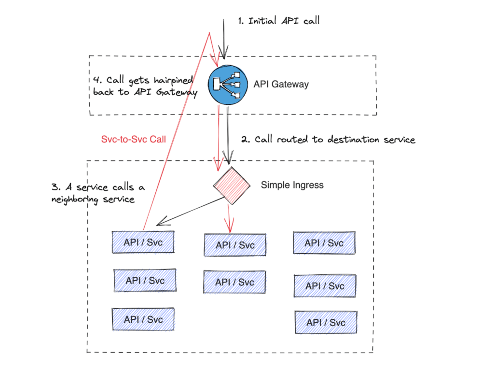
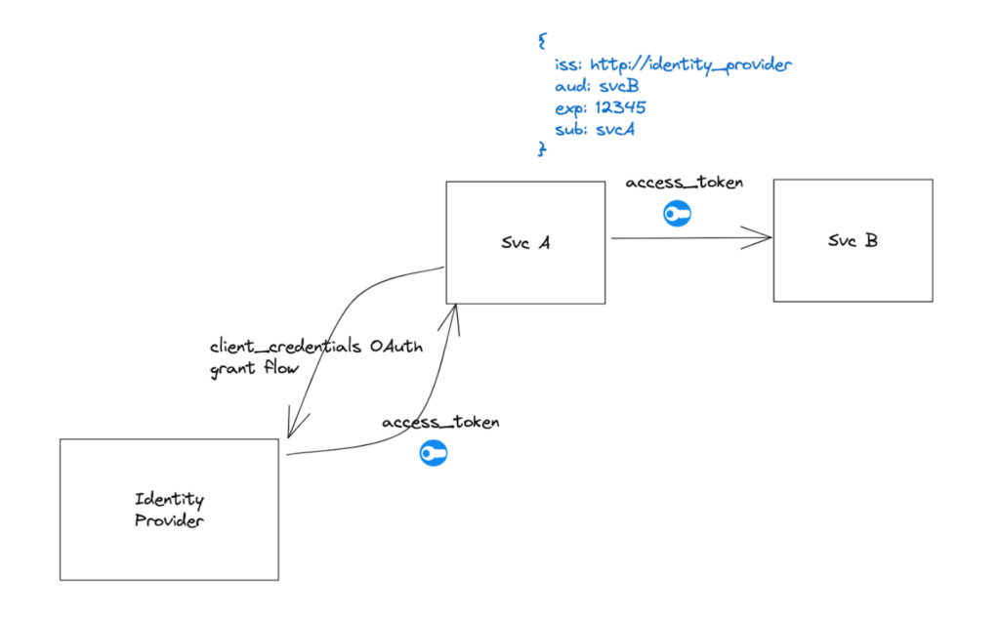
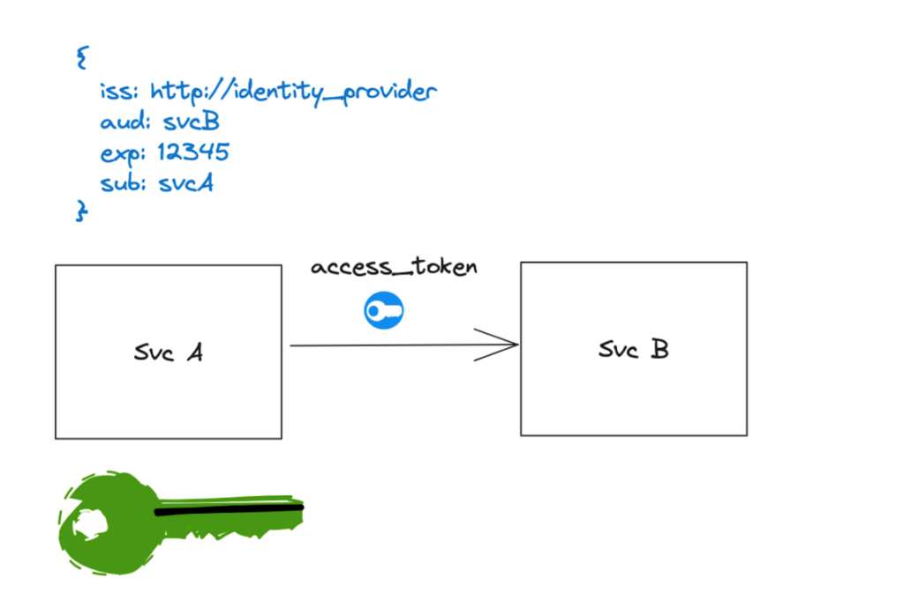
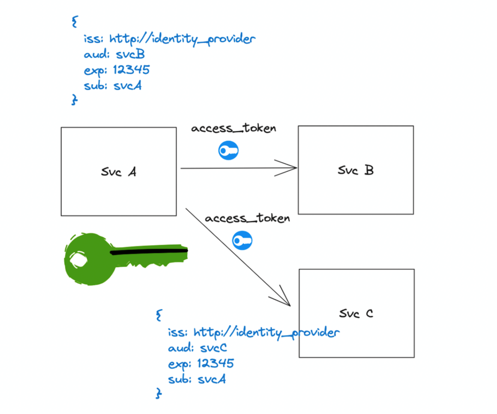

本文译自：<https://www.solo.io/blog/jwts-authenticate-services-api-gateways/>

摘要：这篇博客探讨了在云原生架构中使用 JSON Web Tokens（JWTs）进行服务间通信的复杂性。它详细讨论了通过 API 网关和服务网格实现安全认证的两种方法，强调了使用 JWTs 的挑战，包括安全性、密钥管理和性能问题。

---

云原生架构中的 API 网关组件至关重要，因为它将关键的 API 安全性和策略功能卸载到一个公共位置，使后端 API 和服务能够专注于业务逻辑。API 身份验证、授权、审计、限流等任务可能会非常复杂且难以正确实现，因此许多组织选择使用 API 网关来处理它们。

那么对于服务与服务（S2S）或内部东/西流量呢？强制 S2S 流量“回头”通过 API 网关会引入额外的跳跃、更多的延迟、增加的流量以及效率降低。

但是，如果您跳过 API 网关直接调用服务，如何确保流量的安全性？接收服务如何进行身份验证并知道是谁在调用它？

保障 S2S 通信的两种常见方式是：

1. 使用传输层安全性（TLS）和客户端证书（双向 TLS 或 mTLS）。
2. 使用签名的 JSON Web Tokens（JWT）。

[服务网格](https://www.solo.io/topics/service-mesh/)通过使用第一种方法自动化了许多最佳实践并减轻了与之相关的[问题](https://istio.io/latest/blog/2023/secure-apps-with-istio/)。

开发人员可以选择使用 JWT 进行 S2S 身份验证，但这会“削弱”API 网关的预期功能。也就是说，您曾期望 API 网关处理的所有安全性复杂性和脆弱性必须在每个 S2S 通信的微服务中重新创建和复制。这是一个重大问题，因为使用 JWT 进行 S2S 身份验证会引入复杂性和对细节的严格要求。（有关此主题和下面的场景的更多信息，请观看 Hoot 第 59 集：“[JWT 与 Service-to-Service 身份验证的比较](https://youtu.be/Q2KfNUBfnjo)”。所有演示都可以在我们的[GitHub 仓库](https://github.com/peterj/jwts-for-services/tree/main)中找到。）

虽然有一些出色的处理 JWT 的框架和库，而 JWT 确实有其用武之地，但将 JWT 用于 S2S 流量的身份验证是复杂且繁重的，并且需要开发人员非常准确地完成工作。这种复杂性（或缺乏意识）可能会降低总体安全性，如果开发人员采取捷径或忽视关键属性，可能会降低总体安全性。开发人员还需要以特定于语言和框架的方式执行此操作（例如，使用 Java 解决此问题与使用 Go 或 Node.js 不同）。在所有代码库中维护、打补丁和审核每个实现都需要付出成本。

## 如何使用 JWT 进行 S2S 通信身份验证

有两种方法可以创建 JWT 以进行 S2S 通信身份验证：使用身份提供者（IdP）（也称为安全令牌服务或 STS）或允许各个服务自行签署 JWT。（如果您对 JWT 概念不熟悉或需要复习，请查看 Auth0 提供的[JWT 概述](https://auth0.com/docs/secure/tokens/json-web-tokens)。）

### 选项 1：使用 STS 发放令牌

第一种方法涉及使用安全令牌服务（STS），这是一个可信任的身份或令牌提供者，例如[Keycloak](https://www.keycloak.org/)、[Okta](https://www.okta.com/)或[Auth0](https://auth0.com/)，用于发放代表特定服务的令牌。

在此方法中，服务使用长期凭据（例如用户名和密码或 OAuth2.0 客户端凭据）与 STS 交换 JWT，表明“我是 Service A”。

注意：长期凭据应安全存储并有限使用。例如，您可以在启动时使用它一次来引导身份，并且以后不再使用。此外，这些凭据应仅存储在内存中。

STS 使用其私钥签署 JWT，可以使用其公钥验证 JWT。然后，Service A 将 JWT 附加到发送给 Service B 的请求中。从这里，Service B 可以通过使用 STS 的公钥验证 JWT 的签名来验证 JWT 是由 STS 签发的。

为了使此工作正常运行：

1. 流量必须加密。
2. 服务 B 必须检查 JWT 的`aud`声明、过期时间、颁发时间以及不早于时间。
3. 当 STS 签发的 JWT 签名密钥轮换时，服务 B 必须准备好更新 STS 的公钥。

加密流量至关重要，因为在这种情况下使用 JWT 时，它们代表了一个“承载令牌”，因此拥有令牌的任何人都可以冒充 Service A。在 Service A 和 Service B 之间加密流量（例如使用单向服务器 TLS）有助于减轻这个问题。

Service B 还必须检查 JWT 的过期时间（`exp`）、颁发时间（`iat`）、不早于时间（`nbf`）以及特别是`aud`声明，以验证令牌是否有效（未过期，位于其时间窗口内并用于 Service B 的使用）。JWT 使用这个约定来防范重放攻击，其中攻击者冒充 Service B，从 Service A 获取令牌，然后冒充 Service A 来调用 Service C。有效的 Service C 会检查`aud`声明，看到代表 Service A 的 JWT 是为 Service B 而设计的，然后拒绝它。

每次调用服务 A 都必须使用不同的 JWT，因为`aud`声明会不同。尝试使用没有`aud`声明的 JWT 或使用通配符`aud`声明会增加 JWT 被破坏的风险。避免这样做。

最后，常常被忽略的是轮换 STS 的公钥。在计划的密钥轮换或计划的撤销 STS 用于签署 JWT 的密钥时，Service B（或任何依赖 STS 进行验证的服务）必须能够处理更新的签名公钥。

### 选项 2：让服务自行签署其令牌

第二种方法使用服务特定的密钥来签署 JWT。可以使用对称密钥或非对称密钥。

在这种情况下，Service A 使用自己的密钥来签署发送给 Service B（或任何其他服务）的 JWT。Service B 将需要 Service A 的公钥（或对称密钥，由于密钥交换和冒充问题更加危险）来验证 Service A 发送的 JWT。实际上，Service B 将需要每个调用它的服务的公钥，这些服务使用 JWT 作为身份验证主体。

与 STS 签发的 JWT 示例一样，服务之间的流量必须加密，Service B 还必须检查`aud`声明，并且您需要一种签署公钥轮换的方法。您还必须为每个调用的服务使用不同的 JWT。

开发人员必须采取措施并跟踪许多内容，以确保一切正确。证书还必须至少分发给一半的服务（接收端的服务）以提供至少单向 TLS。此外，整个过程的关键是密钥管理、轮换和安全保管密钥。

## JWT 可能出现问题的地方

我们已经介绍了 JWT 可用于表示服务身份的一些方式，并提出了关注的领域。在服务架构中，有几个需要密切关注的领域，以避免安全漏洞。如果这些不是牢不可破的，您将为攻击者提供机会来破坏您的系统。

在使用客户端证书/mTLS（例如服务网格）和JWT进行身份验证之间最重要的区别之一是：JWT通过网络发送敏感的承载令牌材料，而mTLS不会。使用mTLS时，只会发送公钥，而不会发送私钥，会协商会话密钥。如果JWT泄露，JWT是私密材料，可以被重放。对于证书，只有公共证书被共享。

为防止重播承载令牌，您必须通过设置短暂的到期时间，理想情况下只有几分钟，来限制其暴露。这会增加服务刷新其 JWT 以进行请求的责任。设置数小时、数天或数月的到期时间发生得太频繁。这是一个严重的安全隐患。

另一个重大的安全漏洞是，在使用 STS 获取 JWT 材料时，您会多次通过网络发送长期凭据（例如客户端凭证流程）。这些长期凭据非常敏感，应谨慎使用（例如，在启动时使用），而不应连续使用。

此外，使用通配符`aud`声明或完全省略`aud`声明也是一个重大问题。未能在服务之间一致使用这些约定以进行身份验证会导致严重问题。确保为*每个*调用的服务创建具有正确`aud`声明的 JWT。

最后，密钥轮换与短暂到期时间和 aud 声明检查同样重要。在发生违规事件时，使密钥无效是最后的努力，应尽快且高效地处理。

## JWT 的复杂性是服务网格简化事物的地方

服务网格简化了服务之间的身份验证，并允许开发人员专注于业务逻辑，而不是正确地处理 JWT 和秘密材料（希望如此）。就像 API 网关应用于处理北/南和入口流量的安全性一样，服务网格应用于处理东/西和 S2S 流量的安全性。保持服务和 API 专注于它们可以提供的不同 iating 业务价值，而不是模板（但极其重要的）的安全性代码。
