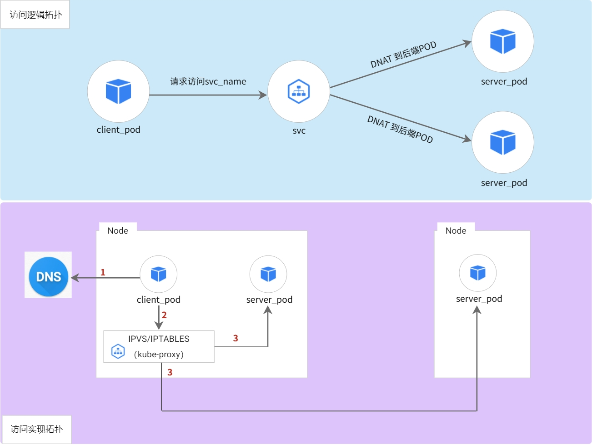

Kubernetes（K8s）是一个用于大规模运行分布式应用和服务的开源容器编排平台。K8s 让应用发布更加快速安全，让应用部署也更加灵活，但在带来这些便利性的同时，也给应用排障增加了 K8s 平台层面的复杂度，本篇文章将以常见的服务异常入手，来详细拆解 K8s 服务访问方式，以及如何利用现有的可观测体系来对 k8s 平台和应用服务进行快速排障。

## 0x0: 服务的访问方式

开启 K8s 服务异常排障过程前，须对 K8s 服务的访问路径有一个全面的了解，下面我们先介绍目前常用的 K8s 服务访问方式（不同云原生平台实现方式可能基于部署方案、性能优化等情况会存在一些差异，但是如要运维 K8s 服务，则需要在一开始就对访问方式有一个了解）。

方式一：**集群内客户端通过 ClusterIP 访问集群内服务**

从`访问逻辑拓扑`来分析，集群内客户端 POD 访问的是集群内服务的 svc_name，然后在 svc 层进行 DNAT，将请求转发到对应的后端 POD。这个过程对应的`访问实现拓扑`则要复杂不少：
- step 1: client_pod 根据 DNS 配置，请求 DNS 服务器解析 svc_name，DNS 服务器会返回 svc_name 对应的 ClusterIP
- step 2: client_pod 请求 ClusterIP，Node 根据 kube-proxy 配置的 IPVS/IPTABLES 完成 DNAT
- step 3: 根据 DNAT 的结果，Node 将请求转发给对应的 server_pod，server_pod 可能与 client_pod 在同一个 Node，也可能在不同 Node，此差异主要体现在网络转发层面 

方式二：**集群外客户端通过 NodePort 访问集群内服务**

相比`方式一`，`访问逻辑拓扑`上 client 访问的区别是从 svc_name 替换为 nodeip:port。`访问实现拓扑`主要过程如下：
- step 1: client 直接请求 svc 对外暴露的 nodeip:port，如果是 LoadBalance 类型的服务，在此之前还会访问 LB（因为并不是 K8s 服务的中的特别能力，所以此处并无特别说明），请求转发到对应的 Node 上，Node 也会根据kube-proxy 配置的 IPVS/IPTABLES 完成 DNAT
- step 2: 与`方式一`的 step 3 一致

方式三：**集群外客户端通过 Ingress 访问集群内服务**

`方式三`相比前两种方式，引入了 Ingress 的概念，因此复杂度增加了非常多。`访问逻辑拓扑`中外部 client 可以直接请求 url 而不是 ip 了，请求 url 会先到达 Ingress，由 Ingress 完成反向代理，转发给后端的 svc，svc 再完成 DNAT 转发给后端 POD。`访问实现拓扑`会根据 ingress-controller 部署形式不同而有差异，ingress-controller **非** hostnetwork 部署下文简称`部署模式一`，ingress-controller hostnetwork 部署下文简称`部署模式二`
- step 1：外部 client 请求 DNS 服务器解析 url 的域名，DNS 服务会返回 ingress-controller 服务所在的 IP (如果前面有挂 LB，则访问的是 LB 的 IP，否则返回的是 ingress-controller 服务的 nodeip:port)
- step 2：此时`部署模式一`，则需要按`方式二`访问 ingress-controller（为避免画图过于复杂，未画出 ingress_controller_pod 分布在不同 Node 场景）；`部署模式二`，请求到达 Node 后，则直接转给 ingress_controller_pod
- step 3：此为`部署模式一`特有的步骤，参考`方式二`
- step 4/5/6：请求经过 ingress_controller_pod 后，已经确定需要转发的后端 svc，则按`方式一`进行转发即可（为避免画图过于复杂，未画出 server_pod 分布在同 Node 场景）

## 0x1: 服务异常的排障思路

了解服务的访问方式后，在遇到服务异常时，基于一套整体的排障思路来开展工作，更能事半功倍，接下来详细聊聊如何进行排障。

step 1：**确定 Node/POD 是否异常**

首先我们可以通过 Prometheus 提供的 Dashboard 来检查部署的实例的基础状态，通过直接查看应用的 CPU/内存/带宽等指标，确认目前部署实例的负载都在正常范围内。

step 2：**确定后端服务是否异常**

然后我们可以通过 DeepFlow 提供的 Dashboard 查看后端服务的黄金指标：请求、异常、时延，以快速判断目前的服务是否在正常运行。

step 3：**确定 DNS 是否异常**

从前面**服务的访问方式**一节可知，仅方式一/方式三的访问过程经过 DNS 服务，因此只有这两种场景才需要检查 DNS 服务是否异常，方式一和三都需要检查集群内的 DNS 服务是否异常，方式三相比方式一还需要检查 client 访问的集群外的 DNS 服务是否异常。对于 CoreDNS 本身，我们可以使用 Prometheus 提供的 Dashboard 来进行排障，对于排查应用服务访问 DNS 异常，我们可以使用 DeepFlow 提供的 Dashboard 查看 DNS 服务的请求、异常、时延指标。

如 DNS 服务无异常，则可直接用 ClusterIP 访问服务，如果能正常访问，那可以确定是 DNS 的问题，并且这个问题很大可能就是配置错误。

step 4：**确定 SVC 是否异常**

因为 SVC 的功能实际是 kube-proxy 同步配置到 IPVS/IPTABLES 来实现的，所以我们可以参考 **step 1** 的排查步骤，把 kube-proxy 视作应用 POD，通过 Prometheus 提供的 Dashboard 查看 kube-proxy 是否正常。

如果能确定应用服务运行正常，可以尝试直接访问后端 POD，如果能正常访问，则可以继续分析 SVC 问题，很大可能是 IPVS/IPTABLES 配置错误。

step 5：**确定 Ingress 是否异常**

在**服务访问方式**中方式三的场景下，如果需要检查 Ingress 的状态，可以查看基于 ingress-controller 服务的状态/负载/请求日志等构建的 Dashboard。这一类 Dashboard 除了 Prometheus/DeepFlow 有提供之外，各个 API 网关的厂商也有提供，可以用 DeepFlow + 厂商提供的 Dashboard 结合进行分析，厂商会更关注网关本身的分析，DeepFlow 则更关注全链路分析，快速定位问题点。

step 6：**追踪访问路径异常点**

上述排障过程，都是独立的一个个点检查，如果都没问题，则可以去追踪报障的某一次访问路径是否有异常。如果能直接定位访问路径，确认问题点就会变得更简单。比如我们发现访问路径如果存在断路，则分析断路位置即可；如果追踪的是时延高的问题，则分析追踪到的每一段路径的时延即可。访问路径需要能覆盖从应用->系统->网络各个层面，目前提供这样全链路追踪能力的组件不多，可以使用 DeepFlow 自动化的分布式追踪能力来进行排查。

## 0x2: 什么是 DeepFlow

[DeepFlow](https://github.com/deepflowys/deepflow) 是一款开源的高度自动化的可观测性平台，是为云原生应用开发者建设可观测性能力而量身打造的全栈、全链路、高性能数据引擎。DeepFlow 使用 eBPF、WASM、OpenTelemetry 等新技术，创新的实现了 AutoTracing、AutoMetrics、AutoTagging、SmartEncoding 等核心机制，帮助开发者提升埋点插码的自动化水平，降低可观测性平台的运维复杂度。利用 DeepFlow 的可编程能力和开放接口，开发者可以快速将其融入到自己的可观测性技术栈中。

GitHub 地址：https://github.com/deepflowys/deepflow

访问 [DeepFlow Demo](https://deepflow.yunshan.net/docs/zh/install/overview/)，体验高度自动化的可观测性新时代。

## 0x3: 参考文档

- 0、https://deepflow.yunshan.net/docs/zh/about/overview/
- 1、https://grafana.com/grafana/dashboards/1860-node-exporter-full/
- 2、https://grafana.com/grafana/dashboards/15661-1-k8s-for-prometheus-dashboard-20211010/
- 3、https://grafana.com/grafana/dashboards/9614-nginx-ingress-controller/
- 4、https://grafana.com/grafana/dashboards/14981-coredns/
- 5、https://kubernetes.io/docs/concepts/services-networking/service/
- 6、https://kubernetes.io/docs/concepts/services-networking/dns-pod-service/
- 7、https://www.nginx.com/products/nginx-ingress-controller/
- 8、https://github.com/haproxytech/kubernetes-ingress#readme
- 9、https://kubernetes.io/docs/concepts/services-networking/service-topology/
- 10、https://mp.weixin.qq.com/s/mp5coRHPAdx5nIfcCnPFhw
