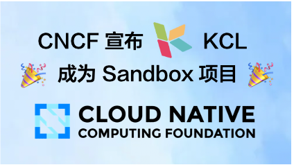
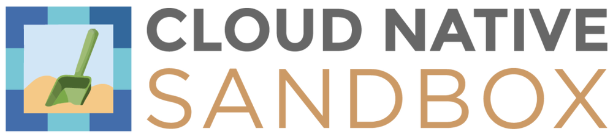
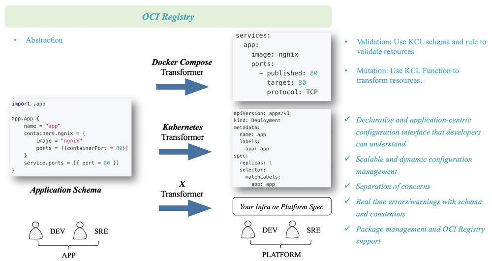
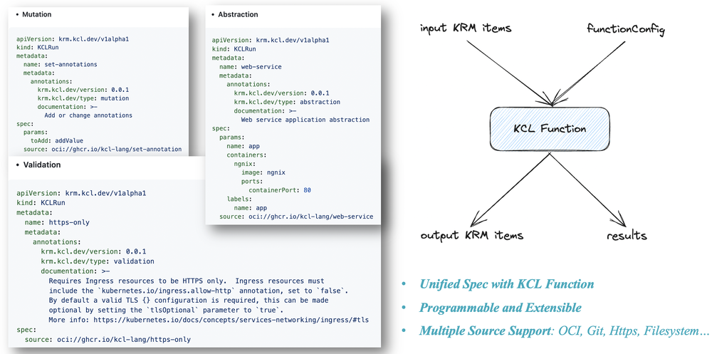
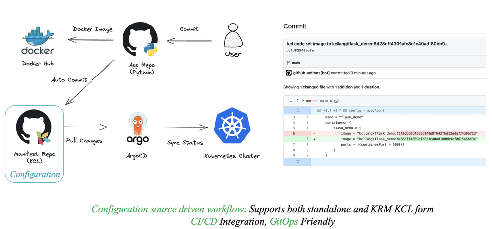
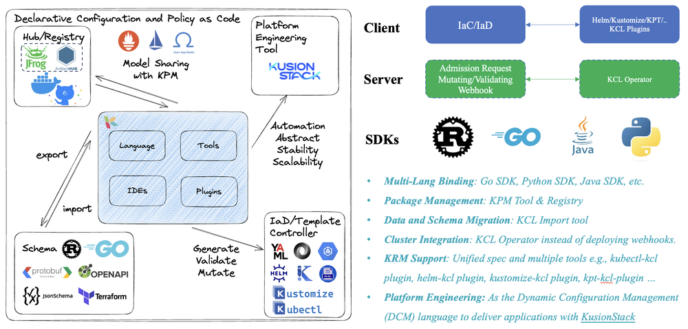
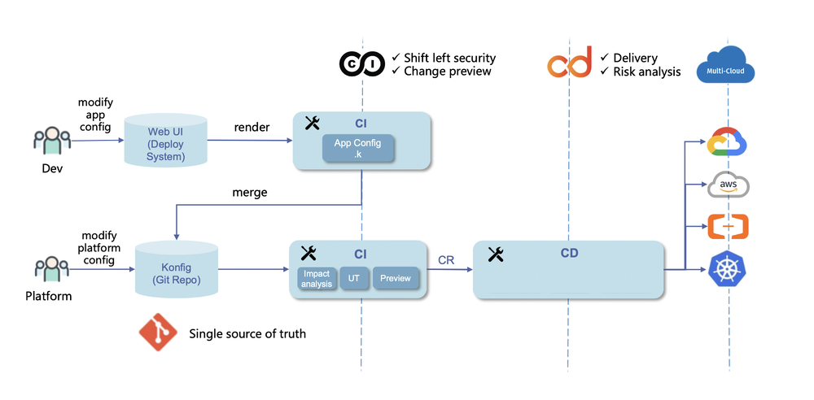
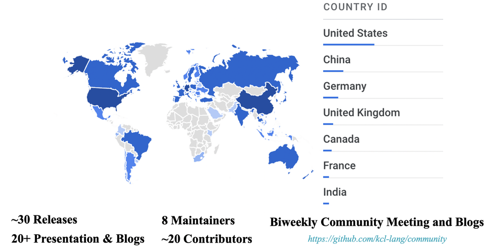

**2023 年 9 月 12 日，KCL 项目通过了全球顶级开源基金会云原生计算基金会（CNCF）技术监督委员会评定，正式成为 CNCF 沙箱项目。**

这意味着 KCL 得到了云原生开源社区的认可，保障了项目的中立性，有利于开发者、合作伙伴等共同参与项目建设，协作共赢，并为云原生应用交付带来动态配置管理和自动化能力迈出了重要一步！

<!--TODO: CNCF Sandbox Review 通过的邮件截图-->

+ *项目地址：<https://github.com/kcl-lang/kcl>*
+ *项目官网：<https://kcl-lang.io>*

通过进入 CNCF 沙箱，KCL 社区将更多吸引更多开发者和用户参与共建，进一步推动项目在云原生业务场景的成熟应用，此外加入 CNCF 将为 KCL 提供一个增强的协作和创新平台。它提供了与处于云原生技术前沿的多元化开发者、组织和行业专家社区进行交流的机会。我们期待与其他 CNCF 项目进行更多合作，贡献我们的技术专业知识，并探索更多 CNCF 项目集成的可能性。

## 什么是 CNCF？

CNCF，全称 Cloud Native Computing Foundation（云原生计算基金会），是 Linux 基金会旗下的子基金会。CNCF 致力于为云原生软件构建可持续生态系统，涉及领域包括存储、计算、编排、调度、CI/CD、DevOps、服务治理、服务网关等。

*Kubernetes 便是 CNCF 最具代表性的项目之一*。

## 什么是 CNCF Sandbox 沙盒项目？

CNCF 社区将项目分为沙箱项目（Sandbox）、孵化项目（Incubating）、毕业项目（Graduated）。著名的毕业项目有：Kubernetes、Prometheus、Istio、ETCD、Containerd、ArgoCD 和 Helm 等。完整的毕业和孵化项目列表查看地址：

[https://www.cncf.io/projects/](https://www.cncf.io/projects/)

Sandbox 是 CNCF 创建的，旨在为开源项目提供一个有益的、中立的家园，以促进开源项目的合作与开发。入选沙箱的项目，是被 CNCF TOC 认可的，并值得进行实验和开发的潜力项目。

Sandbox 对应的是 CNCF 社区早期项目，列表为：[https://www.cncf.io/sandbox-projects/](https://www.cncf.io/sandbox-projects/)。进入 Sandbox 需要 66% 以上的 TOC（技术委员会）成员赞成，即全部 11 人 [https://github.com/cncf/toc#members](https://github.com/cncf/toc#members) 中的 8 人投赞成票。

## 什么是 KCL

KCL 是一个开源的基于约束的记录及函数语言，期望通过成熟的编程语言技术和实践来改进对大量繁杂配置比如云原生 Kubernetes 配置场景的编写，致力于围绕配置的模块化、扩展性和稳定性，打造更简单的逻辑编写体验，构建更简单的自动化和生态集成路径。

项目主要里程碑如下：

+ 2022 年 5 月，KCL 由蚂蚁集团发起，正式开源
+ 2023 年 6 月，KCL 正式成为 CNCF Landscape 项目
+ 2023 年 9 月，KCL 由 CNCF 应用交付 TAG 进行审核并通过 TOC 投票，顺利成为 CNCF Sandbox 项目 - [https://github.com/cncf/sandbox/issues/48](https://github.com/cncf/sandbox/issues/48)

## 为什么需要 KCL

正如记录音乐有五线谱，存储时间序列数据有时序数据库一样，在云原生配置和自动化的特定问题域内，我们使用专用配置和策略语言用于编写和管理规模化复杂配置及策略。不同于混合编写范式、混合工程能力的高级通用语言，专用语言的核心逻辑是以收敛的有限的语法、语义集合解决领域问题近乎无限的变化和复杂性，将复杂配置和策略编写思路和方式沉淀到语言特性中。

此外，KCL 期望通过更现代化的声明式配置语言和工具，在轻量级客户端云原生动态配置领域填补配置语言及工具的空白并解决如下问题：

+ **维度爆炸**: 大多数静态配置如云原生领域的 Kubernetes YAML 配置需要为每个环境单独进行配置；在最糟糕的情况下，它可能引入涉及环境交叉链接的难以调试的错误，稳定性和扩展性都较差。
+ **配置漂移**: 对于不同环境的静态管理应用程序和基础设施配置的方式，往往没有标准的方式去管理这些动态的不同环境的配置，采用非标准化的方法比如脚本和胶水代码的拼盘，会导致复杂度呈指数增长，并导致配置漂移。
+ **认知负担**: Kubernetes 等作为构建平台的平台技术手段在底层统一基础架构细节方面出色，但是缺乏更上层的应用软件交付抽象，对于普通开发者认知负担较高，影响了更上层应用开发者的软件交付体验。

针对如上问题，KCL 期望提供如下能力:

+ 通过**代码抽象**等手段屏蔽基础设施和平台的细节和复杂性，降低研发者**认知负担**
+ **编辑**和**校验**已有的存量配置或模版，直接解决云原生小配置场景问题如 Helm Chart 配置硬编码问题，但远不止如此
+ 通过配置语言无副作用地**管理跨团队的大规模配置数据**，提升团队协作效率

具体来说，KCL 可以

+ 在代码层面提升**配置语义验证**的能力，比如 Schema 定义、字段可选/必选、类型、范围等配置检查校验能力
+ 提供**配置分块编写、组合和抽象**的能力，比如结构定义、结构继承、约束定义和配置策略合并等能力
+ 用**现代编程语言**的方式以**编写代码**的方式提升配置的灵活度，比如条件语句、循环、函数、包管理等特性提升配置重用的能力
+ 提供**完备的工具链支持**，丰富的 IDE 插件、语言和生态工具链支持用以降低上手门槛，提升使用体验
+ 通过**包管理工具** 和 **OCI 注册表**使得配置以更简单的方式在不同团队/角色之间分享，传播和交付
+ 提供**高性能**的编译器满足规模化配置场景诉求，比如满足由一份基线配置根据部署上下文生成不同环境不同拓扑的配置的渲染性能以及配置自动化修改性能诉求
+ 通过**多语言 SDK，KCL 语言插件**等手段提升其自动化集成能力，在发挥配置及策略编写价值的同时显著降低 KCL 的学习成本

除了语言自身，KCL 还提供了许多额外的工具如格式化，测试、文档等工具帮助您使用、理解和检查编写的配置或策略；通过 VS Code 等 IDE 插件，包管理工具和 Playground 降低配置编写和分享的成本；通过 Rust, Go, 和 Python 多语言 SDK 自动化地管理和执行配置。

## KCL 能做什么

### 动态配置管理

作为一种配置语言，KCL 为应用程序和平台开发人员/SRE 提供的最重要的功能是动态配置管理。通过代码抽象，我们可以构建以应用为中心的模型屏蔽复杂的基础设施和平台概念，为开发人员提供一个以应用程序为中心且易于理解的界面。此外，KCL 还允许平台人员快速扩展和定义自己的模型，并且这些模型可以通过 OCI 注册表进行分享和复用。

此外，KCL 还支持与 Kubernetes Resource Model (KRM) 规范直接集成，KRM KCL 是一个通用的配置模型规范，用于描述和管理各种云原生资源，如容器、Pod、服务的配置操作和抽象等。KRM KCL 规范提供了一种统一的方式来定义和管理这些资源，使得它们可以在不同的环境中进行移植和复用。它建立在一个完全开放的 Kubernetes 世界当中，几乎不与任何编排/引擎工具或者 Kubernetes 控制器绑定，它在关注点分离的基础上允许平台人员扩展自己的抽象，配置编辑和验证逻辑，并提供一个开发者友好的配置管理界面。

### GitOps 集成

无论是使用独立的 KCL 还是 KRM KCL 配置形式，我们都支持 KCL 与各种以及 CI/CD 和 GitOps 工具的集成，KCL 允许开发人员以声明式的方式定义应用程序所需的资源，通过将 KCL 和 GitOps 工具相结合可以帮助我们更好地实现基础设施即代码（IaC），提高部署效率，简化应用程序的配置管理。

使用 GitOps，开发人员和运维团队可以通过分别修改应用和配置代码来管理应用程序的部署，GitOps 工具链可以基于 KCL 的自动化能力实现对配置的自动更改，从而实现持续部署并确保一致性。如果出现问题，可以使用 GitOps 工具链快速回滚。

## 生态集成

除了与 ArgoCD 等 GitOps 自动化工具进行集成，作为 CNCF 的项目，KCL 还与 CNCF 其他众多生态项目进行了集成，比如为现有的 CNCF 生态配置管理工具项目如 Helm、Kustomize、kpt 等提供 KCL 插件，在运行时提供 KCL Kubernetes Operator，以满足不同场景的配置管理需求等。此外我们还提供如下集成支持：

+ **多语言支持**：我们提供了多语言 SDK，帮助用户以不同的语言操作 KCL，并将其集成到自己的应用程序中。
+ **包管理支持**：我们提供了 KPM 包管理工具可以将 KCL 配置通过 docker hub, GitHub 容器注册表进行分发和复用。
+ **Schema 迁移支持**：我们支持其他生态系统的 Schema 一键迁移到 KCL Schema，如 Go/Rust 结构定义、JsonSchema、Protobuf、OpenAPI、Terraform Provider Schema 等。

## 落地实践

首先，KCL 作为云原生领域内的一个小语言，它可以直接被用于解决场景中简单的小问题，如通过 KCL 模型直接为 Kubernetes 资源注入环境变量等配置而不是编写脚本，通过 KCL 模型和 Helm KCL 插件无侵入处理 Helm Chart 的硬编码配置而不是 Fork Helm Chart 直接修改等。

其次，KCL 也可以被用于企业内部与各种 CI/CD 和应用配置交付引擎比如 [KusionStack](https://kusionstack.io) 等相配合，实现关注点分离、以应用为中心的可编程模型界面和 GitOps 流程，以简化当今混合多云环境中规模化应用的部署和运维操作，提升发布运维效率和开发者体验。

当然，KCL 能够解决的问题和实践的场景远不止如此，我们会陆续分享社区中采用者的最佳实践，也欢迎大家加入我们的社区进行进一步交流和讨论 ❤️。[https://github.com/kcl-lang/community](https://github.com/kcl-lang/community)

## 社区动态

在 KCL 开源短短的这一年里，我们发布了许多版本，并与全世界许多贡献者和维护者合作构建了 KCL 社区，并得到了一些采用者比如有赞和华为等公司的认可，通过加入 CNCF，我们的目标是提高项目的知名度并促进社区采用和参与，因为强大且知名的基金会组织对于推动语言生态系统的发展至关重要。

此外，我们在开源社区收获了来自全世界包括中国、北美、欧洲和澳大利亚各地小伙伴的认可，感谢一路陪伴 KCL 走来的各位用户和社区研发者，同时也欢迎更多的小伙伴加入到我们的社区一起共建 ❤️

## 结语

对 KCL 来说，加入 CNCF 并不代表成功，它意味着一个新的开始，我们将和社区的小伙伴们一起努力打造更好的 KCL 语言、工具链和 IDE 体验！最后，也欢迎大家加入我们的社区进行交流和贡献 👏👏👏

## 其他资源

+ KCL 网站: https://kcl-lang.io/
+ KusionStack 网站: https://kusionstack.io/

+ KCL 社区: https://github.com/kcl-lang/community
+ KCL 2023 路线规划: https://kcl-lang.io/docs/community/release-policy/roadmap
+ KCL GitHub Issues: https://github.com/kcl-lang/kcl/issues
+ KCL GitHub Discussion: https://github.com/orgs/kcl-lang/discussions
