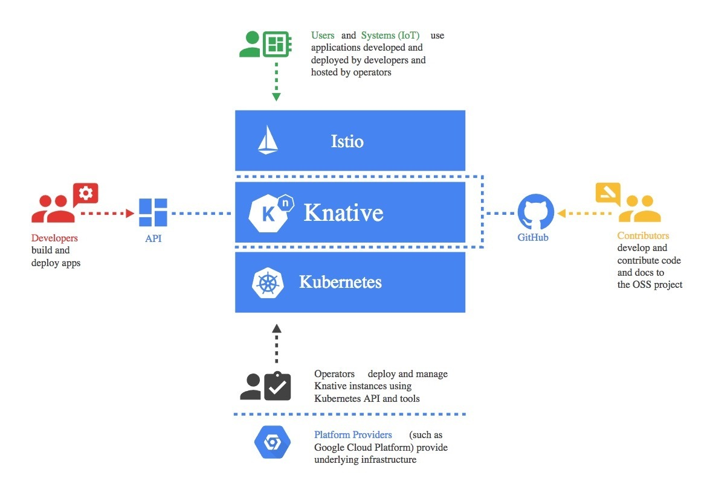
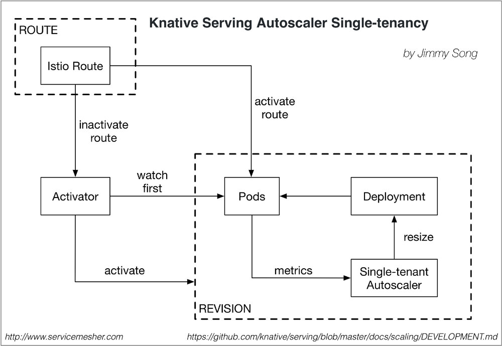

> 我们都是知道Kubernetes中个资源对象叫 autoscaler，该对象在serverless架构中更是不可或缺，有了它可以负责应用的自动水平伸缩，用户再也不用关心示例的个数和资源消耗，本文是来自阿里巴巴UC事业群基础研发部的陈有坤同学对Knative的解析之autoscaler部分，还有大量的解析等待放出，起关注本站的后续内容。

[Knative](https://github.com/knative)是一款基于Kubernetes的平台，用来构建、部署和管理现代serverless应用的框架。该框架试图将云原生应用开发的以下三个领域的最佳实践结合起来：

- 构建容器（和函数）
- 为工作负载提供服务（和动态扩展）
- 事件

Knative是由谷歌与[Pivotal](https://content.pivotal.io/blog/knative-powerful-building-blocks-for-a-portable-function-platform)、[IBM](https://www.ibm.com/blogs/cloud-computing/2018/07/24/ibm-cloud-google-knative-serverless/)、[Red Hat](https://blog.openshift.com/state-of-serverless-in-kubernetes-knative-and-openshift-cloud-functions/) 和[SAP](https://blogs.sap.com/?p=696354)紧密协作开发的。 

Knative构建在Kubernetes和[Istio](https://istio.io/)之上，它的设计考虑到了多种角色通过该框架进行交互，包括开发人员、运维人员和平台提供者。



Knative所涉及的角色（图片来源于[Knative GitHub仓库](https://github.com/knative/docs/)）

Knative致力于提供可重用的“通用模式和最佳实践组合”实现，目前可用的组件包括：

- [Build](https://github.com/knative/build)：从源到容器的构建编排；
- [Eventing](https://github.com/knative/eventing)：管理和交付事件；
- [Serving](https://github.com/knative/serving)：请求驱动的计算，可以缩放到零。

> 以上内容引用自： [InfoQ | 谷歌发布Knative：用于构建、部署和管理Serverless工作负载的Kubernetes框架](http://www.infoq.com/cn/news/2018/07/knative-kubernetes-serverless)

以上是对Knative的基本介绍，关于Knative的更多信息大家可以关注其GitHub：<https://github.com/knative>，我们都是知道Kubernetes中个资源对象叫`autoscaler`，该对象在serverless架构中是不可或缺的，有了它可以负责应用的自动水平伸缩，用户再也不用关心示例的个数和资源消耗，下文是来自阿里巴巴UC事业群的陈有坤同学对Knative的解析。

------

下面首先解析的是Serving中的Autoscaling组件，该组件的功能是根据网络流量来自动伸缩应用实例的个数。

## Knative是如何做伸缩容的？

处理伸缩容问题，首先要解决的问题是根据什么指标判断伸缩容？cpu、内存、请求数？这里knative使用的是请求数。

其次是伸缩多少的问题。

Knative的伸缩是依赖修改deployment的replica数实现的。

## 如何采集请求数？

启动revision的pod时，也会启动一个autoscaler（一个knative revision只启动一个autoscaler），autoscaler自己本身也会scale到0，用于接收请求数统计和处理伸缩容。

业务pod中，会注入queue-proxy sidecar，用于接收请求，在这里会统计并发数，每秒向autoscaler汇报，接收到的请求会转发给业务container。

注：单租户模式下一个revision启动一个autoscaler，多租户共用一个autoscaler

## 计算需要pod的个数？

autoscaler接收到并发统计的时候，会根据算法计算需要的pod个数。

算法中有两种模式，分别是panic和stable模式，一个是短时间，一个是长时间，为了解决短时间内请求突增的场景，需要快速扩容。

[文档中描述](https://github.com/knative/docs/blob/master/serving/samples/autoscale-go/README.md#algorithm)的算法是，默认的target concurrency是1，如果一个revision 35QPS，每个请求花费0.25秒，Knative Serving 觉得需要 9 个 pod。  

```bash
ceil(35 * .25) = ceil(8.75) = 9
```

#### Stable Mode（稳定模式）

在稳定模式下，Autoscaler 根据每个pod期望的并发来调整Deployment的副本个数。根据每个pod在60秒窗口内的平均并发来计算，而不是根据现有副本个数计算，因为pod的数量增加和pod变为可服务和提供指标数据有一定时间间隔。

#### Panic Mode （恐慌模式）

Panic时间窗口默认是6秒，如果在6秒内达到2倍期望的并发，则转换到恐慌模式下。在恐慌模式下，Autoscaler根据这6秒的时间窗口计算，这样更能及时的响应突发的流量请求。每2秒调整Deployment的副本数达到想要的pod个数（或者最大10倍当前pod的数量），为了避免pod数量频繁变动，在恐慌模式下只能增加，不会减少。60秒后会恢复回稳定模式。

# autoscaler单租户图



上图基于 https://github.com/knative/serving/blob/master/docs/scaling/DEVELOPMENT.md 绘制。

# 模式

```go
const (
   // 每个pod实例同时只处理一个请求
   RevisionRequestConcurrencyModelSingle RevisionRequestConcurrencyModelType = "Single"
   // 每个pod实例同时处理多个请求
   RevisionRequestConcurrencyModelMulti RevisionRequestConcurrencyModelType = "Multi"
)
```

# 配置

```bash
apiVersion: v1
kind: ConfigMap
metadata:
  name: config-autoscaler
  namespace: knative-serving
data:
  # Static parameters:

  # 期望每个pod并发请求数
  multi-concurrency-target: "1.0"
  # 如果是单个并发，值要接近1.0
  single-concurrency-target: "0.9"

  # stable窗口时间，计算平均并发会用到。如果进入panic模式后，经过stable窗口时间也会恢复stable
  stable-window: "60s"

  # 如果平均并发在panic窗口时间内达到2倍目标并发，autoscaler进入panic模式。
  # 在panic模式下，自动伸缩按在panic窗口时间的平均并发来操作。
  panic-window: "6s"

  # 最大增长比例，每次调整会根据并发计算增长比例，最大增长不超过这个值
  max-scale-up-rate: "10"

  # 计算并发值的参数，每一段时间得到最大并发，作为一个bucket，最后汇报的时候，
  # 平均并发 = 各个bucket最大并发之和 / 总bucket数，汇报间隔是1秒（hard coded）
  concurrency-quantum-of-time: "100ms"

  # 是否开启缩容到0
  enable-scale-to-zero: "true"

  # 实验性：开启垂直扩容
  # Requires a VPA installation (e.g. ./third_party/vpa/install-vpa.sh)
  enable-vertical-pod-autoscaling: "false"
 
  # 如果开启了enable-vertical-pod-autoscaling，这个值就会替代multi-concurrency-target，
  # 如果成熟了后期会变成默认值
  vpa-multi-concurrency-target: "10.0"

  # 多长时间调整一次
  tick-interval: "2s"
  
  # Dynamic parameters (take effect when config map is updated):

  # 空闲多长时间缩容到0
  scale-to-zero-threshold: "5m"
```

