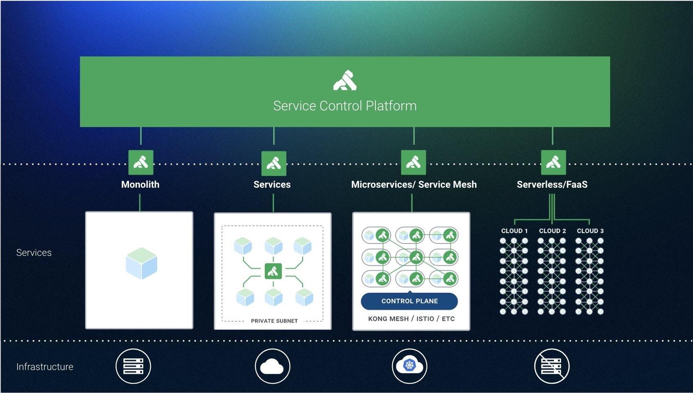

本文为翻译文章，[点击查看原文](https://thenewstack.io/kong-at-1-0-a-service-control-platform/)。

_图片：Kong 公司员工们在庆祝第一届 Kong Summit 举办（来自 Kong 官方 Twitter）_

[Kong](https://konghq.com/)公司的前身是 Mashape，发布了其核心开源 API 网关的 1.0 版本，名字也为[Kong](https://github.com/Kong/kong) 。这是包括诺基亚、纽约时报和哈佛大学等客户近四年生产经验的结晶。

**Kong 1.0 是该公司构建服务控制平台愿景的基础，该平台结合了人工智能、机器学习和其他先进技术，可以促进信息流在服务之间的流动。**

“我们相信未来所有数据都将处于运动状态，并且将从数据池转移到系统间代理信息的地方。Kong 最初是一个网关，在 1.0 发布之后将转型为服务控制平台，“[Geoff Townsend](https://www.linkedin.com/in/geoff-townsend-25058347 /)，Kong 工程副总裁。据该公司称，截至目前，该软件已被下载 4500 万次。

本周在[Kong Summit 2018](https://konghq.com/kong-summit/)上，在该公司的总部旧金山探讨了 1.0 里程碑以及企业级组件包括开发人员门户、Open API 规范、自动生成和自动配置，这些功能将于明年初推出。

“我们希望帮助您获得服务的可见性，并能以简单的方式记录通过平台的所有内容。我们将从生产中的服务自动生成 Open API 规范，这将能够记录没有登记在册的服务。使用 Open API 规范自动配置 Kong 的节点，以便记录的内容与生产中的内容一致。有一个 API 地图能够显示实时流量的拓扑，“他说。 “Kong 位于网络中的绝佳位置，所以它将能够做一系列异常检测和机器学习。”

Kong 建立在 Nginx 反向代理服务器之上。[提供的服务](https://thenewstack.io/mashape-opens-kong-a-microservices-proxy-built-on-nginx/)中包括一个 RESTful API 接口，用于在注册表中注册 API 本身的插件平台，提供微服务常用的基础功能。

首席执行官[Augusto Marietti](https://www.linkedin.com/in/sonicaghi/)之前告诉 The New Stack，“它解决了在系统中处理身份验证协议的所有问题。”

日志记录是另一个常见服务，可以使用 Kong 中的插件向微服务公开。

“对于那些已经使用微服务架构的人来说，Kong 并没有改变服务的编排方式，但会使微服务变得更轻量，因为使用它后就可以剔除微服务中的许多常用功能，把这些功能集中到 Kong 中，使服务变得更轻，更易于维护，“Marietti 说。

[雅虎日本](https://globenewswire.com/news-release/2018/09/13/1570542/0/en/Yahoo-Japan-Deploys-Kong-Enterprise-API-Platform-to-Improve-Service-Development-Productivity .html)最近宣布，使用单点 Kong 来代理所有 API 端点和路由流量，从而消除了为每个 API 的编写身份验证和授权的冗余代码。它还使用 Kong 的金丝雀发布功能来评估一小部分用户的版本。

Kong 最近宣布[支持服务网格部署](https://konghq.com/blog/service-mesh-new-pattern-not-new-technology/)。去年在 MesosCon 2017 上，Kong 首席技术官[Marco Palladino](https://www.linkedin.com/in/marcopalladino/)预测[API 网关和服务网格之间的相似性](https://thenewstack.io/api-gateways-age-microservices/)将继续增长。

传统的 API 网关用于处理单体应用程序和外部客户端之间的流量，微服务架构将这些大部分流量转移到内部不同微服务之间的通信。

“你依然拥有外部客户端用例，但现在它只是微服务的所有消费者中的一个。”Palladino 解释说。
