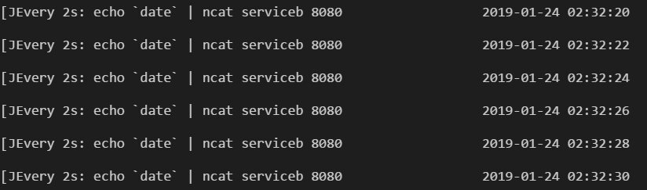
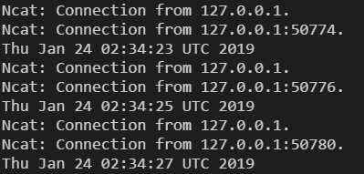
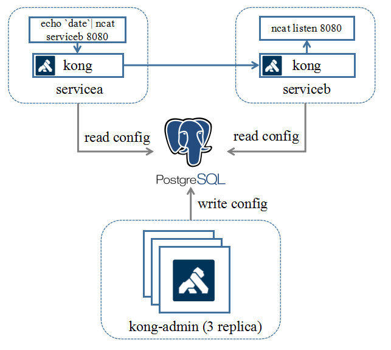
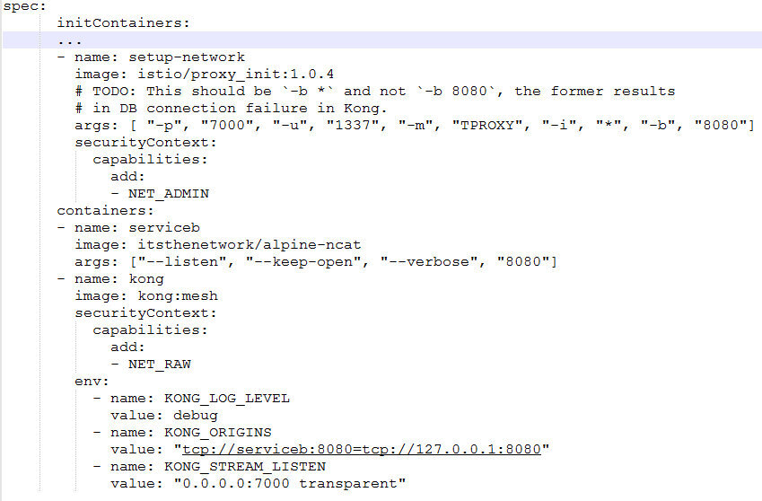
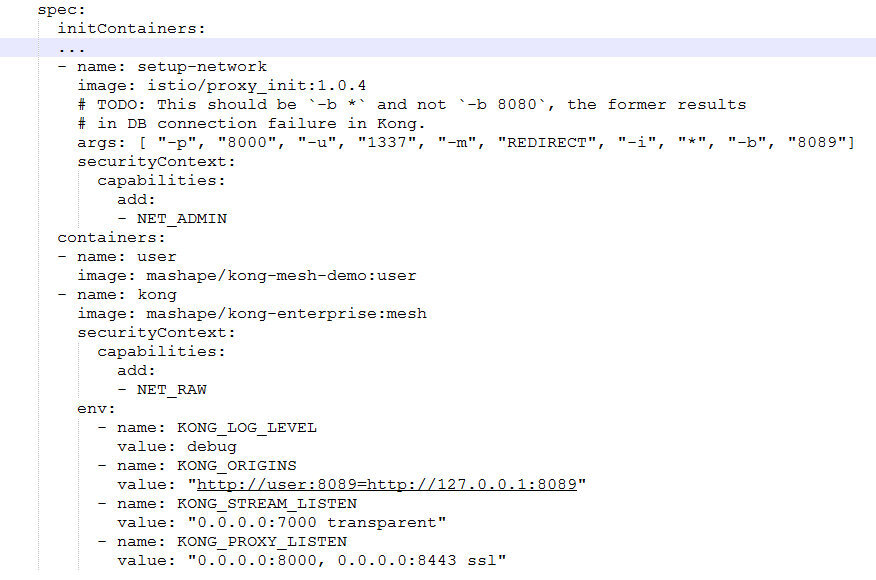
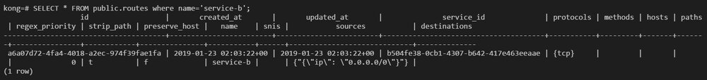
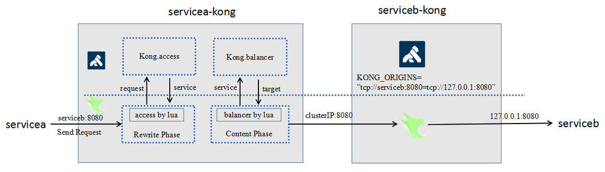

Kong 是一个基于 OpenResty (Nginx) 封装的微服务中间件产品，在微服务架构体系中，作为 API 网关以及 API 中间件（kubernetes ingress）提供服务。由于其天生具备 Nginx 的高性能、nginx-lua 插件的可定制性，再加上完善的社区以及齐全的文档，在中小企业用户群非常受欢迎，拥有较好的群众基础。

2018 年 8 月，kong 发布了 1.0 GA 版本，正式宣布其支持 service mesh，并提供社区版以及企业版 2 个版本。下面我们从 Demo、配置、功能这 3 方面，对 kong mesh 进行体验及分析。

## Demo 体验

Kong 社区提供了 kong mesh 的 demo (<https://github.com/Kong/kong-mesh-dist-kubernetes>），该 demo 是实现的是 tcp 四层透明代理转发业务。

该 demo 主要做的事情是：提供两个服务 servicea 以及 serviceb，serviceb 作为服务端，通过 ncat 监听 8080 端口，接受外部的 TCP 消息；servicea 作为 client 端，通过 ncat 将当前 server 的时间发往 serviceb。Demo 的运行效果如下：

在客户端节点，每隔两秒会发送一次时间戳到服务端。

 

服务端节点，每隔两秒打印一次时间戳。



接下来，我们详细了解一下该 demo 背后的技术原理。

首先，我们来分析一下 kong-mesh 业务整体组网：

 
从组网中可以看出，kong mesh 也分控制面与数据面。

控制面为图中 kong-admin 的 POD，3 副本实例独立部署，对外提供 Admin API 供用户设置各种规则配置。

数据面为图中 servicea 及 serviceb 的 POD，每个 POD 中会启动一个 kong 容器作为 sidecar，通过 iptables 规则将外发以及到达的流量劫持到 kong 容器中，然后 kong 会根据路由规则将流量转发到对应的实例。下面我们看看 POD 的部署配置：

 

部署配置关键点在于流量接管的设置，POD 在启动应用前，会使用 istio/proxy_init 镜像来初始化环境，图中的参数的含义是，使用 TProxy（透明代理）的流量接管模式，将发往 8080 端口（业务 serviceb 监听端口）的流量通过 7000 端口（kong 监听端口）来进行代理。 

了解清楚该部署配置后，我们就可以比较容易地使用 kong 来代理 http 服务了。主要改动点还是在于 POD 的部署配置的修改。如下图所示： 

 

值得注意的是，代理 HTTP 服务和代替 TCP 不一样，属于 7 层转发，不能使用上文的透明代理方式来进行接管。因此在 setup_network 的启动参数中，需要指定流量接管模式为 REDIRECT，通过 iptables 显式将报文导入到 kong，kong 再根据报文内容进行匹配后，再路由到目标服务（大家如果需要 http demo 的代码，可以到<https://github.com/andrewshan/kong-mesh-http-demo>下载）。

那么，kong 又是根据什么规则去路由的呢？下面我们会继续体验 kong mesh 的配置规则。 

## 配置分析

kong mesh 的配置集中存储在 DB 中，当前仅支持 Postgre 以及 cassandra。控制面 kong-admin 会把配置规则写入到 DB 中，数据面的 Kong 会定期从数据库读取配置规则并更新缓存。 

在 demo 中，我们通过 k8s Job 向 kong-admin 写入了两条数据：  

```bash
http --ignore-stdin put kong-admin:8001/services/service-b host=serviceb port=8080 protocol=tcp -f  
http --ignore-stdin post kong-admin:8001/services/service-b/routes name=service-b sources[1].ip=0.0.0.0/0 protocols=tcp -f 
```

第一条语句是添加一个名字叫 service-b 的服务；

第二条语句是为 service-b 的服务添加路由规则，允许源 ip 在 0.0.0.0/0 网段的 tcp 包可以转发到 service-b。 

规则添加后，分别在 services 和 routes 表中可以查询到相关的记录： 



那么问题来了，kong 的规则模型具体是什么含义？这些规则是怎么组合工作的呢？ 
首先，我们先看看 kong 的规则模型：

 

从图上可见，Service 是规则模型的核心，一个 Service 代表一个目标服务 URL。

Route 代表的是 Service 的细粒度路由规则，定义了根据不同的客户端请求属性来选择目标端 Service，一个 Service 可关联多个 Route 规则。可类比 istio 中的 VirtualService。

Upstream 定义的是针对具体的目标 Service，所采取的负载均衡策略，以及健康检查相关配置，一个 Service 可关联 0-1 个 Upstream。可类比 istio 中的 DestinationRule。 

Target 定义的是具体的服务节点实例，可定义权重，一个 target 关联一个 upstream。
具体的详细规则描述，可参考 kong 的官方文档：<https://docs.konghq.com/?_ga=2.44328420.1762329551.1548210642-1561229614.1544407768>。

在 k8s 环境下部署，如果直接使用 k8s 平台所提供的 kube-dns 的域名解析能力以及 ClusterIP/NodePort 的负载均衡的话，那么原则上只需要配置 Service 以及 Route 规则就可以进行工作。Upstream 和 Target 属于可选配置。

我们继续看看，kong-mesh 本身如何根据这些规则进行路由。 

 

Kong 的路由及负载均衡能力是构建于 openresty 的 access_by_lua 以及 balancer_by_lua 这 2 个 phase 之上的。Servicea 发送的请求通过 iptables 将流量导入到客户端侧（servicea-kong），kong 收到后，根据请求消息进行 route_match，找出匹配的目标 service，然后再根据 service 的可用 target 进行负载均衡，找到目标 serviceb 节点实例进行发送。

服务端 serviceb-kong 收到请求后，由于启动前通过环境变量配置好了本地路由规则：

```yaml
env:
  - name: KONG_ORIGINS
	value: "tcp://serviceb:8080=tcp://127.0.0.1:8080"
```

根据该规则，kong 直接把 target 为 serviceb:8080 的请求直接投递给 serviceb。最终完成整个请求路由过程。

接下来，我们再看看，kong 基于上述的配置模型，可以提供什么样的功能，以及与其他 mesh 产品的差异点。

## 功能对比

下表将 kong mesh (community）与当下热门的 istio+envoy 组合进行功能比较，大家可以了解一下相关的差异（相关数据来源于 kong 官网） 

| 功能点   | kong-mesh (community)                                        | istio + envoy                                                | 分析                                                         |
| -------- | ------------------------------------------------------------ | ------------------------------------------------------------ | ------------------------------------------------------------ |
| 服务发现 | 通过 admin api 添加服务，并只能发现通过 api 添加的服务           | 支持对接 k8s, consul 等注册中心进行服务发现                    | 从平台独立性来看，kong mesh 占优; 从服务接管易用性来看，istio 占优 |
| 服务协议 | 支持 http, http2, websocket, stream                           | 支持 http, http2, grpc, websocket, stream                     | istio+envoy 占优                                              |
| 服务路由 | 支持根据源、目标地址，method、host、path、protocol 等细粒度的路由 | 支持除左侧列举的所有能力外，还支持按 header 以及 subset（标签）的路由 | istio+envoy 占优                                              |
| 负载均衡 | 支持轮询、权重、一致性 hash 的负载均衡模式                     | 支持除左侧列举的所有负载均衡模式外，还支持随机、最低负载等模式 | istio+envoy 占优                                              |
| 健康检查 | 支持主动健康检查以及被动健康检查（熔断）                     | 支持主动健康检查以及被动健康检查（熔断）                     | 基本对等                                                     |
| 安全     | 支持 Certificate 证书管理，支持 JWT+TLS 加密传输                 | 支持证书下发及更新，JWT+mTLS 加密传输                         | 基本对等                                                     |
| 多用户   | 支持按 consumer 授权                                           | 支持 RBAC 用户 - 角色授权                                        | istio+envoy 占优                                              |
| 故障注入 | 不支持                                                       | 支持                                                         | istio+envoy 占优                                              |
| 监控统计 | 继承 nginx 的统计能力，支持按请求、连接、健康状态等维度的统计  | 支持更细粒度的比如按协议、Zone 的统计                         | istio+envoy 占优                                              |
| 可扩展性 | 背靠 openresty，提供强大的自定义插件能力，使用 lua 进行开发     | 提供 lua 插件开发能力，但能力比较基础                          | kong mesh 占优                                                |
| 学习曲线 | kong 自身提供控制面和数据面能力，组网简单，纯 lua 语言上手较轻松 | istio+envoy 一起至少 4 个组件，跨两种语言，上手较难             | kong mesh 占优                                                |

总体上来看，kong mesh 相对 istio+envy 在功能满足度上略占劣势，不过胜在简单、可扩展性强，社区活跃度高（stars 稍多于 istio），未来结合社区将功能补齐也不是难事。

## 总结

Kong 作为一个从 API 网关演变而来的 service mesh 产品，背靠成熟的 OpenResty，拥有不输 istio+envoy 的功能满足度、且社区活跃，版本更新较快（平均 2 周一个 release），比较适合中小型团队以及以前 kong 的老用户试水 service mesh。
