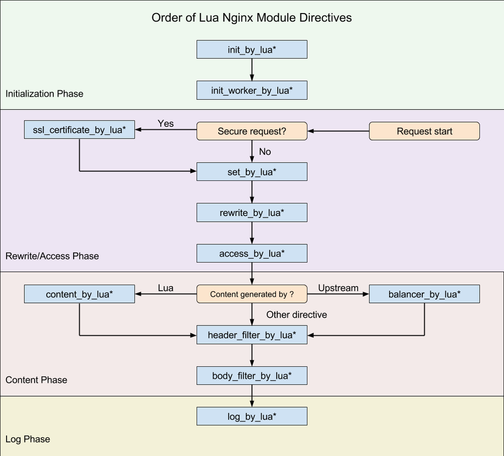
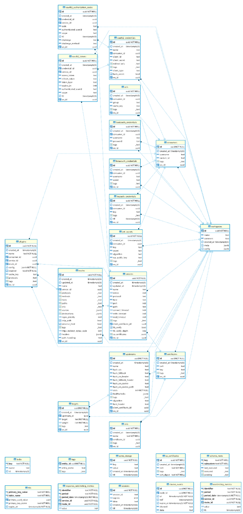

本文针对 Kong 的启动流程、插件机制、缓存机制和请求的生命周期做了详细的阐述。

## 1. 概述

本文针对的是 Kong 2.1 版本（Stable）。

我阅读并作出中文注释的 Commits 可以在这里看到：    
[https://github.com/mayocream/kong/commits?author=mayocream](https://github.com/mayocream/kong/commits?author=huanghan39)

**Kong（OpenResty）的执行阶段**：



Kong 的插件机制也是基于 OpenResty 的生命周期，只不过是其在上层做了些许封装。

**Kong 的数据库关联关系**：



[Kong](https://github.com/Kong/kong) 虽然介绍中说是 Cloud Native 项目，也上榜了 CNCF [全景图](https://landscape.cncf.io/)，但是它还依赖于传统的数据库 PostgreSQL，并且还自定义了许多 Function，相比于 APISIX 的分布式储存 Etcd 显得较为弱势。比起 Etcd 客户端能建立 HTTP 长连接 Watch 数据变化，Kong 只能依赖定时的轮询从数据库更新状态，数据库高可用也相比搭建 Etcd 集群要复杂得多。

## 2. 配置文件

Kong 在启动阶段会解析 [`kong/templates`](https://github.com/kong/kong/tree/master/kong/templates) 目录下的 `.lua` 模板文件，注入环境变量和 `kong.conf` 覆盖配置，生成 Nginx 启动的配置文件 `nginx.conf`。

结构如下：

```yaml
pid pids/nginx.pid;
error_log logs/error.log notice;

# injected nginx_main_* directives

env SKYWALKING_URL;

events {
    # injected nginx_events_* directives
    multi_accept on;
    worker_connections 16384;
}

http {
    lua_package_path       './?.lua;./?/init.lua;;;;';
    lua_package_cpath      ';;;';

    lua_shared_dict kong                        5m;
    lua_shared_dict kong_locks                  8m;
	...

    # injected nginx_http_* directives
    client_body_buffer_size 8k;

    init_by_lua_block {
        Kong = require 'kong'
        Kong.init()
    }

    init_worker_by_lua_block {
        Kong.init_worker()
    }

    upstream kong_upstream {
        server 0.0.0.1;

        # injected nginx_upstream_* directives
        
        balancer_by_lua_block {
            Kong.balancer()
        }
    }

	# Kong Proxy
    server {
        server_name kong;
		...
    }

	# Kong Admin API
    server {
        server_name kong_admin;
        ...
    }


}
```
Kong 定义了 `NGINX_MAIN_XXX`，诸如此类的环境变量，在解析配置阶段会加载到 `nginx.conf` 的指定位置，能够避免直接修改模板文件。

例如：

```bash
# 在 main 块里定义 env 变量
$ export NGINX_MAIN_ENV SKYWALKING_URL;
# 创建新的 lua shared dict
$ export NGINX_HTTP_Lua_SHARED_DICT tracing_buffer 128m;
```

Kong [官方的配置文档](https://docs.konghq.com/2.1.x/configuration/)已经非常详尽，解释了各个参数代表的含义。

这里补充一点，通常我们需要定义多个 Shared dict，配置写法需要改成这种形式：
```
nginx_http_lua_shared_dict = cache_buffer_one 128m; lua_shared_dict cache_buffer_two 128m
```

## 3. 初始化

### 3.1. 数据库初始化

`Kong.init()` 方法中初始化数据库相关：

```lua
  -- 数据库连接相关
  local db = assert(DB.new(config))
  assert(db:init_connector())
  kong.db = db
```

`DB.new()` 方法中依次调用了 `Schema.new()`、`Entity.new()`、`DAO.new()` 方法，下面一个个来说明。

#### 3.1.1. Schema

Kong 的 Schema 数据结构体位于 `db/schema/entities` 下，就 `routes.lua` 为例：

```lua
local typedefs = require "kong.db.schema.typedefs"


return {
  name         = "routes",
  primary_key  = { "id" },
  endpoint_key = "name",
  workspaceable = true,
  subschema_key = "protocols",

  fields = {
    { id             = typedefs.uuid, },
    { created_at     = typedefs.auto_timestamp_s },
    { updated_at     = typedefs.auto_timestamp_s },
    { name           = typedefs.name },
    { protocols      = { type     = "set",
                         len_min  = 1,
                         required = true,
                         elements = typedefs.protocol,
                         mutually_exclusive_subsets = {
                           { "http", "https" },
                           { "tcp", "tls" },
                           { "grpc", "grpcs" },
                         },
                         default = { "http", "https" }, -- TODO: different default depending on service's scheme
                       }, },
    { methods        = typedefs.methods },
    { hosts          = typedefs.hosts },
    { paths          = typedefs.paths },
    { headers        = typedefs.headers },
    { https_redirect_status_code = { type = "integer",
                                     one_of = { 426, 301, 302, 307, 308 },
                                     default = 426, required = true,
                                   }, },
    { regex_priority = { type = "integer", default = 0 }, },
    { strip_path     = { type = "boolean", default = true }, },
    { path_handling  = { type = "string", default = "v0", one_of = { "v0", "v1" }, }, },
    { preserve_host  = { type = "boolean", default = false }, },
    { snis = { type = "set",
               elements = typedefs.sni }, },
    { sources = typedefs.sources },
    { destinations = typedefs.destinations },
    { tags             = typedefs.tags },
    { service = { type = "foreign", reference = "services" }, },
  },

  entity_checks = {
    { conditional = { if_field = "protocols",
                      if_match = { elements = { type = "string", not_one_of = { "grpcs", "https", "tls" }}},
                      then_field = "snis",
                      then_match = { len_eq = 0 },
                      then_err = "'snis' can only be set when 'protocols' is 'grpcs', 'https' or 'tls'",
                    }},
                  }
}

```

`primary_key` 是在数据库中主键也是当 `cache_key` 未定义时的默认 `cache_key`。

有 `type=foreign` 的情况，entity 加载时会当作 subschema 加载进来。

插件不同于其他 entity，有特定 cache_key。

```lua
  name = "plugins",
  primary_key = { "id" },
  cache_key = { "name", "route", "service", "consumer" },
```

Cache 相关操作中调用 `Entity.cache_key()` 获取。

```lua
    local cache_key = dao:cache_key(entity)
    local ok, err = cache:safe_set(cache_key, entity)
```

具体生成 `cache_key` 的方法，返回一个字符串作为缓存 key。

```lua
function DAO:cache_key(key, arg2, arg3, arg4, arg5, ws_id)

  if self.schema.workspaceable then
    ws_id = ws_id or workspaces.get_workspace_id()
  end

  -- Fast path: passing the cache_key/primary_key entries in
  -- order as arguments, this produces the same result as
  -- the generic code below, but building the cache key
  -- becomes a single string.format operation
  if type(key) == "string" then
    return fmt("%s:%s:%s:%s:%s:%s:%s", self.schema.name,
               key == nil and "" or key,
               arg2 == nil and "" or arg2,
               arg3 == nil and "" or arg3,
               arg4 == nil and "" or arg4,
               arg5 == nil and "" or arg5,
               ws_id == nil and "" or ws_id)
  end

  -- Generic path: build the cache key from the fields
  -- listed in cache_key or primary_key

  if type(key) ~= "table" then
    error("key must be a string or an entity table", 2)
  end

  if key.ws_id then
    ws_id = key.ws_id
  end

  local values = new_tab(7, 0)
  values[1] = self.schema.name
  local source = self.schema.cache_key or self.schema.primary_key

  local i = 2
  for _, name in ipairs(source) do
    local field = self.schema.fields[name]
    local value = key[name]
    if value == null or value == nil then
      value = ""
    elseif field.type == "foreign" then
      -- FIXME extract foreign key, do not assume `id`
      value = value.id
    end
    values[i] = tostring(value)
    i = i + 1
  end
  for n = i, 6 do
    values[n] = ""
  end

  values[7] = ws_id or ""

  return concat(values, ":")
end
```

`schema/init.lua` 中定义了 schema 相关操作的基本方法：

```lua
-- each_field() 用于遍历 schema 的 fields
-- 是 schema 相关操作最频繁的
function Schema:each_field(values)
  local i = 1

  local subschema
  if values then
    subschema = get_subschema(self, values)
  end

  return function()
    local item = self.fields[i]
    if not item then
      return nil
    end
    local key = next(item)
    local field = resolve_field(self, key, item[key], subschema)
    i = i + 1
    return key, field
  end
end
```
`Schema.new()` 方法中通过元组设置 `__index` 让结构体继承 Schema 下定义的一系列操作方法。
```lua
function Schema.new(definition, is_subschema)
  if not definition then
    return nil, validation_errors.SCHEMA_NO_DEFINITION
  end

  if not definition.fields then
    return nil, validation_errors.SCHEMA_NO_FIELDS
  end

  local self = copy(definition)

  -- 继承 Schema 下定义的一系列操作方法
  setmetatable(self, Schema)

  -- entity 缓存的 cache_key，
  -- 如果没有这个字段，则默认使用 schema 定义的
  -- primary_key 来作为 cache_key
  -- cache_key 是个数组，
  -- 这里只是分开储存
  if self.cache_key then
    self.cache_key_set = {}
    for _, name in ipairs(self.cache_key) do
      self.cache_key_set[name] = true
    end
  end


  -- 通过元组 __index 方法调用 Schema:each_field() 方法
  -- 遍历 schema 的 fields table
  for key, field in self:each_field() do
    -- Also give access to fields by name
    self.fields[key] = field
    if field.type == "record" and field.fields then
      allow_record_fields_by_name(field)
    end

    -- 如果有外键
    -- 则加载外键关联的 schema 进来
    if field.type == "foreign" then
      local err
      field.schema, err = get_foreign_schema_for_field(field)
      if not field.schema then
        return nil, err
      end

      if not is_subschema then
        -- Store the inverse relation for implementing constraints
        local constraints = assert(_cache[field.reference]).constraints
        table.insert(constraints, {
          schema     = self,
          field_name = key,
          on_delete  = field.on_delete,
        })
      end
    end
  end

  if self.workspaceable and self.name then
    if not _workspaceable[self.name] then
      _workspaceable[self.name] = true
      table.insert(_workspaceable, { schema = self })
    end
  end

  if self.name then
    -- do not reset the constraints list if a schema in reloaded
    if not _cache[self.name] then
      _cache[self.name] = {
        constraints = {},
      }
    end
    -- but always update the schema object in cache
    _cache[self.name].schema = self
  end

  return self
end
```
用于下级继承的元组。
```lua
local Schema       = {}
Schema.__index     = Schema
```

#### 3.1.2. Entity

Entity 只是简单对 Schema 进行一层封装。

```lua
-- definition 是 schema 结构体
function Entity.new(definition)

  -- 初始化 Schema 对象
  local self, err = Schema.new(definition)
  if not self then
    return nil, err
  end

  -- 遍历 schema fields
  for name, field in self:each_field() do
    if field.nilable then
      return nil, entity_errors.NO_NILABLE:format(name)
    end

    if field.abstract then
      goto continue
    end

    if field.type == "map" then
      if field.keys.type ~= "string" then
        return nil, entity_errors.MAP_KEY_STRINGS_ONLY:format(name)
      end

    elseif field.type == "record" then
      make_records_required(field)

    elseif field.type == "function" then
      return nil, entity_errors.NO_FUNCTIONS:format(name)
    end

    ::continue::
  end

  self.new_subschema = Entity.new_subschema

  return self
end

```

Entity 对象随后被加载到 `DB.new()` 函数中：

```lua
local schemas = {}

do
  -- load schemas
  -- core entities are for now the only source of schemas.
  -- TODO: support schemas from plugins entities as well.

  -- 载入核心 entity，为什么是核心 entity
  -- 因为还有 plugin 自定义的 entity
  -- 这些 entity 是 Kong 自身的
  for _, entity_name in ipairs(constants.CORE_ENTITIES) do

    -- 加载 schema（数据结构体）
    local entity_schema = require("kong.db.schema.entities." .. entity_name)

    -- validate core entities schema via metaschema
    local ok, err_t = MetaSchema:validate(entity_schema)
    if not ok then
      return nil, fmt("schema of entity '%s' is invalid: %s", entity_name,
                      tostring(errors:schema_violation(err_t)))
    end

    -- 加载 entity 对象
    local entity, err = Entity.new(entity_schema)
    if not entity then
      return nil, fmt("schema of entity '%s' is invalid: %s", entity_name,
                      err)
    end
    schemas[entity_name] = entity

    -- load core entities subschemas
    local subschemas
    ok, subschemas = utils.load_module_if_exists("kong.db.schema.entities." .. entity_name .. "_subschemas")
    if ok then
      for name, subschema in pairs(subschemas) do
        local ok, err = entity:new_subschema(name, subschema)
        if not ok then
          return nil, ("error initializing schema for %s: %s"):format(entity_name, err)
        end
      end
    end
  end
end
```

#### 3.1.3. DAO

`db/dao/init.lua` 中定义了一系列对数据库操作的方法，例如：

```lua
function DAO:select(primary_key, options)
function DAO:page(size, offset, options)
function DAO:each(size, options)
function DAO:insert(entity, options)
function DAO:update(primary_key, entity, options)
function DAO:delete(primary_key, options)
...
```

`DAO.new()` 会创建一个包含 db 连接信息，entity 的 table。
```lua
-- schema 参数是 Entity 对象
--  DB 结构体：  local self   = {
  --    daos       = daos,       -- each of those has the connector singleton
  --    strategies = strategies,
  --    connector  = connector,
  --    strategy   = strategy,
  --    errors     = errors,
  --    infos      = connector:infos(),
  --    kong_config = kong_config,
  --  }
function _M.new(db, schema, strategy, errors)
  local fk_methods = generate_foreign_key_methods(schema)
  -- 继承 DAO 基础方法
  local super      = setmetatable(fk_methods, DAO)

  local self = {
    db         = db,
    schema     = schema,
    strategy   = strategy,
    errors     = errors,
    pagination = utils.shallow_copy(defaults.pagination),
    super      = super,
  }

  if schema.dao then
    -- 插件自定义的 dao
    local custom_dao = require(schema.dao)
    for name, method in pairs(custom_dao) do
      self[name] = method
    end
  end

  return setmetatable(self, { __index = super })
end
```

在 `db\init.lua` 中加载所有 DAO 对象。
```lua
  do
    -- load DAOs

    for _, schema in pairs(schemas) do
      local strategy = strategies[schema.name]
      if not strategy then
        return nil, fmt("no strategy found for schema '%s'", schema.name)
      end

      -- 储存 daos
      daos[schema.name] = DAO.new(self, schema, strategy, errors)
    end
  end
```
和上面结构一样，`DB.new()` 中最后为 table 设置元组 __index 方法。
```lua
  -- 设置元组 __index 方法
  -- 访问不存在的对象则先
  -- DB.xxx 再访问 DB.daos.xxx
  return setmetatable(self, DB)
  
  
local DB = {}
DB.__index = function(self, k)
  -- rawget 为不调用元组 __index 方法，直接获取原数据
  return DB[k] or rawget(self, "daos")[k]
end
```
Kong 中其他地方调用数据库方法，操作符为 `kong.db.services:each_fields()`，即实际调用 `daos.services`、`entity:each_fields()`（实际是 `Schema:each_fields()`）。

DAO 下面还有封装的数据库操作层，例如 PostgreSQL 生成 SQL 语句的方法，这里就不赘述了。

### 3.2. 缓存构建

`init_by_lua`  阶段初始化 Master 进程，进行解析配置文件、连接数据库、清空共享内存、构建路由缓存等操作。

`reset_kong_shm` 代码块里清理共享内存。

```lua
    local shms = {
      "kong",
      "kong_locks",
      "kong_healthchecks",
      "kong_process_events",
      "kong_cluster_events",
      "kong_rate_limiting_counters",
      "kong_core_db_cache" .. suffix,
      "kong_core_db_cache_miss" .. suffix,
      "kong_db_cache" .. suffix,
      "kong_db_cache_miss" .. suffix,
      "kong_clustering",
    }

    for _, shm in ipairs(shms) do
      local dict = ngx.shared[shm]
      -- 清空共享内存
      if dict then
        dict:flush_all()
        dict:flush_expired(0)
      end
    end
```
#### 3.2.1. 路由缓存

```lua
  else
    -- DB 模式
    local default_ws = db.workspaces:select_by_name("default")
    kong.default_workspace = default_ws and default_ws.id

    local ok, err = runloop.build_plugins_iterator("init")
    if not ok then
      error("error building initial plugins: " .. tostring(err))
    end

    -- 初始化路由
    -- 构建路由缓存
    assert(runloop.build_router("init"))
  end

  db:close()
end
```

DB 模式下最后一步会调用 `runloop.build_router("init")` 构建路由缓存。

构建路由缓存过程中，判断 Kong 是否已经初始化过 Cache 组件，`init` 阶段没有完成初始化 Cache，则创建一个 Lua table 缓存路由信息。`build_services_init_cache()` 方法会分页加载所有 Service 到 table 中，对取出来的 Services，判断当前使用的 Nginx 模式（http/stream）是否对应路由指定的协议，对应则取出 Service 对象，与 Route 进行关联。最后传递给 `Router.new()` 方法通过算法建立树形结构建立路由索引。

Kong 基于 Nginx Subsystem 支持的协议对应关系：

- http/https -> http
- grpc/grpcs -> http
- tcp/tls -> stream

```lua
  build_router = function(version)
    local db = kong.db
    -- table 储存所有的 route-service 数据
    local routes, i = {}, 0

    local err
    -- The router is initially created on init phase, where kong.core_cache is
    -- still not ready. For those cases, use a plain Lua table as a cache
    -- instead
    -- init 阶段 core_cache 还没有初始化完成
    -- 这里使用 table 储存
    local services_init_cache = {}
    if not kong.core_cache and db.strategy ~= "off" then
      -- 获取所有的 services，使用默认的分页参数
      services_init_cache, err = build_services_init_cache(db)
      if err then
        services_init_cache = {}
        log(WARN, "could not build services init cache: ", err)
      end
    end

    local counter = 0
    local page_size = db.routes.pagination.page_size
    for route, err in db.routes:each(nil, GLOBAL_QUERY_OPTS) do
      if err then
        return nil, "could not load routes: " .. err
      end

      -- 检查 router 数据是否已经变化
      -- 通过检查 router hash 是否一致判断
      -- 如果已经变化则退出函数
      if db.strategy ~= "off" then
        if kong.core_cache and counter > 0 and counter % page_size == 0 then
          local new_version, err = get_router_version()
          if err then
            return nil, "failed to retrieve router version: " .. err
          end

          if new_version ~= version then
            return nil, "router was changed while rebuilding it"
          end
        end
      end

      -- subsystem 是否支持当前路由的协议
      if should_process_route(route) then
        -- 获取 route 的 service
        local service, err = get_service_for_route(db, route, services_init_cache)
        if err then
          return nil, err
        end

        local r = {
          route   = route,
          service = service,
        }

        i = i + 1
        -- 储存所有的 route-service
        routes[i] = r
      end

      counter = counter + 1
    end

    local new_router, err = Router.new(routes)
    if not new_router then
      return nil, "could not create router: " .. err
    end

    -- router 实例
    router = new_router

    if version then
      router_version = version
    end

    -- LEGACY - singletons module is deprecated
    singletons.router = router
    -- /LEGACY

    return true
  end
```

构建路由缓存过程中，判断 Kong 是否已经初始化过 Cache 组件，`init` 阶段没有完成初始化 Cache，则创建一个 Lua table 缓存 services。

```lua
  -- 以 [service.id] = service
  -- 结构储存到 table 中
  local function build_services_init_cache(db)
    local services_init_cache = {}

    for service, err in db.services:each(nil, GLOBAL_QUERY_OPTS) do
      if err then
        return nil, err
      end

      services_init_cache[service.id] = service
    end

    return services_init_cache
  end
```

`build_services_init_cache(db)` 方法，调用 `DAO:each()` 函数，使用默认分页参数 `page_size=1000`，进行分页获取，再返回可迭代的单条记录。这里因为 `init_by_lua` 阶段没有初始化缓存（`kong.core_cache` ），所以使用 Lua table 储存缓存数据。

```lua
function DAO:each(size, options)
  if size ~= nil then
    validate_size_type(size)
  end

  -- 获取分页条件，有默认值
  options = get_pagination_options(self, options)

  if size ~= nil then
    local ok, err = validate_size_value(size, options.pagination.max_page_size)
    if not ok then
      local err_t = self.errors:invalid_size(err)
      return nil, tostring(err_t), err_t
    end

  else
    size = options.pagination.page_size
  end

  local ok, errors = validate_options_value(self, options)
  if not ok then
    local err_t = self.errors:invalid_options(errors)
    return nil, tostring(err_t), err_t
  end

  local pager = function(size, offset, options)
    return self.strategy:page(size, offset, options)
  end

  return iteration.by_row(self, pager, size, options)
end
```

默认分页参数在 `db/strategies/connector.lua` 文件中：

```lua
local Connector = {
  defaults = {
    -- 默认分页条件
    pagination = {
      page_size     = 1000,
      max_page_size = 50000,
    },
  },
}
```

接下来会遍历所有的 Routes，逐个调用 `should_process_route()` 和 `get_service_for_route()` 方法，前者会判断 Nginx Subsystem 是否和 Route 协议一致，后者先在缓存中查找 Service，如果缓存中不存在则从数据库中获取。

```lua
  local function get_service_for_route(db, route, services_init_cache)
    -- route 关联的 service 外键
    local service_pk = route.service
    if not service_pk then
      return nil
    end

    -- 查找缓存 table 里的 service
    local id = service_pk.id
    local service = services_init_cache[id]
    if service then
      return service
    end

    local err

    -- kong.core_cache is available, not in init phase
    if kong.core_cache then
      -- 通过 mlcache 查询 service
      local cache_key = db.services:cache_key(service_pk.id, nil, nil, nil, nil,
                                              route.ws_id)
      -- 查询 cache 获取，没有获取到则调用 load_service_from_db 获取
      service, err = kong.core_cache:get(cache_key, TTL_ZERO,
                                    load_service_from_db, service_pk)

    else -- init phase, kong.core_cache not available

      -- A new service/route has been inserted while the initial route
      -- was being created, on init (perhaps by a different Kong node).
      -- Load the service individually and update services_init_cache with it
      -- 直接查询数据库获取 service
      service, err = load_service_from_db(service_pk)
      services_init_cache[id] = service
    end

    if err then
      return nil, "error raised while finding service for route (" .. route.id .. "): " ..
                  err

    elseif not service then
      return nil, "could not find service for route (" .. route.id .. ")"
    end


    -- TODO: this should not be needed as the schema should check it already
    if SUBSYSTEMS[service.protocol] ~= subsystem then
      log(WARN, "service with protocol '", service.protocol,
                "' cannot be used with '", subsystem, "' subsystem")

      return nil
    end

    return service
  end

```

`load_service_from_db()` 方法中只是简单调用 `DAO:select()` 方法，取出 Service 同时缓存到 `services_init_cache` table 中，不更新 `Kong.core_cache` 组件。

对数据库实体对象的处理中，只有`create` 、`update`、`delete` 会通过事件广播到其他 Worker 同步，后面事件的一节我们会详细阐述。

接下来将 `{router, service}` 数组传入 `router.iua` 中 `Router.new()` 函数处理。

```lua
local new_router, err = Router.new(routes)
if not new_router then
    return nil, "could not create router: " .. err
end

-- 绑定 router 实例
router = new_router
```

具体构建路由索引的过程在 `router.lua` 中的 `_M.new(routes)` 函数，使用 **[lua-resty-lrucache](https://github.com/openresty/lua-resty-lrucache)** 包缓存，对路由和 Service 组合通过算法进行排序，构建索引，将诸如 `{cache_key: {route, service}}` 结构存入缓存中，返回 Router 实例。

路由索引 Key 的构建方法：

```lua
    local cache_key = req_method .. "|" .. req_uri .. "|" .. req_host ..
                      "|" .. ctx.src_ip .. "|" .. ctx.src_port ..
                      "|" .. ctx.dst_ip .. "|" .. ctx.dst_port ..
                      "|" .. ctx.sni
```

Router 实例由 Master 进程构建，并 fork 到各个 Worker 进程使用。

Worker 执行完共享内存的构建后，注册定时任务，定时重建缓存。

```lua
      -- 定时重建路由缓存
      if kong.db.strategy ~= "off" then
        timer_every(worker_state_update_frequency, function(premature)
          if premature then
            return
          end

          -- Don't wait for the semaphore (timeout = 0) when updating via the
          -- timer.
          -- If the semaphore is locked, that means that the rebuild is
          -- already ongoing.
          local ok, err = rebuild_router(ROUTER_ASYNC_OPTS)
          if not ok then
            log(ERR, "could not rebuild router via timer: ", err)
          end
        end)

        timer_every(worker_state_update_frequency, function(premature)
          if premature then
            return
          end

          local ok, err = rebuild_plugins_iterator(PLUGINS_ITERATOR_ASYNC_OPTS)
          if not ok then
            log(ERR, "could not rebuild plugins iterator via timer: ", err)
          end
        end)
      end
```

#### 3.2.2. Entity 缓存

这里首先介绍一下 **[lua-resty-mlcache](https://github.com/thibaultcha/lua-resty-mlcache)** 这个缓存库，该库基于 [lua_shared_dict](https://github.com/openresty/lua-nginx-module#lua_shared_dict) 和 [lua-resty-lrucache](https://github.com/openresty/lua-resty-lrucache) 做了两层缓存，Worker 会有自己的进程级别的 LRU 缓存，首先会在这一层进行查询，其次使用共享内存进行缓存，最后提供 callback 从数据库查询，使用 [lua-resty-lock](https://github.com/openresty/lua-resty-lock) 库创建锁只允许单个进程执行 callback。

mlcache 架构图：

```
┌─────────────────────────────────────────────────┐
│ Nginx                                           │
│       ┌───────────┐ ┌───────────┐ ┌───────────┐ │
│       │worker     │ │worker     │ │worker     │ │
│ L1    │           │ │           │ │           │ │
│       │ Lua cache │ │ Lua cache │ │ Lua cache │ │
│       └───────────┘ └───────────┘ └───────────┘ │
│             │             │             │       │
│             ▼             ▼             ▼       │
│       ┌───────────────────────────────────────┐ │
│       │                                       │ │
│ L2    │           lua_shared_dict             │ │
│       │                                       │ │
│       └───────────────────────────────────────┘ │
│                           │ mutex               │
│                           ▼                     │
│                  ┌──────────────────┐           │
│                  │     callback     │           │
│                  └────────┬─────────┘           │
└───────────────────────────┼─────────────────────┘
                            │
  L3                        │   I/O fetch
                            ▼

                   Database, API, DNS, Disk, any I/O...
```

`Kong.init_worker()` 中进行初始化缓存：

```lua
  -- 初始化基于共享内存的 cache
  local cache, err = kong_global.init_cache(kong.configuration, cluster_events, worker_events)
  if not cache then
    stash_init_worker_error("failed to instantiate 'kong.cache' module: " ..
                            err)
    return
  end
  kong.cache = cache

  local core_cache, err = kong_global.init_core_cache(kong.configuration, cluster_events, worker_events)
  if not core_cache then
    stash_init_worker_error("failed to instantiate 'kong.core_cache' module: " ..
                            err)
    return
  end
  kong.core_cache = core_cache

  ok, err = runloop.set_init_versions_in_cache()
  if not ok then
    stash_init_worker_error(err) -- 'err' fully formatted
    return
  end
```

`global.init_cache()` 结构如下：

```lua
function _GLOBAL.init_cache(kong_config, cluster_events, worker_events)
  local db_cache_ttl = kong_config.db_cache_ttl
  local db_cache_neg_ttl = kong_config.db_cache_neg_ttl
  local cache_pages = 1
  if kong_config.database == "off" then
    db_cache_ttl = 0
    db_cache_neg_ttl = 0
    cache_pages = 2
  end

  return kong_cache.new {
    shm_name          = "kong_db_cache",
    cluster_events    = cluster_events,
    worker_events     = worker_events,
    ttl               = db_cache_ttl,
    neg_ttl           = db_cache_neg_ttl or db_cache_ttl,
    resurrect_ttl     = kong_config.resurrect_ttl,
    cache_pages       = cache_pages,
    resty_lock_opts   = {
      exptime = 10,
      timeout = 5,
    },
  }
end
```

最终会调用 `cache.lua` 中 `_M.new()` 进行必要参数的验证，检测共享内存块是否可以访问，关联集群事件和 Worker 事件，定义序列化和反序列化的方法，对 mlcache 进行一层封装。

```lua
function _M.new(opts)
  -- opts validation

  opts = opts or {}

  local mlcaches = {}
  local shm_names = {}

  for i = 1, opts.cache_pages or 1 do
    local channel_name  = (i == 1) and "mlcache"                 or "mlcache_2"
    local shm_name      = (i == 1) and opts.shm_name             or opts.shm_name .. "_2"
    local shm_miss_name = (i == 1) and opts.shm_name .. "_miss"  or opts.shm_name .. "_miss_2"

    if ngx.shared[shm_name] then
      local mlcache, err = resty_mlcache.new(shm_name, shm_name, {
        shm_miss         = shm_miss_name,
        shm_locks        = "kong_locks",
        shm_set_retries  = 3,
        lru_size         = LRU_SIZE,
        ttl              = max(opts.ttl     or 3600, 0),
        neg_ttl          = max(opts.neg_ttl or 300,  0),
        resurrect_ttl    = opts.resurrect_ttl or 30,
        resty_lock_opts  = opts.resty_lock_opts,
        ipc = { -- 进程间通信的函数绑定
          register_listeners = function(events)
            for _, event_t in pairs(events) do
              opts.worker_events.register(function(data)
                event_t.handler(data)
              end, channel_name, event_t.channel)
            end
          end,
          broadcast = function(channel, data)
            local ok, err = opts.worker_events.post(channel_name, channel, data)
            if not ok then
              log(ERR, "failed to post event '", channel_name, "', '",
                       channel, "': ", err)
            end
          end
        }
      })
      if not mlcache then
        return nil, "failed to instantiate mlcache: " .. err
      end
      mlcaches[i] = mlcache
      shm_names[i] = shm_name
    end
  end

  local curr_mlcache = 1

  if opts.cache_pages == 2 then
    curr_mlcache = ngx.shared.kong:get("kong:cache:" .. opts.shm_name .. ":curr_mlcache") or 1
  end

  local self          = {
    cluster_events    = opts.cluster_events,
    mlcache           = mlcaches[curr_mlcache],
    mlcaches          = mlcaches,
    shm_names         = shm_names,
    curr_mlcache      = curr_mlcache,
  }

  local ok, err = self.cluster_events:subscribe("invalidations", function(key)
    log(DEBUG, "received invalidate event from cluster for key: '", key, "'")
    self:invalidate_local(key)
  end)
  if not ok then
    return nil, "failed to subscribe to invalidations cluster events " ..
                "channel: " .. err
  end

  _init[opts.shm_name] = true

  return setmetatable(self, mt)
end
```

初始化完缓存模块后，Worker 会根据配置文件中的 `db_cache_warmup_entities` 加载指定的数据库资源到内存进行缓存，默认配置会缓存 `services, plugins`。

`LRU_SIZE` 值为 500,000，单位是 item，设置最大能储存的 item 数量，这个值表示单个 Worker LRU Cache 最大占用 500M 内存。

Worker 会根据配置项加载数据库实体到共享内存缓存。

```lua
local function execute_cache_warmup(kong_config)
  if kong_config.database == "off" then
    return true
  end

  -- 只在一个 worker 上执行操作
  -- 加载数据库实体到共享内存缓存
  if ngx.worker.id() == 0 then
    local ok, err = cache_warmup.execute(kong_config.db_cache_warmup_entities)
    if not ok then
      return nil, err
    end
  end

  return true
end
```
这里只在一个 Worker 进程上加载数据库数据，随后同步到其他的 Worker 上。

`cache_warmup.execute()` 里做基本信息的检测，随后调用 `cache_warmup_single_entity(dao)` 方法。

```lua
-- 加载数据库实体到缓存，以实现更快的访问速度
-- 在 Worker 初始化阶段运行
-- 默认加载 service, plugins
-- 大小受配置 mem_cache_size 影响
-- Loads entities from the database into the cache, for rapid subsequent
-- access. This function is intented to be used during worker initialization.
function cache_warmup.execute(entities)
  if not kong.cache or not kong.core_cache then
    return true
  end

  for _, entity_name in ipairs(entities) do
    if entity_name == "routes" then
      -- do not spend shm memory by caching individual Routes entries
      -- because the routes are kept in-memory by building the router object
      kong.log.notice("the 'routes' entry is ignored in the list of ",
                      "'db_cache_warmup_entities' because Kong ",
                      "caches routes in memory separately")
      goto continue
    end

    local dao = kong.db[entity_name]
    if not (type(dao) == "table" and dao.schema) then
      kong.log.warn(entity_name, " is not a valid entity name, please check ",
                    "the value of 'db_cache_warmup_entities'")
      goto continue
    end

    local ok, err = cache_warmup_single_entity(dao)
    if not ok then
      if err == "no memory" then
        kong.log.warn("cache warmup has been stopped because cache ",
                      "memory is exhausted, please consider increasing ",
                      "the value of 'mem_cache_size' (currently at ",
                      kong.configuration.mem_cache_size, ")")

        return true
      end
      return nil, err
    end

    ::continue::
  end

  return true
end
```

不缓存 Routes，因为 Route 已经在上一节中构建为路由索引树，通过 fork 到所有的 Worker 内存里了。

```lua
local function cache_warmup_single_entity(dao)
  local entity_name = dao.schema.name

  -- 选定储存地方 cache/core_cache
  local cache_store = constants.ENTITY_CACHE_STORE[entity_name]
  -- cache 全局对象
  local cache = kong[cache_store]

  ngx.log(ngx.NOTICE, "Preloading '", entity_name, "' into the ", cache_store, "...")

  local start = ngx.now()

  local hosts_array, hosts_set, host_count
  if entity_name == "services" then
    hosts_array = {}
    hosts_set = {}
    host_count = 0
  end

  for entity, err in dao:each(nil, GLOBAL_QUERY_OPTS) do
    if err then
      return nil, err
    end

    if entity_name == "services" then
      if utils.hostname_type(entity.host) == "name"
         and hosts_set[entity.host] == nil then
        host_count = host_count + 1
        hosts_array[host_count] = entity.host
        hosts_set[entity.host] = true
      end
    end

    -- 获取 cache_key
    local cache_key = dao:cache_key(entity)

    -- 调用 mlcache 的 safe_set 方法，
    -- 内存不足会报错
    local ok, err = cache:safe_set(cache_key, entity)
    if not ok then
      return nil, err
    end
  end

  if entity_name == "services" and host_count > 0 then
    ngx.timer.at(0, warmup_dns, hosts_array, host_count)
  end

  local elapsed = math.floor((ngx.now() - start) * 1000)

  ngx.log(ngx.NOTICE, "finished preloading '", entity_name,
                      "' into the ", cache_store, " (in ", tostring(elapsed), "ms)")
  return true
end
```

`cache_warmup_single_entity()` 会加载该 dao 所有的数据到内存中，`set` 方法会分发事件同步数据到其他的 Worker 上，最终每个 Worker 都会缓存一份。

### 3.3. 事件订阅

`Kong.init_worker()` 中初始化 Worker 事件和集群事件。

```lua
  local worker_events, err = kong_global.init_worker_events()
  if not worker_events then
    stash_init_worker_error("failed to instantiate 'kong.worker_events' " ..
                            "module: " .. err)
    return
  end
  kong.worker_events = worker_events

  local cluster_events, err = kong_global.init_cluster_events(kong.configuration, kong.db)
  if not cluster_events then
    stash_init_worker_error("failed to instantiate 'kong.cluster_events' " ..
                            "module: " .. err)
    return
  end
  kong.cluster_events = cluster_events
```

Worker 事件内部是使用 **[lua-resty-worker-events](https://github.com/Kong/lua-resty-worker-events)** 库实现的进程间事件处理，原理是通过共享内存储存事件，每秒拉取共享内存中的事件，进行处理。

```lua
function _GLOBAL.init_worker_events()
  -- Note: worker_events will not work correctly if required at the top of the file.
  --       It must be required right here, inside the init function
  local worker_events = require "resty.worker.events"

  local ok, err = worker_events.configure {
    shm = "kong_process_events", -- defined by "lua_shared_dict"
    timeout = 5,            -- life time of event data in shm
    interval = 1,           -- poll interval (seconds)

    wait_interval = 0.010,  -- wait before retry fetching event data
    wait_max = 0.5,         -- max wait time before discarding event
  }
  if not ok then
    return nil, err
  end

  return worker_events
end
```

集群事件（多个 Kong 之间的通信）是通过将事件储存在数据库中，定时轮询数据库查询事件，进行处理。

```lua
function _GLOBAL.init_cluster_events(kong_config, db)
  return kong_cluster_events.new({
    db            = db,
    poll_interval = kong_config.db_update_frequency,
    poll_offset   = kong_config.db_update_propagation,
    poll_delay    = kong_config.db_update_propagation,
  })
end
```

从这里可以看到集群事件是通过数据库表实现的：

```lua
function _M:broadcast(channel, data, delay)
  if type(channel) ~= "string" then
    return nil, "channel must be a string"
  end

  if type(data) ~= "string" then
    return nil, "data must be a string"
  end

  if delay and type(delay) ~= "number" then
    return nil, "delay must be a number"

  elseif self.poll_delay > 0 then
    delay = self.poll_delay
  end

  -- insert event row

  --log(DEBUG, "broadcasting on channel: '", channel, "' data: ", data,
  --           " with delay: ", delay and delay or "none")

  local ok, err = self.strategy:insert(self.node_id, channel, nil, data, delay)
  if not ok then
    return nil, err
  end

  return true
end


function _M:subscribe(channel, cb, start_polling)
  if type(channel) ~= "string" then
    return error("channel must be a string")
  end

  if type(cb) ~= "function" then
    return error("callback must be a function")
  end

  if not self.callbacks[channel] then
    self.callbacks[channel] = { cb }

    insert(self.channels, channel)

  else
    insert(self.callbacks[channel], cb)
  end

  if start_polling == nil then
    start_polling = true
  end

  if not self.polling and start_polling and self.use_polling then
    -- start recurring polling timer

    local ok, err = timer_at(self.poll_interval, poll_handler, self)
    if not ok then
      return nil, "failed to start polling timer: " .. err
    end

    self.polling = true
  end

  return true
end
```

在 `cache.lua` 中集群事件订阅 cache 失效事件，内部调用 mlcache 的 delete 方法，同步到所有的 Worker 上。

```lua
  local ok, err = self.cluster_events:subscribe("invalidations", function(key)
    log(DEBUG, "received invalidate event from cluster for key: '", key, "'")
    self:invalidate_local(key)
  end)


function _M:invalidate_local(key, shadow)
  if type(key) ~= "string" then
    error("key must be a string", 2)
  end

  log(DEBUG, "invalidating (local): '", key, "'")

  local current_page = self.curr_mlcache or 1
  local delete_page
  if shadow and #self.mlcaches == 2 then
    delete_page = current_page == 1 and 2 or 1
  else
    delete_page = current_page
  end

  local ok, err = self.mlcaches[delete_page]:delete(key)
  if not ok then
    log(ERR, "failed to delete entity from node cache: ", err)
  end
end
```

这部分主要描述 Kong 初始化过程中的事件相关操作，主要是初始化事件订阅，关联到 mlcache 的 IPC 进程间通信，订阅 cache 的失效事件，并关联 DAO 的事件发布。

```lua
function DB:set_events_handler(events)
  for _, dao in pairs(self.daos) do
    dao.events = events
  end
end
```

## 4. 事件分发

Kong 中众多部分通过非阻塞的 `ngx.timer.at()` 和 `ngx.timer.every()` 函数执行定时任务。这一部分较为分散，主要叙述 Kong 执行非阻塞一次性事件处理，和典型的定时任务。

### 4.1. 单次任务

#### 4.1.1. DNS 解析

在 `cache_warmup.lua` 中缓存 services 对象时，Kong 会非阻塞地获取 services 中 host 对应的 IP。

```lua
  if entity_name == "services" and host_count > 0 then
    ngx.timer.at(0, warmup_dns, hosts_array, host_count)
  end

local function warmup_dns(premature, hosts, count)
  if premature then
    return
  end

  ngx.log(ngx.NOTICE, "warming up DNS entries ...")

  local start = ngx.now()

  for i = 1, count do
    kong.dns.toip(hosts[i])
  end

  local elapsed = math.floor((ngx.now() - start) * 1000)

  ngx.log(ngx.NOTICE, "finished warming up DNS entries",
                      "' into the cache (in ", tostring(elapsed), "ms)")
end
```

Kong 内部 dns 模块使用 **[lua-resty-dns-client](https://github.com/Kong/lua-resty-dns-client)**，这个库也是由 Kong 开源的，`toip` 函数会根据 DNS 返回 ip 的权重配置加权轮询的权重，储存 DNS 查询的结果在内存中。

`warmup_dns()` 内调用 `kong.dns.toip()` 方法：

```lua
local function warmup_dns(premature, hosts, count)
  if premature then
    return
  end

  ngx.log(ngx.NOTICE, "warming up DNS entries ...")

  local start = ngx.now()

  for i = 1, count do
    kong.dns.toip(hosts[i])
  end

  local elapsed = math.floor((ngx.now() - start) * 1000)

  ngx.log(ngx.NOTICE, "finished warming up DNS entries",
                      "' into the cache (in ", tostring(elapsed), "ms)")
end
```


### 4.2. 定时任务

#### 4.2.1. 集群任务

`cluster_events/init.lua` 中集群事情订阅函数里启用定时器轮询数据库集群事件表。

```lua
function _M:subscribe(channel, cb, start_polling)
  if type(channel) ~= "string" then
    return error("channel must be a string")
  end

  if type(cb) ~= "function" then
    return error("callback must be a function")
  end

  if not self.callbacks[channel] then
    self.callbacks[channel] = { cb }

    insert(self.channels, channel)

  else
    insert(self.callbacks[channel], cb)
  end

  if start_polling == nil then
    start_polling = true
  end

  if not self.polling and start_polling and self.use_polling then
    -- start recurring polling timer

    local ok, err = timer_at(self.poll_interval, poll_handler, self)
    if not ok then
      return nil, "failed to start polling timer: " .. err
    end

    self.polling = true
  end

  return true
end
```

这里因为要在每次循环调用时进行锁的判断，所以没有使用 `ngx.timer.every()` 函数，而是循环调用 `ngx.timer.at()`。

```lua
poll_handler = function(premature, self)
  if premature or not self.polling then
    -- set self.polling to false to stop a polling loop
    return
  end

  if not get_lock(self) then
    local ok, err = timer_at(self.poll_interval, poll_handler, self)
    if not ok then
      log(CRIT, "failed to start recurring polling timer: ", err)
    end

    return
  end

  -- single worker

  local pok, perr, err = pcall(poll, self)
  if not pok then
    log(ERR, "poll() threw an error: ", perr)

  elseif not perr then
    log(ERR, "failed to poll: ", err)
  end

  -- unlock

  self.shm:delete(POLL_RUNNING_LOCK_KEY)

  local ok, err = timer_at(self.poll_interval, poll_handler, self)
  if not ok then
    log(CRIT, "failed to start recurring polling timer: ", err)
  end
end
```

锁通过共享内存事件，保证只有一个 Worker 执行单次任务。

```lua
local function get_lock(self)
  -- check if a poll is not currently running, to ensure we don't start
  -- another poll while a worker is still stuck in its own polling (in
  -- case it is being slow)
  -- we still add an exptime to this lock in case something goes horribly
  -- wrong, to ensure other workers can poll new events
  -- a poll cannot take more than max(poll_interval * 5, 10) -- 10s min
  local ok, err = self.shm:safe_add(POLL_RUNNING_LOCK_KEY, true,
                                    max(self.poll_interval * 5, 10))
  if not ok then
    if err ~= "exists" then
      log(ERR, "failed to acquire poll_running lock: ", err)
    end
    -- else
    --   log(DEBUG, "failed to acquire poll_running lock: ",
    --              "a worker still holds the lock")

    return false
  end

  if self.poll_interval > 0.001 then
    -- check if interval of `poll_interval` has elapsed already, to ensure
    -- we do not run the poll when a previous poll was quickly executed, but
    -- another worker got the timer trigger a bit too late.
    ok, err = self.shm:safe_add(POLL_INTERVAL_LOCK_KEY, true,
                                self.poll_interval - 0.001)
    if not ok then
      if err ~= "exists" then
        log(ERR, "failed to acquire poll_interval lock: ", err)
      end
      -- else
      --   log(DEBUG, "failed to acquire poll_interval lock: ",
      --              "not enough time elapsed since last poll")

      self.shm:delete(POLL_RUNNING_LOCK_KEY)

      return false
    end
  end

  return true
end
```

#### 4.2.2. 数据库 TTL

为给 PostgreSQL 加上 TTL，Kong 在 `init_worker` 阶段调用数据库层 `db/strategies/postgres/connector.lua` 中 `init_worker()` 函数。

```lua
-- 以下省略部分内容，只展示关键部分
function _mt:init_worker(strategies)
  if ngx.worker.id() == 0 then

      cleanup_statements[i] = concat {
        "  DELETE FROM ",
        self:escape_identifier(table_name),
        " WHERE ",
        column_name,
        " < CURRENT_TIMESTAMP AT TIME ZONE 'UTC';"
      }

    local cleanup_statement = concat(cleanup_statements, "\n")

    return timer_every(60, function(premature)

      local ok, err, _, num_queries = self:query(cleanup_statement)
      if not ok then
        if num_queries then
          for i = num_queries + 1, cleanup_statements_count do
            local statement = cleanup_statements[i]
            local ok, err = self:query(statement)
            if not ok then
              if err then
                log(WARN, "unable to clean expired rows from table '",
                          sorted_strategies[i], "' on PostgreSQL database (",
                          err, ")")
              else
                log(WARN, "unable to clean expired rows from table '",
                          sorted_strategies[i], "' on PostgreSQL database")
              end
            end
          end

        else
          log(ERR, "unable to clean expired rows from PostgreSQL database (", err, ")")
        end
      end
    end)
  end

  return true
end
```

数据库初始化时新增一个 `timer`，在协程中调用回调函数，删除 TTL 过期的 rows。

#### 4.2.3. 更新路由索引

`kong.init_worker()` 会添加定时任务，定时更新缓存。

```lua
      -- 定时重建路由缓存
      if kong.db.strategy ~= "off" then
        timer_every(worker_state_update_frequency, function(premature)
          if premature then
            return
          end

          -- Don't wait for the semaphore (timeout = 0) when updating via the
          -- timer.
          -- If the semaphore is locked, that means that the rebuild is
          -- already ongoing.
          local ok, err = rebuild_router(ROUTER_ASYNC_OPTS)
          if not ok then
            log(ERR, "could not rebuild router via timer: ", err)
          end
        end)

        timer_every(worker_state_update_frequency, function(premature)
          if premature then
            return
          end

          local ok, err = rebuild_plugins_iterator(PLUGINS_ITERATOR_ASYNC_OPTS)
          if not ok then
            log(ERR, "could not rebuild plugins iterator via timer: ", err)
          end
        end)
      end
```

实际调用顺序是开一个 cosocket 协程，判断 routes 是否有变化，变化则重构路由缓存。

```lua
  rebuild_router = function(opts)
    return rebuild("router", update_router, router_version, opts)
  end

local function rebuild(name, callback, version, opts)
  local current_version, err = kong.core_cache:get(name .. ":version", TTL_ZERO,
                                                   utils.uuid)
  if err then
    return nil, "failed to retrieve " .. name .. " version: " .. err
  end

  if current_version == version then
    return true
  end
	
  -- 开一个 cosocket 协程调用 callback
  return concurrency.with_coroutine_mutex(opts, callback)
end

  update_router = function()
    -- we might not need to rebuild the router (if we were not
    -- the first request in this process to enter this code path)
    -- check again and rebuild only if necessary
    local version, err = get_router_version()
    if err then
      return nil, "failed to retrieve router version: " .. err
    end

    if version == router_version then
      return true
    end

    local ok, err = build_router(version)
    if not ok then
      return nil, --[[ 'err' fully formatted ]] err
    end

    return true
  end
```

最终还会调用到 `build_router()` 方法，我们已经在 1.2.1 中描述过。

## 5. 事件处理

Worker 间的事件处理使用 `lua-resty-worker-events` 库。

事件订阅函数：`events.register(callback, source, event1, event2, ...)`，callback 方法 `callback = function(data, event, source, pid)`。

事件发布函数：`success, err = events.post(source, event, data, unique)`

### 5.1. 数据库事件

`db/dao/init.lua` 中定义了 DAO 相关的操作方法，我已经在 1.1.3 中简单阐述过了。

数据库相关实体的 CRUD 事件最后会调用 `DAO:post_crud_event()` 方法广播事件。

```lua
function DAO:post_crud_event(operation, entity, old_entity, options)
  if options and options.no_broadcast_crud_event then
    return
  end

  if self.events then
    local entity_without_nulls
    if entity then
      entity_without_nulls = remove_nulls(utils.deep_copy(entity, false))
    end

    local old_entity_without_nulls
    if old_entity then
      old_entity_without_nulls = remove_nulls(utils.deep_copy(old_entity, false))
    end

    local ok, err = self.events.post_local("dao:crud", operation, {
      operation  = operation,
      schema     = self.schema,
      entity     = entity_without_nulls,
      old_entity = old_entity_without_nulls,
    })
    if not ok then
      log(ERR, "[db] failed to propagate CRUD operation: ", err)
    end
  end
end
```

在 `dao:crud` 通道发布了一个事件，operation 类型有 create、update、delete。

`runloop/handler.lua` 中 `register_events()` 会在 `kong.init_worker()` 中被调用，此时会订阅数据库相关事件，添加处理函数。

```lua
  worker_events.register(function(data)
    if not data.schema then
      log(ERR, "[events] missing schema in crud subscriber")
      return
    end

    if not data.entity then
      log(ERR, "[events] missing entity in crud subscriber")
      return
    end

    -- invalidate this entity anywhere it is cached if it has a
    -- caching key
    -- 如果 entity 有 cache_key 则让它失效
    -- 基本上也只有 entity schema 定义出错的情况下才不会有 cache_key

    local cache_key = db[data.schema.name]:cache_key(data.entity)
    local cache_obj = kong[constants.ENTITY_CACHE_STORE[data.schema.name]]

    if cache_key then
      cache_obj:invalidate(cache_key)
    end

    -- if we had an update, but the cache key was part of what was updated,
    -- we need to invalidate the previous entity as well

    if data.old_entity then
      local old_cache_key = db[data.schema.name]:cache_key(data.old_entity)
      if old_cache_key and cache_key ~= old_cache_key then
        cache_obj:invalidate(old_cache_key)
      end
    end

    if not data.operation then
      log(ERR, "[events] missing operation in crud subscriber")
      return
    end

    -- public worker events propagation

    -- 获取 schema 名字
    local entity_channel           = data.schema.table or data.schema.name
    local entity_operation_channel = fmt("%s:%s", entity_channel,
      data.operation)

    -- crud:routes
    local ok, err = worker_events.post_local("crud", entity_channel, data)
    if not ok then
      log(ERR, "[events] could not broadcast crud event: ", err)
      return
    end

    -- crud:routes:create
    ok, err = worker_events.post_local("crud", entity_operation_channel, data)
    if not ok then
      log(ERR, "[events] could not broadcast crud event: ", err)
      return
    end
  end, "dao:crud")
```

CRUD 事件处理流程：调用 `cache:invalidate()` 方法，方法内部发布了一个 worker 级事件，通知 worker 进程删除该数据，还会发布一个集群事件，在集群间同步删除数据。

```lua
  -- 修改了 Routes 后会清空 router:version 缓存，
  -- 会导致重新构建路由表，详情查看 2.2.3
  worker_events.register(function()
    log(DEBUG, "[events] Route updated, invalidating router")
    core_cache:invalidate("router:version")
  end, "crud", "routes")

...其他对象同理
```

## 6. 插件加载

### 6.1. 插件读取

`init` 阶段会加载配置文件中 `plugins=bundled,skywalking-intergrator` 的插件列表，调用 Lua `require` 加载对应的包。（所有的插件包都要求在 `kong.plugins` 下）

```lua
function Plugins:load_plugin_schemas(plugin_set)
  self.handlers = nil

  local go_plugins_cnt = 0
  local handlers = {}
  local errs

  -- load installed plugins
  for plugin in pairs(plugin_set) do
    local handler, err = load_plugin(self, plugin)

    if handler then
      if type(handler.is) == "function" and handler:is(BasePlugin) then
        -- Backwards-compatibility for 0.x and 1.x plugins inheriting from the
        -- BasePlugin class.
        -- TODO: deprecate & remove
        handler = handler()
      end

      if handler._go then
        go_plugins_cnt = go_plugins_cnt + 1
      end

      handlers[plugin] = handler

    else
      errs = errs or {}
      table.insert(errs, "on plugin '" .. plugin .. "': " .. tostring(err))
    end
  end

  if errs then
    return nil, "error loading plugin schemas: " .. table.concat(errs, "; ")
  end

  reports.add_immutable_value("go_plugins_cnt", go_plugins_cnt)

  self.handlers = handlers

  return true
end
```

所有插件的 Handler 函数会被储存在 `kong.db.plugins.handlers`，数据格式为 `{plugin_name: handler}`。

所有的插件会储存到 Worker 进程上，周期性进行同步更新。

我整理了插件表加载到 Lua table 的结构，输出成 YAML，方便理解：

```yaml
map:
  plugin_name: true

combos:
  plugin_name:
    # both: {}
    both: 
      route_id: service_id
    # routes: {}
    routes:
      route_id: true
    # services: {}
    services:
      service_id: true
    0: true # 全局插件
    1: true # 路由插件
    2: true # Service 插件
    3: true # 路由+Service
    4: true # Consumer 插件
    5: true # 路由+Consumer 插件
    6: true # 路由+Service+Consumer 插件

loaded:
  plugin_name:
    handler:
      phase_name: func()
```

### 6.2. 插件调用

插件不直接和路由进行绑定，插件有自己的生命周期，和 Kong 的生命周期基本相同。在 Kong 生命周期的各个阶段会调用插件的对应方法。

插件只在调用阶段进行判断，是否关联当前 Route、Service、和 Consumer，有则从数据库读取插件关联的配置项（插件 Entity），并使用 `kong.core_cache` 进行缓存。

```lua
local function load_configuration_through_combos(ctx, combos, plugin)
  local plugin_configuration
  local name = plugin.name

  local route    = ctx.route
  local service  = ctx.service
  local consumer = ctx.authenticated_consumer

  if route and plugin.no_route then
    route = nil
  end
  if service and plugin.no_service then
    service = nil
  end
  if consumer and plugin.no_consumer then
    consumer = nil
  end

  local    route_id = route    and    route.id or nil
  local  service_id = service  and  service.id or nil
  local consumer_id = consumer and consumer.id or nil

  if kong.db.strategy == "off" then
	...
  else
    if route_id and service_id and consumer_id and combos[COMBO_RSC]
      and combos.both[route_id] == service_id
    then
      plugin_configuration = load_configuration(ctx, name, route_id, service_id,
                                                consumer_id)
      if plugin_configuration then
        return plugin_configuration
      end
    end

    if consumer_id and combos[COMBO_C] then
      plugin_configuration = load_configuration(ctx, name, nil, nil, consumer_id)
      if plugin_configuration then
        return plugin_configuration
      end
    end

    if route_id and combos[COMBO_R] and combos.routes[route_id] then
      plugin_configuration = load_configuration(ctx, name, route_id)
      if plugin_configuration then
        return plugin_configuration
      end
    end
	
    ...

    if combos[COMBO_GLOBAL] then
      return load_configuration(ctx, name)
    end
  end
end
```

这里会查询当前 Service、Route 和 Consumer 是否与某个插件配对，成功则加载对应的配置项：

```lua
--- Load the configuration for a plugin entry.
-- Given a Route, Service, Consumer and a plugin name, retrieve the plugin's
-- configuration if it exists. Results are cached in ngx.dict
-- @param[type=string] name Name of the plugin being tested for configuration.
-- @param[type=string] route_id Id of the route being proxied.
-- @param[type=string] service_id Id of the service being proxied.
-- @param[type=string] consumer_id Id of the donsumer making the request (if any).
-- @treturn table Plugin configuration, if retrieved.
local function load_configuration(ctx,
                                  name,
                                  route_id,
                                  service_id,
                                  consumer_id)
  local ws_id = workspaces.get_workspace_id() or kong.default_workspace
  local key = kong.db.plugins:cache_key(name,
                                        route_id,
                                        service_id,
                                        consumer_id,
                                        nil,
                                        ws_id)
  local plugin, err = kong.core_cache:get(key,
                                          nil,
                                          load_plugin_from_db,
                                          key)
  if err then
    ctx.delay_response = false
    ngx.log(ngx.ERR, tostring(err))
    return ngx.exit(ngx.ERROR)
  end

  if not plugin or not plugin.enabled then
    return
  end

  local cfg = plugin.config or {}

  if not cfg.__key__ then
    cfg.__key__ = key
    cfg.__seq__ = next_seq
    next_seq = next_seq + 1
  end

  cfg.route_id    = plugin.route and plugin.route.id
  cfg.service_id  = plugin.service and plugin.service.id
  cfg.consumer_id = plugin.consumer and plugin.consumer.id

  return cfg
end
```

插件的调用有两种方式：

1. 同步调用
2. 异步调用

除了 `access_by_lua` 阶段，都是使用同步调用：

```lua
local function execute_plugins_iterator(plugins_iterator, phase, ctx)
  local old_ws = ctx and ctx.workspace
  for plugin, configuration in plugins_iterator:iterate(phase, ctx) do
    if ctx then
      if plugin.handler._go then
        ctx.ran_go_plugin = true
      end

      kong_global.set_named_ctx(kong, "plugin", plugin.handler)
    end

    kong_global.set_namespaced_log(kong, plugin.name)
    -- 这里是同步调用
    plugin.handler[phase](plugin.handler, configuration)
    kong_global.reset_log(kong)

    if ctx then
      ctx.workspace = old_ws
    end
  end
end
```

而在 `access_by_lua` 阶段，使用协程异步调用：

```lua
  for plugin, plugin_conf in plugins_iterator:iterate("access", ctx) do
    if plugin.handler._go then
      ctx.ran_go_plugin = true
    end

    if not ctx.delayed_response then
      kong_global.set_named_ctx(kong, "plugin", plugin.handler)
      kong_global.set_namespaced_log(kong, plugin.name)

      -- 使用 Lua coroutine 开启协程异步调用插件函数
      local err = coroutine.wrap(plugin.handler.access)(plugin.handler, plugin_conf)
      if err then
        kong.log.err(err)
        ctx.delayed_response = {
          status_code = 500,
          content     = { message  = "An unexpected error occurred" },
        }
      end

      kong_global.reset_log(kong)
    end
    ctx.workspace = old_ws
  end
```

## 7. 缓存机制

本节根据我对 Kong 源码的分析，做一个缓存机制的小回顾。

Kong 针对缓存有这些操作：

- 初始化缓存块
- 预载加载数据库内容到缓存
- 访问时才加载的数据内容添加到缓存
- timer 定时更新缓存
- 数据库 CRUD 操作删除缓存
- 集群/Worker 间同步缓存

缓存加载内容：

默认配置下，Kong 将路由表和 Routes 全量加载到每个 Worker 的内存，Services 和 Plugins 全量加载到每个 Worker 的内存和共享内存中。Upstreams 和 Targets 根据负载均衡器的解析及时从数据库获取，加载到内存和共享内存中。

上述 Entity 加载在由 mlcache 库创建的 L1+L2 两级缓存 `core_cache` 中。

而 consumers 加载到同为 mlcache 创建的不同名的 `cache` 中。 

##  8. 请求生命周期

本节讲述一个请求经过 Kong 处理的流程。

### 8.1. ssl_certificate_by_lua 阶段

```lua
local function execute()
  local sn, err = server_name()
  if err then
    log(ERR, "could not retrieve SNI: ", err)
    return ngx.exit(ngx.ERROR)
  end

  local cert_and_key, err = find_certificate(sn)
  if err then
    log(ERR, err)
    return ngx.exit(ngx.ERROR)
  end

  if cert_and_key == default_cert_and_key then
    -- use (already set) fallback certificate
    return
  end

  -- set the certificate for this connection

  local ok, err = clear_certs()
  if not ok then
    log(ERR, "could not clear existing (default) certificates: ", err)
    return ngx.exit(ngx.ERROR)
  end

  ok, err = set_cert(cert_and_key.cert)
  if not ok then
    log(ERR, "could not set configured certificate: ", err)
    return ngx.exit(ngx.ERROR)
  end

  ok, err = set_priv_key(cert_and_key.key)
  if not ok then
    log(ERR, "could not set configured private key: ", err)
    return ngx.exit(ngx.ERROR)
  end
end
```

根据 Server Name 查找对应 SSL 证书 Cert 和私钥并设置在 Nginx 上。

### 8.2. rewrite_by_lua 阶段

```lua
  local ctx = ngx.ctx
  if not ctx.KONG_PROCESSING_START then
    ctx.KONG_PROCESSING_START = ngx.req.start_time() * 1000
  end

  if not ctx.KONG_REWRITE_START then
    ctx.KONG_REWRITE_START = get_now_ms()
  end

  kong_global.set_phase(kong, PHASES.rewrite)
  kong_resty_ctx.stash_ref()

  local is_https = var.https == "on"
  if not is_https then
    log_init_worker_errors(ctx)
  end

  runloop.rewrite.before(ctx)

...

  rewrite = {
    before = function(ctx)
      ctx.host_port = HOST_PORTS[var.server_port] or var.server_port

      -- special handling for proxy-authorization and te headers in case
      -- the plugin(s) want to specify them (store the original)
      ctx.http_proxy_authorization = var.http_proxy_authorization
      ctx.http_te                  = var.http_te
    end,
  },
```

初始化 `kong.ctx` 生命周期 Context，为 Context 添加请求信息。

### 8.3. access_by_lua 阶段

#### 8.3.1. 路由匹配

`runloop.access.before` 会进行调用 `Router` 实例进行路由匹配。首先会调用 `get_updated_router()` 判断是否有路由更新，没有则返回当前 `Router` 实例。

```lua
      -- routing request
      local router = get_updated_router()
	  -- 调用 Router.exec() 查找匹配的路由
      local match_t = router.exec()
      if not match_t then
        return kong.response.exit(404, { message = "no Route matched with those values" })
      end
```

`Router.exec()` 方法最终会调用 `Router.find_route()` 方法，该方法接收请求头字段，并生成路由 Cache Key，查找对应的项目。

```lua
  local function find_route(req_method, req_uri, req_host, req_scheme,
                            src_ip, src_port,
                            dst_ip, dst_port,
                            sni, req_headers)
    
    req_method = req_method or ""
    req_uri = req_uri or ""
    req_host = req_host or ""
    req_headers = req_headers or EMPTY_T

    ctx.req_method     = req_method
    ctx.req_uri        = req_uri
    ctx.req_host       = req_host
    ctx.req_headers    = req_headers
    ctx.src_ip         = src_ip or ""
    ctx.src_port       = src_port or ""
    ctx.dst_ip         = dst_ip or ""
    ctx.dst_port       = dst_port or ""
    ctx.sni            = sni or ""
    
    local cache_key = req_method .. "|" .. req_uri .. "|" .. req_host ..
                      "|" .. ctx.src_ip .. "|" .. ctx.src_port ..
                      "|" .. ctx.dst_ip .. "|" .. ctx.dst_port ..
                      "|" .. ctx.sni

    do
      local match_t = cache:get(cache_key)
      if match_t and hits.header_name == nil then
        return match_t
      end
    end
```

如果 LRU 缓存中有匹配路由，则直接返回。

否则继续匹配路由，生成匹配项目，并存入缓存中。

```lua
              ...
              local match_t     = {
                  route           = matched_route.route,
                  service         = matched_route.service,
                  headers         = matched_route.headers,
                  upstream_url_t  = upstream_url_t,
                  upstream_scheme = upstream_url_t.scheme,
                  upstream_uri    = upstream_uri,
                  upstream_host   = upstream_host,
                  prefix          = request_prefix,
                  matches         = {
                    uri_captures  = matches.uri_captures,
                    uri           = matches.uri,
                    host          = matches.host,
                    headers       = matches.headers,
                    method        = matches.method,
                    src_ip        = matches.src_ip,
                    src_port      = matches.src_port,
                    dst_ip        = matches.dst_ip,
                    dst_port      = matches.dst_port,
                    sni           = matches.sni,
                  }
                }

                if band(matched_route.match_rules, MATCH_RULES.HEADER) == 0 then
                  cache:set(cache_key, match_t)
                end
                ...
```

匹配成功后会将关联的 Route 和 Service 写入 `ngx.ctx` ，在接下来的生命周期中共享。

#### 8.3.2. 请求调度

`runloop.access.after` 中根据 Route、Service 等条件解析出后端要请求的 IP、Port、Schema 等参数。

```lua
-- looks up a balancer for the target.
-- @param target the table with the target details
-- @param no_create (optional) if true, do not attempt to create
-- (for thorough testing purposes)
-- @return balancer if found, `false` if not found, or nil+error on error
local function get_balancer(target, no_create)
  -- NOTE: only called upon first lookup, so `cache_only` limitations
  -- do not apply here
  local hostname = target.host


  -- first go and find the upstream object, from cache or the db
  local upstream, err = get_upstream_by_name(hostname)
  if upstream == false then
    return false -- no upstream by this name
  end
  if err then
    return nil, err -- there was an error
  end

  local balancer = balancers[upstream.id]
  if not balancer then
    if no_create then
      return nil, "balancer not found"
    else
      log(ERR, "balancer not found for ", upstream.name, ", will create it")
      return create_balancer(upstream), upstream
    end
  end

  return balancer, upstream
end
```

`get_balancer()` 根据 Service 的 Host 返回最终请求的 Target，和负载均衡器。

```lua
  local ip, port, hostname, handle
  if balancer then
    -- have to invoke the ring-balancer
    local hstate = run_hook("balancer:get_peer:pre", target.host)
    ip, port, hostname, handle = balancer:getPeer(dns_cache_only,
                                          target.balancer_handle,
                                          hash_value)
    run_hook("balancer:get_peer:post", hstate)
    if not ip and
      (port == "No peers are available" or port == "Balancer is unhealthy") then
      return nil, "failure to get a peer from the ring-balancer", 503
    end
    hostname = hostname or ip
    target.hash_value = hash_value
    target.balancer_handle = handle

  else
    -- have to do a regular DNS lookup
    local try_list
    local hstate = run_hook("balancer:to_ip:pre", target.host)
    ip, port, try_list = toip(target.host, target.port, dns_cache_only)
    run_hook("balancer:to_ip:post", hstate)
    hostname = target.host
    if not ip then
      log(ERR, "DNS resolution failed: ", port, ". Tried: ", tostring(try_list))
      if port == "dns server error: 3 name error" or
         port == "dns client error: 101 empty record received" then
        return nil, "name resolution failed", 503
      end
    end
  end
```

调用负载均衡器的策略获取 Target 的 IP，或者直接使用 DNS 查询获取 IP 地址，这一步在 2.1.1 中已经提前进行了 DNS 预缓存，这里可以从缓存中读取。

如果 Service Host 直接是 IP 地址，则不执行负载均衡策略。

```lua
  -- ip 则直接返回
  if target.type ~= "name" then
    -- it's an ip address (v4 or v6), so nothing we can do...
    target.ip = target.host
    target.port = target.port or 80 -- TODO: remove this fallback value
    target.hostname = target.host
    return true
  end
```

### 8.4. balancer_by_lua 阶段

使用 `ngx.balancer.set_more_tries()` 设置错误重试次数，使用 `ngx.balancer.get_last_failure()` 获取上一次请求错误详情，在错误处理中进行对上游节点进行被动健康检查。

```lua
  if balancer_data.try_count > 1 then
    -- only call balancer on retry, first one is done in `runloop.access.after`
    -- which runs in the ACCESS context and hence has less limitations than
    -- this BALANCER context where the retries are executed

    -- record failure data
    local previous_try = tries[balancer_data.try_count - 1]
    previous_try.state, previous_try.code = get_last_failure()

    -- Report HTTP status for health checks
    local balancer = balancer_data.balancer
    if balancer then
      if previous_try.state == "failed" then
        if previous_try.code == 504 then
          balancer.report_timeout(balancer_data.balancer_handle)
        else
          balancer.report_tcp_failure(balancer_data.balancer_handle)
        end

      else
        balancer.report_http_status(balancer_data.balancer_handle,
                                    previous_try.code)
      end
    end

    local ok, err, errcode = balancer_execute(balancer_data)
    if not ok then
      ngx_log(ngx_ERR, "failed to retry the dns/balancer resolver for ",
              tostring(balancer_data.host), "' with: ", tostring(err))

      ctx.KONG_BALANCER_ENDED_AT = get_now_ms()
      ctx.KONG_BALANCER_TIME = ctx.KONG_BALANCER_ENDED_AT - ctx.KONG_BALANCER_START
      ctx.KONG_PROXY_LATENCY = ctx.KONG_BALANCER_ENDED_AT - ctx.KONG_PROCESSING_START

      return ngx.exit(errcode)
    end

  else
    -- first try, so set the max number of retries
    local retries = balancer_data.retries
    if retries > 0 then
      set_more_tries(retries)
    end
  end
```

请求到最终解析的后端服务，使用 `ngx.balancer.set_current_peer()` 方法设置访问的地址。

```lua
  -- set the targets as resolved
  ngx_log(ngx_DEBUG, "setting address (try ", balancer_data.try_count, "): ",
                     balancer_data.ip, ":", balancer_data.port)
  -- 最终调度的地址
  local ok, err = set_current_peer(balancer_data.ip, balancer_data.port, pool_opts)
  if not ok then
    ngx_log(ngx_ERR, "failed to set the current peer (address: ",
            tostring(balancer_data.ip), " port: ", tostring(balancer_data.port),
            "): ", tostring(err))

    ctx.KONG_BALANCER_ENDED_AT = get_now_ms()
    ctx.KONG_BALANCER_TIME = ctx.KONG_BALANCER_ENDED_AT - ctx.KONG_BALANCER_START
    ctx.KONG_PROXY_LATENCY = ctx.KONG_BALANCER_ENDED_AT - ctx.KONG_PROCESSING_START

    return ngx.exit(500)
  end
```

### 8.5. header_filter_by_lua 阶段

此阶段在 Kong 接收完上游服务返回的 Header 字段后执行。

```lua
      local upstream_status_header = constants.HEADERS.UPSTREAM_STATUS
      if singletons.configuration.enabled_headers[upstream_status_header] then
        header[upstream_status_header] = tonumber(sub(var.upstream_status or "", -3))
        if not header[upstream_status_header] then
          log(ERR, "failed to set ", upstream_status_header, " header")
        end
      end

      local hash_cookie = ctx.balancer_data.hash_cookie
      if not hash_cookie then
        return
      end

      local cookie = ck:new()
      local ok, err = cookie:set(hash_cookie)
```

`runloop.header_filter.before` 中在返回结果的 header 里加入节点状态，以及判断是否需要加入负载均衡器一致性策略的 Cookie。

### 8.6. body_filter_by_lua 阶段

此阶段在接收上游服务返回的 Body 数据时执行，根据数据大小划分 chunks，此阶段会被执行多次。

在 OpenResty 的生命周期里，`body_filter_by_lua` 中使用 `ngx.arg[1]` 读取 chunk，使用 `ngx.arg[2]` 标记 EOF。

```lua
  -- 获取到了所有的 body
  if kong.ctx.core.response_body then
    arg[1] = kong.ctx.core.response_body
    arg[2] = true
  end

  if not arg[2] then
    return
  end

  -- 获取到所有的 body 后
  -- 再统计执行时间
  ctx.KONG_BODY_FILTER_ENDED_AT = get_now_ms()
  ctx.KONG_BODY_FILTER_TIME = ctx.KONG_BODY_FILTER_ENDED_AT - ctx.KONG_BODY_FILTER_START

  if ctx.KONG_PROXIED then
    -- time spent receiving the response (header_filter + body_filter)
    -- we could use $upstream_response_time but we need to distinguish the waiting time
    -- from the receiving time in our logging plugins (especially ALF serializer).
    ctx.KONG_RECEIVE_TIME = ctx.KONG_BODY_FILTER_ENDED_AT - (ctx.KONG_HEADER_FILTER_START or
                                                             ctx.KONG_BALANCER_ENDED_AT or
                                                             ctx.KONG_BALANCER_START or
                                                             ctx.KONG_ACCESS_ENDED_AT)
```

### 8.7. log_by_lua 阶段

调用 Lua 的垃圾回收器统计 Kong 占用内存情况：

```lua
local update_lua_mem
do
  local pid = ngx.worker.pid
  local kong_shm = ngx.shared.kong

  local Lua_MEM_SAMPLE_RATE = 10 -- seconds
  local last = ngx.time()

  local collectgarbage = collectgarbage

  update_lua_mem = function(force)
    local time = ngx.time()

    if force or time - last >= Lua_MEM_SAMPLE_RATE then
      local count = collectgarbage("count")

      local ok, err = kong_shm:safe_set("kong:mem:" .. pid(), count)
      if not ok then
        log(ERR, "could not record Lua VM allocated memory: ", err)
      end

      last = ngx.time()
    end
  end
end
```

根据响应结果调用负载均衡器调整上游节点的权重：

```lua
      -- If response was produced by an upstream (ie, not by a Kong plugin)
      -- Report HTTP status for health checks
      local balancer_data = ctx.balancer_data
      if balancer_data and balancer_data.balancer_handle then
        local status = ngx.status
        if status == 504 then
          balancer_data.balancer.report_timeout(balancer_data.balancer_handle)
        else
          balancer_data.balancer.report_http_status(
            balancer_data.balancer_handle, status)
        end
        -- release the handle, so the balancer can update its statistics
        balancer_data.balancer_handle:release()
      end
```

## 9. Admin API

Kong Admin API 入口：

```lua
function Kong.admin_content(options)
  local ctx = ngx.ctx
  if not ctx.workspace then
    ctx.workspace = kong.default_workspace
  end

  return serve_content("kong.api", options)
end
```

```lua
local function serve_content(module, options)

  -- CORS 跨域相关
  header["Access-Control-Allow-Origin"] = options.allow_origin or "*"

  -- 启动 lapis
  lapis.serve(module)
end
```

关于 [Lapis](https://leafo.net/lapis/)：

> Lapis is a framework for building web applications using [MoonScript](https://moonscript.org) or [Lua](https://lua.org) that runs inside of a customized version of [Nginx](https://nginx.org) called [OpenResty](https://openresty.org).

```lua
# api/init.lua
-- 加载固定路由
-- Load core routes
for _, v in ipairs({"kong", "health", "cache", "config", "clustering"}) do
  local routes = require("kong.api.routes." .. v)
  api_helpers.attach_routes(app, routes)
end

  local routes = {}

  -- DAO Routes
  for _, dao in pairs(singletons.db.daos) do
    if dao.schema.generate_admin_api ~= false and not dao.schema.legacy then
      routes = Endpoints.new(dao.schema, routes)
    end
  end
```

初始化构建路由：

```lua
# api/endpoints.lua
-- 创建基础路由
-- Generates admin api endpoint functions
--
-- Examples:
--
-- /routes
-- /routes/:routes
-- /routes/:routes/service
-- /services/:services/routes
--
-- and
--
-- /services
-- /services/:services
-- /services/:services/routes/:routes
local function generate_endpoints(schema, endpoints)
  -- list 路由
  -- e.g. /routes
  generate_collection_endpoints(endpoints, schema)

  -- 单体路由
  -- e.g. /routes/:routes
  generate_entity_endpoints(endpoints, schema)

  -- 判断是否有关联对象
  -- 例如 route 关联 services
  for foreign_field_name, foreign_field in schema:each_field() do
    -- 外键
    if foreign_field.type == "foreign" and not foreign_field.schema.legacy then
      -- e.g. /routes/:routes/service
      generate_entity_endpoints(endpoints, schema, foreign_field.schema, foreign_field_name, true)

      -- e.g. /services/:services/routes
      generate_collection_endpoints(endpoints, schema, foreign_field.schema, foreign_field_name)

      -- e.g. /services/:services/routes/:routes
      generate_entity_endpoints(endpoints, foreign_field.schema, schema, foreign_field_name)
    end
  end

  return endpoints
end

-- Generates admin api collection endpoint functions
--
-- Examples:
--
-- /routes
-- /services/:services/routes
--
-- and
--
-- /services
local function generate_collection_endpoints(endpoints, schema, foreign_schema, foreign_field_name)
  local collection_path

  -- 外键关联
  if foreign_schema then
    collection_path = fmt("/%s/:%s/%s", foreign_schema.admin_api_name or
                                        foreign_schema.name,
                                        foreign_schema.name,
                                        schema.admin_api_nested_name or
                                        schema.admin_api_name or
                                        schema.name)

  else
    -- 没有外键关联
    collection_path = fmt("/%s", schema.admin_api_name or
                                 schema.name)
  end

  endpoints[collection_path] = {
    schema  = schema,
    methods = {
      --OPTIONS = method_not_allowed,
      --HEAD    = method_not_allowed,
      GET     = get_collection_endpoint(schema, foreign_schema, foreign_field_name),
      POST    = post_collection_endpoint(schema, foreign_schema, foreign_field_name),
      --PUT     = method_not_allowed,
      --PATCH   = method_not_allowed,
      --DELETE  = method_not_allowed,
    },
  }
end
```

只关注 POST 请求处理的部分：

```lua
local function post_collection_endpoint(schema, foreign_schema, foreign_field_name, method)
  return function(self, db, helpers, post_process)
    if foreign_schema then
      local foreign_entity, _, err_t = select_entity(self, db, foreign_schema)
      if err_t then
        return handle_error(err_t)
      end

      if not foreign_entity then
        return not_found()
      end

      self.args.post[foreign_field_name] = foreign_schema:extract_pk_values(foreign_entity)
    end

    -- 处理请求，参数校验，插入数据    
    local entity, _, err_t = insert_entity(self, db, schema, method)
    if err_t then
      return handle_error(err_t)
    end
    
    -- 回调函数
    if post_process then
      entity, _, err_t = post_process(entity)
      if err_t then
        return handle_error(err_t)
      end
    end

    return created(entity)
  end
end
```

Admin API 仅仅是一层 API 封装，不负责背后的事件处理和数据同步，背后的事件处理在文章事件处理部分阐述过了。

## 10. 插件开发

简单介绍一下插件开发能用上的一些小 Trick。

### 10.1. 多层 Schema 嵌套

Schema 多层嵌套示例：

```lua
local schema = {
    name = plugin_name,
    fields = {
        { consumer = typedefs.no_consumer },
        { protocols = typedefs.protocols_http },
        { config = {
          type = "record",
          fields = { {
            rules = {
              type = "array",
              elements = {
                type = "record",
                fields = { {
                  match = {
                    type = "array",
                    elements = {
                      type = "record",
                      fields = {
                        { vars = { type = "array", elements = { 
                            type = "array",
                            elements = { type = "string" }
                        } } }
                      }
                    }
                  }
                } }
              }
            }
          } },
        } }
    }
}
```

### 10.2. 自定义 Schema 校验器

```lua
local expr = require("resty.expr.v1")

local schema_validator = function(conf)
    if conf.rules then
        for _, rule in ipairs(conf.rules) do
            if rule.match and type(rule.match) == "table" then
                for _, m in pairs(rule.match) do
                    local ok, err = expr.new(m.vars)
                    if not ok then
                        return false, "failed to validate the 'vars' expression: " .. err
                    end
                end
            end
        end
    end

    return true
end
```

### 10.3. 日志打印 Table

```lua
kong.log.inspect.on()
kong.log.debug("Lua table: ", t)
```

### 10.4. 自定义日志输出

2.3.0 版本以上可用。

```lua
local entry = {
    entries = ctx.log_entries,
    id = self.transaction_id,
    action = action_name,
}

kong.log.set_serialize_value("waf", entry)
```
