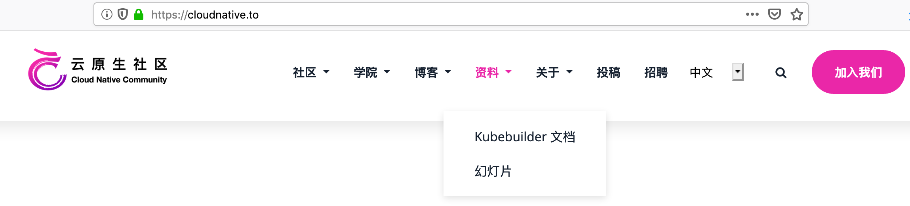
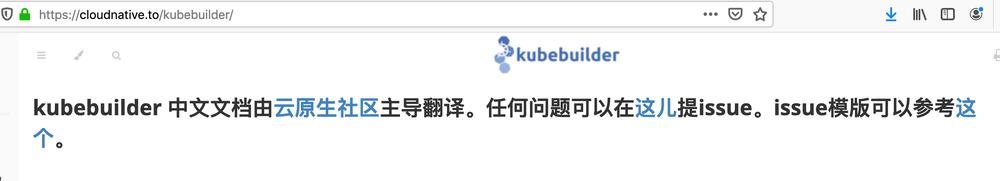

不管你关注不关注，云原生它走来了，它乘着万丈光芒的 Kubernetes 走来了；不管你承认不承认，Kubernetes 已经成为了云计算时代的操作系统。对于 Kubernetes，最为大家所熟知的就是它强大的容器编排能力（同为容器编排的还有 Mesos、Docker Swarm，但是 Kubernetes 已成一枝独秀），其实 Kubernetes 还有一个更强大的能力——扩展能力。如果只是利用 Kubernetes 内置的资源及 controller 类型，也就只能做到将应用“挪”到 Kubernetes 上，而不是真正的 Kubernetes 原生。如果利用 Kubernetes 的扩展能力，就可以将应用变成 Kubernetes 原生的了。

## Kubernetes 扩展之 Operator

Kubernetes 的扩展可以通过 Operator（Kubernetes API + CRD）来实现。在早期，为了实现一个 Operator，用户需要自己完成很多 Kubernetes 功能的实现，比如 Kubernetes Client 的创建，Kubernetes API Server 的监听等（这一点付业成老师在云原生社区直播分享 TiDB Operator 架构与实现的时候提到了，由于 TiDB Operator 开发初期，没有像本文要讲的主角—— Kubebuilder 等 Operator 框架出现的时候，很多功能都是由他们自己开发实现的。关于付业成老师的直播分享的相关文档，可以点击[这儿](https://mp.weixin.qq.com/s?__biz=MzI1NTE2NDE2MA==&mid=2649382450&idx=1&sn=2821ebc10ee82bb96b2ea222c3c86eb2&chksm=f224d45dc5535d4bafbf92d680c2a3bdcdef418f2512b92a54d24de286300810b7080cd6b65a&mpshare=1&scene=1&srcid=0828H8AVRCOE1zF80mDmMyFs&sharer_sharetime=1598606753261&sharer_shareid=69a671b032908bc53da173d06860fd16&exportkey=AelvSvG61dltexVPDUE2ZqY%3D&pass_ticket=xADS2K%2Ba1S5aRSLCMvRl1FI8%2FZ36Aex4ndAjdveOi87TBUPfO8ezl8mwng3JW%2BBm&wx_header=0#rd)查看。直播视频链接在文档底部，如下图）。

但是在整个开发过程中，有些逻辑是所有 Operator 实现过程所必须的，因此就有了将这些所有 Operator 实现所必须的逻辑封装和抽象成了公共的库和工具，从而形成一些 Operator SDK，这样开发人员就可以将更多的精力放在 Operator 中与自己应用程序相关的逻辑实现上，加速了开发流程。而 Kubebuilder 正是这些 SDK 中的其中一个（其他的还有 Operator SDK）。Kubebuilder 能够帮助我们生成一些 Scaffolding（脚手架）代码帮助初始化 CRD 功能，自动生成相应的配置，而且还提供了一些封装好的库供使用。

## Kubebuilder 官网翻译

为了让国内用户学习 Kubebuilder 变得快捷，同时秉承云原生社区立社的宗旨——向中文用户推广普及云原生相关知识。云原生社区将 Kubebuilder 官方文档进行了汉化，整个翻译过程前后历时一个多月，由来自多个城市，多家公司的志愿者共同完成。[Kubebuilder 中文网站](https://cloudnative.jimmysong.io/kubebuilder)，可由下图指示直达：

由于时间、人员分布及翻译习惯等因素，Kubebuilder 中文文档可能存在一些翻译问题，我们非常欢迎大家能在阅读的过程中给我们多提意见，我们会持续改进。可以通过微信找我们反映翻译问题，也可以在 GitHub 上提 Issue，提 Issue 的方式和模版在中文文档页首，点击相应的链接即可，如下图所示：

在此，非常感谢十多位志愿者的无私奉献，同时，为了响应社区大众想读 Envoy 中文版的要求（有[1.7 中文版](https://www.servicemesher.com/envoy/)，但距离最新版，差多个版本），云原生社区决定开启 Enovy 最新版的中文翻译工作，我们热忱欢迎对云原生感兴趣的志愿者加入我们，我们一起搞事情（可加微信 "jimmysongio"或者"majinghe11"并注明“Enovy 翻译”，我们拉你进群)。

加入云原生社区，一起搞事情，我们等你！！！

## 特别感谢
再次感谢以下参与 Kubebuilder 翻译的志愿者 (排名不分先后，按字母排序)

| 姓名 | GitHub 账号 | 姓名 | GitHub 账号 | 姓名 | GitHub 账号 |
| --- | :--- | :--- | :--- | :--- | :--- |
| 官余棚 | 3ks| 厉辉 | Miss-you | 梁斌 | hzliangbin |
| 刘晓敏 | dk-lockdown| 马景贺 | lhb008 | 尚坤 | skyshang1 |
| 申红磊 | shenhonglei| 宋净超 | rootsongjc | 文彦 | vsxen |
| 徐龙 | long0419| 许振文 | helight | 姚沈结 | Luffy110 |
| 曾祥龙 | alandtsang| 张浩 | zhangguanzhang |
