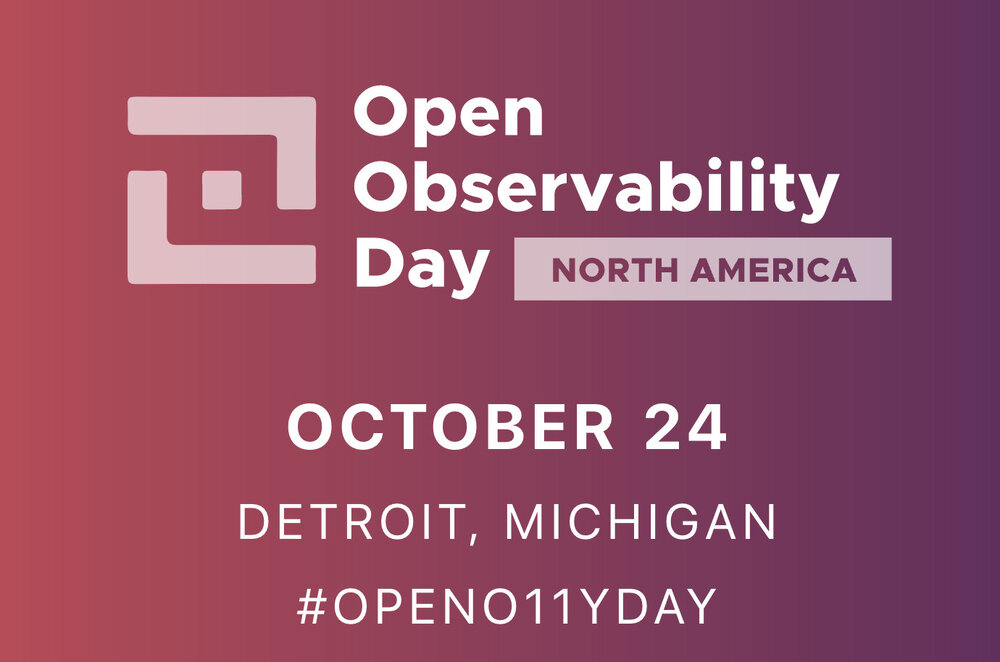
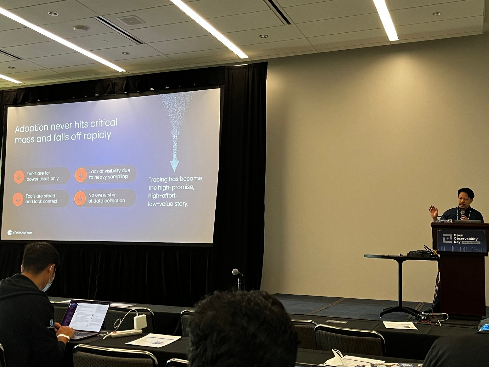
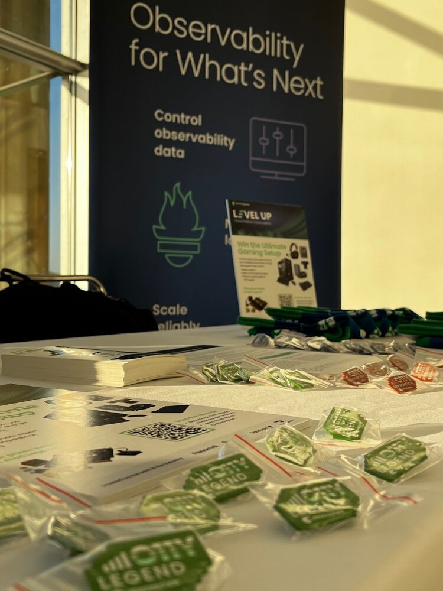
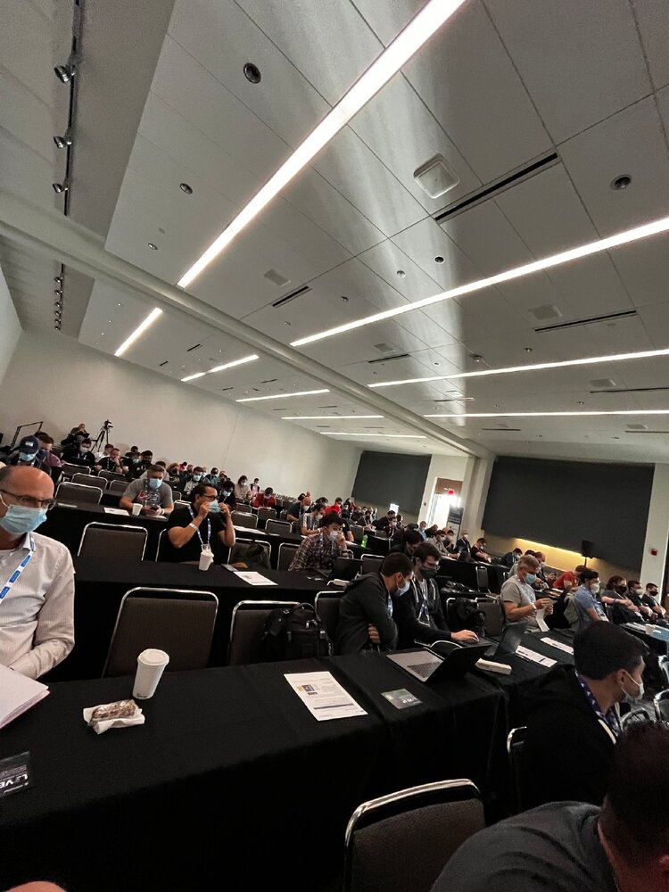

2022 年 10 月底，作为在底特律举行的完整 KubeCon 和 CloudNativeCon 活动之前的场外活动，[Open Observability Day](https://events.linuxfoundation.org/open-observability-day-north-america/) 为期一天的活动首次举行。

活动会场在亨廷顿广场会议中心，可以看到河对面加拿大的景色（很多人都不知道底特律离美国北部边境如此之近） 。

Open Observability Day 的[完整时间表可在线获得](https://events.linuxfoundation.org/open-observability-day-north-america/program/schedule/)，今天我想分享一下在那里的感受。

这一天以所有与开放可观测性相关的 CNCF 项目为中心，充斥了供应商和以项目为中心的演讲。

活动从 CNCF 项目创始人 Bartek Płotka 的概述开始，他叙述了 Thanos、Fluntd、OpenTelemetry、Jeager 等项目的更新。然后过渡到两个简短的主题演讲。

## 分布式追踪：斗争是真实的

Chronosphere 的现场首席技术官 Ian Smith 分享了他在该领域从事分布式跟踪解决方案 9 年后的想法。他带我们进行了一次旋风之旅，了解了它的来源和可能的发展方向，以及围绕支持分布式跟踪的工具存在哪些技术问题。下面是他给出的 tips：

> 追踪已成为高承诺、高努力、低价值的故事。

他继续强调对开发人员工具的关注需要如何扭转这种局面，并开始以更少的努力和更多的价值提供一些承诺。

## 简化可观测性

Calyptia 首席执行官 Eduardo Silva 分享了从创建 Fluentd 项目到专注于云原生环境的新 Fluent-bit 项目的故事。然后，他介绍了他们在构建 Fluent Bit 项目的日志空间方面的经验，以及如何扩展生态系统以支持指标和追踪，从而帮助塑造简化的用户可观测性体验。他宣布发布 Calyptia Core，使用开源工具通过数据管道收集数据，而无需使用代理。现在可以免费使用，并且可以安装到现有的 Kubernetes 集群中。他们还有一个 Docker 桌面扩展。

两个主题演讲都很短，只有 10 分钟，之后主要演讲开始了。

## 使用 Fluent Bit 构建可观测性管道

LinkedIn 的 Chao Xu 谈到了他们如何从现有的可观测性管道封闭工具过渡到开源和开放标准。他们主要使用 Fluent Bit 和 Open Telemetry。他们还将语言工具从 Java 应用程序扩展到 Go、C++ 和 Python。他们将跟踪和日志整合到单个管道中，而不是单独的数据管道中，从而创建更简单的维护标准和更少的资源负载。他们是 OTEL 收集器的忠实信徒，但他们将其扩展为新扩展的可观测性代理，以支持数据转换和过滤以及 OTEL 数据流的摄取。LinkedIn 也非常喜欢 Fluent Bit 提供的用于处理各种数据流的增强标签管理。

## 为什么大规模可观测性需要图

SquaredUp 的 Richard Benwell 深入研究了可观测性 Wikipedia 页面，这是一种相当有趣的方式来尝试构建我们所说的可观测性的基础。他用它来表明我们有带有指标、日志和跟踪的信号，但是我们在当前的可观测性平台中缺少我们的系统模型。这个演讲假设没有模型，信号是无用的。他继续使用架构作为我们正在收集的指标、日志和跟踪的模型。这就引出了一个问题：你是否需要架构师来设计模型，或者你是否只是像跟踪工具那样生成模型？此外，该模型很好（它有助于理解），但你需要能够深入了解你正在收集和建模的数据的含义。然后演讲深入到我们大学都学习过的图入门课程，从顶点到边到顶点类型的故事。它唤起了人们对数学课程和人工智能领域建模的美好回忆，以解决医疗诊断等问题领域。

## 对混沌的 Kubernetes 可观测性充满信心

来自 GitLab 的 Michael Friedrich 分享了我们如何从运行云原生环境转变为使用 Prometheus、Perces、Graphans 等 CNCF 项目监控。现在我们被所有传入的数据所淹没，这不是一个新概念。所以现在我们有了这个，他分享了一些关于故意破坏事物的想法，以了解它的行为、监控和恢复方式。他强调了 Chaos Mesh 项目，这是一个有趣的想法，即如何查看整个环境将如何响应问题。演讲以 Chaos Mesh 使用的现场演示结束。

午餐前后有几个闪电演讲，只有短短的 10 分钟。

- 使用 FluentBit 实现云和边缘的统一可观测性
- 通过自动发现的安全策略理解可观测性
- 通过 OpAMP 协议管理 OpenTelemetry
- 如何为可观测性构建数据管道
- eBPF 实际上可以为现代可观测性做什么？

下午结束了完整的分组会议：

## 在 eBay 采用开放遥测收集器：在飞行中换引擎

来自 eBay 的 Vijay Samuel 分享了从 Elastic Beats for traces 迁移到 Open Telemetry 的经验。他谈到了他们的云原生规模、遇到的问题、从 Metric Beats 到 OTEL 收集器的旅程、弥合动态配置重新加载的差距以及确保迁移后的数据奇偶性。这很有趣，他们正在招聘工程师。

## 使用  OpenTelemetry 的 Prometheus 管道

来自 Grafana Labs 和作为 Prometheus 维护者超过五年的 Goutham Veeramachaneni 分享了如何在 Prometheus 数据管道中利用 OTEL 来为你的指标基础设施添加追踪。

这个概述不包括今天举行的所有会谈，但给人留下了很好的印象。我必须承认，由于在休息期间出现的网络问题，我无法跟上所有会话。有几次，我进行了深入的讨论，使我在大厅或展位上的时间比计划的休息时间更长，但这就是这些活动的目的！