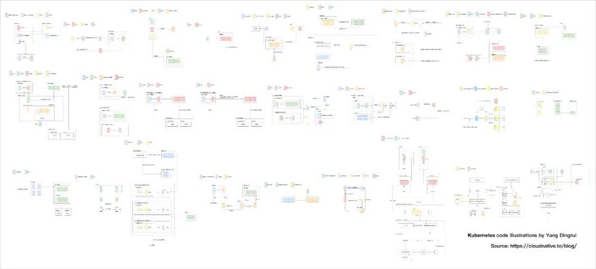
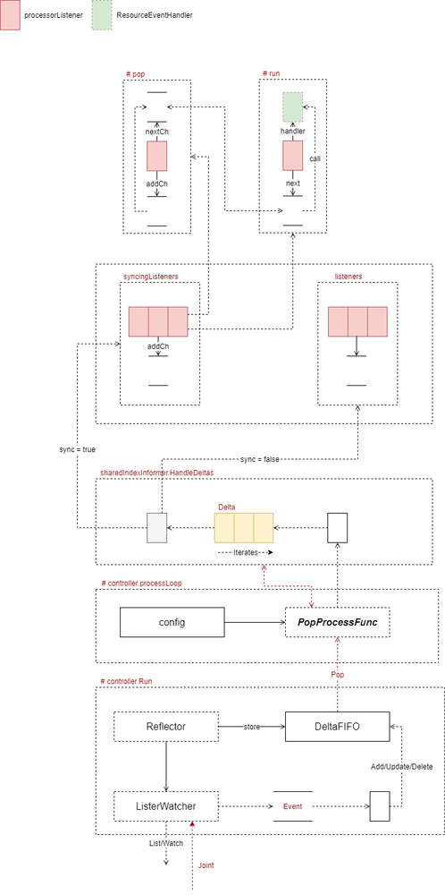
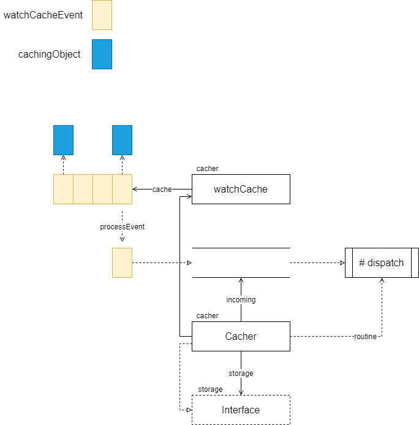
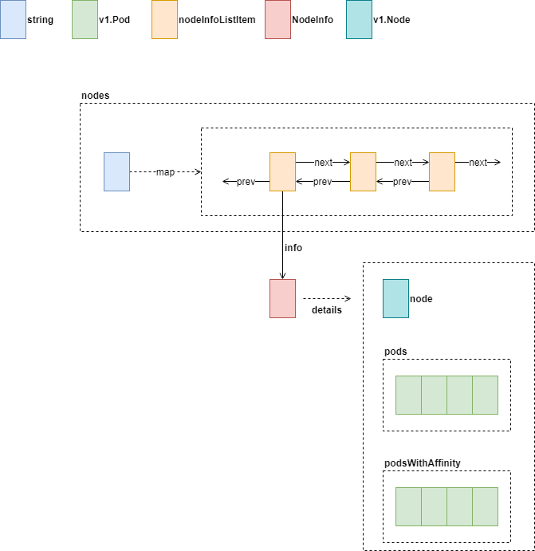
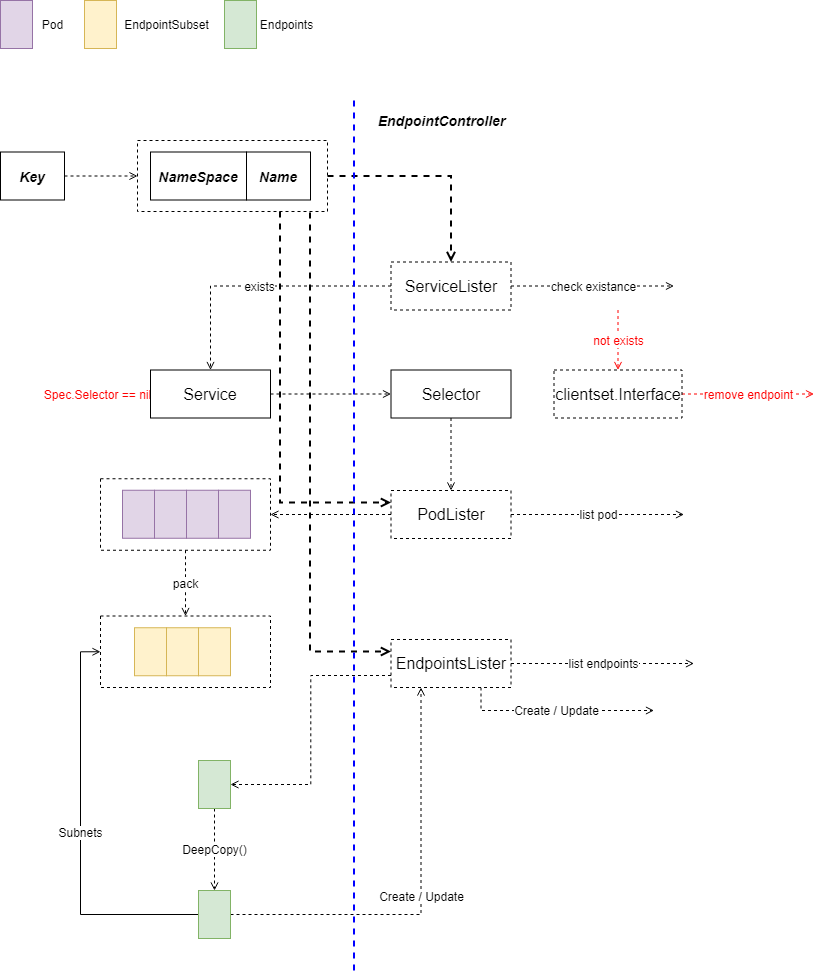
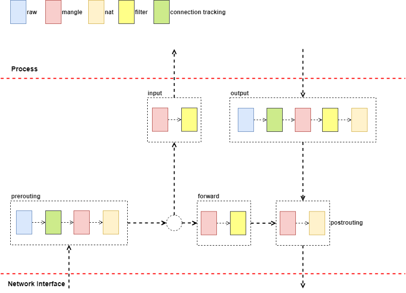

好消息，好消息！源码架构图系列完整啦！

大家好，我是杨鼎睿，Kubernetes 源码设计图已经整理完整啦，全部放在了云原生社区下，欢迎大家前来阅读！

为了方便广大读者的阅读，我们将所有的源码图整理到了 GitBook 中，大家不必为阅读的顺序而困扰啦。

[阅读点我](https://i.cloudnative.to/kubernetes/kubernetes/index) 

源码设计图共近 200 余张（100 余张是手绘的架构设计图），覆盖主要组件包括 API Server，Controller，Scheduler，Proxy，Client 等，同时还有 Docker， Golang 等相关部分。源码图理念以架构设计（数据结构的设计）为主，决不为了讲述流程而画流程图，阅读时需要配合源码同时阅读，同时会有一小部分的问题留白，可以引导读者带着问题进入源码中寻求答案，希望能籍此帮助大家在学习 K8S 的同时提高自己的设计能力。 

从去年 6 月开始到今年，很多图例都经过多次打磨，大小，含义保证一致，如虚线箭头代表动作等，对各种流程如循环迭代的画图表达也经过多次改版，除此之外，尤在图中不同实体的相互位置有下功夫，如同一水平线代表同一层次等，欢迎在画图表达上多多交流，共同推进如此理念的源码架构图。（除 Kubernetes 外，不少知名项目的源码架构图也已完成，欢迎交流）

这一系列完成过程中，超哥（Jimmy Song）给予了我很多支持，还有响哥（李响）的鼓励，也有不少前辈给予肯定，感谢大家的关注和阅读。

## 图例

### 部分全览图

### SharedInfomer

### Cacher

Cacher 包含了 storage.Interface 实例，这个实例是真正的存储后端实例。同时，Cacher 也实现了 storage.Interface 接口，这个是典型的装饰器模式。Kubernetes 源码中，有大量优雅的设计模式的运用，在阅读时可多加注意。
### Node

Nodes 中保存了 Node.Name 到 nodeInfoListItem 链表的映射。每个 nodeInfoListItem 对应一个 NodeInfo 实例，实例中保存了 Node 信息及相关的 Pod 信息。
### Endpoint Controller

上图为 syncService 完整的流程。第一步，先根据通过 Service 获取的 Key 值，还原 Namespace 与 Name，这两个值是后续向 API Server 查询的核心依据。
- 服务删除，那么通知 API Server 删除该服务相关的 Endpoint
- 如果是创建、更新服务
  - 从 API Server 根据 (Namespace, Name) 拉取与现有与 Service.Spec.Selector 相关的 Pod 列表
  - 根据 Pod 列表获取子网地址列表
  - 获取当前与 Service 关联的 Endpoints
  - DeepCopy 返回的 Endpoints 对象，并更新 Copy 的 Endpoints 的子网地址列表
  - 使用新 Endpoints，通知 API Server 创建或更新 Endpoints 资源
  - 创建/更新过程发生错误时，记录事件
### IPTable Proxier

Chain 如上图中虚线方框所示，代表了包处理过程中，实际的规则执行路径。Table 是可简单理解为规则的分类：
- Raw：Connection Tracking 相关操作
- Mangle：修改 IP 包
- Nat：地址转换
- Filter：过滤
