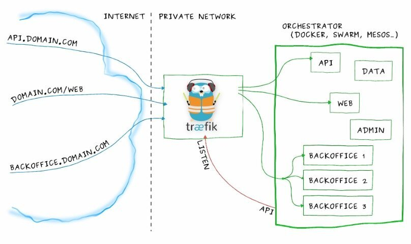

> 本文转载自[zhangguanzhang 的博客](https://zhangguanzhang.github.io/2018/10/06/IngressController/)。

从之前对 ingress controller 到现在了解架构和一些经验总结下，顺带给人科普少走弯路
需要看懂本文要具备一下知识点：

- Service 实现原理和会应用
- 知道反向代理原理，了解 nginx 和 apache 的 vhost 概念
- 了解 service 的几种类型（Nodeport、clusterip、LB）
- 四层和七层区别（不明白就这样去理解，七层最常见就是应用层的 http，也就是 url，四层是传输层，为 tcp/udp 端口）
- 域名解析，/etc/hosts 等基础知识

## Ingress Controller 介绍

`Ingress Controller`是一个统称，并不是只有一个，有如下这些：

- [Ingress NGINX](https://github.com/kubernetes/ingress-nginx): Kubernetes 官方维护的方案，也是本次安装使用的 Controller。
- [F5 BIG-IP Controller](https://clouddocs.f5.com/products/connectors/k8s-bigip-ctlr/v1.5/): F5 所开发的 Controller，它能够让管理员通过 CLI 或 API 让 Kubernetes 与 OpenShift 管理 F5 BIG-IP 设备。
- [Ingress Kong](https://konghq.com/blog/kubernetes-ingress-controller-for-kong/): 著名的开源 API Gateway 方案所维护的 Kubernetes Ingress Controller。
- [Traefik](https://github.com/containous/traefik): 是一套开源的 HTTP 反向代理与负载均衡器，而它也支援了 Ingress。
- [Voyager](https://github.com/appscode/voyager): 一套以 HAProxy 为底的 Ingress Controller。

> Ingress Controller 的实现不只上面这些方案，还有很多可以在网络上找到这里不一一列出来了。

我们部署在集群里的服务的 svc 想暴露出来的时候，从长久眼光看和易于管理维护都是用的`Ingress Controller`来处理，clusterip 非集群主机无法访问，Nodeport 不方便长久管理和效率，LB 服务多了不方便因为需要花费额外的钱，externalIPS 不好用（后面有空写文章会说它）。

我们跑的大多服务都是应用层 http（s），Ingress Controller 使用 service 或者 pod 的网络将它暴露在集群外，然后它反向代理集群内的七层服务，通过 vhost 子域名那样路由到后端的服务，`Ingress Controller`工作架构如下，借用 traefik 官方的图。



你可以将`api.domain.com`进来的流量路由到集群里 api 的 pod，你可以将`backoffice.domain.com`流量路由到 backoffice 的一组 pod 上，虽说我们可以自己搭建一个 nginx 来代替掉`Ingress Controller`，但是要增加代理的 service 长期来看维护很不方便，在使用上`Ingress Controller`后可以用一种抽象的对象告诉 controller 添加对应的代理，也就是`kind: Ingress`。它里面描述了从 Ingress Controller 访问进来的 ServerName 和 web 的 url 要代理到集群里哪个 service（以及 service 的 port）等等具体信息。

而官方的`Ingress Nginx`可以视为一个魔改的 nginx，拥有集群赋予的 RBAC 权限后，能够有监听集群 Ingress 相关的变化能力，用户创建了`kind: Ingress`，
例如上面 trafik 图里的 Ingress 大致就是下面这样：

```yaml
apiVersion: extensions/v1beta1
kind: Ingress
metadata:
  name: my-ingress
  annotations: 
    nginx.ingress.kubernetes.io/use-regex: "true"
spec:
  rules:
  - host: api.mydomain.com
    http:
      paths:
      - backend:
          serviceName: api
          servicePort: 80
  - host: domain.com
    http:
      paths:
      - path: /web/*
        backend:
          serviceName: web
          servicePort: 8080
  - host: backoffice.domain.com
    http:
      paths:
      - backend:
          serviceName: backoffice
          servicePort: 8080
```

只要创建了上面的 Ingress 后，ingress controller 里会监听到从而生成对应的配置段后动态 reload 配置文件。

## Ingress Controller 部署

部署非常简单，一条命令创建即可，yml 来源于 <https://github.com/kubernetes/ingress-nginx/tree/master/deploy>。  

```bash
kubectl apply -f https://raw.githubusercontent.com/kubernetes/ingress-nginx/master/deploy/mandatory.yaml
```

 该 yaml 缺少向群外暴露的方式，我们先使用 externalIPs 方式创建 svc 来让它能从集群外面访问（此处先学工作原理，后面再讲高可用）。

`$INGRESS_VIP`选取一个和宿主机同一个段没使用过的 IP 即可（实际上 Ingress Nginx bind 的端口不止 80 和 443，这里不讨论，有兴趣的同学可以看容器里的默认配置文件）。

```yaml
apiVersion: v1
kind: Service
metadata:
  name: ingress-nginx
  namespace: ingress-nginx
  labels:
    app: ingress-nginx
spec:
  type: LoadBalancer
  externalIPs:
  - $INGRESS_VIP
  ports:
  - port: 80
    targetPort: 80
  selector:
    app: ingress-nginx
```

上面的 yaml 里后面详细解释我们需要关注的配置项，先来创建 ingress 对象试试。

### 测试 http 7 层负载

部署了官方的 ingress nginx 后，我部署了一个 nginx 的 pod，为它创建了一个名为 nginx 的 service：

```yaml
apiVersion: extensions/v1beta1
kind: Deployment
metadata:
  name: nginx
spec:
  template:
    metadata:
      labels:
        app: nginx
    spec:
      containers:
      - image: nginx
        name: nginx
        ports:
        - containerPort: 80
---
apiVersion: v1
kind: Service
metadata:
  name: nginx
spec:
  selector:
    app: nginx
  ports:
    - protocol: TCP
      port: 80
      targetPort: 80
```

然后创建对应的一个 ingress 对象来暴露集群里这个 nginx 的 http 服务：

```yaml
apiVersion: extensions/v1beta1
kind: Ingress
metadata:
  name: nginx-ingress
spec:
  rules:
  - host: nginx.testdomain.com
    http:
      paths:
      - backend:
          serviceName: nginx
          servicePort: 80
```

找到 ingress nginx 的 pod 名字后通过命令查看里面 nginx 配置文件能找到有对应的配置段生成：

```yaml
$ kubectl -n ingress-nginx exec nginx-ingress-controller-6cdcfd8ff9-t5sxl -- cat /etc/nginx/nginx.conf
...
	## start server nginx.testdomain.com
	server {
		server_name nginx.testdomain.com ;
		
		listen 80;
		
		set $proxy_upstream_name "-";
		
		location / {
			
			set $namespace      "default";
			set $ingress_name   "nginx-ingress";
			set $service_name   "nginx";
			set $service_port   "80";
			set $location_path  "/";
            ........
	## end server nginx.testdomain.com      
...
```

找一台非集群的 Windows 机器（也可以 mac，主要是有图形界面且非集群内机器），设置 hosts 文件把域名`nginx.testdomain.com`设置到对 service 的那个 externalIPs 的 ip 上，打开浏览器访问`nginx.testdomain.com`即可发现集群内的 nginx 已经暴露在集群外。

**注意**：Ingress Controller 虽然调用的是 service，看起来按照 nginx 来理解转发是 client–nginx–svc–pod; 实际上转发是 client–nginx–pod，因为已经魔改了不能按照 nginx 的来理解，是直接负载到 svc 的 endpoint 上面的。

另外低版本的 ingress nginx 的 args 参数`--default-backend-service=$(POD_NAMESPACE)/default-http-backend`，该参数指定 ingress nginx 的同 namespace 下名为`default-http-backend`的 service 作为默认访问的时候页面，通常那个时候是创建一个 404 页面的的 pod 和对应 service，如果 ingress nginx 启动的时候没找到这个 service 会无法启动，新版本不是必须了，好像也自带 404 页面了。

另外 ingress 也能多路径，如下：

```yaml
spec:
  rules:
  - host: xxxx.xxxx.xxx
    http:
      paths:
      - backend:
          serviceName: service-index
          servicePort: 80
        path: /
      - backend:
          serviceName: service-test-api
          servicePort: 80
        path: /api/
```

### 如何来 4 层负载

我们可以看到 ingress nginx 的 args 里有这两行：

```yaml
- --tcp-services-configmap=$(POD_NAMESPACE)/tcp-services
- --udp-services-configmap=$(POD_NAMESPACE)/udp-services
```

从选项和值可以猜测出，要想代理四层（tcp/udp），得写同 namespace 里一个名为`tcp-service`和`udp-service`的两个 configmap 的数据
四层的话这边我们创建一个 mysql 的 pod，来代理 3306 端口到集群外面，则需要写 tcp-services 这个 configmap：

```yaml
kind: ConfigMap
apiVersion: v1
metadata:
  name: tcp-services
  namespace: ingress-nginx
data:
  3306: "default/mysql:3306"
```

四层写这两个 ConfigMap 的 data 即可，按照这样去写即可`out_port: namespaces/svc_name:port`，要给每个 ingress 加一些 nginx 里的配置可以查看官方的 annotation 字段以及值（traefik 同理）。

### Ingress Controller 高可用

这里来讨论下`Ingress Controller`的高可用。

Ingress Controller 到集群内的路径这部分都有负载均衡了，我们比较关注部署了 Ingress Controller 后，外部到它这段路怎么高可用？

上面的例子里 service 我使用的 externalIPs，但是代理四层的时候会新加端口，需要每次人为去介入增加暴露端口？

流量从入口到`Ingress Controller`的 pod 有下面几种方式：

- type 为`LoadBalancer`的时候手写`externalIPs`很鸡肋，后面会再写文章去讲它
- type 为`LoadBalancer`的时候只有云厂商支持分配公网 ip 来负载均衡，LoadBalancer 公开的每项服务都将获得自己的 IP 地址，但是需要收费，且自己建立集群无法使用
- 不创建 service，pod 直接用 hostport，效率等同于`hostNetwork`，如果不代理四层端口还好，代理了需要修改 pod 的 template 来滚动更新来让 nginx bind 的四层端口能映射到宿主机上
- `Nodeport`，端口不是 web 端口（但是可以修改 Nodeport 的范围改成 web 端口），如果进来流量负载到 Nodeport 上可能某个流量路线到某个 node 上的时候因为`Ingress Controller`的 pod 不在这个 node 上，会走这个 node 的 kube-proxy 转发到 Ingress Controller 的 pod 上，多走一趟路
- 不创建 service，效率最高，也能四层负载的时候不修改 pod 的 template，唯一要注意的是`hostNetwork`下 pod 会继承宿主机的网络协议，也就是使用了主机的 dns，会导致 svc 的请求直接走宿主机的上到公网的 dns 服务器而非集群里的 dns server，需要设置 pod 的`dnsPolicy: ClusterFirstWithHostNet`即可解决

## 写在最后

部署方式没多大区别开心就好。

- DaemonSet + nodeSeletor
- deploy 设置 replicas 数量 + nodeSeletor + pod 互斥
- 所以可以一个 vip 飘在拥有存活的 controller 的宿主机上，云上的话就用 slb 来负载代替 vip
- 最后说说域名请求指向它，如果部署在内网或者办公室啥的，内网有 dns server 的话把 ing 的域名全部解析到 ingress controller 的宿主机 ip 上，否则要有人访问每个人设置/etc/hosts 才能把域名解析来贼麻烦，如果没有 dns server 可以跑一个 external-dns，它的上游 dns 是公网的 dns 服务器，办公网内机器的 dns server 指向它即可，云上的话把域名请求解析到对应 ip 即可
- traefik 和 ingress nginx 类似，不过它用 go 实现的
- 在一些老版本的 ingress nginx 的 log 里会一直刷找不到 ingress-nginx 的 svc，不处理的话会狂刷 log 导致机器 load 过高，创建一个同名的 svc 即可解决，例如创建一个不带选择器 clusterip 为 null 的即可。非要创建 port 的 svc 的话参照下面：

```yaml
apiVersion: v1
kind: Service
metadata:
  name: ingress-nginx
  namespace: ingress-nginx
  labels:
    app.kubernetes.io/name: ingress-nginx
    app.kubernetes.io/part-of: ingress-nginx
spec:
  type: ClusterIP
  ports:
  - name: http
    port: 80
    targetPort: 80
    protocol: TCP
  - name: https
    port: 443
    targetPort: 443
    protocol: TCP
  - name: metrics
    port: 10254
    targetPort: 10254
    protocol: TCP
  selector:
    app.kubernetes.io/name: ingress-nginx
    app.kubernetes.io/part-of: ingress-nginx
```

## 参考：

- [ingress-nginx deploy - github.com](https://github.com/kubernetes/ingress-nginx/blob/master/docs/deploy/index.md)
- [ingress-nginx deploy - kubernetes.github.io](https://kubernetes.github.io/ingress-nginx/deploy/baremetal/)
