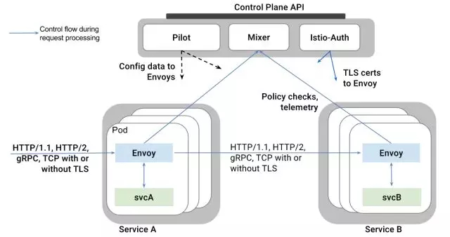
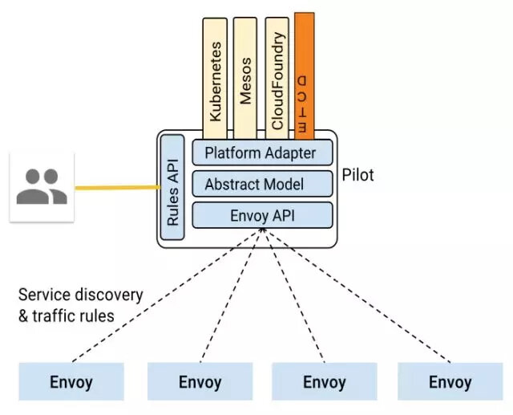
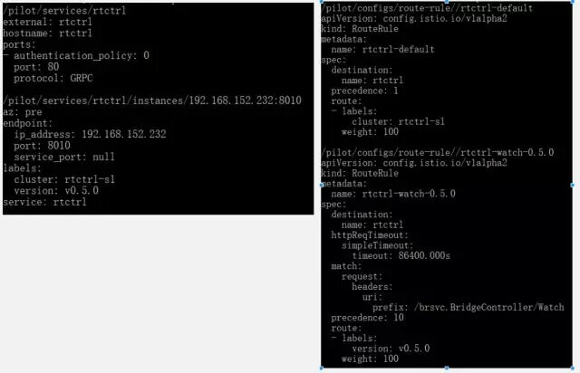

> UCloud 作为一家To B的公有云服务商，我们的CTO莫显峰经常说：“研发团队最首要的任务是提供稳定的服务，然后才是提供符合客户需求的、易用和低成本的产品”。但事实是，在提供稳定云服务的同时，面对快速发展的客户业务场景，我们还需要不断 “拥抱变化”。 

Max Kanat-Alexander 在《简约之美：软件设计之道》（Code Simplicity）中提出的软件设计的 6 条法则恰到好处的描述了这一矛盾的事实，具体内容如下：

1. 软件的目的是帮助他人；
2. 相比降低开发成本，更重要的是降低维护成本；
3. 变化定律：软件存在的时间越久，它的某部分需要变化的可能性越大；
4. 缺陷定律：软件出现缺陷的可能性，正比于你对它所做修改的程度；
5. 简洁定律：软件任一部分的维护难度，正比于该部分的复杂程度；
6. 测试定律：你对软件行为的了解程度，等于你真正测试它的程度。

正像法则1、3、4和6所说的软件的目的就是满足客户的需求，而随着时间的推移，用户需求总会改变；伴随着用户需求的改变，软件也需要适应新的需求而做修改，修改必然会引入缺陷；如果要排除缺陷就必须进行测试。

但目前软件行业的现状大部分面临这样的问题，即无论花多大的成本去测试，真正的用户行为背后的需求总是不可能被完全满足的，缺陷总是会有的，这时我们最后的安全网就是“灰度发布”（又名“金丝雀发布”）。在采用用户真实行为作为终极测试的同时，通过控制变更范围尽可能的减少风险；一旦真的有缺陷可以快速回滚，尽可能以最大程度降低影响。

## 为何采用Service Mesh实现灰度发布

Service Mesh 是用来处理各服务间通信的基础设施层。它主要通过构建云原生应用程序的各种复杂拓扑结构来完成传递请求。实际上，Service Mesh 通常与应用程序代码一起部署轻量级网络代理的阵列来实现请求。

在Service Mesh之前，我们已经采用了APIGateway来实现灰度发布，但APIGateway通常仅部署在用户流量的入口，完全灰度发布就需要完整地部署两套系统。但是在微服务时代，任何一个微服务发生变更都需要完整地部署两套系统，这不仅成本很高而且严重影响了产品变更的速度。 

而Service Mesh正好可以解决这些问题，它的应用类似于将APIGateway部署到本地，同时提供了集中化控制，极大地简化了灰度发布的实现流程、降低了变更成本、同时加快了产品发布的进度。

## 为何采用轻量Service Mesh

正如敖小剑在《DreamMesh抛砖引玉》系列文章中提到的：“Service Mesh 的发展进程，当前还处于前景虽然一致看好，但是脚下的路还处于需要一步一步走的早期艰难阶段。由于 Istio 和 Conduit 的尚未成熟，造成目前 Service Mesh 青黄不接的尴尬局面。” 到底该如何让Service Mesh落地，这也是我们在2017年10月选择了Service Mesh之后面临的难题。

Istio可以提供一个完整的解决方案，通过为整个服务网格（Service Mesh）提供行为检测和操作控制来满足微服务应用程序的各种需求。它在服务网络中提供了许多关键功能例如：流量管理、可观察性、策略执行、服务身份和安全、平台支持、集成和定制。

事实上我对Istio的流量管理DSL非常满意，同时通过评测也能够接受Envoy的性能开销，从当时来看Istio确实是一个非常优秀的且是唯一的候选者。但敖小剑在《DreamMesh抛砖引玉》描述的几个问题，也困扰着我是否采用Istio:

**1. Ready for Cloud Native?**

我们目前并没有采用K8S，事实上我们所开发的IaaS控制面程序，本身就和K8S的功能类似。

**2. 如何从非 Service Mesh 体系过渡到 Service Mesh？**

我们有大量既有的服务。

**3. 零侵入的代价**

K8S的网络方案已经是非常复杂且性能堪忧了，再通过IPTables来透明引流确实是雪上加霜，给未来的运维、Trouble-Shooting带来了很高的复杂度。

**4. 网络通讯方案**

目前我们主要使用gRPC和HTTP，但仍有数据库服务等业务不适合跑在K8S中，而K8S的网络方案需要能够兼容现有的数据库等业务。

## 如何实现轻量Service Mesh

Istio在逻辑上可以分为数据面板和控制面板，这两部分的具体功能如下：

- 数据面板由一组智能代理（Envoy）组成，代理部署为sidecar，调解和控制微服务之间所有的网络通信。
- 控制面板负责管理和配置代理来路由流量，以及在运行时执行策略。

下图是构成每个面板的不同组件：

经过一些代码级别的Research之后，我们最终选择了将Pilot从Istio中剥离出来，脱离K8S运行的轻量级Service Mesh方案。

**1.从Istio中剥离Pilot和Envoy**

在Istio中Pilot作为Envoy的控制面板提供集中式流量管理功能的模块，这是实现灰度发布必不可少的功能，事实上也是Service Mesh的核心功能。Mixer提供访问策略和控制功能，Istio-Auth提供安全认证功能，但在UCloud的内网环境下，我们可以将这两个模块去掉。

得益于Pilot的良好设计，ETCD Platform很容易实现，进而从ETCD获取Service和ServiceInstance信息。然后我们重写了Pilot的main.go，保留了Pilot的model、proxy和proxy/envoy模块；删除其他的Platform仅保留新增的ETCD Platform。

最后我们在保留完整的Istio DSL支持的同时，得到了完全脱离K8S运行和编译的Pilot。同时我们将Pilot和ETCD gRPC naming and discovery做了深度整合，自动剔除没有在线的ServiceInstance信息。

**2.采用docker-compose管理container实现sidecar**

我们仍然采用container的方式打包和部署微服务，但采用Host的网络方式简化了现存服务的网络通信方式。为了实现Envoy的sidecar部署，我们采用docker-compose模拟k8s的POD，管理服务间的依赖关系。通过实现一个简单的服务管理、版本管理、集群管理、路由策略管理层，为集群中的每台Node（VM或物理服务器）生成docker-compose配置文件，从而实现每台Node的服务部署和管理。

最后针对HTTP 1.0、HTTP 2.0和gRPC的RPC方式，采用显式代理而不是IPTables透明引流和Envoy集成。

- 如果服务中配置了Envoy的Proxy Port，则通过Envoy接入Service Mesh；
- 如果配置是IP地址和端口，则直连这个地址；
- 如果配置的是域名且没有配置Envoy的Proxy，则自动采用ETCD gRPC naming and discovery的方式去发现远端服务。

## 总结

通过一系列的设计改造，最终我们得到了一个轻量的Service Mesh实践，实现了优化灰度发布的目标。在保证了更好的控制变更范围的同时，也能以提供更稳定的服务为最终目的。
