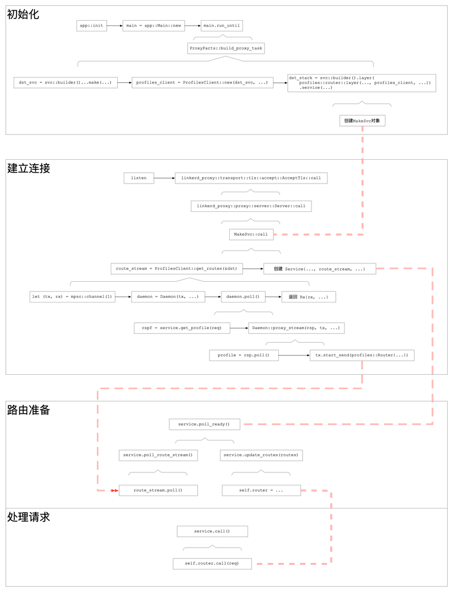

> 作者：哗啦啦 mesh 团队，热衷于 kubernetes、devops、apollo、istio、linkerd、openstack、calico 等领域技术。

## linkerd2 介绍

Linkerd 由`控制平面`和`数据平面`组成：

- `控制平面`是在所属的`Kubernetes命名空间`（linkerd 默认情况下）中运行的一组服务，这些服务可以完成`汇聚遥测数据`，提供面向用户的 API，并向`数据平面`代理`提供控制数据`等，它们`共同驱动`数据平面。

- `数据平面`用 Rust 编写的轻量级代理，该代理安装在服务的`每个pod`中，并成为数据平面的一部分，它接收 Pod 的`所有接入`流量，并通过`initContainer`配置`iptables`正确转发流量的拦截所有传出流量，因为它是附加工具，并且拦截服务的所有`传入和传出`流量，所以不需要更改代码，甚至可以将其添加到`正在运行`的服务中。

借用官方的图：


proxy 由 rust 开发完成，其内部的异步运行时采用了[Tokio](https://tokio-zh.github.io/)框架，服务组件用到了[tower](https://github.com/tower-rs/tower)。

本文主要关注 proxy 与 destination 组件交互相关的整体逻辑，分析 proxy 内部的运行逻辑。

## 流程分析

### 初始化

proxy 启动后：

1. `app::init`初始化配置
2. `app::Main::new`创建主逻辑`main`，
3. `main.run_until`内新加一任务 `ProxyParts::build_proxy_task`。

在`ProxyParts::build_proxy_task`中会进行一系列的初始化工作，此处只关注`dst_svc`，其创建代码为：

```rust
    dst_svc = svc::stack(connect::svc(keepalive))
                .push(tls::client::layer(local_identity.clone()))
                .push_timeout(config.control_connect_timeout)
                .push(control::client::layer())
                .push(control::resolve::layer(dns_resolver.clone()))
                .push(reconnect::layer({
                    let backoff = config.control_backoff.clone();
                    move |_| Ok(backoff.stream())
                }))
                .push(http_metrics::layer::<_, classify::Response>(
                    ctl_http_metrics.clone(),
                ))
                .push(proxy::grpc::req_body_as_payload::layer().per_make())
                .push(control::add_origin::layer())
                .push_buffer_pending(
                    config.destination_buffer_capacity,
                    config.control_dispatch_timeout,
                )
                .into_inner()
                .make(config.destination_addr.clone())
```

`dst_svc`一共有 2 处引用，一是`crate::resolve::Resolver`的创建会涉及；另一个就是`ProfilesClient`的创建。

#### `Resolver`

1. `api_resolve::Resolve::new(dst_svc.clone())`创建`resolver`对象
2. 调用`outbound::resolve`创建 `map_endpoint::Resolve`类型对象，并当做参数`resolve`传入`outbound::spawn`函数开启出口线程

在`outbound::spawn`中，`resolve`被用于创建负载均衡控制层，并用于后续路由控制：

```rust
let balancer_layer = svc::layers()
        .push_spawn_ready()
        .push(discover::Layer::new(
            DISCOVER_UPDATE_BUFFER_CAPACITY,
            resolve,
        ))
        .push(balance::layer(EWMA_DEFAULT_RTT, EWMA_DECAY));
```

在`discover::Layer::layer`中：

```rust
let from_resolve = FromResolve::new(self.resolve.clone());
let make_discover = MakeEndpoint::new(make_endpoint, from_resolve);
Buffer::new(self.capacity, make_discover)
```

#### `Profiles`

1. 在`ProfilesClient::new`中调用`api::client::Destination::new(dst_svc)`创建 grpc 的 client 端并存于成员变量`service`
2. 接着`profiles_client`对象会被用于`inbound`和`outbound`的创建（省略无关代码）：

```rust
    let dst_stack = svc::stack(...)...
        .push(profiles::router::layer(
            profile_suffixes,
            profiles_client,
            dst_route_stack,
        ))
        ...
```

其中`profiles::router::layer`会创建一个`Layer`对象，并将`profiles_client`赋予`get_routes`成员。然后在`service`方法中，会调到`Layer::layer`方法，里面会创建一个`MakeSvc`对象，其`get_routes`成员的值即为`profiles_client`。

### 运行

新的连接过来时，从`listen`拿到连接对象后，会交给`linkerd_proxy::transport::tls::accept::AcceptTls`的`call`，然后是`linkerd2_proxy::proxy::server::Server`的`call`，并最终分别调用`linkerd2_proxy_http::balance::MakeSvc::call`和`linkerd2_proxy_http::profiles::router::MakeSvc::call`方法。

#### `balance`

在`linkerd2_proxy_http::balance::MakeSvc::call`中：

1. 调用`inner.call(target)`，此处的`inner`即是前面`Buffer::new`的结果。
2. 生成一个新的`linkerd2_proxy_http::balance::MakeSvc`对象，当做`Future`返回

先看`inner.call`。它内部经过层层调用，依次触发`Buffer`、`MakeEndpoint`、`FromResolve`等结构的`call`方法，最终会触发最开始创建的`resolve.resolve(target)`，其内部调用`api_resolve::Resolve::call`。

在`api_resolve::Resolve::call`中：

```rust
    fn call(&mut self, target: T) -> Self::Future {
        let path = target.to_string();
        trace!("resolve {:?}", path);
        self.service
            // GRPC 请求，获取 k8s 的 endpoint
            .get(grpc::Request::new(api::GetDestination {
                path,
                scheme: self.scheme.clone(),
                context_token: self.context_token.clone(),
            }))
            .map(|rsp| {
                debug!(metadata = ?rsp.metadata());
                // 拿到结果 stream
                Resolution {
                    inner: rsp.into_inner(),
                }
            })
    }
```

将返回的`Resolution`再次放入`MakeSvc`中，然后看其 poll：

```rust
    fn poll(&mut self) -> Poll<Self::Item, Self::Error> {
        // 这个 poll 会依次调用：
        //    linkerd2_proxy_api_resolve::resolve::Resolution::poll
        //    linkerd2_proxy_discover::from_resolve::DiscoverFuture::poll
        //    linkerd2_proxy_discover::make_endpoint::DiscoverFuture::poll
        // 最终获得 Poll<Change<SocketAddr, Endpoint>> 
        let discover = try_ready!(self.inner.poll());
        let instrument = PendingUntilFirstData::default();
        let loaded = PeakEwmaDiscover::new(discover, self.default_rtt, self.decay, instrument);
        let balance = Balance::new(loaded, self.rng.clone());
        Ok(Async::Ready(balance))
    }
```

最终返回 service `Balance`。

当具体请求过来后，先会判断`Balance::poll_ready`：

```rust
    fn poll_ready(&mut self) -> Poll<(), Self::Error> {
        // 获取 Update<Endpoint>
        // 将 Remove 的从 self.ready_services 中删掉
        // 将 Insert 的构造 UnreadyService 结构加到 self.unready_services
        self.poll_discover()?;
        // 对 UnreadyService，调用其 poll，内部会调用到 svc 的 poll_ready 判断 endpoint 是否可用
        // 可用时，将其加入 self.ready_services
        self.poll_unready();
        
        loop {
            if let Some(index) = self.next_ready_index {
                // 找到对应的 endpoint，可用则返回
                if let Ok(Async::Ready(())) = self.poll_ready_index_or_evict(index) {
                    return Ok(Async::Ready(()));
                }
            }
            // 选择负载比较低的 endpoint
            self.next_ready_index = self.p2c_next_ready_index();
            if self.next_ready_index.is_none() {
                // 
                return Ok(Async::NotReady);
            }
        }
    }
```

就绪后，对请求`req`调用`call`：

```rust
    fn call(&mut self, request: Req) -> Self::Future {
        // 找到下一个可用的 svc，并将其从 ready_services 中删除
        let index = self.next_ready_index.take().expect("not ready");
        let (key, mut svc) = self
            .ready_services
            .swap_remove_index(index)
            .expect("invalid ready index");

        // 将请求转过去
        let fut = svc.call(request);
        // 加到 unready
        self.push_unready(key, svc);

        fut.map_err(Into::into)
    }
```

#### `profiles`

在`linkerd2_proxy_http::profiles::router::MakeSvc::call`中：

```rust
        // Initiate a stream to get route and dst_override updates for this
        // destination.
        let route_stream = match target.get_destination() {
            Some(ref dst) => {
                if self.suffixes.iter().any(|s| s.contains(dst.name())) {
                    debug!("fetching routes for {:?}", dst);
                    self.get_routes.get_routes(&dst)
                } else {
                    debug!("skipping route discovery for dst={:?}", dst);
                    None
                }
            }
            None => {
                debug!("no destination for routes");
                None
            }
        };
```

经过若干判断后，会调用`ProfilesClient::get_routes`并将结果存于`route_stream`。

进入`get_routes`：

```rust
    fn get_routes(&self, dst: &NameAddr) -> Option<Self::Stream> {
        // 创建通道
        let (tx, rx) = mpsc::channel(1);
        // This oneshot allows the daemon to be notified when the Self::Stream
        // is dropped.
        let (hangup_tx, hangup_rx) = oneshot::channel();
        // 创建 Daemon 对象（Future 任务）
        let daemon = Daemon {
            tx,
            hangup: hangup_rx,
            dst: format!("{}", dst),
            state: State::Disconnected,
            service: self.service.clone(),
            backoff: self.backoff,
            context_token: self.context_token.clone(),
        };
        // 调用 Daemon::poll
        let spawn = DefaultExecutor::current().spawn(Box::new(daemon.map_err(|_| ())));
        // 将通道接收端传出
        spawn.ok().map(|_| Rx {
            rx,
            _hangup: hangup_tx,
        })
    }
```

接着看`Daemon::poll`：

```rust
    fn poll(&mut self) -> Poll<Self::Item, Self::Error> {
        loop {
            // 遍历 state 成员状态
            self.state = match self.state {
                // 未连接时
                State::Disconnected => {
                    match self.service.poll_ready() {
                        Ok(Async::NotReady) => return Ok(Async::NotReady),
                        Ok(Async::Ready(())) => {}
                        Err(err) => {
                            error!(
                                "profile service unexpected error (dst = {}): {:?}",
                                self.dst, err,
                            );
                            return Ok(Async::Ready(()));
                        }
                    };
                    // 构造 grpc 请求
                    let req = api::GetDestination {
                        scheme: "k8s".to_owned(),
                        path: self.dst.clone(),
                        context_token: self.context_token.clone(),
                    };
                    debug!("getting profile: {:?}", req);
                    // 获取请求任务
                    let rspf = self.service.get_profile(grpc::Request::new(req));
                    State::Waiting(rspf)
                }
                // 正在请求时，从请求中获取回复
                State::Waiting(ref mut f) => match f.poll() {
                    Ok(Async::NotReady) => return Ok(Async::NotReady),
                    // 正常回复
                    Ok(Async::Ready(rsp)) => {
                        trace!("response received");
                        // 流式回复
                        State::Streaming(rsp.into_inner())
                    }
                    Err(e) => {
                        warn!("error fetching profile for {}: {:?}", self.dst, e);
                        State::Backoff(Delay::new(clock::now() + self.backoff))
                    }
                },
                // 接收回复
                State::Streaming(ref mut s) => {
                    // 处理回复流
                    // 注意此处，参数 1 是 get_profile 请求的回复流，
                    //   参数 2 是之前创建的通道发送端
                    match Self::proxy_stream(s, &mut self.tx, &mut self.hangup) {
                        Async::NotReady => return Ok(Async::NotReady),
                        Async::Ready(StreamState::SendLost) => return Ok(().into()),
                        Async::Ready(StreamState::RecvDone) => {
                            State::Backoff(Delay::new(clock::now() + self.backoff))
                        }
                    }
                }
                // 异常，结束请求
                State::Backoff(ref mut f) => match f.poll() {
                    Ok(Async::NotReady) => return Ok(Async::NotReady),
                    Err(_) | Ok(Async::Ready(())) => State::Disconnected,
                },
            };
        }
    }
```

接着 `proxy_stream`：

```rust
    fn proxy_stream(
        rx: &mut grpc::Streaming<api::DestinationProfile, T::ResponseBody>,
        tx: &mut mpsc::Sender<profiles::Routes>,
        hangup: &mut oneshot::Receiver<Never>,
    ) -> Async<StreamState> {
        loop {
            // 发送端是否就绪
            match tx.poll_ready() {
                Ok(Async::NotReady) => return Async::NotReady,
                Ok(Async::Ready(())) => {}
                Err(_) => return StreamState::SendLost.into(),
            }

            // 从 grpc stream 中取得一条数据
            match rx.poll() {
                Ok(Async::NotReady) => match hangup.poll() {
                    Ok(Async::Ready(never)) => match never {}, // unreachable!
                    Ok(Async::NotReady) => {
                        // We are now scheduled to be notified if the hangup tx
                        // is dropped.
                        return Async::NotReady;
                    }
                    Err(_) => {
                        // Hangup tx has been dropped.
                        debug!("profile stream cancelled");
                        return StreamState::SendLost.into();
                    }
                },
                Ok(Async::Ready(None)) => return StreamState::RecvDone.into(),
                // 正确取得 profile 结构
                Ok(Async::Ready(Some(profile))) => {
                    debug!("profile received: {:?}", profile);
                    // 解析数据
                    let retry_budget = profile.retry_budget.and_then(convert_retry_budget);
                    let routes = profile
                        .routes
                        .into_iter()
                        .filter_map(move |orig| convert_route(orig, retry_budget.as_ref()))
                        .collect();
                    let dst_overrides = profile
                        .dst_overrides
                        .into_iter()
                        .filter_map(convert_dst_override)
                        .collect();
                    // 构造 profiles::Routes 结构并推到发送端
                    match tx.start_send(profiles::Routes {
                        routes,
                        dst_overrides,
                    }) {
                        Ok(AsyncSink::Ready) => {} // continue
                        Ok(AsyncSink::NotReady(_)) => {
                            info!("dropping profile update due to a full buffer");
                            // This must have been because another task stole
                            // our tx slot? It seems pretty unlikely, but possible?
                            return Async::NotReady;
                        }
                        Err(_) => {
                            return StreamState::SendLost.into();
                        }
                    }
                }
                Err(e) => {
                    warn!("profile stream failed: {:?}", e);
                    return StreamState::RecvDone.into();
                }
            }
        }
    }
```

回到`MakeSvc::call`方法，前面创建的`route_stream`会被用于创建一个`linkerd2_proxy::proxy::http::profiles::router::Service`任务对象，并在其`poll_ready`方法中通过`poll_route_stream`从`route_steam`获取`profiles::Routes`并调用`update_routes`创建具体可用的路由规则`linkerd2_router::Router`，至此，路由规则已建好，就等具体的请求过来然后在`call`中调用`linkerd2_router::call`进行对请求的路由判断。

### 图示

#### profile



## 总结

proxy 采用的 tower 框架，每个处理逻辑都是其中的一个 layer，开发时只需层层堆叠即可。不过，也正因如此，各层之间的接口都极其相似，须得小心不可调错。
对于 destination 这部分逻辑，linkerd2 的 destination 组件收到来自 proxy 的 grpc 请求后，每当 endpoint 或 service profile 有任何变动，都会立即通过 stream 发送过去，proxy 收到后根据 endpoint 调整负载均衡策略，根据 service profile 调整路由，然后通过它们来处理用户服务的实际请求。
