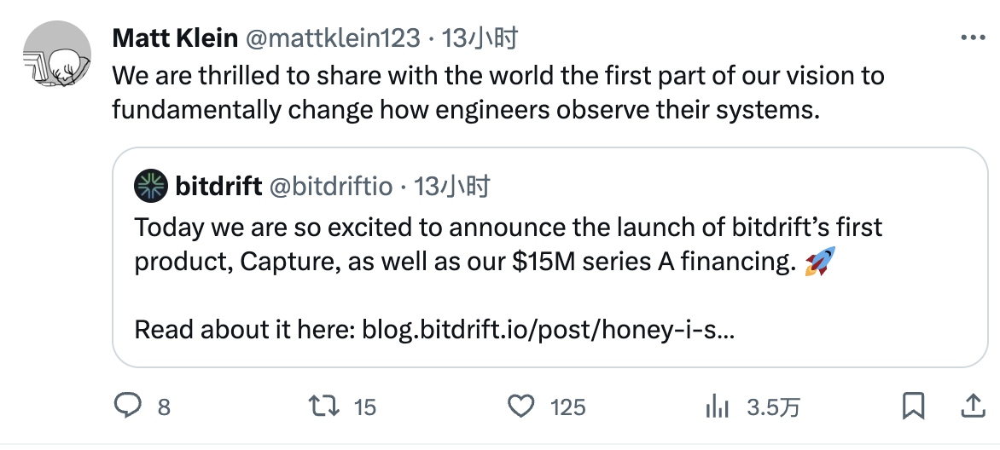
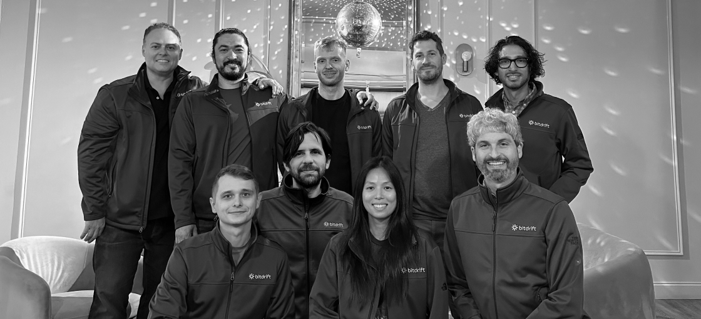

云原生社区报道：

近期，Matt Klein——Envoy 代理的创造者——领导下的创业公司 Bitdrift 发布了他们的首款产品：Capture。这款专注于移动端可观测性的产品获得了 1500 万美元 A 轮融资，由 Amplify Partners 领投。这标志着 Bitdrift 在解决移动和服务器端可观测性问题方面迈出了重要的一步。

Bitdrift 的创始缘起于团队在规模化构建互联网基础设施时的挑战和挫折。公司团队来自 Twitter、AWS、Square、Google、Microsoft、Netflix 等知名企业，他们认为当前的可观测性生态系统存在供应商和消费者之间的不匹配问题。Bitdrift 旨在通过实时动态控制，仅发出可能用于解决客户问题的遥测数据，以改变这一现状。

目前，移动端可观测性被认为是浪费、无序且远落后于服务器端。大约 95% 用于监控系统健康的数据从未被阅读。与此同时，移动工程师在生产中拥有的分析事件集合通常是静态的，而且调整这些事件以调试正在进行的问题可能需要数周甚至数月的时间。

Capture 通过在 iOS 和 Android 上实现发出会话遥测数据的动态实时控制，改变了可观测性游戏的规则。这个系统允许对设备进行即时定位，从所有客户端到特定群体，甚至个别设备。结合先进的本地存储和实时配置，Capture 支持分布式搜索和遥测数据，使得数据仅在解决客户问题时才被请求和发送。

Capture 的本地存储解决方案核心是所谓的“环形缓冲区”，一种高性能的子系统，使用有界且实时可配置的 RAM 和磁盘空间。数据首先被刷新到 RAM，然后在后台级联到磁盘。Capture 还包括高效且注重隐私的会话回放实现，可以捕获移动屏幕状态的 2D 和 3D 表示。

Capture 已在 Lyft 应用中部署到数百万设备上，并在大规模下经过战斗测试。它已准备好为全球的组织解决现实世界的挑战【18†source】。

Bitdrift 的愿景是开创可观测性的未来。通过 Capture，Bitdrift 开始了一段旅程，将本地遥测存储与实时控制和分布式搜索相结合，这不仅适用于移动端，而且适用于整个分布式系统——从每个服务器到移动边缘。

作为云原生社区，我们对 Matt Klein 和 Bitdrift 团队在改善可观测性生态系统方面的努力表示赞赏。他们的创新不仅对移动工程师，而且对整个分布式系统的健康和效率具有深远影响。欢迎来到可观测性的未来。

## 参考

- [Bitdrift 介绍](https://bitdrift.io/about)
- [Honey, I shrunk the telemetry](https://blog.bitdrift.io/post/honey-i-shrunk-the-telemetry)
