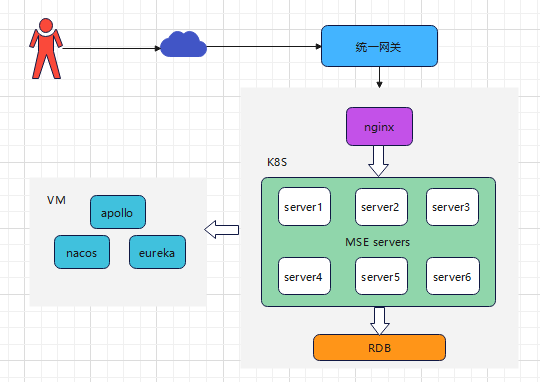
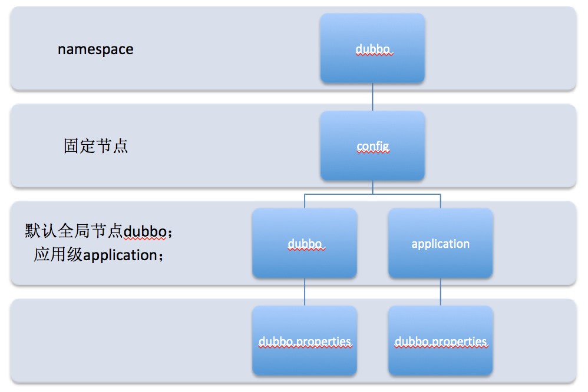
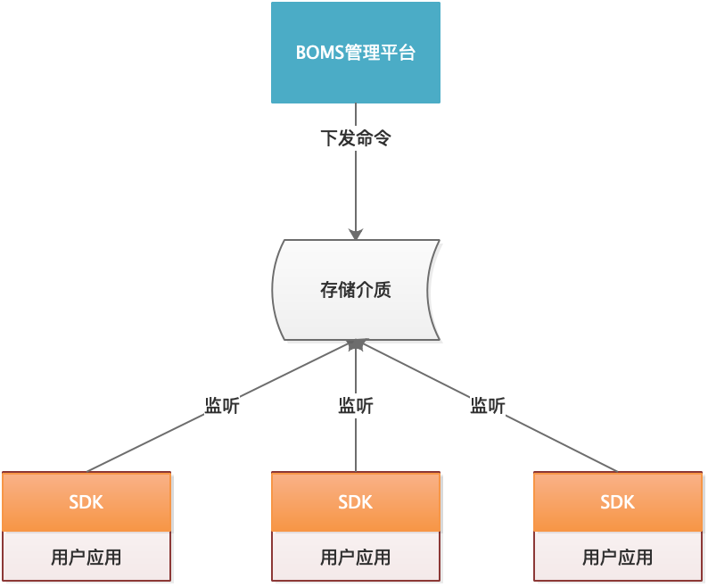

## 摘要

微服务引擎（Micro Service Engine 后面简称 MSE）是面向业界主流开源微服务生态的一站式微服务治理平台，兼容 Spring Cloud、Dubbo 微服务框架，提供高可用、免运维的服务注册中心（支持 Eureka/ Nacos/ZooKeeper）、配置中心（支持Apollo）和监控中心（支持Skywalking），实现对微服务的治理和监控。基于云原生环境下，微服务引擎又是如何一种架构？微服务引擎产品中Spring Cloud 及 Dubbo 相关服务治理是如何实现的？Spring Cloud 框架下如何实现参数的动态配置呢？

## 前言

在云原生主流发展的环境下，基于需求而来，一种应云而生的微服务引擎架构，显然是脱颖而出，得到业界的普遍关注。服务治理，对于 Srping Cloud 类型的服务和 Dubbo 类型的服务，本文也给出了不同的设计方案。而针对常用的 Srping Cloud 类型的服务，做了详细的服务治理剖析，以及通过具体的案例解析相应的治理过程。
                                                
## MSE 部署组网架构实现

MSE 采用 nginx 网关作为流量入口，统一转发路由到各个服务；应用端面向 op 用户，访问请求经 op 网关进行统一管理。

具体的部署组网架构图如下：



## Dubbo 服务治理

Dubbo 服务的治理，社区提供的治理方案是自由编辑 yaml 格式的参数配置，然后将配置信息写入到注册中心 zookeeper 的配置节点上。微服务引擎在设计时，首选推荐的图形化方式引导选择或输入的方式，同时也保留了自由编辑 yaml 格式的参数配置的方式。

Dubbo 服务治理的配置都存储在 `/dubbo/config` 节点，具体节点结构图如下：



- namespace，用于不同配置的环境隔离。
- config，Dubbo 约定的固定节点，不可更改，所有配置和服务治理规则都存储在此节点 (/dubbo/config) 下。
- dubbo/application，分别用来隔离全局配置、应用级别配置：dubbo是默认group值，application对应应用名
- dubbo.properties，此节点的 node value 存储具体配置内容

通过可视化配置可以实现 Dubbo 服务的负载均衡、条件路由、标签路由、黑白名单策略。
1. 负载均衡：在集群负载均衡时，Dubbo 提供了多种均衡策略，缺省为随机调用。随机，轮询，最少活跃调用数。
2. 条件路由：以服务或消费者应用为粒度配置路由规则。
 例如：设置应用名为 app1 的消费者只能调用端口为 20880 的服务实例，设置 samples.governance.api.DemoService 的 sayHello 方法只能调用所有端口为 20880 的服务实例。
3. 标签路由：通过将某一个或多个服务的提供者划分到同一个分组，约束流量只在指定分组中流转，从而实现流量隔离的目的，可以作为蓝绿发布、灰度发布等场景的能力基础。
4. 黑白名单：是条件路由的一部分，规则存储和条件路由放在一起，为了方便配置所以单独拿出来，可以对某一个服务，指定黑名单和白名单。

## Srping Cloud 服务治理

通过可视化配置可以实现 Spring Cloud 服务的负载均衡、限流、熔断、降级、超时策略以及参数的动态化配置，通过 BOMS 管理平台，负责接收用户请求，将用户数据持久化到存储介质；存储介质用来存储用户操作数据，例如项目负载均衡策略；在使用上述治理功能时，依赖于 apollo 的参数动态生效功能以及自研的 SDK 负责监听存储介质，动态更新负载均衡策略，存储介质基于 Apollo 根据存储介质中访问控制策略，增加访问控制拦截负责监听存储介质，动态更新是否启用容错重试机制，以及动态更新重试次数等功能；后面章节会从 apollo 的参数动态生效以及 SDK 两方面详细介绍微服务引擎时如何纳管 springcloud 服务实现流量治理过程。  

如果用户的微服务需要通过 mse 纳管进行流量治理，首先需要在 mse 里订购注册中心及配置中心 apollo 实例，然后对用户的服务进行部分改造，引入 SDK 工具包，并且在服务的配置文件里需要配置 apollo 的 meta 地址以及 apollo 的 namespaces: application,circuit-breaker,fault-tolerant,loadbalance,timeout，这五个 namespace 分别对应五种治理功能：参数动态配置、熔断降级、容错、负载均衡、超时策略。

下图是 Spring Cloud 服务治理结构图：



1. 负载均衡：基于当出现访问量和流量较大，一台服务器无法负载的情况下，我们可以通过设置负载均衡的方式将流量分发到多个服务器均衡处理，从而优化响应时长，防止服务器过载。
 该功能对使用 Ribbon 组件的服务进行参数设置，可以对调用不同的服务采取不同的负载均衡策略，热生效。可以通过新增规则配置负载均衡策略，设置参数支持轮询、随机、权重轮询等多种负载均衡策略。
2. 应用限流：在分布式系统中，如果客户端依赖多个服务，在一次请求中，某一个服务出现异常，则整个请求会处理失败。Netflix 的 Hystrix 组件可以将这些请求隔离，针对服务限流，防止任何单独的服务耗尽资源。
Hystrix 有两种限流方式：线程池隔离、信号量隔离。线程池隔离可以设置线程池的大小，信号量隔离可以设置最大并发数。
3. 服务熔断：针对使用 Hystrix 组件的服务进行设置。在访问量和流量过大时，可以强制性对一些不重要接口进行熔断，系统调用该接口时，就会直接走降级方法，而不会实际去调用某个外部服务。
强制开启熔断需要人工进行参与。非人工参与的熔断，可以通过设置条件熔断来实现，例如可以设置如果一个时间周期内 (10 秒) 内，当请求个数达到阈值 20 时情况下，如果请求错误率达到 50%，自动开启熔断 5 秒钟。
4. 服务降级：针对使用 Hystrix 组件的服务进行设置。可以预先设置后接口如果调用失败后返回的预留信息。该功能一般配合熔断功能一起使用。
5. 超时策略：使用 Ribbon 组件的服务，可以通过设置“连接超时时间”、“请求超时时间”参数，从而控制调用外部服务多长时间不成功就判定为调用失败。
6. 集群容错：使用 Ribbon 组件的服务，可以设置调用出错自动重试的策略。例如，可以设置在同一台实例最大重试次数，可以设置重试其他实例最大重试次数。

## MSE 如何实现参数动态配置 

mse 纳管 springcloud 服务是强依赖于 apollo 配置中心的，是借助于 apollo 强大的微服务配置管理功能，apollo 是携程研发并开源的一款生产级的配置中心产品，它能够集中管理应用在不同环境、不同集群的配置，配置修改后能够实时推送到应用端，并且具备规范的权限、流程治理等特性。

修改 Spring 配置文件，增加 Apollo 配置中心的相关参数。

```application.yml
#Apollo appId 根据服务名称，服务名称不可重复
app:
  id: ${spring.application.name}
apollo:
  #Apollo meta 地址，如果跳过 apollo meta server 的话，不配置该属性，但是需要在启动脚本中添加以下参数
  #-Dapollo.configService=http://config-service-url:port（多个 configserver 地址之间用逗号隔开）
  meta: ${APOLLO_ADDR:http://166.88.66.8:8080,http://166.88.66.9:8080,http://166.88.66.10:8080}
  bootstrap:
    enabled: true
    #引入哪些 namespace
    namespaces: application,circuit-breaker,fault-tolerant,loadbalance,timeout
```

在服务启动类上增加注解@EnableApolloConfig，启用 Apollo 配置中心功能。

```java
@SpringBootApplication
@EnableHystrix
@EnableApolloConfig
@EnableDiscoveryClient
@EnableFeignClients
@EnableSwagger2
public class ConsumerDemoHystrixApplication {

    @Bean
    public RestTemplate restTemplate() {
        SimpleClientHttpRequestFactory requestFactory = new SimpleClientHttpRequestFactory();
        requestFactory.setConnectTimeout(30000);// 设置超时
        requestFactory.setReadTimeout(30000);
        RestTemplate restTemplate = new RestTemplate();
        restTemplate.setRequestFactory(requestFactory);
        return restTemplate;
    }
```

用户的 springcloud 服务启动时，在 ApplicationContextInitializer 初始化阶段，会把配置文件中 application，circuit-breaker，fault-tolerant，loadbalance，timeout 这五个 namespace 进行遍历，并读取已经配置好的参数，加载到当前服务的 Environment 中，在执行每个 namespace 的 initializer 时，会调用 RemoteConfigRepository 中的方法，通过远程 Repository，实现从 ConfigService 拉取配置，缓存配置，并通过实时机制、定时机制从 ConfigService 中获取最新的配置参数。

```java
public RemoteConfigRepository(String namespace) {
        this.m_namespace = namespace;
        this.m_configCache = new AtomicReference();
        this.m_configUtil = (ConfigUtil)ApolloInjector.getInstance(ConfigUtil.class);
        this.m_httpUtil = (HttpUtil)ApolloInjector.getInstance(HttpUtil.class);
        this.m_serviceLocator = (ConfigServiceLocator)ApolloInjector.getInstance(ConfigServiceLocator.class);
        this.remoteConfigLongPollService = (RemoteConfigLongPollService)ApolloInjector.getInstance(RemoteConfigLongPollService.class);
        this.m_longPollServiceDto = new AtomicReference();
        this.m_remoteMessages = new AtomicReference();
        this.m_loadConfigRateLimiter = RateLimiter.create((double)this.m_configUtil.getLoadConfigQPS());
        this.m_configNeedForceRefresh = new AtomicBoolean(true);
        this.m_loadConfigFailSchedulePolicy = new ExponentialSchedulePolicy(this.m_configUtil.getOnErrorRetryInterval(), this.m_configUtil.getOnErrorRetryInterval() * 8L);
        this.gson = new Gson();
        this.trySync();
        this.schedulePeriodicRefresh();
        this.scheduleLongPollingRefresh();
}
```

- namespace：通过 application 配置加载。
- this.trySync()：尝试同步配置信息。
- this.schedulePeriodicRefresh()：初始化定时刷新配置。
- this.scheduleLongPollingRefresh()：注册自己到 RemoteConfigLongPollService，通过长连接实现配置更新，并实时通知。
- this.scheduleLongPollingRefresh() 是 apollo 中的长轮询刷新机制，客户端和服务端保持了一个长连接，从而能第一时间获得配置更新的推送，这也是为什么通过 apollo 配置参数，可以立刻在客户端获取到的原因。
- this.schedulePeriodicRefresh() 是 apollo 中的一个定时刷新配置机制，通过定时刷新，客户端会定时从 Apollo 配置中心服务端拉取应用的最新配置，已经有了上面的长轮询刷新机制为什么还要一个定时刷新机制呢？这是 apollo 的一个 fallback 机制，是防止推送机制失效导致配置不更新问题。

在 springcloud 的 ApplicationContextInitializer 执行完后，apollo 中的所有 namespace 配置都加载到了 Environment 中，并且每个 namespace 都起了两个线程，一个定时获取配置，一个实时获取配置。当我们在 application 的 namespace 中对参数进行增删改的时候，apollo 通过这两个线程可以实时获取到参数的修改，那么又是怎样通知 springcloud 服务参数修改的呢？

当我们修改了配置参数后，长轮询线程会立刻获取当前 namespace 下的所有配置参数，并调用 doLongPollingRefresh 进行后续的操作，首先从缓存中获取修改前的所有配置的值，然后与当前长轮询线程中的配置参数进行比较，如果有配置参数不同，则调用 fireRepositoryChange 进行处理，在 fireRepositoryChange 中会遍历所有的 RepositoryChangeListener 监听器进行配置修改操作，最终是调用 beanFactory.resolveEmbeddedValue(placeholder) 解析@Value 的值，并通过 updateSpringValue 修改内存中的值。

```java
public void onChange(ConfigChangeEvent changeEvent) {
        Set<String> keys = changeEvent.changedKeys();
        if (CollectionUtils.isEmpty(keys)) {
            return;
        }
        for (String key : keys) {
            Collection<SpringValue> targetValues = springValueRegistry.get(beanFactory, key);
            if (targetValues == null || targetValues.isEmpty()) {
                continue;
            }
            for (SpringValue val : targetValues) {
                updateSpringValue(val);
            }
        }
    }
```
首先通过 event 拿到所有变更的 keys；然后遍历 keys，通过 springValueRegistry.get(beanFactory, key) 拿到 SpringValue 集合对象，这个 springValueRegistry 是在 springcloud 启动的时候，通过后置处理器 SpringValueProcessor 处理的所有@Value 的值（apollo 不仅可以处理@Value 值，还可以处理通过@ApolloConfigChangeListener 注解的值）；最后遍历 SpringValue 集合，逐一通过反射改变内存中字段的值。

参数配置只需要动态修改 spring 中的 Environment 值就可以实现参数动态配置，但是像熔断降级、容错、负载均衡、超时策略等流量治理策略实现动态配置，不仅需要动态修改 Environment 值，还需要使实现熔断降级、容错、负载均衡、超时策略的 Ribbon、Feign、hystrix 机制动态更新。

## MSE 使用 Hystrix 的方式

1. 使用@HystrixCommand 注解的方式

由于熔断使用到了 hystrix 的一些配置作为资源隔离，所以被接入平台的服务在使用 hystrix 的方式上如果使用了@HystrixCommand 的方式，需要注意以下几点：

使用案例： 

```java
@HystrixCommand(commandKey = "/test_hystrix_command", groupKey = "hystrix-thread-pool",
            threadPoolKey = "hystrix-thread-pool", fallbackMethod = "fallback")
```

注解需要按照以下规则填写以上的三个配置参数：

- commandKey

该参数表示该接口的 api 名称，是某个方法/接口的标识

注意：为了避免应用下的服务众多，导致该标识不好识别接口的归属，这里要做一个规划，例如：当前服务名#方法/接口名，仅供参考。

- groupKey

该参数表示这个接口/方法属于哪个组,一般这里填写被调用的外部服务名（假设消费者服务调用了提供者服务，这里填写提供者服务的服务名，需要保证与spring.application.name的值相同）

- threadPoolKey（可以不填，默认会使用 groupKey 的值）

该参数表示线程池的名称，这里要与 groupKey 的值保持一致

- fallbackMethod

该参数该调用发生熔断后的处理方法

2. 使用@FeignClient 的方式

@FeignClient 注解其实是在@HystrixCommand 的基础上做了一些封装，这里的 value 值会设置为@HystrixCommand 中的 groupKey 和 threadPoolKey 值，而 commandKey 会设置为类名#方法名（参数类型）

```java
@Component
public class UserServiceFeignClientFallbackFactory implements FallbackFactory<UserServiceFeignClient> {
Logger logger = LoggerFactory.getLogger(UserServiceFeignClientFallbackFactory.class);

    @Override
    public UserServiceFeignClient create(Throwable cause) {
        return new UserServiceFeignClient() {
            @Override
            public String testAccessMethodGet() {
                cause.printStackTrace();
                return "我是服务降级方法";
            }
```

使用案例

```java
@FeignClient(value = "${provider.service.name}", fallbackFactory =UserServiceFeignClientFallbackFactory.class)
public interface UserServiceFeignClient {
```
- value
该参数表示该接口的目标服务名称，一般这里填写被调用的外部服务名（假设消费者服务调用了提供者服务，这里填写提供者服务的服务名，需要保证与 spring.application.name 的值相同）	
- fallback
该参数该调用发生熔断后的处理方法类。

后文以超时策略为例，阐述 MSE 是如何纳管 springcloud 服务实现超时策略动态更新。

## MSE 如何实现超时策略

要想使用 MSE 纳管自己的服务实现超时策略，首先要对自己的 springcloud 服务进行稍许改造，添加 mse-sc-datasource-apollo 以及 mse-sc-feature-timeout 两个自定义的 SDK，当项目启动时，会进行一些初始化操作，我们知道 springcloud 中的超时策略时通过 Ribbon 实现的，因此我们的目标是修改超时参数，使超时参数的动态生效，并进行 Ribbon 的动态加载。

1. 把 ApolloDataSource 放入 spring 的 IOC 容器里。
```java
@Configuration
@ConditionalOnClass
@ConditionalOnProperty(value={"spring.application.govern.datasource.type"}, havingValue="Apollo", matchIfMissing=true)
public class ApolloAutoConfiguration
{
  @Bean
  @ConditionalOnClass(name={"com.ctrip.framework.apollo.build.ApolloInjector"})
  public ApolloDataSource apolloDataSource()
  {
    return new ApolloDataSource();
  }
}
```
2. 在 ApolloDataSource 中，是通过 guava 的 Eventbus 监听事件的发布事件消息，当监听到事件的发布，根据不同 namespace 处理不同的数据治理服务，并初始化一个 apollo 的配置修改监听器 ConfigChangeListener。
```java
@Subscribe
  public void listenerConfig(DataSourceEvent dataSourceEvent)
  {
    DataEvent dataEvent = dataSourceEvent.getDataEvent();
final String namespace = dataEvent.getNamespace();
#处理不同的namespace，MSE一共可以处理五种默认的namespace
    if (!this.map.keySet().contains(namespace))
    {
      EventBus eventBus = new EventBus();
      this.map.put(namespace, eventBus);
      eventBus.register(dataSourceEvent.getConfigListener());
      final Config config = ConfigService.getConfig(namespace);
      
      List<RuleEvent> configs = loadConfig(config, config.getPropertyNames());
      ((EventBus)this.map.get(namespace)).post(new ConfigEvent(configs));
      ConfigChangeListener configChangeListener = new ConfigChangeListener()
      {
        public void onChange(ConfigChangeEvent changeEvent)
        {
          try
          {
            List<RuleEvent> result = ApolloDataSource.this.loadConfig(config, changeEvent.changedKeys());
            ((EventBus)ApolloDataSource.this.map.get(namespace)).post(new ConfigEvent(result));
          }
          catch (Exception e)
          {
            ApolloDataSource.this.logger.error("config load exception", e);
          }
        }
      };
      #增加一个apollo的ConfigChangeListener，处理参数的动态修改
      config.addChangeListener(configChangeListener);
    }
    else
    {
      ((EventBus)this.map.get(namespace)).register(dataSourceEvent.getConfigListener());
    }
  }
```
3. 当执行 TimeoutListenerInitializer 的 Bean 时，
```java
@Configuration
@ConditionalOnClass
public class TimeoutAutoConfiguration
{
  @Bean
  @ConditionalOnMissingBean
  public TimeoutFactory timeoutFactory(SpringClientFactory springClientFactory, ApplicationContext applicationContext)
  {
    return new TimeoutRibbonFactory(springClientFactory, applicationContext);
  }
  
  @Bean
  @ConditionalOnBean({TimeoutFactory.class})
  public TimeoutListenerInitializer timeoutListenerInitializer(TimeoutFactory timeoutFactory, Environment environment)
  {
    return new TimeoutListenerInitializer(timeoutFactory, environment);
  }
}
```
会发布超时策略的 DataSourceEvent 消息，被上述 ApolloDataSource 中的监听器监听到，并初始化一个 namespace 为 timeout 的 ConfigChangeListener。
```java
private void initialize()
  {
    DataEvent dataEvent = new DataEvent();
    dataEvent.setType("TIMEOUT");
    dataEvent.setNamespace(this.environment.getProperty("govern.namespace.timeout", "timeout"));
    DataSourceEventManager.post(new DataSourceEvent(dataEvent, new TimeoutRuleListener("TIMEOUT", this.timeoutFactory)));
  }
```
4. 当 timeout 超时策略被修改的时候，apollo 客户端的长轮询机制会监听到配置修改，并通过 SDK 中的 ConfigChangeListener 进行处理，ConfigChangeListener 调用 TimeoutRibbonFactory 中的 operator 函数处理超时参数，并通过 applicationContext.publishEvent 发布修改的超时参数到环境变量里，最后通过 config.loadDefaultValues() 重新加载 Ribbon，使刚才修改的超时参数生效。
```java
 private void releaseRibbonTimeoutConfig(String key, String value)
  {
    if ((key.contains("ribbon.ConnectTimeout")) || (key.contains("ribbon.ReadTimeout")))
    {
      Set<String> keys = new HashSet();
      IClientConfig config;
      if ((key.startsWith("ribbon.ConnectTimeout")) || (key.startsWith("ribbon.ReadTimeout")))
      {
        config = this.springClientFactory.getClientConfig("default");
      }
      else
      {
        String name = key.split("\\.")[0];
        config = this.springClientFactory.getClientConfig(name);
      }
      keys.add(key);
#更新相应的bean的属性值
      this.applicationContext.publishEvent(new EnvironmentChangeEvent(keys));
      #重新加载config配置
      config.loadDefaultValues();
    }
  }
```

通过上述方式，我们就可以通过 MSE 修改用户自己的服务，实现超时参数配置并可以进行修改。

## 总结

本文通过介绍基于云原生的 MSE 整体设计架构，支持两种主流的代码开发框架。针对 Dubbo 类型服务，不需要依赖使用自研 SDK，服务治理的配置信息，通过注册中心 zookeeper 实现存储加载。详细阐述 MSE 纳管 springcloud 类型服务，最重要的是依赖于 apollo 的动态参数生效机制的实现过程，并通过自研的 SDK 包，自定义 ConfigChangeListener 处理多种数据治理服务。
虽然本文提到的基于云原生环境下的微服务引擎在服务治理过程中，部署配置中心、注册中心以及监控服务时会采取底层后台调用 op 接口开通云主机，然后部署底层基础镜像的方式，把服务全部启动起来，看起来整个架构比较笨重。但是，整个架构设计，以及功能还是比较完备的，通过支持多种主流开发框架，支持多种主流配置中心及注册中心，监控功能也比较完善，所以仍然值得我们继续的深挖研究。在不破坏功能完整性，以及技术主流的前提下，我们仍然试图考虑将微服务引擎改造为更为主流的云原生服务网格 Istio 架构，来充分融入云原生，使得服务治理更主流，更快捷，更加的安全等。敬请大家期待...
