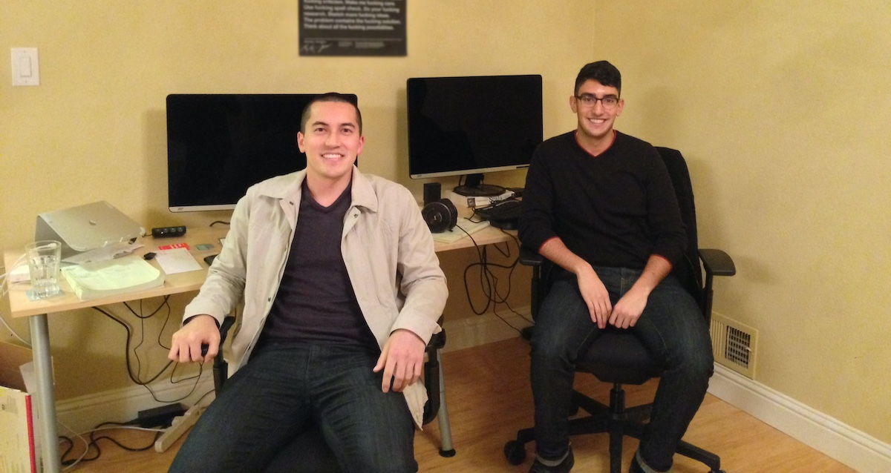

云原生社区报道：Mitchell Hashimoto 的离职意味着 HashiCorp 这一领先的云原生工具和解决方案提供商将迎来新的篇章。他在离开之际分享了对过去的回顾和对未来的展望。HashiCorp 社区和生态系统将继续发展壮大，我们期待看到他们在云原生领域取得更多的成功。

下文是 Mitchell Hashimoto 在 Hashicorp 官网上发布的[离职感言](https://www.hashicorp.com/blog/mitchell-reflects-as-he-departs-hashicorp)。

## 正文

在经过超过 11 年的时光后，HashiCorp 共同创始人 Mitchell Hashimoto 写下了一封深情的告别信，向他所帮助创立的公司告别。

*2023 年 12 月 14 日，作者：[Mitchell Hashimoto](https://www.hashicorp.com/blog/authors/mitchell-hashimoto)*

本周早些时候，我向 HashiCorp 的员工发送了这封信，并在这里发布，以让整个 HashiCorp 社区了解我的计划：

今天，我有一些双重情感要与大家分享：我决定离开 HashiCorp，不久后将不再是该公司的员工。我刚刚庆祝了自从开始 HashiCorp 以来的 11 年，回顾过去的十年，我认为自己无法找到更好的方式来度过我生命的这一部分。

我离开 HashiCorp 是我长时间以来一直在思考和策划的事情。自从创立 HashiCorp 以来，我一直觉得有必要建立一个公司，我不必参与日常运营，其他领导者可以随着时间推移继续前进。随着时间的推移，我对此非常有意识：2016 年辞去首席执行官职务，随着时间的推移，不断改进领导层自治文化，不需要我的参与来做出决策，最终在 2021 年[离开了领导团队和董事会](https://www.hashicorp.com/blog/mitchell-s-new-role-at-hashicorp)。从那时起，我有幸全职从事我最喜欢的工作——作为一名全职的、亲自动手的工程师。

作为一名工程师，我的激情不仅限于基础架构，我一直知道，某个时候——当公司和我准备好的时候——我会继续前进，承担新的、不同的挑战。我的家庭最近迎来了我们的第一个孩子，休息期间，我觉得现在是完成这个过渡的合适时机。云自动化和基础架构工具领域仍然充满了机遇和增长，但在专门从事这个领域的工具近 15 年后，我已经准备尝试新的领域。

尽管我离开 HashiCorp 正是我计划的，但这仍然是一个令人难以忘怀的时刻。几乎我整个成年生活都与这家公司有关。我最具有决定性的记忆中有许多不容忽视的瞬间。在这里无法一一列举，但我想突出几个。

早在我们创办 HashiCorp 之前，我和 Armon [Dadgar，HashiCorp 共同创始人兼首席技术官] 经常讨论云、自动化和分布式系统。那时我们还是青少年，我们曾玩笑地——并非认真——说过类似的话：“如果有一天最大的公司使用我们的软件会怎么样？”然而，有一天，我们迈出了第一步，将一些想法变成了实际的代码。接下来，我们意识到我们拥有了成千上万的用户。然后，我们又迈出了一步，创办了一家公司。再过一段时间，我们又迈出了下一步，决定筹集资金。这就是 HashiCorp 今天的样子：我们像这样迈出了许多小小的步骤，直到我们发现那种玩味十足的、青少年的理想主义已经成为现实。

正式开始后，我觉得一些“第一次”尤为重要。[2015 年的第一届 HashiConf](https://www.hashicorp.com/blog/hashiconf-2015-wrap-up) 将永远是一个特殊的回忆。这是数字世界真正跨足物理世界的第一次，很难相信其中的任何一部分是真实的。我知道我们的下载量很高，我知道我每天都与社区成员在线互动，但看到数百人愿意亲自出席却是一种完全不同的体验。我感到非常自豪，但那也是我第一次感到责任的沉重。我感到内心挣扎，一方面想要建设，但另一方面需要引导我和 Armon 创建的这家公司。我非常感谢那些早期采用者和员工们参加了这次活动。

几年后，我们的第一次全公司内部外出活动是我下一个重大的“哇”的经历。出席的人数比第一届 HashiConf 还要多！我和 Armon 一起创办了这家公司，专注于我对技术的激情，但像这样的时刻教会了我人员也同样重要。人和我们共享的经历是我现在最怀念的东西。

在我与 HashiCorp 的历史中，还有许多类似的影响深远的时刻，我为其中每一个经验（甚至是艰难的经验）都感到感激，因为它是实现每个个体里程碑的必要步骤之一。

我与 Armon 已经一起工作了将近 15 年（甚至在 HashiCorp 之前就开始了！），与 Dave [McJannet，HashiCorp CEO] 已经合作了 7 年多。我们一起领导了公司，直到我在 2021 年退出了领导团队。除了是同事，我们已经成为亲密的朋友。我继续信任他们的领导才能，将非常怀念与他们一起工作的时光。

我们创办这家公司的多云等有争议的世界观现在已经成为主流，[得到广泛接受](https://www.hashicorp.com/state-of-the-cloud/2021)。我帮助创办的软件被从业者广泛使用，从世界上最大的公司的业余爱好者到专业人士。最近，[GitHub Octoverse 报告](https://solutionshub.epam.com/blog/post/programming-language-popularity-on-github) 发现 HashiCorp 配置语言（HCL）再次成为开源项目中使用最多的语言之一。这些只是一些例子，显示了 HashiCorp 在行业中持续产生的影响、增长和光明未来。这已经超出了我所能期望的，我离开时为自己在实现这一切中扮演的小角色感到自豪。

正如我之前所说，几乎我整个成年生活都与 HashiCorp 有关。这家公司不仅对我的生活产生了巨大的影响，也对许多人的生活产生了巨大的影响，包括我们充满激情的社区、珍贵的客户、众多亲密的生态伙伴和我们了不起的员工。感谢大家的支持和信任。最后，我衷心祝愿整个公司一切顺利。我将为你们加油打气，感激我为塑造 HashiCorp 的旅程做出的贡献，期待看到你们接下来将要做的事情。

## 评价

Mitchell Hashimoto 的离职标志着他个人职业生涯的新篇章，同时也对 HashiCorp 公司和云原生领域带来了重大影响。作为公司的共同创始人之一，他在 HashiCorp 中度过了 11 年，为公司成功发展做出了巨大贡献。离开公司，他追求新的挑战，反映了公司文化演进，强调了领导力的重要性。他的工作对云原生社区和生态系统产生了深远影响，HashiCorp 的工具广泛应用于云原生领域。他的离职不会改变 HashiCorp 在该领域的地位，同时为他提供了继续成长和探索新领域的机会，也让公司有机会吸引新领导者和推动创新。
