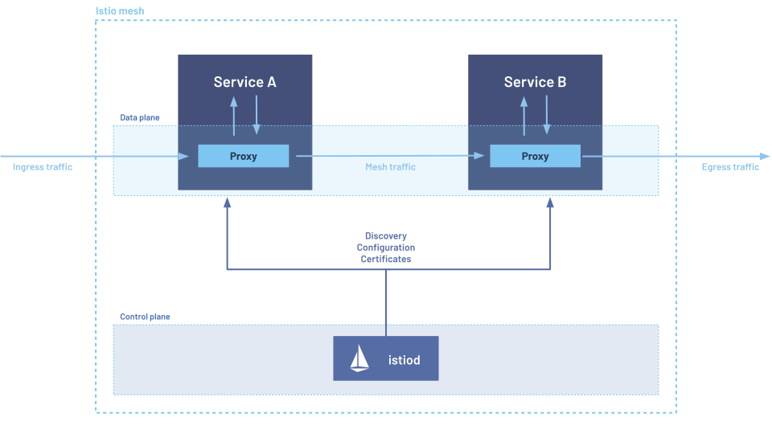

在与 Kubernetes 用户的对话中，经常会听到这样一句话：“我只想让我的所有流量在 Kubernetes 中实现 mTLS 加密。”有时，这种要求还会加上一些附加条件，比如“……但不要涉及服务网格的复杂性。”

这是一个合理的需求，市面上有很多解决方案，各自有不同的取舍。在本文中，我将介绍几种选择，并提供一些建议。

> 为什么要求是“mTLS”，而不是更广泛的“加密”？原因有很多。有些人可能已经对各种加密机制进行了研究，并决定使用 mTLS，而有些人可能对其他选项不了解。在本文中，我将主要关注 mTLS。

## 为什么选择 mTLS

在深入探讨 mTLS 的最佳方案之前，我们有必要先理解为什么要使用它。

mTLS 代表双向 TLS，这与互联网上大多数使用的加密（如 `https://`）类似，但它是双向的。

在标准的互联网场景中，浏览器会验证目标网站的 TLS 证书，以确认 `bank.com` 确实由 `bank.com` 操作，而不是遭遇[中间人攻击（MITM）](https://en.wikipedia.org/wiki/Man-in-the-middle_attack)。网站也可能会验证用户，但通常是在应用层进行，而不是通过 TLS。

双向 TLS 则是类似的机制，但**客户端**也会提供一个证书，该证书需要被服务器验证。浏览器技术上也支持这种方式，但由于操作上的复杂性，实际应用非常少。

在 Kubernetes 集群（或其他基础设施）内部使用双向 TLS 的好处与在互联网上的应用类似。它提供了**身份验证**（双方都能证明自己的身份）、**机密性**（窃听者无法看到交换的数据）、以及**完整性**（数据在传输中不会被篡改）。

这些属性是实现[零信任](https://www.cloudflare.com/learning/security/glossary/what-is-zero-trust/#:~:text=Zero Trust security is an,outside of the network perimeter.)安全策略的重要一步。此外，它们也是满足各种合规要求（无论是公司内部政策还是政府标准，如[FIPS](https://www.nist.gov/standardsgov/compliance-faqs-federal-information-processing-standards-fips)）的常见要求。

## 实现 mTLS 的选项

一旦你决定要使用 mTLS，你需要选择如何去实现它。这里有几种不同的方法。

### 自行实现

传统的方法是为所有应用程序配置证书，并修改应用程序以使用这些证书。这在小规模环境中可能还算简单，但在大规模环境中则极具挑战性。主要问题如下：

首先，需要管理证书的配置。这包括命名方案的制定、信任根的分发、证书的签发、确保证书的轮换和更新等。工具如 [`cert-manager`](https://cert-manager.io/docs/usage/csi-driver/) 和 [`SPIRE`](https://spiffe.io/) 可以帮助解决部分问题。但根据我的经验，许多用户在采用这种方法时，往往需要修改已有的证书基础设施以适应 Kubernetes。

在管理好证书后，还需要修改应用程序以开始使用 TLS，并正确发送和验证对等证书。对于大型的多语言部署来说，这可能是一个挑战。虽然让一个应用程序开始使用 TLS 通常是相对简单的，但往往会遇到各种棘手的问题：

- 你无法原子性地更改整个集群。在部分状态下如何处理？
- 如何确保所有流量都在使用 TLS，而不仅仅是某些子集？应用程序可能有多个入口和出口点，是否全部覆盖？
- 如何验证对等证书？是否有跨应用程序的通用逻辑？是否支持所有使用的语言？是否在所有应用中保持更新？
- 所有应用程序是否都支持 TLS？是否支持**双向** TLS？是否支持你的[证书方案](https://spiffe.io/docs/latest/spiffe-about/spiffe-concepts/#spiffe-id)？
- 公司范围内的每个应用程序代码更改的开发和推出需要多长时间？

因此，常常会使用一些更高层的选项来处理这些问题。

### 基于 Sidecar 的服务网格

采用双向 TLS 的最常见方法之一是基于 Sidecar 的服务网格架构。[Istio](https://istio.io/) 和 [Linkerd](https://linkerd.io/) 是其中最受欢迎的两个选项。

从高层次上来说，与其修改应用程序以在代码中处理 TLS，不如在每个应用程序旁边部署一个小型网络代理。这个代理可以做很多事情（请查看相关项目的文档！），但对于本文而言，重要的是它们可以自动为你处理双向 TLS。这意味着你可以在不更改应用程序的情况下自动为网格中的所有工作负载之间的流量启用双向 TLS。

至少从我熟悉的 Istio 和 Linkerd 的角度来看，这些解决方案都能处理上面列出的[棘手问题](https://blog.howardjohn.info/posts/mtls-kubernetes/#do-it-yourself)。特别值得注意的是迁移案例。这两个项目都会根据对等方是否支持 TLS，自动支持发送和接受明文和 TLS。完成迁移（如果可能的话）后，可以严格限定只使用双向 TLS。

这种方法是 Kubernetes 中广泛部署双向 TLS 的最常见选择；我估计在生产环境中的使用率超过95%。

尽管它成功地解决了很多问题，但也存在一些摩擦点。有时服务网格被认为过于复杂或资源消耗过高（CPU/内存或延迟）。许多这些担忧与服务网格的功能超出 mTLS 的范围有关；如果你只需要 mTLS，这种方法可能会显得大材小用。

### 基于节点的 Ambient 模式

Sidecar 方法为提供与 mTLS 无关的功能增加了额外的复杂性，这促使了服务网格新架构的开发： [Ambient 模式](https://istio.io/latest/docs/ambient/overview/)。在这种架构中，部署了一个每节点代理来自动处理双向 TLS。目前，只有 Istio 提供这种方法，所以我将重点介绍它。

Istio Ambient 专门设计来满足“我只想要 Kubernetes 上的 mTLS”这一用例。几乎每一个设计决策都源于这一初始目标。虽然服务网格的全套功能仍然存在，但它提供了一个从“原始 Kubernetes”到“全局 mTLS”再到“全功能服务网格”的平滑过渡，详细内容可以参阅[我之前的文章](https://blog.howardjohn.info/posts/flattening-curve/)。

由于这种模式针对双向 TLS 用例的特殊化设计，Ambient 模式往往更适合并能减轻 Sidecar 方法的一些顾虑。仅使用 Ambient 模式下的 mTLS 功能时：

- 成本大幅降低：在某些部署中，Ambient 方法的 CPU 和内存消耗可能仅为 Sidecar 方法的 1%。
- 性能有所提高：尽管这取决于应用程序，但在某些情况下，服务网格的延迟开销可能会[减少约 20 倍](https://a-cup-of.coffee/blog/istio/#http-benchmark)。需要注意的是，这并不意味着你的应用程序会快 20 倍，而只是减少了开销；这可能意味着你的应用程序从 1000ms 应用延迟 + 1ms 网格延迟，变为 1000ms 应用延迟 + 0.05ms 网格延迟。因此，这可能只在你的应用程序已经非常高效时才更为重要。
- 兼容性增强：服务网格的主要优势之一是 [HTTP 流量管理](https://istio.io/latest/blog/2021/zero-config-istio/#traffic-management)。虽然这通常是一个很好的功能，但它也从根本上改变了功能。Ambient 模式默认不执行此操作（但允许用户选择加入）。
- 复杂性降低：由于节点代理是为提供 mTLS 而专门设计的，因此不会有其他功能带来的附带复杂性。

总体而言，Ambient 模式提供了一种简单的方法，可以在不带来太多负面影响的情况下部署全局 mTLS。对于那些只想要 mTLS 的用户来说，这是一个最好的起点，同时也提供了[逐步采用其他网格功能](https://istio.io/latest/docs/ambient/usage/waypoint/)的可能性。

### 基于 CNI 的方法

在这些讨论中偶尔会提到的一种选项是使用基于 CNI（容器网络接口）的方法。问题是：**目前没有 CNI 支持双向 TLS！**

那么为什么会提到这种方法呢？原因有以下几点。

1. CNI（通常）实现了 `NetworkPolicy`。虽然这不提供 TLS 的大部分特性（包括加密、身份验证、完整性和机密性），但它通常是零信任网络架构的一部分，因此经常被提及。我在另一篇文章中也强调了[NetworkPolicy 的一些问题](https://blog.howardjohn.info/posts/netpol-api/)。
   
2. CNI 通常实现其他网络加密机制。例如，[Calico 提供了 WireGuard](https://docs.tigera.io/calico/latest/network-policy/encrypt-cluster-pod-traffic)，而 Cilium 提供了 [WireGuard](https://docs.cilium.io/en/latest/security/network/encryption-wireguard/#encryption-wg) 和 [IPSec](https://docs.cilium.io/en/latest/security/network/encryption-ipsec/)。虽然这些不是双向 TLS，但它们在功能上有一些重叠。虽然我认为这些往往被认为比实际更等同，但这已经超出了本文的范围——或许可以考虑写一篇文章对这些进行逐一比较。
   
3. Cilium 提供了一项名为[双向认证](https://docs.cilium.io/en/latest/network/servicemesh/mutual-authentication/mutual-authentication)的功能。这通常被称为 mTLS，因为它受到了 mTLS 的启发，并有一些重叠的想法。然而，**这并不是双向 TLS**。这并不是一个语义上的细微差别：它根本不提供 TLS。因此，它属于上述非 mTLS 的选项，需要进行评估。

如果你的需求是“Mutual TLS”，这种方法不可行。如果你的需求更灵活，这些选项中的一些可能会满足你的需求。

## 建议

总结一下：“我只想在 Kubernetes 上实现 mTLS”，我该怎么办？

对于大多数用户，[Ambient 模式](https://blog.howardjohn.info/posts/mtls-kubernetes/#node-basedambient-mesh)可能是最合适的。这是以最小的成本、复杂度和开销，在整个集群上部署 mTLS 的最快方法。

[基于 Sidecar 的](https://blog.howardjohn.info/posts/mtls-kubernetes/#sidecar-based-service-mesh)方法也是一个不错的选择，并且在业界得到了广泛应用。请记住，这些方法提供了大量超出 mTLS 的功能，这取决于你的使用场景，可能会显得大材小用。

[自行实现](https://blog.howardjohn.info/posts/mtls-kubernetes/#do-it-yourself)极具挑战性。虽然这可能适合拥有非常精确的要求和极其健壮的操作实践的组织，但这是最后的选择。
