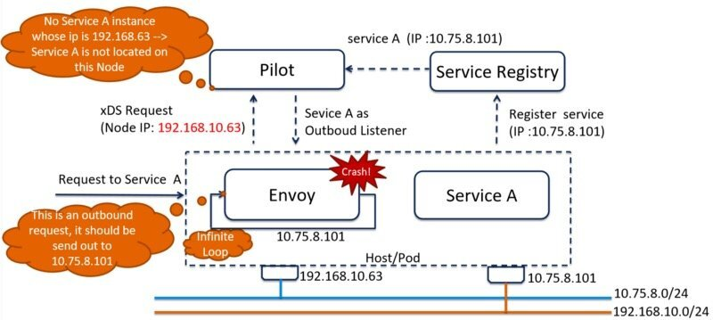
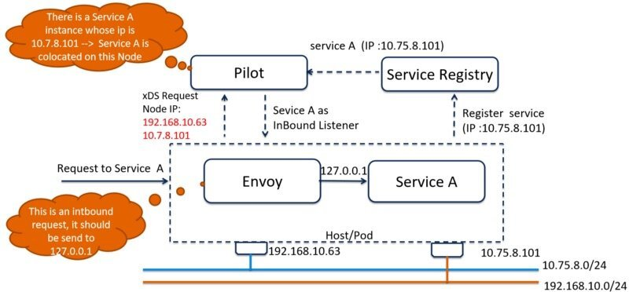

> 本文转载自[赵化冰的博客](https://zhaohuabing.com)。

Istio 1.0 版本只支持在单个网络，即 Mesh 中的服务只能连接在一个网络上。虽然在架构设计上是开放的，但从目前的代码来看，Istio 的内部实现还是和 Kubernetes 高度集成的。由于 Kubernetes 集群中 Pod 缺省只支持一个网络接口，因此 Istio 也存在该限制并不让人意外。

随着 Kubernetes 在 NFV（网络功能虚拟化）领域中的逐渐应用，已经出现多个 Kubernetes 的多网络平面解决方案，Istio 也需要考虑支持多网络平面，以为 5G 的微服务化架构提供服务通讯和管控的基础设施。

## 什么是多网络平面？

多网络平面是一个电信行业的常用术语，即将一个电信设备或者系统同时连接到多个网络上。简而言之，就是一个主机上有多个物理或者虚拟的网络接口，这些接口分别连接到不同的网络，这些网络之间一般是相互独立的。由于电信系统对可靠性的要求非常高，因此系统会通过配置多网络平面来避免不同网络流量的相互影响，提高系统的健壮性。

## 为什么需要多网络平面？

但在一些应用场景下，多网络平面是一个必须支持的重要特性。例如在电信系统中，一般都是有多个网络平面的，电信系统中使用多个网络平面的原因如下：

- 按功能对不同网络进行隔离，以避免相互影响。例如管理流量，控制流量和数据流量分别采用不同的网络平面。
- 通过多个网络的汇聚/绑定，提供网络设计冗余，增强系统的网络健壮性。
- 支持按照不同的网络提供不同的 SLA（服务等级），例如语音 (低延迟) 和视频流量（高带宽）具有不同的特点，需要分别对待。
- 通过网络隔离提高系统的安全性，例如为不同的租户分配不同的网络。
- 在单个网络带宽有限的情况下，通过多个网络接口增加网络的系统带宽。

在电信的 NFV（网络功能虚拟化）领域中，已经有多个针对 Kubernetes 的多网络平面解决方案。其中一个[Kubernetes 推荐的方案](https://kubernetes.io/docs/concepts/cluster-administration/networking/)是中兴通讯提供的[Knitter](https://github.com/ZTE/Knitter/)开源实现。下图展示了 Knitter 是如何实现 Kubernetes 的多网络平面支持的。

Kubernetes 多网络平面开源项目[Knitter](https://github.com/ZTE/Knitter/)

除了 NFV 的应用场景，Istio 也支持除 Kubernetes 之外的其他部署环境，例如虚机和裸金属部署。在这些场景下，一个 Host 具有多个网络接口的场景也是很常见的，例如同时需要被内部和外部网络访问的 Host 就会有两个网络接口。

## Istio 在多网络平面下的问题

在 1.0 版本中，Pilot 在创建 Inbound listener 时未考虑多网络平面的情况，因此在 Envoy 所在节点存在多个 IP 时的处理逻辑存在问题。

下图描述了在多网络平面场景下 Istio 1.1 存在的问题。

Istio 在多网络平面场景下的问题

## 服务注册

1. Envoy 所在节点存在两个网络接口，分别连接到 10.75.8.0/24 和 192.168.10.0/24 两个网络上。
2. Service A 被注册到 Service Registry 中，使用的是第二个网络接口的 IP，即 10.75.8.101。

## Envoy 初始化

1. Envoy 通过 xDS 接口向 Pilot 获取配置信息。
2. Envoy 在 xDS 请求中携带了第一个网络接口的 IP，即 192.168.10.63。
3. Pilot 从 xDS 请求中解析出 Envoy 所在节点的 IP，即 192.168.10.63。
4. Pilot 用 Envoy 节点 IP 来和 Service Registry 中所有 Service Instance 的 IP 进行对比。
5. 由于 Service A 的注册 IP10.75.8.101 和节点 IP192.168.10.63 不一致，Pilot 错误判断该节点上没有 Service A 的 Instance，为 Service A 创建了一个 Outbound Listener。

## 服务请求

1. 节点的网络接口 10.75.8.101 上收到一个来自 downstream 的请求，被重定向到 Envoy。
2. Envoy 在 15001 端口上收到该请求，要求访问 Service A
3. Envoy 根据 Pilot 下发的配置将该请求交由在 Service A 端口的 Outbound Listener，该 Listener 将请求分发到 Service A 的 Outbound Cluster 上，对应 IP 地址为 10.75.8.101。
4. Envoy 将请求发送到 10.75.8.101，经过 TCP/IP 协议栈处理后，进入第二个网络接口，被 Iptable 拦截，再次被作为入向请求转发到 Envoy 的 15001 端口。上述流程形成了一个死循环，最终导致 Envoy 由于文件描述符被用光 而 crash。

## 如何支持多网络平面

从上面的描述可以看到，要支持多网络平面，Istio 需要修改 Pilot 生成 Outbound Listener 的代码实现，下图描述了修改后的处理逻辑。

Istio 多网络平面解决方案

## 服务注册（流程不变）

1. Envoy 所在节点存在两个网络接口，分别连接到 10.75.8.0/24 和 192.168.10.0/24 两个网络上。
2. Service A 被注册到 Service Registry 中，使用的是第二个网络接口的 IP，即 10.75.8.101。

## Envoy 初始化（增加多网络平面处理逻辑）

1. Envoy 通过 xDS 接口向 Pilot 获取配置信息。
2. Envoy 在 xDS 请求中携带所在节点上的所有网络接口的 IP，在本例中即 192.168.10.63 和 10.75.8.101。
3. Pilot 从 xDS 请求中解析出 Envoy 所在节点的所有 IP，在本例中即 192.168.10.63 和 10.75.8.101。
4. Pilot 用 Envoy 节点 IP 来和 Service Registry 中所有 Service Instance 的 IP 进行对比。
5. 由于 Service A 的注册 IP 10.75.8.101 和节点的两个 IP 之一相同，Pilot 判断该节点上存在 Service A 的 Instance，为 Service A 创建了一个 Inbound Listener。

## 服务请求

1. 节点的网络接口 10.75.8.101 上收到一个来自 downstream 的请求，被重定向到 Envoy。
2. Envoy 在 15001 端口上收到该请求，要求访问 Service A
3. Envoy 根据 Pilot 下发的配置将该请求交由在 Service A 端口的 Inbound Listener，该 Listener 将请求分发到 Service A 的 Inbound Cluster 上，对应 IP 地址为 127.0.0。1。
4. Envoy 将请求发送到 127.0.0.1 的 Service A 进程的服务端口上进行处理。

该修改方案已实现并提交 PR 合入到 Istio 代码中，在 1 月份发布的 Istio 1.1 Release 中将会正式支持。

RP: <https://github.com/istio/istio/pull/9688>
Issue: <https://github.com/istio/istio/issues/9441>

## 参考资料

1. <https://kubernetes.io/docs/concepts/cluster-administration/networking/>
2. <https://github.com/ZTE/Knitter/>

