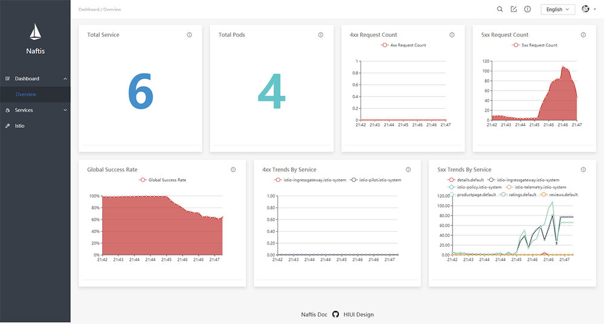
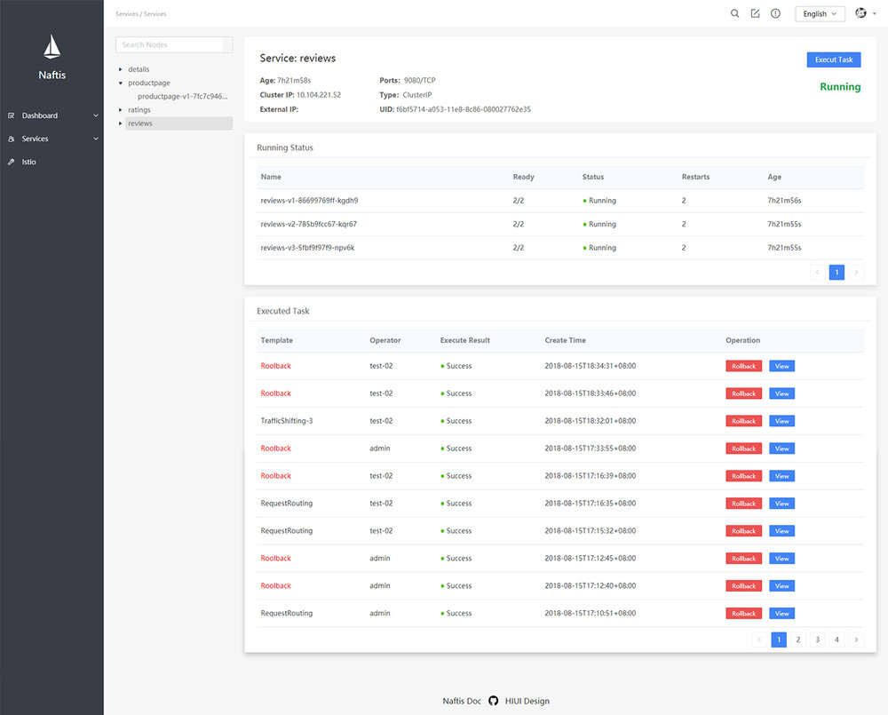
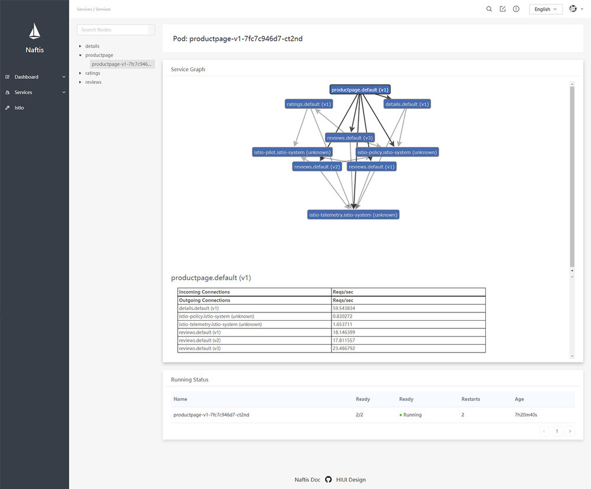
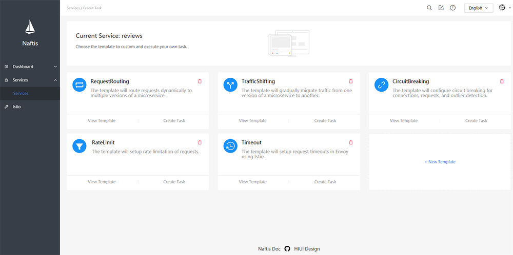
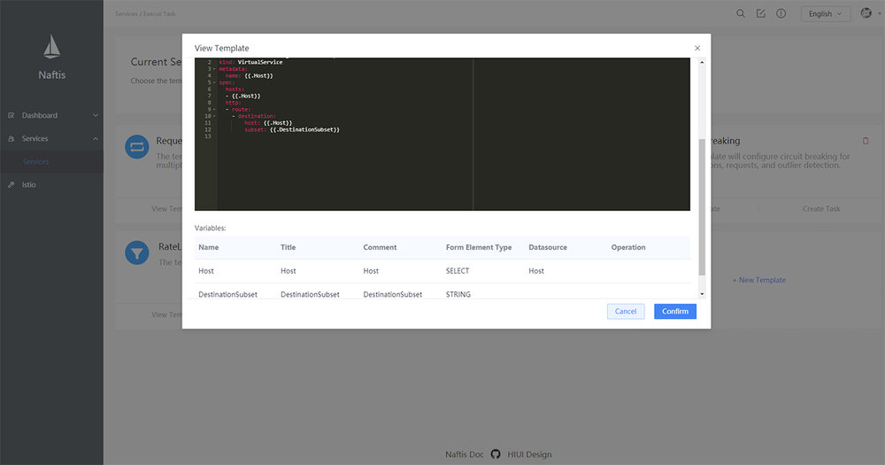
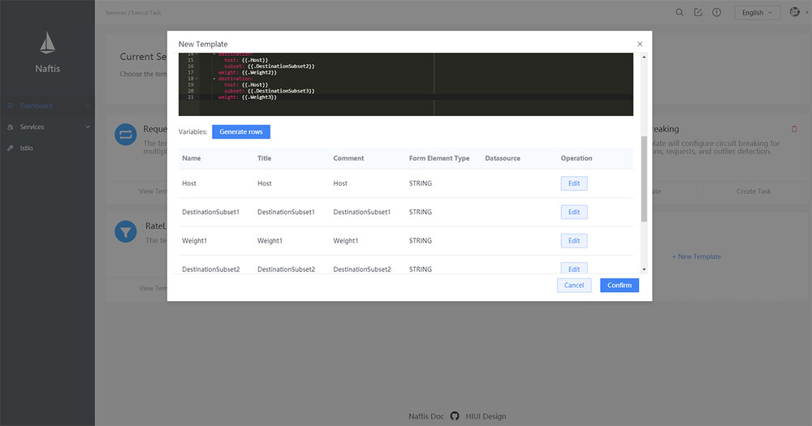
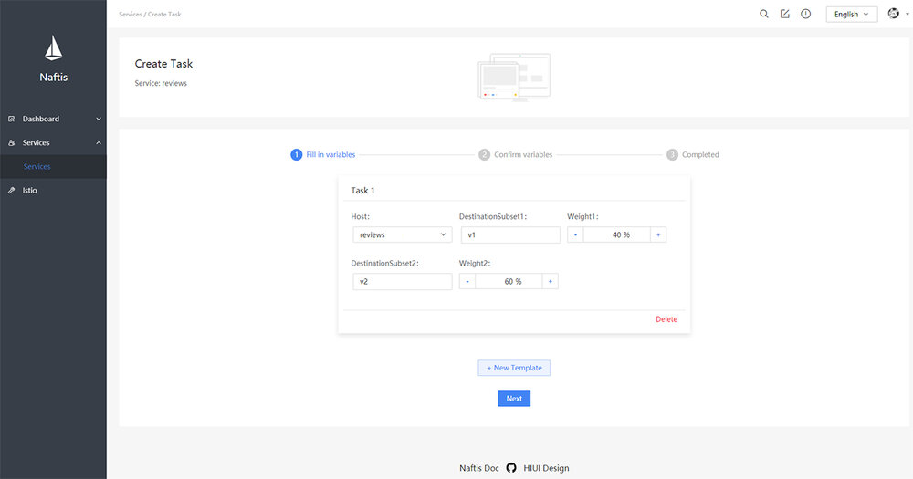
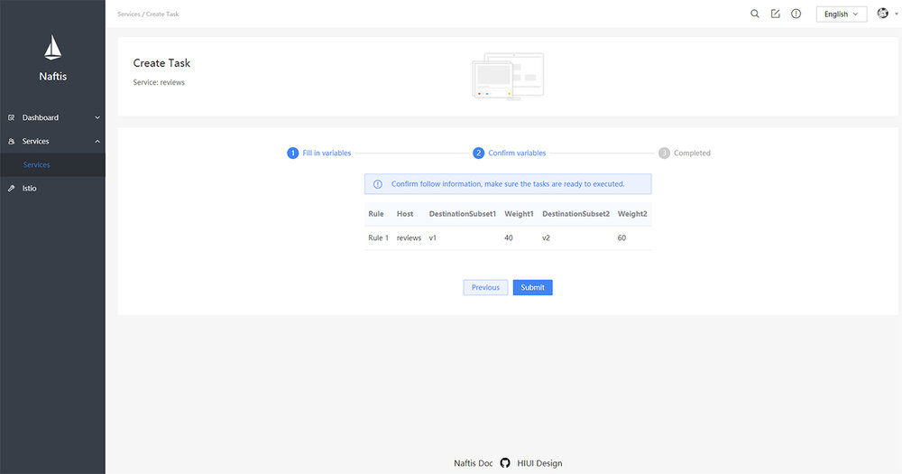
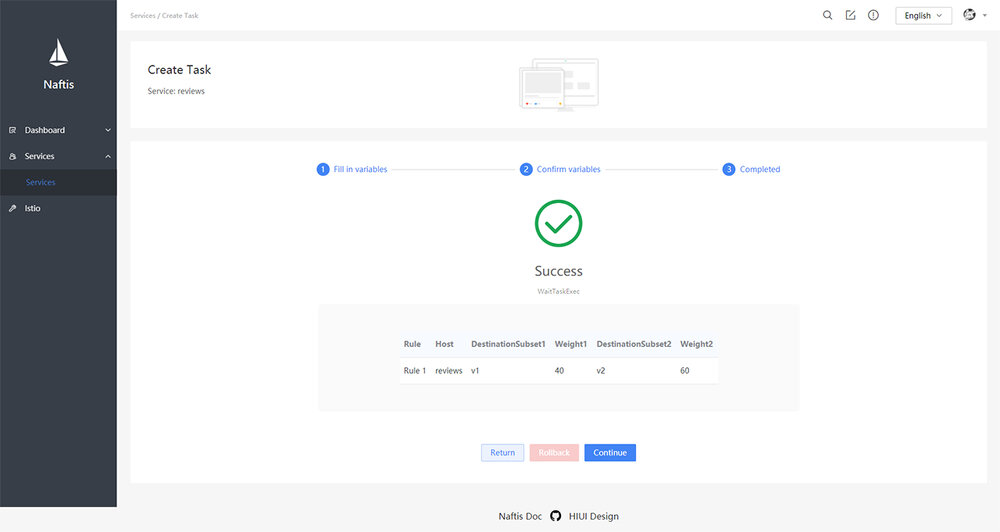
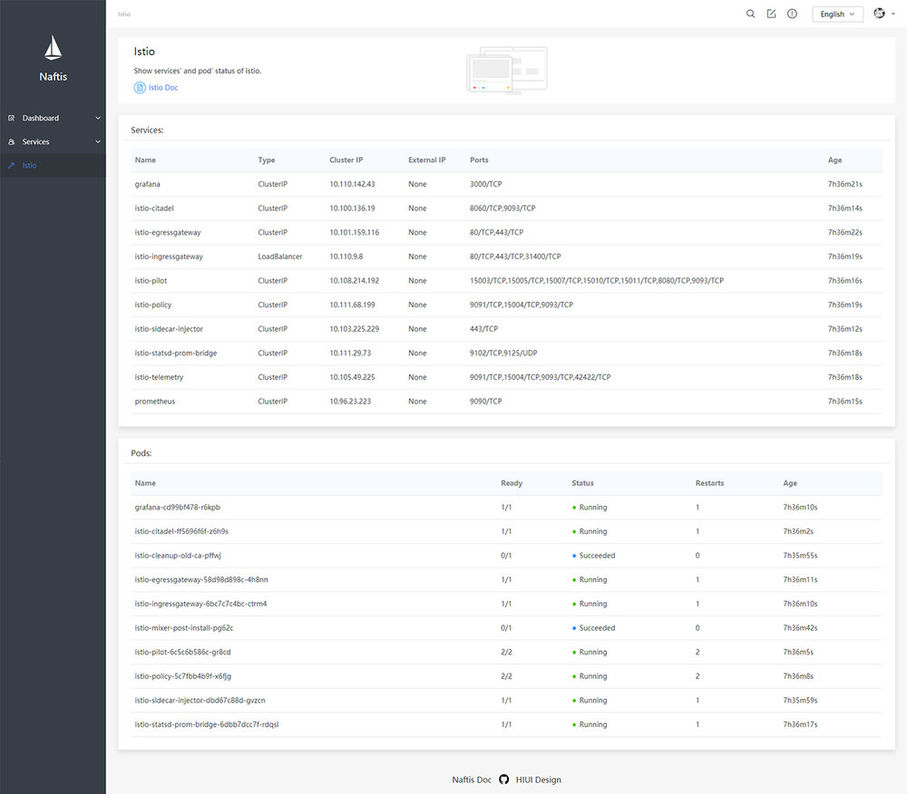

> 用[Istio](https://istio.io/zh)治理服务时须通过 istioctl 或 kubectl，这种方式可能存在一些问题。因此小米武汉研发中心推出 Naftis，帮助用户更轻松地管理 Istio。

近年来服务网格（Service Mesh）已成为各大公司关注重点，各大公司纷纷开始调研 Service Mesh 相关架构。作为 Service Mesh 中的佼佼者，Istio 诞生之初就已吸引众多目光。

作为基础设施层，Istio 有优秀的服务治理能力。但使用 Istio 进行服务治理时，开发者需通过 istioctl 或 kubectl 工具在终端中进行操作，这种方式目前存在一些问题，举例如下：

1. Istio 要求用户熟练掌握 istioctl 工具的数百种指令，有较高的学习成本。
2. Istio 进行服务治理时需要的 yaml 配置文件的数量非常庞大，如何配置和管理这些配置文件，也是个难题。
3. Istio 的 istioctl 工具没有用户权限的约束，存在一定安全隐患，无法适应大公司严格的权限管理需求。
4. Istio 的 istioctl 工具不支持任务回滚等需求，在执行任务出错的情况下，无法快速回滚到上一个正确版本。

为了解决这些问题，小米信息部武汉研发中心为 Istio 研发出了一套友好易用的 Dashboard - Naftis。

> Naftis 意为水手，和 Istio（帆船）意境契合。作为 dashboard，Naftis 能使用户像水手一样熟练掌控和管理 Istio。

https://github.com/XiaoMi/naftis

Naftis 通过任务模板的方式来帮助用户更轻松地执行 Istio 任务。用户可以在 Naftis 中定义自己的任务模板，并通过填充变量来构造单个或多个任务实例，从而完成各种服务治理功能。

Naftis 提供了如下特性：

- 集成了一些常用的监控指标，包括 40X、50X 错误趋势等。
- 提供了可定制的任务模板的支持。
- 支持回滚指定某一任务。
- 提供了 Istio 状态诊断功能，可实时查看 Istio 的 Services 和 Pod 状态。
- 开箱即用，通过 kubectl 指令一键部署。

## 依赖

目前 Naftis 仅支持 Kubernetes，不支持其他容器调度平台。

- Istio > 1.0
- Kubernetes>= 1.9.0
- HIUI >= 1.0.0

Naftis 后端采用 Go 编写，通过 Kubernetes 和 Istio 的 CRD 接口对 Istio 资源进行操作；
前端则采用了同样由小米开源的基于 React 的前端组件 HIUI，HIUI 简洁优雅，有一定 React 基础的前端开发者能迅速上手：

https://github.com/XiaoMi/hiui

## 快速开始

```bash
kubectl create namespace naftis && kubectl apply -n naftis -f mysql.yaml && kubectl apply -n naftis -f naftis.yaml

# 通过端口转发的方式访问Naftis
kubectl -n naftis port-forward $(kubectl -n naftis get pod -l app=naftis-ui -o jsonpath='{.items[0].metadata.name}') 8080:80 &

# 打开浏览器访问 http://localhost:8080，默认用户名和密码分别为admin、admin。
```

## 详细的部署流程

### Kubernetes 集群内运行

```bash
# 创建Naftis命名空间
$ kubectl create namespace naftis

# 确认Naftis命名空间已创建
$ kubectl get namespace naftis
NAME           STATUS    AGE
naftis         Active    18m

# 部署Naftis MySQL服务
$ kubectl apply -n naftis -f mysql.yaml

# 确认MySQL已部署
NAME                           READY     STATUS    RESTARTS   AGE
naftis-mysql-c78f99d6c-kblbq   1/1       Running   0          9s
naftis-mysql-test              1/1       Running   0          10s

# 部署Naftis API和UI服务
kubectl apply -n naftis -f naftis.yaml

# 确认Naftis所有的服务已经正确定义并正常运行中
kubectl get svc -n naftis
NAME           TYPE           CLUSTER-IP      EXTERNAL-IP   PORT(S)        AGE
naftis-api     ClusterIP      10.233.3.144    <none>        50000/TCP      7s
naftis-mysql   ClusterIP      10.233.57.230   <none>        3306/TCP       55s
naftis-ui      LoadBalancer   10.233.18.125   <pending>     80:31286/TCP   6s

kubectl get pod -n naftis
NAME                           READY     STATUS    RESTARTS   AGE
naftis-api-0                   1/2       Running   0          19s
naftis-mysql-c78f99d6c-kblbq   1/1       Running   0          1m
naftis-mysql-test              1/1       Running   0          1m
naftis-ui-69f7d75f47-4jzwz     1/1       Running   0          19s

# 端口转发访问Naftis
kubectl -n naftis port-forward $(kubectl -n naftis get pod -l app=naftis-ui -o jsonpath='{.items[0].metadata.name}') 8080:80 &

# 打开浏览器，访问 http://localhost:8080 即可。默认用户名和密码分别为admin、admin。
```

### 本地运行

#### 数据移植

```bash
# 执行sql语句
mysql> source ./tool/naftis.sql;

# 将in-local.toml中的数据库的DSN配置替换成本地数据库实例的DSN。
```

### 启动 API 服务

- Linux

```bash
make build && ./bin/naftis-api start -c config/in-local.toml
```

或

```bash
./run
```

- Mac OS

```bash
GOOS=darwin GOARCH=amd64 make build && ./bin/naftis-api start -c config/in-local.toml
```

或

```bash
GOOS=darwin GOARCH=amd64 ./run
```

#### 配置 Nginx 代理

```bash
cp tool/naftis.conf <your-nginx-conf-directory>/naftis.conf
# 酌情修改naftis.conf文件并reload nginx
```

#### 启动前端 Node 代理

```bash
cd src/ui
npm install
npm run dev

# 打开浏览器访问 http://localhost:5200。
```

## 预览

### Dashboard

Dashboard 页面集成了一些常用的图表，比如请求成功率、4XX 请求数量等。



### 服务管理

#### 服务详情

服务详情页面可以查看查看已部署到 Kubernetes 中服务信息。



#### 服务 Pod 和拓扑图等

服务详情页面可以查看指定服务 Pod 和拓扑图等信息。



### 任务模板管理

#### 任务模板列表

任务模板列表也可以查看已经添加好的任务模板卡片列表。



#### 查看指定模板

点击“查看模板”可以查看指定模板信息。



#### 新增模板

点击“新增模板”可以向系统中新增自定义模板。



#### 创建任务

初始化变量值。



确认变量值。



提交创建任务的分步表单。



#### Istio 诊断

Istio 诊断页面可以查看 Istio Service 和 Pod 状态。



## Docker 镜像

Naftis 的 API 和 UI 镜像已经发布到 Docker Hub 上，见[api](https://hub.docker.com/r/sevennt/naftis-api/)和[ui](https://hub.docker.com/r/sevennt/naftis-ui/)。

## 开发者指南

### 获取源码

```bash
go get github.com/xiaomi/naftis
```

### 配置环境变量

将下述环境变量添加到`~/.profile`。我们强烈推荐通过[autoenv](https://github.com/kennethreitz/autoenv)来配置环境变量。

```bash
# 根据环境改变GOOS和GOARCH变量
export GOOS="linux"   # 或替换成"darwin"
export GOARCH="amd64" # 或替换成"386"

# 把USER修改成你自己的DockerHub用户名
export USER="sevennt"
export HUB="docker.io/$USER"
```

如果你使用[autoenv](https://github.com/kennethreitz/autoenv)，则输入`cd .`来使环境变量生效。

### Go 依赖

我们目前使用[dep](https://github.com/golang/dep)管理依赖。

```bash
# 安装dep
go get -u github.com/golang/dep
dep ensure -v # 安装Go依赖
```

### 代码风格

- [Go](https://github.com/golang/go/wiki/CodeReviewComments)
- [React](https://standardjs.com/)

## 其他指令

```bash
make                 # 编译所有 targets

make build           # 编译 Go 二进制文件、前端静态资源、Kubernetes清单
make build.api       # 编译 Go 二进制文件
make build.ui        # 编译前端静态资源
make build.manifest  # 编译Kubernetes清单

make fmt   # 格式化 Go 代码
make lint  # lint Go 代码
make vet   # vet Go 代码
make test  # 运行测试用例
make tar   # 打包成压缩文件

make docker      # 编译 docker 镜像
make docker.api  # 编译后端 docker 镜像
make docker.ui   # 编译前端 docker 镜像
make push        # 把镜像推送到 Docker Hub

./bin/naftis-api -h       # 显示帮助信息
./bin/naftis-api version  # 显示版本信息

./tool/genmanifest.sh  # 本地渲染Kubernetes部署清单
./tool/cleanup.sh      # 清理已部署的Naftis
```

## 其他

Naftis 目前已在 Github 开源，目前功能还比较薄弱，希望更多志同道合的朋友一起参与进来共同完善落地 Istio 生态。

https://github.com/XiaoMi/naftis
