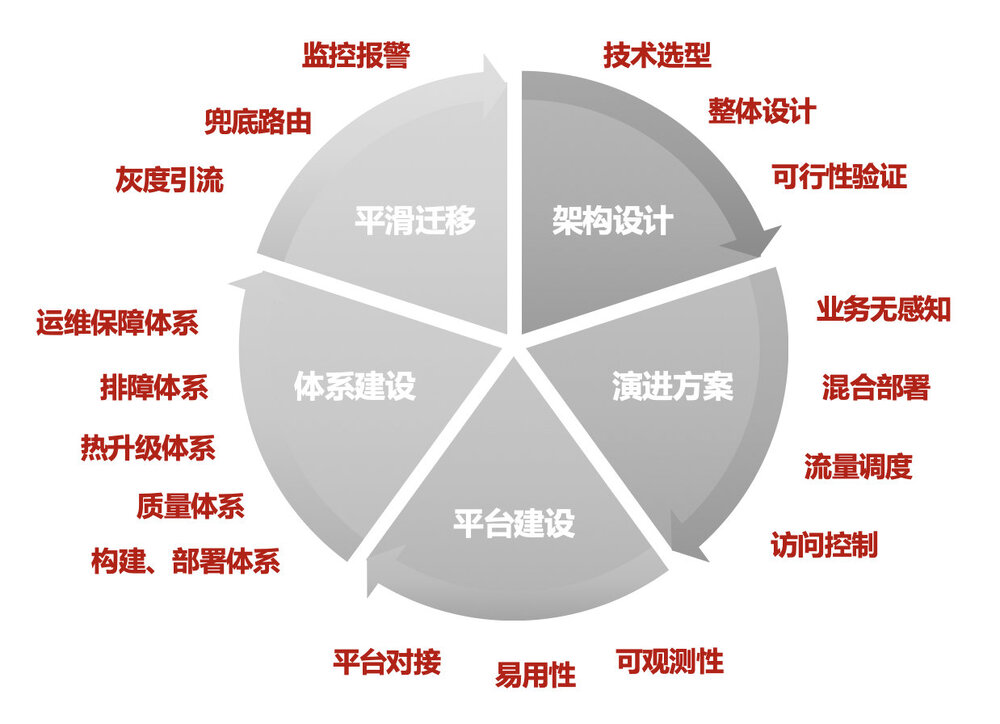
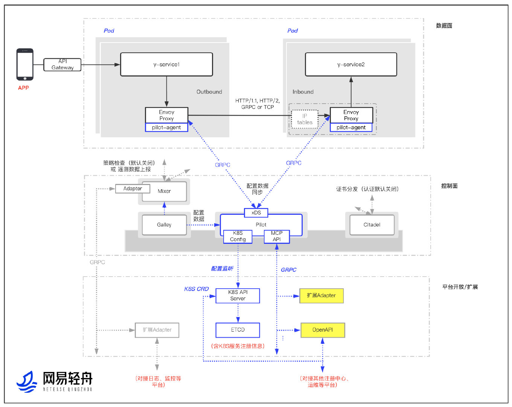
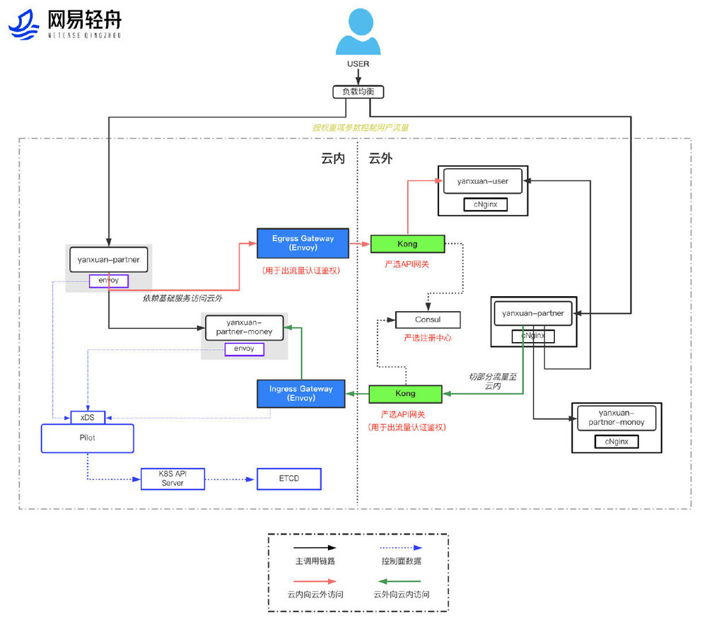
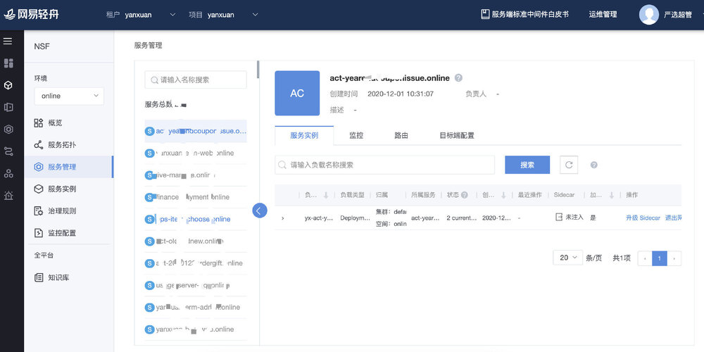
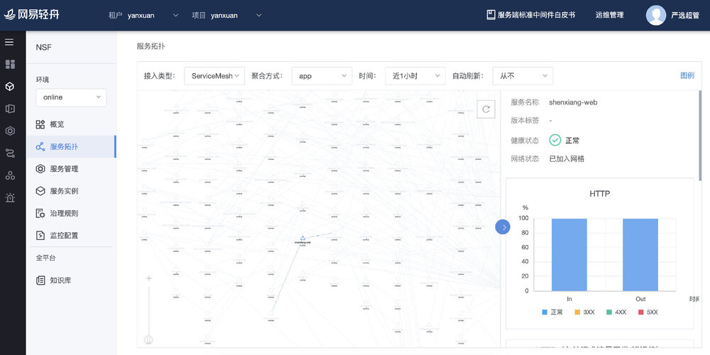
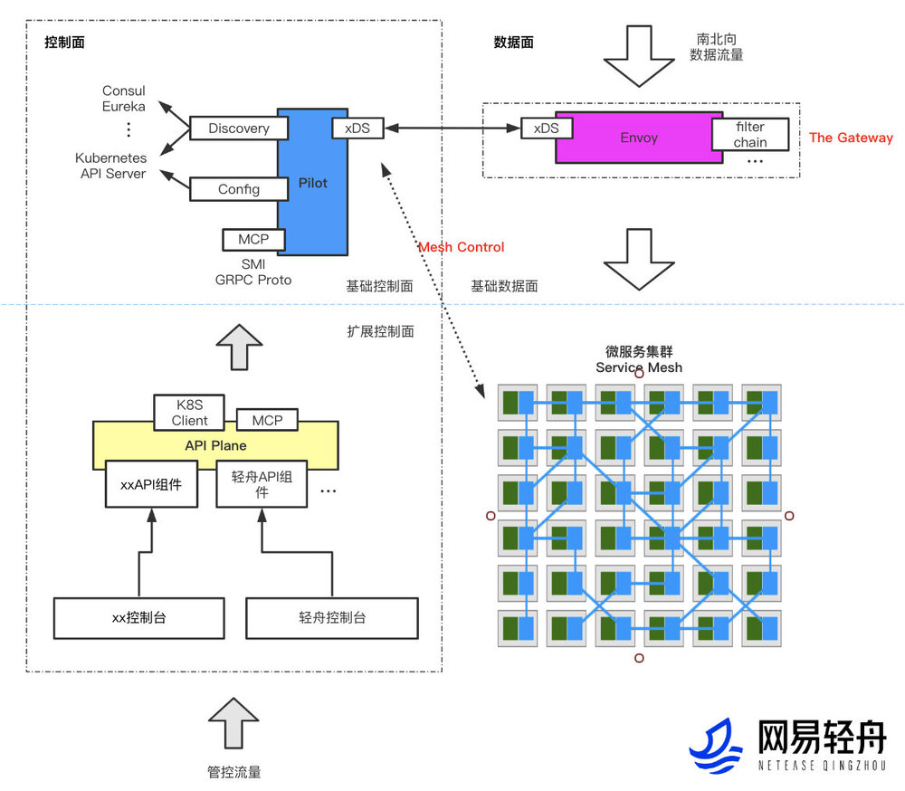

## Problem

网易作为一家拥有众多互联网业务的公司，不同业务结合自身的业务特性、团队组成均有一些微服务技术栈选择、体系建设，这在业务发展初期并没有问题。当业务持续发展，不管业务规模、复杂度、团队的组成都发生了变化，这时候微服务架构就会遇到诸多问题：

- 各业务分别投入研发，研发成本高
- 网易集团技术资产无法沉淀
- 微服务框架对业务侵入性大，需要业务人员明显感知、学习、掌控和维护
- 升级周期长，即使是很小版本的框架升级，都需要动辄 1 个月以上的升级周期
- 语言局限，绝大多数核心业务的微服务体系基于 Java 语言构建，对其他语言支持薄弱

## Strategy

Service Mesh 是云原生体系下重要的微服务技术，可以有效的解决网易诸多互联网业务在微服务架构下存在的问题。网易选择 Istio 这一有代表性的 Service Mesh 开源框架有着深刻的考虑：

- 有深厚的云原生背景及大厂背书
- Istio 的核心数据面组件 Envoy 是云原生数据面的事实标准组件
- 在 Service Mesh 领域，Istio 是最为流行的框架选择，有着活跃的技术社区和优秀的技术架构
- Istio 在帮助企业落地、框架易用性方面持续优化，具备企业应用的亲和性

在确定 Istio 为 Service Mesh 框架选型后，网易数帆的轻舟团队构建了轻舟 Service Mesh 平台，以解决网易集团诸多互联网业务面临的微服务架构问题，并整合已有的微服务治理框架，形成支撑通用分布式、微服务架构演进的微服务平台，赋能更多企业的微服务架构演进与升级。此外，网易轻舟还基于 Istio 技术栈实现了 API 网关体系升级，基于 Envoy 与 Istio 的轻舟 API 网关能力更丰富，性能更好，已成为网易 API 网关的标准组件。

尽管 Istio 提供了非常完整的 Service Mesh 解决方案，企业在构建 Service Mesh 体系时仍需要明晰的建设路线。

#### 架构设计

网易轻舟 Service Mesh 整体架构如下。

**架构设计要点**：

- 通过**扩展 Envoy+定制 Istio**进行了整体的架构设计，并进行相应的可行性验证。
- **以 Envoy 为核心的数据面，支持多种拦截方式**。除原生 Istio 支持的全量拦截 TCP 流量外，加入了 IP 指向、动态控制拦截等易于业务接入的流量拦截方式。
- **以 Istio Pilot 为核心的控制面，其他组件可插拔**。Istio 1.5 之前版本控制面组件较多，维护成本较高。选定控制面核心组件 Pilot 为必要组件，其他组件可插拔，不仅降低了 Istio 生产落地的风险和运维成本，也让研发、维护者在体系构建上更加聚焦。
- **多种扩展方式，供业务已有平台快速接入**。提供了原生 Istio CRD、MCP、API 平面等多种平台开放方式，一方面将原生能力完整保留，另一方面通过简单 Restful API 方式，降低企业平台构建或已有平台接入成本。
- **性能优化**：组件、网络多管齐下。一方面在组件层进行优化，如将 Istio 早期版本集中式 Mixer 后端能力下沉到 Envoy filter，提供基于调用链路审计的配置瘦身等。另一方面配合容器网络进行网络加速，降低延时。

#### 演进方案

基于整体架构设计，结合业务实际的架构、技术栈，形成微服务架构演进方案。以网易电商业务演进方案为例，演进架构图如下：

**演进要点**：

- 基于**业务现有技术、架构分析**，形成迁移的整体架构
- **业务接入**：在基础设施层进行适配，保障业务无感知迁移
- **跨云互访**：基于边缘网关的混合云方案，保障迁移前后环境无缝互访
- **高可用保障**：兜底路由、灰度引流等能力建设，保障迁移过程的 SLA

#### 平台建设

Istio 落地过程中，业务需要网格整体视图及快速治理能力，为此我们增强了网易轻舟微服务平台，加入 Service Mesh 管控能力，支持 Service Mesh 与微服务框架（Spring Cloud、Dubbo、gRPC、Thrift）跨集群统一管控，帮助用户现有微服务架构平滑迁移。

**建设要点：结合业务痛点，完善产品能力**

- **可观测性**：提供整体视图及快速治理功能
- **易用性**：云原生概念产品级封装
- **扩展性**：Open API 体系建设，业务平台快速接入

#### 体系建设

基于 Istio 的 Service Mesh 技术架构需要完整的体系保障。

**体系建设要点**：
**构建、部署体系**：Service Mesh 组件 CICD、自动部署
**质量体系**：自动化功能、性能、稳定性测试；整体故障测试；混沌测试
**排障体系**：业务、组件排障，快速对 Service Mesh 体系的故障定位与恢复
**运维保障体系**：立体化监控、报警
**热升级体系**：支持 Sidecar 热升
**开源技术体系**：轻舟团队对 Service Mesh 社区持续贡献

#### 场景扩展：支撑 API 网关

**设计要点**：

- 扩展 Service Mesh 技术栈，复用云原生技术成果
- 整体设计与可行性验证
- Envoy 作为高性能数据面，增强插件扩展能力
- Istio Pilot 作为基础控制面，多种扩展接入方式
- API 平面设计，屏蔽平台差异，方便平台快捷接入

## Results

- 网易严选、传媒、有道、行业平台等业务实现业务落地，**千级服务、万级实例接入**
- 实现网易微服务基础设施下沉。各业务线研发不再需要过多关注微服务治理，降低业务微服务整体研发与维护成本
- 快速引入多语言治理、热升级、故障注入、路由、熔断降级等服务治理能力
- 赋能网易集团业务，实现微服务技术栈的统一，向云原生技术方向演进
- 作为云原生基础设施长期规划，支撑更多应用场景：API 网关、DB&中间件 Mesh、故障演练等。API 网关已成为网易 API 网关标准组件，**支撑网易传媒、严选、Lofter 等多个业务核心服务全站流量接入**
- 网易微服务架构与技术在业界处于领先梯队水平
