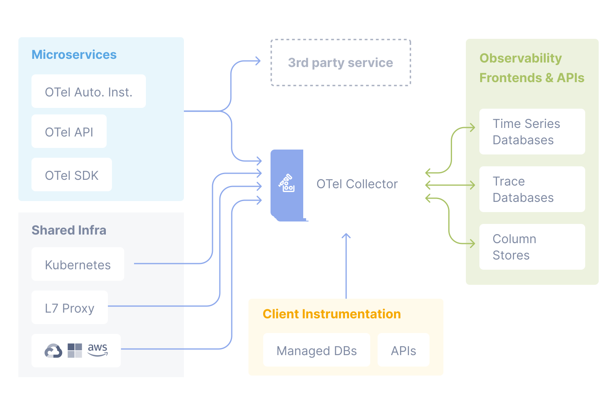

摘要：OpenTelemetry Protocol (OTLP) 1.0.0 已发布，它是 OpenTelemetry 项目中的通用遥测数据传递协议。OpenTelemetry 是一个开源的可观测性框架，提供了一组 API、库、代理和收集器服务，用于捕获分布式跟踪和指标。OTLP 在客户端和服务器之间进行数据交换，定义了一个序列化模式，紧密遵循跟踪、指标和日志的数据模型。

原文地址：<https://www.infoq.com/news/2023/08/otlp-version-one-released/>

最近，[OpenTelemetry](https://opentelemetry.io/) Protocol (OTLP) 1.0.0 发布了。OTLP 规范描述了遥测数据在遥测源、收集器等中间节点和遥测后端之间的编码、传输和传递机制。它是 OpenTelemetry 项目中设计的通用遥测数据传递协议。

OpenTelemetry (OTEL) 是一个由 OpenCensus 和 OpenTracing 项目合并形成的开源 Cloud Native Computing Foundation (CNCF) 项目。它是一个供仪表化、生成、收集和导出遥测数据（例如跟踪、指标和日志）使用的供应商中立的开源可观测性框架。该框架提供了一组 API、库、代理和收集器服务，用于捕获分布式跟踪和指标。此外，它的规范在 2021 年早些时候达到了 1.0.0 版本状态，并被 InfoQ 报道。

OpenTelemetry 通过使用 API 来仪表化应用程序代码，以生成遥测数据，并在不同的 SDK 实现之间无缝地引导收集指标。它提供了针对特定语言的集成和库，例如 Java、Golang、.NET 和 Python 的 OTel SDK，以使开发人员能够仪表化其代码并捕获遥测数据。这些库中的遥测数据被收集并传输到 OpenTelemetry Collector，利用 OTLP 在客户端和服务器之间进行数据交换。OTLP 定义了一个序列化模式，紧密遵循跟踪、指标和日志的数据模型。

作为中央存储库，OpenTelemetry Collector 接收、处理和导出从各种源收集的遥测数据，既作为单个应用程序的本地代理，也作为多个应用程序的网关。

*Open Telemetry Diagram（来源：[OpenTelemetry 文档](https://opentelemetry.io/docs/)）*

OTLP 在数据序列化、反序列化和网络服务之间的传输方面发挥着重要作用。该协议旨在指定一个序列化模式，紧密遵循数据模型并解决其他遥测协议的问题。

Honeycomb 开发者倡导者 [Martin Thwaites](https://twitter.com/MartinDotNet) 说：

> OTLP 是 OpenTelemetry 的生命力，使其比以往任何时候都更强大；转向 v1 将把这一点提升到一个新的水平。已经有大多数供应商适应了使用 OTLP 协议接收数据；通过 V1，这将给人们带来一些急需的信心，希望可以让最后几个顽固分子添加 OTLP 支持。
>

此外，他表示：

> 这很重要，因为它开启了更多的互操作性，减少了添加专有协议库到我们堆栈中的需求，这对于希望更好地了解其应用程序的情况下获得更多可见性的人来说只能是一个胜利。
>

最后，OpenTelemetry 项目目前是 CNCF 的[孵化项目](https://www.cncf.io/projects/)。
