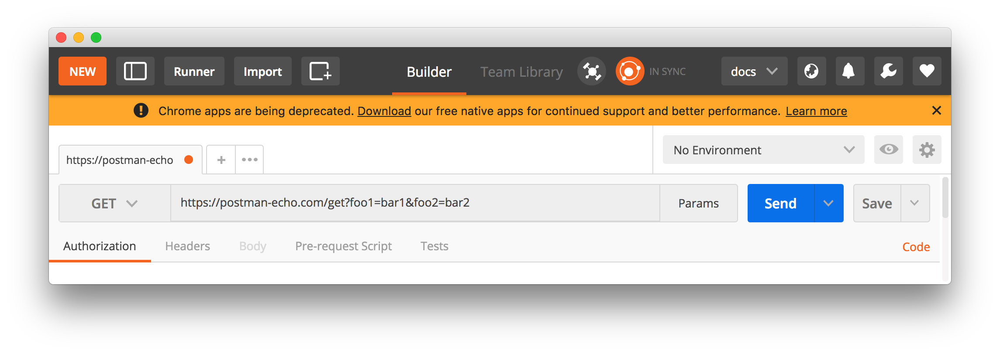

本文译自 [Postman’s Series D Funding and the API-First World](https://blog.postman.com/postman-announces-series-d/)。

## 译者评论

没错，这正是那个被人所熟知，在程序员中广为流传的 Postman，五年前我曾在被一个同事推荐 Chrome 中安装过一个插件，专门用来调试 API 的，这个插件就是 Postman。

## 正文

我很高兴地宣布，今天对 Postman 来说是一个巨大的里程碑。我们已经完成了 D 轮 2.25 亿美元的融资，目前公司的估值为 56 亿美元。本轮融资由 Insight Partners 领投，并有三个新的投资者加入 ——[Coatue](https://www.coatue.com/)、[Battery Ventures](https://www.battery.com/) 和 [BOND](https://www.bondcap.com/)。我们也得到了现有 Postman 投资者 [CRV](https://www.crv.com/) 和 [Nexus Venture Partners](https://nexusvp.com/) 的热情参与。此外，DoorDash 产品负责人 Gokul Rajaram 和 Freshworks 创始人 Girish Mathrubootham 作为个人投资者加入。

> API 已经迅速成为全球每个行业、每个国家的开发者使用的软件的基本构件，Postman 已经牢固地确立了自己作为开发者首选平台的地位。Postman 有机会成为企业构建、交付产品和无缝启用整个生态系统伙伴关系的关键支柱。他们持续、快速的扩张和强大的管理团队表明，Postman 的未来几乎有无限的可能性。——Insight Partners 总经理 Jeff Horing

一年多以前，Postman 完成了 C 轮投资，在那篇公告博文中，我描述了“Postman 飞轮”，它有助于指导我们决定如何使 Postman 平台对我们的客户越来越强大和有效。

Postman 飞轮

今天，Postman 飞轮的运行速度比以往任何时候都快，在一些关键领域有强劲的势头。

- **开发者** 。现在，[Postman API 平台](https://www.postman.com/api-platform/)上有 1700 万名开发者，Postman 应用程序迄今已被下载超过 6000 万次。
- **团队协作**。最近宣布在 Postman 中为小型团队提供[无限制的协作](https://blog.postman.com/announcing-unlimited-collaboration-for-small-teams/)之后，我们今天在该平台上看到了创纪录的协作活动量。
- **企业客户**。我们继续增加的客户，如 Salesforce、Stripe、Kroger、Cisco、PayPal，以及更多。你可以在我们的[案例研究](https://www.postman.com/case-studies/)页面阅读更多内容。
- **公共 API 网络**。Postman 公共 API 网络最近成为[世界上最大的公共 API 中心](https://blog.postman.com/postman-public-api-network-is-now-the-worlds-largest-public-api-hub/)，它已经迅速发展到 2 万多个[公共工作空间](https://blog.postman.com/public-workspaces-why-we-created-them-what-you-can-do/)（来自[梅赛德斯 - 奔驰](https://www.postman.com/mbdevelopers/workspace/mercedes-benz/overview)、 [Notion](https://blog.postman.com/how-to-explore-notion-api-postman-public-workspace/)、 [微软 Graph 等](https://www.postman.com/microsoftgraph/workspace/microsoft-graph/overview)顶级组织），使世界各地的开发者、团队和公司能够以前所未有的规模在 API 上合作。

## API 优先的世界

伴随着 Postman 和[整个 API 行业](https://blog.postman.com/api-growth-rate/)的这一势头，我们也观察到了与这一切直接相关的更大转变。世界正日益成为 API 优先。

现在，关于“API-first“到底意味着什么，这些天在整个行业内有相当多的讨论，所以我们决定选择一个非常规的媒介来解释它。Postman 公司的人热爱阅读，也是科幻小说和图画小数的粉丝，所以我们决定创作一部图画小说来描述 API-first 的世界。

Shruthi Venkatesh 是 Postman 的一名视觉设计师，她在一本全新的图画小说中用插图把这个想法变成了现实，我非常兴奋地与你们分享这本书：[“API 优先的世界”](https://api-first-world.com/)，请阅读一下。

我们新的图画小说[《API 优先的世界》](https://api-first-world.com/)中的一幅插图

现在你已经通过我们的新图画小说看到了这个 API 优先的世界的愿景，你可能会问：Postman 正在做什么来实现这个愿景？为了达到这个目标，Postman 一直坚持不懈地关注并将在未来通过 D 轮投资继续关注 Postman 迄今为止成功的两个基本要素：产品和社区。以下是最近在这些领域中的一些活动的回顾。

## Postman 的产品在去年发生了什么？

API 优先的世界需要一个 API 平台，使更多的人能够用 API 做更多的事情，而 Postman 继续以快速的速度发布新的功能，以实现这一目标。仅举几个例子。[网络上的 Postman](https://blog.postman.com/announcing-postman-for-the-web-now-in-open-beta/)、 [公共工作空间](https://blog.postman.com/public-workspaces-why-we-created-them-what-you-can-do/)、[私人 API 网络](https://blog.postman.com/postman-api-network-intro/)、[公共 API 网络](https://blog.postman.com/postman-public-api-network-is-now-the-worlds-largest-public-api-hub/)、 [API 安全验证](https://blog.postman.com/security-warnings-during-api-validation/)、 [OpenAPI 验证](https://blog.postman.com/real-time-validation-of-openapi-definitions-in-postman-api-builder/)、对 [WebSockets](https://blog.postman.com/postman-supports-websocket-apis/) 和 [SOAP](https://blog.postman.com/making-http-soap-requests-with-postman/) 等协议的支持、用户组和 [SCIM 整合](https://blog.postman.com/introducing-user-management-in-postman-with-scim/)，以及其他数百项改进。

我们今年还完成了 [SOC 2 Type 2](https://blog.postman.com/postmans-new-soc-2-type-2-report-how-and-why-we-did-it/) 安全认证的里程碑，同时还与 [Datadog](https://blog.postman.com/postman-datadog-technology-partner-more-integration-features/)、[New Relic](https://blog.postman.com/monitor-apis-with-postman-and-new-relic/)、[Opsgenie](https://blog.postman.com/postman-opsgenie-integration/) 和 [AWS API Gateway](https://blog.postman.com/aws-api-gateway-integration-postman/) 建立了新的伙伴关系，以帮助我们的客户解决许多现代挑战。

> Postman 有能力解决全球开发者面临的挑战，他们需要比以往更快地构建软件，这给 Coatue 留下了深刻印象。我们还喜欢 Postman 为管理团队（无论规模大小）提供 API 环境的适当可见性，并确保日益精简的团队能够有效地维护 API，我们很自豪地支持 Postman 的未来计划，并与他们合作，因为他们执行的愿景是为迅速扩大的开发人员队伍提供服务，并进一步扩展到新的角色和领域，计划在未来实现令人兴奋的增长。——Coatue 普通合伙人 David Schneider

## Postman 社区去年发生了什么？

Postman 社区正在引领建设 API 优先的世界，而我们正在以各种方式为社区提供支持。以下是今年的几个例子：

- 我们转向了全虚拟的教育和社区活动。
  - 2021 年 2 月，我们举办了世界上最大的 API 会议 ——[Postman Galaxy](https://www.postman.com/postman-galaxy/)，有超过 26000 人注册。
  - 我们推出了 [Breaking Changes](https://www.postman.com/events/breaking-changes/)，这是一个全新的每周在线谈话节目，由 Postman 首席布道师 Kin Lane 主持来自整个 API 领域的明星嘉宾，讨论、辩论和解决围绕 API 和 API 优先的最新话题。
  - 我们推出了 [Postman Space Camp](https://www.postman.com/events/postman-space-camp/)，这是一系列针对每种用户类型的在线教育培训。
  - 我们推出了 [The Exploratory](https://blog.postman.com/the-exploratory-postmans-new-educational-video-series/)，这是一个新的教育视频系列，包含了人们强烈要求的 Postman 操作内容。
- 我们正式确定了 [Postman 开放技术项目](https://blog.postman.com/announcing-postman-open-technologies/)，以支持和引导围绕 API 规范的对话，这有助于实现 API 优先的世界。
  - 我们[加入了 OpenAPI 倡议](https://blog.postman.com/postman-joins-openapi-initiative/)，参与了 OpenAPI 规范的教育、营销和发展。
  - 我们[与 AsyncAPI 联合起来](https://blog.postman.com/asyncapi-joins-forces-with-postman-future-of-apis/)，帮助定义 API 的未来，并加速将 API 优先原则应用于异步 API。AsyncAPI 规范也成为 Linux 基金会的一个正式组成部分。
- Postman 的[学生项目](https://blog.postman.com/how-postman-is-building-education-first-student-programs-that-empower/)继续扩大。
  - 本月早些时候，我们举行了首届 [Postman 学生峰会](https://blog.postman.com/announcing-the-first-postman-student-summit/)，这是世界上最大的以学生为中心的 API 活动，有超过 6000 人报名参加。
- 我们推出了 [Postman for Nonprofits](https://blog.postman.com/introducing-postman-for-nonprofits/)，这是一个以 Postman 计划折扣支持社区内非营利组织的计划，以帮助它们完成任务。该计划的参与者包括 [丹佛心理健康中心](https://mhcd.org/get-to-know-us/)、[世界骨髓捐献者日](https://worldmarrowdonorday.org/)、 [Giving Compass](https://givingcompass.org/) 等。

在 Postman，整个团队对 API 优先的世界有一个大的、广泛的、热情的愿景，我们觉得我们仍然处于执行这一愿景的早期阶段。我们继续寻求招聘那些希望长期建设并符合 Postman 文化价值观的人，这些价值观是：

- 带着好奇心创作
- 赢得信任
- 拥抱制约因素
- 共赢
- 拥有并交付

如果这些价值观听起来像你的价值观，并且你想加入我们，帮助创造 API 第一的世界，请看一下 [Postman 的职业页面](https://www.postman.com/company/careers/)。

最后但并非最不重要的是，在这个重要的日子里，我想亲自感谢我们的客户、我们的社区、我们的投资者，以及在 Postman 团队中工作的每个人。很荣幸能与你们一起走过这段旅程，而且未来看起来比以往任何时候都更加光明。
