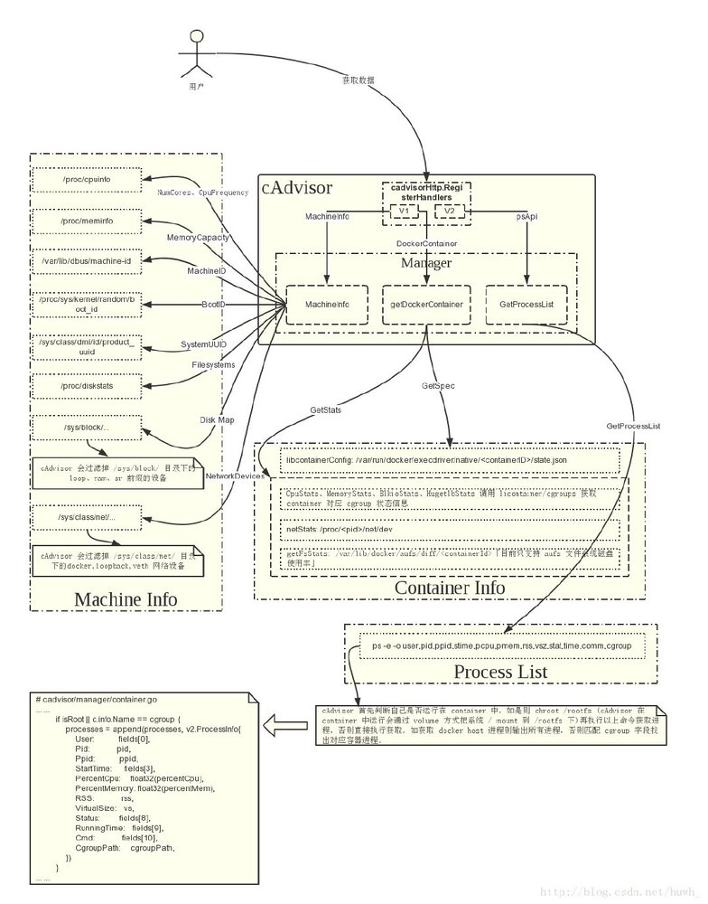
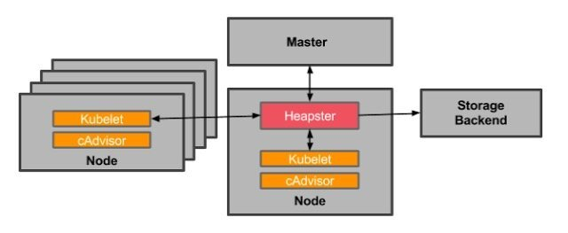
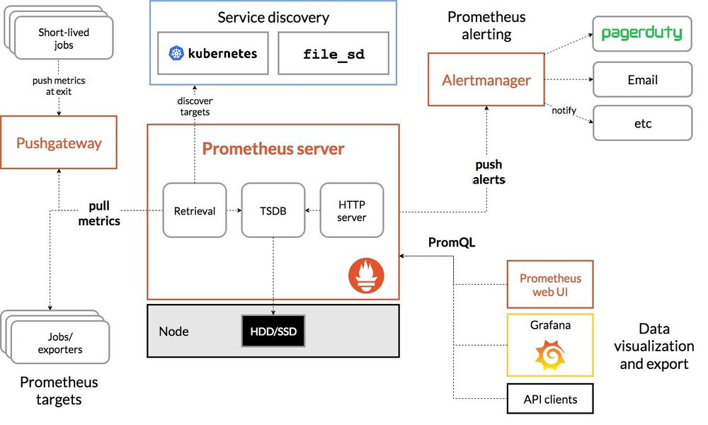
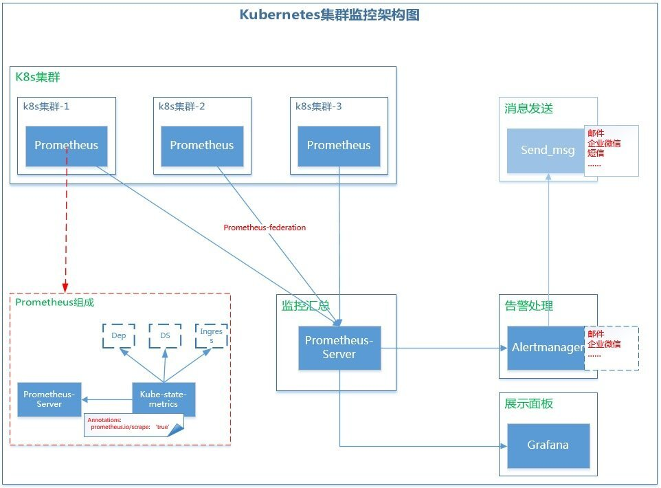

## 背景

由于容器化和微服务的大力发展，Kubernetes 基本已经统一了容器管理方案，当我们使用 Kubernetes 来进行容器化管理的时候，全面监控 Kubernetes 也就成了我们第一个需要探索的问题。我们需要监控 kubernetes 的 ingress、service、deployment、pod......等等服务，以达到随时掌握 Kubernetes 集群的内部状况。

此文章是 Prometheus 监控系列的第一篇，目的也很明确，旨在于寻找一套能够胜任 kubernetes 集群监控的架构。

## k8s 监控方案调研

- [ ] 1、cAdvisor + InfluxDB + Grafana
- [ ] 2、Heapster + InfluxDB + Grafana
- [x] 3、Promethus + kube-state-metrics + Grafana
- **Grafana**:
  开源 DashBoard，后端支持多种数据库，如：Influxdb、Prometheus...，插件也比较多，功能强大。非常适合用于做展示。
- **InfluxDB**:
  开源时间序列数据库，性能高效
- **cAdvisor**:
  来自 Google 的容器监控工具，也是 Kubelet 内置的容器资源收集工具。它会自动收集本机容器 CPU、内存、网络和文件系统的资源占用情况，并对外提供 cAdvisor 原生的 API。随 kubelet 启动   --cadvisor-port = 1



- **Heapster**:
  由于 cAdvisor 只提供了单机的容器资源占用情况，而 Heapster 则提供了整个集群的资源监控（kubernetes 1.11 之前，hpa 都是从 heapster 获取数据），并支持持久化数据存储到 InfluxDB



- **Promethues**:
  提供强大的数据采集、数据存储、数据展示、告警等，天生完美支持 kubernetes，CNCF 基金会的第二个成员，第一个是 Kubernetes。而且 Prometheus 里面很多思想都来源于 Google 内部的监控系统 Borgmon，可以说是 Google 的干儿子。



- **kube-state-metrics**在这里作为 prometheus 的一个 exporter 来使用，提供 deployment、daemonset、cronjob 等服务的监控数据，由 kubernestes 官方提供，与 prometheus 紧密结合。
  更多关于 kube-state-metrics 的信息：https://github.com/kubernetes/kube-state-metrics

## Prometheus 优势

#### Prometheus 和 kubernetes 相亲相爱

Google 干儿子，大厂维护，而且最重要的一点是完美支持 Kubernetes

#### 规范定义

Prometheus 对于应用层的监控，定义了一个良好的规范，只需要应用提供接口获取日志就可以了

#### Prometheus 可以在各个层面实现监控，如下

- 基础设施层：监控各个主机服务器资源 (包括 Kubernetes 的 Node 和非 Kubernetes 的 Node)，如 CPU，内存，网络吞吐和带宽占用，磁盘 I/O 和磁盘使用等指标。
- 中间件层：监控独立部署于 Kubernetes 集群之外的中间件，例如：MySQL、Redis、RabbitMQ、ElasticSearch、Nginx 等。
- Kubernetes 集群：监控 Kubernetes 集群本身的关键指标
- Kubernetes 集群上部署的应用：监控部署在 Kubernetes 集群上的应用

基于以上三点，所以最终选择使用 Prometheus 来监控 Kubernetes 集群。

## Kubernetes 集群监控架构

在具体讨论 Prometheus 监控架构之前，再来看几个实际的问题

1. 如果有多个 Kubernetes 集群，怎么做？
2. 多个 Kubernetes 集群的监控数据怎么处理？
3. 告警应该怎么集中并去重？

好在这些问题对 Prometheus 来说都不是难事，最终，我们采取 Prometheus + kube-state-metrics + Alertmanager + Grafana 架构来做 Kubernetes 集群监控。监控系统具体架构如下



使用这个架构，那上面所提到的三个问题将不再是问题。

## 详解

### K8s 集群：

k8s集群-1/-2/-3为需要被监控的集群，就是业务集群。每个集群内部都部署了一个Prometheus，主要由两部分组成 prometheus-server + kube-state-metrics。

prometheus-server：使用一个带 RBAC 权限的账号采集集群中现有监控信息（其实是从 cadvisor 获取）和节点信息。

kube-state-metrics：这里作为 prometheus 的 exporter 使用。因为 prometheus 不能获取集群中 Deployment, Job, CronJob 的监控信息。
部署 kube-state-metrics 的时候，svc 一定要带一个 annotations：prometheus.io/scrape: 'true'（**这非常重要**）

### 监控汇总

监控汇总其实就是一个 Prometheus-server，用于将各个散落在各地的监控数据汇总起来，统一管理。

核心思想是利用 Prometheus 的 federation 机制，从其他集群 pull 数据。这样其他集群的 prometheus 只需要短暂存储数据，汇总之后再做长期存储；同时还可以统一做告警判断和数据展示。

Prometheus 官方 Federation 示例

```yaml
- job_name: 'federate'
  scrape_interval: 15s

  honor_labels: true
  metrics_path: '/federate'

  params:
    'match[]':
      - '{job="prometheus"}'
      - '{__name__=~"prometheus_job:.*"}'

  static_configs:
    - targets:
      - 'source-prometheus-1:9090'
      - 'source-prometheus-2:9090'
      - 'source-prometheus-3:9090'
```

这段配置所属的 Prometheus 将从 source-prometheus-1 ~ 3这3个Prometheus的/federate端点拉取监控数据。match[]参数指定了只拉取带有 job="prometheus"标签的指标，或者名称以 prometheus_job 开头的指标。

### 展示面板

展示面板就是一个 Grafana，支持使用 Prometheus 做为数据源进行绘图展示。

### 告警处理

告警是利用 Prometheus 官方提供的 Altermanager 模块。Alermanager 模块从 Prometheus-Server 接收告警信息，然后进行汇总、屏蔽、告警...等等操作。Alertmanager 告警途径支持有 email、wechat、webhook、slack 等等，非常丰富。但是这里使用的是自身开发的 Send_msg 模块。

### 消息发送

自主开发的消息发送模块，集成 email、微信、钉钉、短信等方式。其实不止告警时会发送消息，还有其他地方也会用到消息发送。

监控架构清楚之后，接下来就是实施监控的一个过程了，具体实施步骤请看“Prometheus 系列”第二篇文章。

## 结束

此文章也是“使用 prometheus 完美监控 kubernetes 集群”系列的第一篇，对文章有不理解的地方，欢迎随时后台留言。
