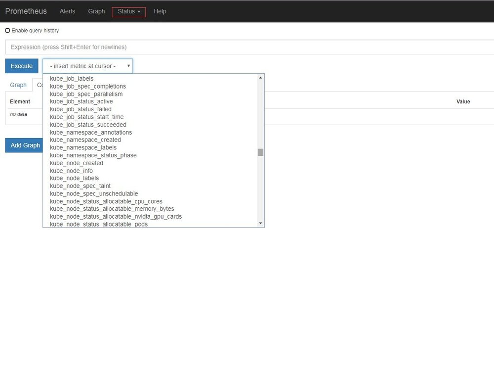
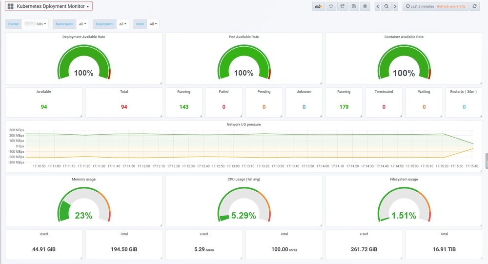
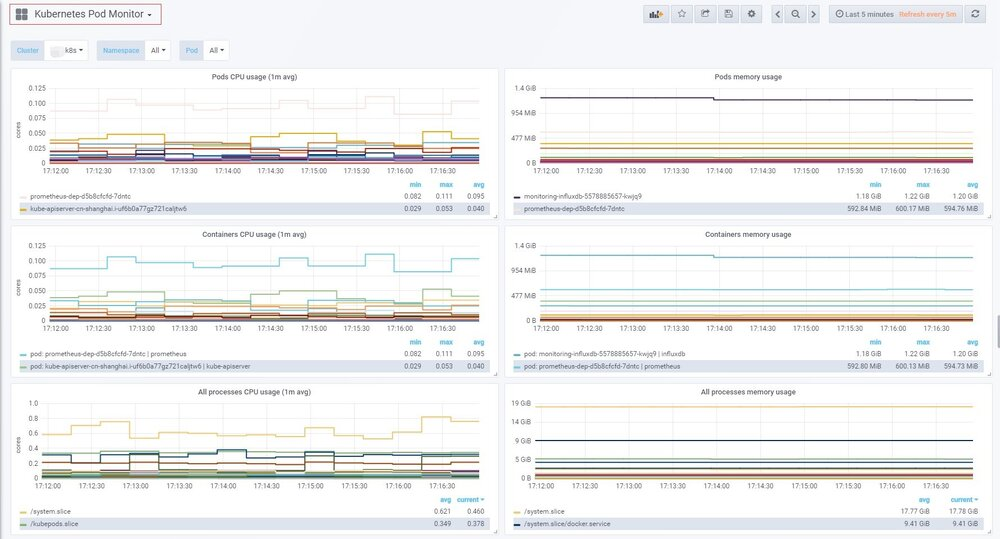

## 背景

由于容器化和微服务的大力发展，Kubernetes 基本已经统一了容器管理方案，当我们使用 Kubernetes 来进行容器化管理的时候，全面监控 Kubernetes 也就成了我们第一个需要探索的问题。我们需要监控 kubernetes 的 ingress、service、deployment、pod......等等服务，以达到随时掌握 Kubernetes 集群的内部状况。

此文章是 Prometheus 监控系列的第二篇，基于上一篇讲解了怎么对 Kubernetes 集群实施 Prometheus 监控。

K8s 编排文件可参考 https://github.com/xianyuLuo/prometheus-monitor-kubernetes

## Prometheus 部署

在 k8s 上部署 Prometheus 十分简单，下面给的例子中将 Prometheus 部署到 prometheus 命名空间。

### 部署——数据采集

将 kube-state-metrics 和 prometheus 分开部署，先部署 prometheus。

#### Prometheus

prometheus-rbac.yaml

```yaml
apiVersion: rbac.authorization.k8s.io/v1beta1
kind: ClusterRole
metadata:
  name: prometheus
rules:
- apiGroups: [""]
  resources:
  - nodes
  - nodes/proxy
  - services
  - endpoints
  - pods
  verbs: ["get", "list", "watch"]
- apiGroups:
  - extensions
  resources:
  - ingresses
  verbs: ["get", "list", "watch"]
- nonResourceURLs: ["/metrics"]
  verbs: ["get"]
---
apiVersion: v1
kind: ServiceAccount
metadata:
  name: prometheus
  namespace: prometheus
---
apiVersion: rbac.authorization.k8s.io/v1beta1
kind: ClusterRoleBinding
metadata:
  name: prometheus
roleRef:
  apiGroup: rbac.authorization.k8s.io
  kind: ClusterRole
  name: prometheus
subjects:
- kind: ServiceAccount
  name: prometheus
  namespace: prometheus
```

prometheus.rbac.yml 定义了 Prometheus 容器访问 k8s apiserver 所需的 ServiceAccount、ClusterRole 以及 ClusterRoleBinding。

------

prometheus-config-configmap.yaml

```yaml
apiVersion: v1
kind: ConfigMap
metadata:
  name: prometheus-config
  namespace: prometheus
data:
  prometheus.yml: |
    global:
      scrape_interval:     15s
      evaluation_interval: 15s
    scrape_configs:

    - job_name: 'kubernetes-apiservers'
      kubernetes_sd_configs:
      - role: endpoints
      scheme: https
      tls_config:
        ca_file: /var/run/secrets/kubernetes.io/serviceaccount/ca.crt
      bearer_token_file: /var/run/secrets/kubernetes.io/serviceaccount/token
      relabel_configs:
      - source_labels: [__meta_kubernetes_namespace, __meta_kubernetes_service_name, __meta_kubernetes_endpoint_port_name]
        action: keep
        regex: default;kubernetes;https

    - job_name: 'kubernetes-nodes'
      kubernetes_sd_configs:
      - role: node
      scheme: https
      tls_config:
        ca_file: /var/run/secrets/kubernetes.io/serviceaccount/ca.crt
      bearer_token_file: /var/run/secrets/kubernetes.io/serviceaccount/token
      relabel_configs:
      - action: labelmap
        regex: __meta_kubernetes_node_label_(.+)
      - target_label: __address__
        replacement: kubernetes.default.svc:443
      - source_labels: [__meta_kubernetes_node_name]
        regex: (.+)
        target_label: __metrics_path__
        replacement: /api/v1/nodes/${1}/proxy/metrics

    - job_name: 'kubernetes-cadvisor'
      kubernetes_sd_configs:
      - role: node
      scheme: https
      tls_config:
        ca_file: /var/run/secrets/kubernetes.io/serviceaccount/ca.crt
      bearer_token_file: /var/run/secrets/kubernetes.io/serviceaccount/token
      relabel_configs:
      - action: labelmap
        regex: __meta_kubernetes_node_label_(.+)
      - target_label: __address__
        replacement: kubernetes.default.svc:443
      - source_labels: [__meta_kubernetes_node_name]
        regex: (.+)
        target_label: __metrics_path__
        replacement: /api/v1/nodes/${1}/proxy/metrics/cadvisor

    - job_name: 'kubernetes-service-endpoints'
      kubernetes_sd_configs:
      - role: endpoints
      relabel_configs:
      - source_labels: [__meta_kubernetes_service_annotation_prometheus_io_scrape]
        action: keep
        regex: true
      - source_labels: [__meta_kubernetes_service_annotation_prometheus_io_scheme]
        action: replace
        target_label: __scheme__
        regex: (https?)
      - source_labels: [__meta_kubernetes_service_annotation_prometheus_io_path]
        action: replace
        target_label: __metrics_path__
        regex: (.+)
      - source_labels: [__address__, __meta_kubernetes_service_annotation_prometheus_io_port]
        action: replace
        target_label: __address__
        regex: ([^:]+)(?::\d+)?;(\d+)
        replacement: $1:$2
      - action: labelmap
        regex: __meta_kubernetes_service_label_(.+)
      - source_labels: [__meta_kubernetes_namespace]
        action: replace
        target_label: kubernetes_namespace
      - source_labels: [__meta_kubernetes_service_name]
        action: replace
        target_label: kubernetes_name

    - job_name: 'kubernetes-services'
      kubernetes_sd_configs:
      - role: service
      metrics_path: /probe
      params:
        module: [http_2xx]
      relabel_configs:
      - source_labels: [__meta_kubernetes_service_annotation_prometheus_io_probe]
        action: keep
        regex: true
      - source_labels: [__address__]
        target_label: __param_target
      - target_label: __address__
        replacement: blackbox-exporter.example.com:9115
      - source_labels: [__param_target]
        target_label: instance
      - action: labelmap
        regex: __meta_kubernetes_service_label_(.+)
      - source_labels: [__meta_kubernetes_namespace]
        target_label: kubernetes_namespace
      - source_labels: [__meta_kubernetes_service_name]
        target_label: kubernetes_name

    - job_name: 'kubernetes-ingresses'
      kubernetes_sd_configs:
      - role: ingress
      relabel_configs:
      - source_labels: [__meta_kubernetes_ingress_annotation_prometheus_io_probe]
        action: keep
        regex: true
      - source_labels: [__meta_kubernetes_ingress_scheme,__address__,__meta_kubernetes_ingress_path]
        regex: (.+);(.+);(.+)
        replacement: ${1}://${2}${3}
        target_label: __param_target
      - target_label: __address__
        replacement: blackbox-exporter.example.com:9115
      - source_labels: [__param_target]
        target_label: instance
      - action: labelmap
        regex: __meta_kubernetes_ingress_label_(.+)
      - source_labels: [__meta_kubernetes_namespace]
        target_label: kubernetes_namespace
      - source_labels: [__meta_kubernetes_ingress_name]
        target_label: kubernetes_name

    - job_name: 'kubernetes-pods'
      kubernetes_sd_configs:
      - role: pod
      relabel_configs:
      - source_labels: [__meta_kubernetes_pod_annotation_prometheus_io_scrape]
        action: keep
        regex: true
      - source_labels: [__meta_kubernetes_pod_annotation_prometheus_io_path]
        action: replace
        target_label: __metrics_path__
        regex: (.+)
      - source_labels: [__address__, __meta_kubernetes_pod_annotation_prometheus_io_port]
        action: replace
        regex: ([^:]+)(?::\d+)?;(\d+)
        replacement: $1:$2
        target_label: __address__
      - action: labelmap
        regex: __meta_kubernetes_pod_label_(.+)
      - source_labels: [__meta_kubernetes_namespace]
        action: replace
        target_label: kubernetes_namespace
      - source_labels: [__meta_kubernetes_pod_name]
        action: replace
        target_label: kubernetes_pod_name
```

prometheus-config-configmap.yaml 定义了 prometheus 的配置文件，以 configmap 的形式使用。

------

prometheus-dep.yaml

```yaml
apiVersion: apps/v1beta2
kind: Deployment
metadata:
  name: prometheus-dep
  namespace: prometheus
spec:
  replicas: 1
  selector:
    matchLabels:
      app: prometheus-dep
  template:
    metadata:
      labels:
        app: prometheus-dep
    spec:
      containers:
      - image: prom/prometheus:v2.3.2
        name: prometheus
        command:
        - "/bin/prometheus"
        args:
        - "--config.file=/etc/prometheus/prometheus.yml"
        - "--storage.tsdb.path=/prometheus"
        - "--storage.tsdb.retention=1d"
        ports:
        - containerPort: 9090
          protocol: TCP
        volumeMounts:
        - mountPath: "/prometheus"
          name: data
        - mountPath: "/etc/prometheus"
          name: config-volume
        resources:
          requests:
            cpu: 100m
            memory: 100Mi
          limits:
            cpu: 500m
            memory: 2500Mi
      serviceAccountName: prometheus
      imagePullSecrets:
        - name: regsecret
      volumes:
      - name: data
        emptyDir: {}
      - name: config-volume
        configMap:
          name: prometheus-config
```

prometheus-dep.yaml 定义了 prometheus 的部署，这里使用--storage.tsdb.retention 参数，监控数据只保留 1 天，因为最终监控数据会统一汇总。
limits 资源限制根据集群大小进行适当调整。

------

prometheus-svc.yaml

```yaml
kind: Service
apiVersion: v1
metadata:
  name: prometheus-svc
  namespace: prometheus
spec:
  type: NodePort
  ports:
  - port: 9090
    targetPort: 9090
    nodePort: 30090
  selector:
    app: prometheus-dep
```

prometheus-svc.yaml 定义 Prometheus 的 Service，需要将 Prometheus 以 NodePort、LoadBalancer 或 Ingress 暴露到集群外部，这样外部的 Prometheus 才能访问它。这里采用的 NodePort，所以只需要访问集群中有外网地址的任意一台服务器的 30090 端口就可以使用 prometheus。

#### kube-state-metrics

prometheus 部署成功后，接着再部署 kube-state-metrics 作为 prometheus 的一个 exporter 来使用，提供 deployment、daemonset、cronjob 等服务的监控数据。

kube-state-metrics-rbac.yaml

```yaml
apiVersion: v1
kind: ServiceAccount
metadata:
  name: kube-state-metrics
  namespace: prometheus
---

apiVersion: rbac.authorization.k8s.io/v1
# kubernetes versions before 1.8.0 should use rbac.authorization.k8s.io/v1beta1
kind: Role
metadata:
  namespace: prometheus
  name: kube-state-metrics-resizer
rules:
- apiGroups: [""]
  resources:
  - pods
  verbs: ["get"]
- apiGroups: ["extensions"]
  resources:
  - deployments
  resourceNames: ["kube-state-metrics"]
  verbs: ["get", "update"]
---

apiVersion: rbac.authorization.k8s.io/v1
# kubernetes versions before 1.8.0 should use rbac.authorization.k8s.io/v1beta1
kind: ClusterRole
metadata:
  name: kube-state-metrics
rules:
- apiGroups: [""]
  resources:
  - configmaps
  - secrets
  - nodes
  - pods
  - services
  - resourcequotas
  - replicationcontrollers
  - limitranges
  - persistentvolumeclaims
  - persistentvolumes
  - namespaces
  - endpoints
  verbs: ["list", "watch"]
- apiGroups: ["extensions"]
  resources:
  - daemonsets
  - deployments
  - replicasets
  verbs: ["list", "watch"]
- apiGroups: ["apps"]
  resources:
  - statefulsets
  verbs: ["list", "watch"]
- apiGroups: ["batch"]
  resources:
  - cronjobs
  - jobs
  verbs: ["list", "watch"]
- apiGroups: ["autoscaling"]
  resources:
  - horizontalpodautoscalers
  verbs: ["list", "watch"]
---

apiVersion: rbac.authorization.k8s.io/v1
# kubernetes versions before 1.8.0 should use rbac.authorization.k8s.io/v1beta1
kind: RoleBinding
metadata:
  name: kube-state-metrics
  namespace: prometheus
roleRef:
  apiGroup: rbac.authorization.k8s.io
  kind: Role
  name: kube-state-metrics-resizer
subjects:
- kind: ServiceAccount
  name: kube-state-metrics
  namespace: prometheus
---

apiVersion: rbac.authorization.k8s.io/v1
# kubernetes versions before 1.8.0 should use rbac.authorization.k8s.io/v1beta1
kind: ClusterRoleBinding
metadata:
  name: kube-state-metrics
roleRef:
  apiGroup: rbac.authorization.k8s.io
  kind: ClusterRole
  name: kube-state-metrics
subjects:
- kind: ServiceAccount
  name: kube-state-metrics
  namespace: prometheus
```

kube-state-metrics-rbac.yaml 定义了 kube-state-metrics 访问 k8s apiserver 所需的 ServiceAccount 和 ClusterRole 及 ClusterRoleBinding。

------

kube-state-metrics-dep.yaml

```yaml
apiVersion: apps/v1beta2
# Kubernetes versions after 1.9.0 should use apps/v1
# Kubernetes versions before 1.8.0 should use apps/v1beta1 or extensions/v1beta1
# addon-resizer描述：https://github.com/kubernetes/autoscaler/tree/master/addon-resizer
kind: Deployment
metadata:
  name: kube-state-metrics
  namespace: prometheus
spec:
  selector:
    matchLabels:
      k8s-app: kube-state-metrics
  replicas: 1
  template:
    metadata:
      labels:
        k8s-app: kube-state-metrics
    spec:
      serviceAccountName: kube-state-metrics
      containers:
      - name: kube-state-metrics
        image: xianyuluo/kube-state-metrics:v1.3.1
        ports:
        - name: http-metrics
          containerPort: 8080
        - name: telemetry
          containerPort: 8081
        readinessProbe:
          httpGet:
            path: /healthz
            port: 8080
          initialDelaySeconds: 5
          timeoutSeconds: 5
      - name: addon-resizer
        image: xianyuluo/addon-resizer:1.7
        resources:
          limits:
            cpu: 100m
            memory: 30Mi
          requests:
            cpu: 100m
            memory: 30Mi
        env:
          - name: MY_POD_NAME
            valueFrom:
              fieldRef:
                fieldPath: metadata.name
          - name: MY_POD_NAMESPACE
            valueFrom:
              fieldRef:
                fieldPath: metadata.namespace
        command:
          - /pod_nanny
          - --container=kube-state-metrics
          - --cpu=100m
          - --extra-cpu=1m
          - --memory=100Mi
          - --extra-memory=2Mi
          - --threshold=5
          - --deployment=kube-state-metrics
```

kube-state-metrics-dep.yaml 定义了 kube-state-metrics 的部署。

------

kube-state-metrics-svc.yaml

```yaml
apiVersion: v1
kind: Service
metadata:
  name: kube-state-metrics
  namespace: prometheus
  labels:
    k8s-app: kube-state-metrics
  annotations:
    prometheus.io/scrape: 'true'
spec:
  ports:
  - name: http-metrics
    port: 8080
    targetPort: http-metrics
    protocol: TCP
  - name: telemetry
    port: 8081
    targetPort: telemetry
    protocol: TCP
  selector:
    k8s-app: kube-state-metrics
```

kube-state-metrics-svc.yaml 定义了 kube-state-metrics 的暴露方式，这里只需要使用默认的 ClusterIP 就可以了，因为它只提供给集群内部的 promethes 访问。

**k8s 集群中的 prometheus 监控到这儿就已经全部 OK 了，接下来还需要做的是汇总数据、展示数据及告警规则配置。**

### 部署——数据汇总

#### prometheus-server

prometheus-server 和前面 prometheus 的步骤基本相同，需要针对 configmap、数据存储时间（一般为 30d）、svc 类型做些许改变，同时增加 rule.yaml。

prometheus-server 不需要 kube-state-metrics。prometheus-server 可以部署在任意 k8s 集群，或者部署在 K8s 集群外部都可以。

prometheus-rbac.yaml (内容和上面的一致，namespace 为 prometheus-server)

```yaml
......
```

------

prometheus-server-config-configmap.yaml

```yaml
apiVersion: v1
kind: ConfigMap
metadata:
  name: prometheus-server-config
  namespace: prometheus-server
data:
  prometheus.yml: |
    global:
      scrape_interval:     30s # Set the scrape interval to every 15 seconds. Default is every 1 minute.
      evaluation_interval: 30s # Evaluate rules every 15 seconds. The default is every 1 minute.
      scrape_timeout: 30s
      
    # Alertmanager configuration
    alerting:
      alertmanagers:
      - static_configs:
    	- targets: ["x.x.com:80"]
    	
    rule_files:
      - "/etc/prometheus/rule.yml"
      
    scrape_configs:
      - job_name: 'federate-k8scluster-1'
    	scrape_interval: 30s
    	honor_labels: true
    	metrics_path: '/federate'
    	params:
    	  'match[]':
    		- '{job=~"kubernetes-.*"}'
    	static_configs:
    	  - targets: ['x.x.x.x:30090']
    		labels:
    		  k8scluster: xxxx-k8s
      - job_name: 'federate-k8scluster-2'
    	scrape_interval: 30s
    	honor_labels: true
    	metrics_path: '/federate'
    	params:
    	  'match[]':
    		- '{job=~"kubernetes-.*"}'
    	static_configs:
    	  - targets: ['x.x.x.x:30090']
    		labels:
    		  k8scluster: yyyy-k8s
```

global：全局配置。设置了收集数据频率、超时等

alerting：告警配置。指定了 prometheus 将满足告警规则的信息发送到哪儿？告警规则在 rule_files 定义

rule_files：定义的告警规则文件

scrape_configs：监控数据刮取配置。定义了 2 个 job，分别是 federate-k8scluster-1、federate-k8scluster-2。其中 federate-k8scluster-1 配置了去 x.x.x.x30090 采集数据，并且要匹配 job 名为"kubernetes-"开头。注意下面的 labels，这个是自己定义的，它的作用在于给每一条刮取过来的监控数据都加上一个 **k8scluster: xxxx-k8s** 的 Key-Value，xxxx 一般指定为项目代码。这样我们可以在多个集群数据中区分该条数据是属于哪一个 k8s 集群，这对于后面的展示和告警都非常有利。

------

prometheus-server-rule-configmap.yaml

```yaml
apiVersion: v1
kind: ConfigMap
metadata:
  name: prometheus-server-rule-config
  namespace: prometheus-server
data:
  rule.yml: |
    groups:
    - name: kubernetes
      rules:
      - alert: PodDown
        expr: kube_pod_status_phase{phase="Unknown"} == 1 or kube_pod_status_phase{phase="Failed"} == 1
        for: 1m
        labels:
          severity: error
          service: prometheus_bot
          receiver_group: "{{ $labels.k8scluster}}_{{ $labels.namespace }}"
        annotations:
          summary: Pod Down
          k8scluster: "{{ $labels.k8scluster}}"
          namespace: "{{ $labels.namespace }}" 
          pod: "{{ $labels.pod }}"
          container: "{{ $labels.container }}"
    
      - alert: PodRestart
        expr: changes(kube_pod_container_status_restarts_total{pod !~ "analyzer.*"}[10m]) > 0
        for: 1m
        labels:
          severity: error
          service: prometheus_bot
          receiver_group: "{{ $labels.k8scluster}}_{{ $labels.namespace }}"
        annotations:
          summary: Pod Restart
          k8scluster: "{{ $labels.k8scluster}}"
          namespace: "{{ $labels.namespace }}"
          pod: "{{ $labels.pod }}"
          container: "{{ $labels.container }}"
    
      - alert: NodeUnschedulable
        expr: kube_node_spec_unschedulable == 1
        for: 5m
        labels:
          severity: error
          service: prometheus_bot
          receiver_group: "{{ $labels.k8scluster}}_{{ $labels.namespace }}"
        annotations:
          summary: Node Unschedulable
          k8scluster: "{{ $labels.k8scluster}}" 
          node: "{{ $labels.node }}"
    
      - alert: NodeStatusError
        expr: kube_node_status_condition{condition="Ready", status!="true"} == 1
        for: 5m
        labels:
          severity: error
          service: prometheus_bot
          receiver_group: "{{ $labels.k8scluster}}_{{ $labels.namespace }}"
        annotations:
          summary: Node Status Error
          k8scluster: "{{ $labels.k8scluster}}" 
          node: "{{ $labels.node }}"
    
      - alert: DaemonsetUnavailable
        expr: kube_daemonset_status_number_unavailable > 0
        for: 5m
        labels:
          severity: error
          service: prometheus_bot
          receiver_group: "{{ $labels.k8scluster}}_{{ $labels.namespace }}"
        annotations:
          summary: Daemonset Unavailable
          k8scluster: "{{ $labels.k8scluster}}" 
          namespace: "{{ $labels.namespace }}"  
          daemonset: "{{ $labels.daemonset }}"
    
      - alert: JobFailed
        expr: kube_job_status_failed == 1
        for: 5m
        labels:
          severity: error
          service: prometheus_bot
          receiver_group: "{{ $labels.k8scluster}}_{{ $labels.namespace }}"
        annotations:
          summary: Job Failed
          k8scluster: "{{ $labels.k8scluster}}" 
          namespace: "{{ $labels.namespace }}" 
          job: "{{ $labels.exported_job }}"

```

rule.yaml 定义了告警规则。此文件中定义了 PodDown、PodRestart、NodeUnschedulable、NodeStatusError、DaemonsetUnavailable、JobFailed 共 6 条规则。

alert：名称

expr：表达式。prometheus 的 SQL 语句

for：时间范围

annotations：告警消息，其中 {{*}} 为 Prometheus 内部变量

------

prometheus-server-dep.yaml (参考上面的 prometheus-dep.yaml 做些许调整)

```yaml
apiVersion: apps/v1beta2
kind: Deployment
metadata:
  name: prometheus-server-dep
  namespace: prometheus-server
spec:
  replicas: 1
  selector:
    matchLabels:
      app: prometheus-server-dep
      ......
        args:
        - "--config.file=/etc/prometheus/prometheus.yml"
        - "--storage.tsdb.path=/prometheus"
        - "--web.console.libraries=/usr/share/prometheus/console_libraries"
        - "--web.console.templates=/usr/share/prometheus"
        - "--storage.tsdb.retention=30d"
        - "--web.enable-lifecycle"
        ......
        volumeMounts:
        - mountPath: "/prometheus"
          name: data
        - mountPath: "/etc/prometheus/prometheus.yml"
          name: server-config-volume
          subPath: prometheus.yml
        - mountPath: "/etc/prometheus/rule.yml"
          name: rule-config-volume
          subPath: rule.yml
        ......
      volumes:
      - name: data
        emptyDir: {}
      - name: server-config-volume
        configMap:
          name: prometheus-server-config
      - name: rule-config-volume
        configMap:  
          name: prometheus-server-rule-config
```

volumes.data 这里使用的是 emptyDir，这样其实不妥，应该单独挂载一块盘来存储汇总数据。可使用 pv 实现。

------

prometheus-server-svc.yaml (参考上面的 prometheus-svc.yaml 做些许调整)

```yaml
kind: Service
apiVersion: v1
metadata:
  name: prometheus-server-svc
  namespace: prometheus-server
spec:
  type: LoadBalancer
  ports:
  - port: 80
    targetPort: 9090
  selector:
    app: prometheus-server-dep
```

**到这儿，数据采集和数据汇总就已经 OK 了。**

Prometheus-server 部署成功之后，在浏览器中可以看到监控数据汇总信息了



Status --> Configuration 中可以看到 Prometheus-server 的配置

Status --> Rules 中可以看到规则文件内容

Status --> Targets 中可以看到刮取目标的状态信息

## 告警配置

遵循上篇文章中的架构，告警使用 Prometheus 官方提供的组件 Alertmanager

alertmanager-config-configmap.yaml

```yaml
apiVersion: v1
kind: ConfigMap
metadata:
  name: alertmanager-config
  namespace: prometheus
data:
  config.yml: |
    global:
	resolve_timeout: 5m

	route:
	  receiver: default
	  group_wait: 30s
	  group_interval: 5m
	  repeat_interval: 4h
	  group_by: ['alertname', 'k8scluster', 'node', 'container', 'exported_job', 'daemonset']
	  routes:
	  - receiver: send_msg_warning
		group_wait: 60s
		match:
		  severity: warning

	receivers:
	- name: default
	  webhook_configs:
	  - url: 'http://msg.x.com/xxx/'
		send_resolved: true
		http_config:
		  bearer_token: 'xxxxxxxxxxxxxxxxxxxxxxxxxxxxxxxxxxxx'

	- name: send_msg_warning
	  webhook_configs:
	  - url: 'http://msg.x.com/xxx/'
		send_resolved: true
		http_config:
		  bearer_token: 'xxxxxxxxxxxxxxxxxxxxxxxxxxxxxxxxxxx'
```

alertmanager-config-configmap.yaml 定义了 alertmanager 的配置文件

route：路由。分级匹配，然后交给指定 receivers，其中 route.group_by 中的 k8scluster 是 prometheus-server-config.yaml 中自定义的标签

receivers：发送。这里使用 webhook 方式发送给自研的 send_msg 模块

email、wechat、webhook、slack 等发送方式配置请见官网文档：https://prometheus.io/docs/alerting/configuration/

------

alertmanager-dep.yaml

```yaml
apiVersion: apps/v1beta2
kind: Deployment
metadata:
  name: alertmanager-dep
  namespace: alertmanager
spec:
  replicas: 1
  selector:
    matchLabels:
      app: alertmanager-dep
  template:
    metadata:
      labels:
        app: alertmanager-dep
    spec:
      containers:
      - image: prom/alertmanager:v0.15.2
        name: alertmanager
        args:
		- "--config.file=/etc/alertmanager/config.yml"
		- "--storage.path=/alertmanager"
		- "--data.retention=720h"
        volumeMounts:
        - mountPath: "/alertmanager"
          name: data
        - mountPath: "/etc/alertmanager"
          name: config-volume
        resources:
          requests:
            cpu: 100m
            memory: 100Mi
          limits:
            cpu: 500m
            memory: 2500Mi
      volumes:
      - name: data
        emptyDir: {}
      - name: config-volume
        configMap:
          name: alertmanager-config
```

alertmanager-dep.yaml 定义了 Alertmanager 的部署。

## 展示

遵循上篇文章中的架构，展示使用开源的 Grafana。Grafana 的部署方式就不详细描述了，下面展示两个 Dashboard



kubernetes-deployment-dashboard，展示了大多关于 deployment 的信息。左上角的 Cluster 选项就是利用 prometheus-server-config.yaml 中自定义的 labels.k8scluster 标签实现的。

------



kubernetes-pod-dashboard，展示的都是关于 pod 和 container 的信息，包括 CPU、mem 使用监控。此页面数据量一般比较大。左上角的 Cluster 选项也是利用 prometheus-server-config.yaml 中自定义的 labels.k8scluster 做的。

kubernetes-deployment-dashboard 下载地址：https://grafana.com/dashboards/9730

kubernetes-pod-dashboard 下载地址：https://grafana.com/dashboards/9729

## 结束

详细监控 Kubernetes 集群本身就是一项复杂的工作，好在有 Prometheus、Grafana、kube-state-metrics 这些优秀的开源工具，才让我们的工作复杂度得以缓解，Thanks。

此文章也是“使用 prometheus 完美监控 kubernetes 集群”系列的第二篇，如果在部署过程中遇到问题或者有不理解的地方，欢迎随时后台留言。
