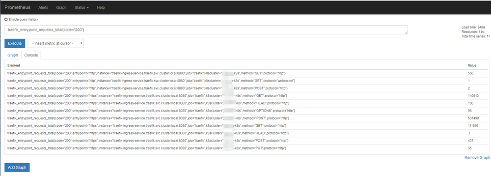
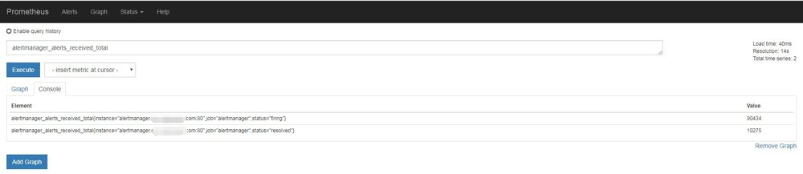

## 背景

由于容器化和微服务的大力发展，Kubernetes 基本已经统一了容器管理方案，当我们使用 Kubernetes 来进行容器化管理的时候，全面监控 Kubernetes 也就成了我们第一个需要探索的问题。我们需要监控 kubernetes 的 ingress、service、deployment、pod......等等服务，以达到随时掌握 Kubernetes 集群的内部状况。

此文章也是 Prometheus 监控系列的第三篇，具体描述了在 Kubernetes 中使用 Prometheus 来采集业务指标。多数为思想指导，会列出两个例子。第一个例子是针对部署在 Kubernetes 中的服务，另外一个例子是非 Kubernetes 部署的服务。前者为使用“动态采集”，后者使用“静态采集”。

## 概念

要使用 Prometheus 实现自动采集业务指标数据真的非常简单，只需要 2 步

1、业务侧实现一个接口，返回 Prometheus 规范化数据，如下：

```json
traefik_entrypoint_requests_total{code="302",entrypoint="https",method="HEAD",protocol="http"} 1
traefik_entrypoint_requests_total{code="302",entrypoint="https",method="POST",protocol="http"} 1
traefik_entrypoint_requests_total{code="304",entrypoint="http",method="GET",protocol="http"} 15
traefik_entrypoint_requests_total{code="304",entrypoint="https",method="GET",protocol="http"} 5951
traefik_entrypoint_requests_total{code="400",entrypoint="https",method="GET",protocol="http"} 149
traefik_entrypoint_requests_total{code="403",entrypoint="http",method="GET",protocol="http"} 2
traefik_entrypoint_requests_total{code="403",entrypoint="https",method="HEAD",protocol="http"} 2
traefik_entrypoint_requests_total{code="404",entrypoint="http",method="GET",protocol="http"} 680
traefik_entrypoint_requests_total{code="404",entrypoint="http",method="HEAD",protocol="http"} 15
traefik_entrypoint_requests_total{code="404",entrypoint="http",method="POST",protocol="http"} 674
```

- 每行代表一个监控项，以 KEY VALUE 形式返回，KEY 可以带上 0 个或多个属性，多个属性以“，”分隔。在 Prometheus 中查询数据的时候，可以用这些属性作为筛选条件。

2、运维侧部署的时候，在 svc 上带上 3 个标签

```yaml
apiVersion: v1
kind: Service
metadata:
  name: xxx-svc
  namespace: xxx-qa
  annotations:
    prometheus.io/scrape: 'true'
    prometheus.io/path: '/monitor/live-data'
    prometheus.io/port: '9098'
```

- prometheus.io/scrape:
  自动采集指标数据开关，默认为 false；Prometheus 会在 k8s 集群中自动检测哪些 svc 是打开了这个开关
- prometheus.io/path：
  采集指标数据路径，默认为 /metrics
- prometheus.io/port：
  采集指标端口，默认为 svc 暴露的端口

加上这 3 个 annotations，prometheus 会自动采集 xxx-svc:9080/monitor/live-data 的数据。

## 数据采集

### 动态采集

部署在 Kubernetes 中服务。这里使用 traefik 做示范

1、业务侧实现接口，返回格式化监控数据。traefik 本身自带监控接口，只需要在启动的时候加上 **--web.metrics.prometheus** 选项就行了

```yaml
apiVersion: extensions/v1beta1
kind: Deployment
metadata:
  name: traefik-ingress-controller
  namespace: traefik
  labels:
    k8s-app: traefik-ingress-lb
spec:
  replicas: 1
  selector:
    matchLabels:
      k8s-app: traefik-ingress-lb
  template:
    metadata:
      labels:
        k8s-app: traefik-ingress-lb
        name: traefik-ingress-lb
    spec:
      serviceAccountName: traefik-ingress-controller
      terminationGracePeriodSeconds: 60
      volumes:
      - name: ssl
        secret:
          secretName: traefik-cert
      - name: config
        configMap:
          name: traefik-conf
      containers:
      - image: traefik:v1.7.6
        name: traefik-ingress-lb
        volumeMounts:
        - mountPath: "/ssl"
          name: "ssl"
        - mountPath: "/config"
          name: "config"
        ports:
        - name: http
          containerPort: 80
        - name: admin
          containerPort: 8080
        - name: https
          containerPort: 443
        args:
        - --configFile=/config/traefik.toml
        - --web
        - --kubernetes
        - --logLevel=INFO
        - --web.metrics.prometheus
        - --web.metrics
```

2、部署 svc 的时候加上

```yaml
apiVersion: v1
kind: Service
metadata:
  name: traefik-ingress-service
  namespace: traefik
  annotations:
    prometheus.io/scrape: 'true'
    prometheus.io/port: '8080'
spec:
  externalTrafficPolicy: Local
  selector:
    k8s-app: traefik-ingress-lb
  ports:
    - protocol: TCP
      port: 80
      name: web
    - protocol: TCP
      port: 443
      name: https
  type: LoadBalancer
```

prometheus.io/path 可以不用指定了，默认就是 /metrics

现在就可以在 Prometheus 页面查询到 traefik 的监控数据了



Grafana 监控 Traefik 面板：https://grafana.com/dashboards/9682

### 静态采集

部署在非 Kubernetes 中的服务。这里使用 Alertmanager 来做示范，Alertmanager 是没有部署在 Kubernetes 里面的。

1、业务侧实现接口，返回格式化监控数据。Alertmanager 也自带监控接口，路径就是 /metrics

2、修改 Prometheus-Server 配置文件，新增加一个 job_name 静态配置。

```yaml
- job_name: "alertmanager"
    static_configs:
    - targets: ['alertmanager.xxxx.com:80']
```

targets：监控数据获取地址

稍等 2 分钟，也可以看到 Prometheus 的监控数据了



Grafana 监控 Alertmanager 面板：https://grafana.com/dashboards/9741

## 结束

此文章是“使用 prometheus 完美监控 kubernetes 集群”系列的第三篇，也基本上把 prometheus 在 kubernetes 中的使用讲的差不多了，剩下的更多是自己平时的使用探索，如果有不理解的地方，欢迎随时后台留言。
