## 编者按

Prow 是 Google 发起的适应云原生开源项目的 ChatOps 系统。Kubernetes、Istio 等项目都使用 Prow 实现开源协同。

* K8s 的 Prow 系统：[https://prow.k8s.io/](https://prow.k8s.io/)
* Prow 开源仓库：[https://github.com/kubernetes/test-infra/](https://github.com/kubernetes/test-infra/)
* Prow 官方文档：[https://github.com/kubernetes/test-infra/blob/master/prow/README.md](https://github.com/kubernetes/test-infra/blob/master/prow/README.md)

我们将以我的 Github 测试仓库 [zhangsean/prow-test](https://github.com/zhangsean/prow-test) 为例，来演示在一个本地k8s集群上使用 Prow 来实现CI/CD的诸多效果。

## 准备一个k8s集群

Prow 运行在 k8s 集群中，最好运行在有公网IP地址的k8s集群，可以免去 Webhook 转发的麻烦。临时测试可以使用本地集群。我使用 kind 创建一个本地 k8s 集群，使用 minikube 等其他工具都可以。

```shell
# 创建一个本地集群
kind create cluster
export KUBECONFIG=$(kind get kubeconfig-path)
# 确认k8s启动成功
kubectl version
kubectl get po -A
# 部署 Ingress 控制器会使访问更方便，如果你的 k8s 集群已经有 Ingress 或者想用 NodePort 则可以跳过
# 以下 Traefik Ingress Controller 中启用了默认 https 协议，替换111.22.3.4成你的主机IP即可访问 http://traefik.主机IP.nip.io 查看 Traefik 控制界面
curl -sSL https://github.com/zhangsean/prow-quickstart/blob/master/traefik-ds.yaml?raw= | sed 's|192.168.64.10|111.22.3.4|g' | kubectl apply -f -
```

## 准备一个 Github 机器人账号

> 说明：体验 Prow 效果并不需要额外注册一个 Github 机器人账号，用个人账号完全不影响 Prow 的效果，给 Prow 配置机器人账号只是可以在 PR 中清楚区分哪些是人为和机器人的操作。

如果你还没有机器人账号，请在 Github 注册一个机器人账号，我注册了 `zhangsean-bot`。  
在你的项目仓库中把机器人账号加入合作者中，复制邀请链接，用机器人账号登录 Github 打开邀请链接并接受邀请，这样机器人就有权限读取和操作你的仓库了。
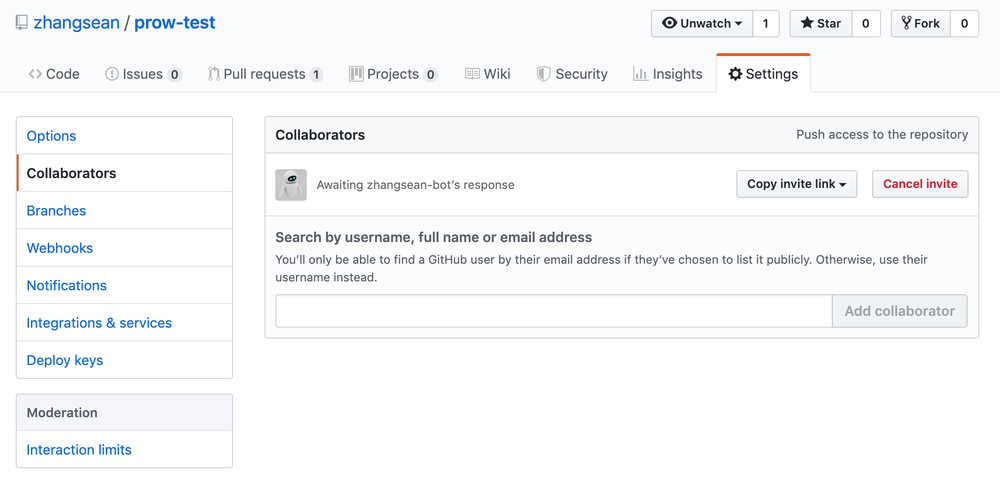

## 准备 Github 认证令牌

为了授权 Prow 访问 Github 项目动态，用机器人或个人账号登录 Github 并在 [Github Tokens](https://github.com/settings/tokens) 中添加一个含有 `repo:status` 和 `public_repo` 权限的令牌。
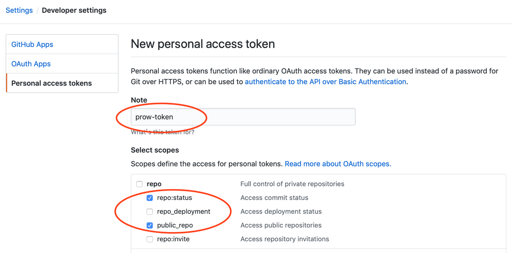
添加成功后把生成的令牌字符串写入到 `oauth-token` 文件并保存到 k8s 中。

```shell
echo "f192f1277d47aff3eb60e99530b1cdc6639fda3c" > oauth-token
kubectl create secret generic oauth-token --from-file=oauth=./oauth-token
```

再生成一个用于 Github Webhook 认证的 hmac 令牌，并保存到 k8s 中：

```shell
openssl rand -hex 20 > hmac-token
kubectl create secret generic hmac-token --from-file=hmac=./hmac-token
```

## 部署 Prow

```shell
# 部署 Prow starter 集群，默认部署到 default 命名空间
kubectl apply -f https://github.com/kubernetes/test-infra/blob/master/prow/cluster/starter.yaml?raw=
# 等待所有 pods 状态都变成 Running
kubectl get po
# 查看 Prow 默认部署的 ingress
kubectl get ing
# 查看 deck 和 hook 服务的 NodePort 端口
kubectl get svc
```

服务列表如下所示，`deck`的 NodePort 端口是`31920`，`hook`的 NodePort 端口是`30868`。

```shell
NAME         TYPE        CLUSTER-IP    EXTERNAL-IP   PORT(S)          AGE
deck         NodePort    10.0.13.133   <none>        80:31920/TCP     85s
hook         NodePort    10.0.2.190    <none>        8888:30868/TCP   85s
kubernetes   ClusterIP   10.0.0.1      <none>        443/TCP          28m
tide         NodePort    10.0.86.177   <none>        80:31254/TCP     85s
```

> 注意：由于 Prow 配置 PR Status 时必须使用 https 访问，所以如果考虑启用 PR Status 功能，请为 deck 配置 https 访问地址（不要求SSL可信证书）。

如果你的 k8s 集群有公网接入，可以配置 SLB 将流量转发到 `deck` 和 `hook` 服务，应该得到两个类似这样的网址：

```yaml
deck: http://prow.example.com/
hook: http://hook.example.com/
```

如果直接通过有公网IP的节点IP:NodePort 访问，那么访问网址应该类似这样：

```yaml
deck: http://111.2.3.4:31920/
hook: http://111.2.3.4:30868/
```

如果你的 k8s 集群已经有 Ingress 控制器，可以修改 Prow 默认的 Ingress 来配置访问地址：

```shell
$ kubectl get ingress
NAME   HOSTS   ADDRESS   PORTS   AGE
ing    *                 80      21h
$ kubectl describe ingress ing
Name:             ing
Namespace:        default
Address:
Default backend:  default-http-backend:80 (<none>)
Rules:
  Host  Path  Backends
  ----  ----  --------
  *
        /*      deck:80 (10.244.0.32:8080,10.244.0.33:8080)
        /hook   hook:8888 (10.244.0.16:8888)
# 必须把 deck 针对GKE配置的路径 /* 改成 / 才能适配普通 Ingress 控制器
$ kubectl get ingress ing -o yaml | sed 's|path: /\*|path: /|g' | kubectl apply -f -
# 验证 ingress 中 deck 服务路径是否调整为 /
$ kubectl describe ingress ing
Name:             ing
Namespace:        default
Address:
Default backend:  default-http-backend:80 (<none>)
Rules:
  Host  Path  Backends
  ----  ----  --------
  *
        /       deck:80 (10.244.0.32:8080,10.244.0.33:8080)
        /hook   hook:8888 (10.244.0.16:8888)
# 如果 ingress 需要绑定域名，比如 prow.example.com，以下是Mac的命令
$ kubectl get ingress ing -o yaml | sed "/\/hook/a\\
\    host: prow.example.com\\
" | kubectl apply -f -
# 验证 ingress 中域名配置
$ kubectl describe ingress ing
Name:             ing
Namespace:        default
Address:
Default backend:  default-http-backend:80 (<none>)
Rules:
  Host              Path  Backends
  ----              ----  --------
  prow.example.com
                    /       deck:80 (10.244.0.32:8080,10.244.0.33:8080)
                    /hook   hook:8888 (10.244.0.16:8888)
```

那么通过ingress访问时的网址应该类似这样：

```yaml
deck: http://prow.example.com/
hook: http://prow.example.com/hook/
```

如果你使用 `minikube` 启动本地 k8s 集群，通过 `minikube ip` 得到 k8s 的 node IP，则访问地址应该类似如下：

```yaml
deck: http://192.168.64.10:31920/
hook: http://192.168.64.10:30868/
```

如果你使用 `kind` 启动本地 k8s 集群，则必须将以上2个端口映射到本地才能访问：

```shell
# 查看 kind 集群的节点名称，也就是容器名称
$ kind get nodes
kind-control-plane
# 将 deck 服务的 NodePort 31920 端口映射到本地 8080 端口
$ docker run -itd --name prow-deck -p 8080:80 --link kind-control-plane zhangsean/nginx-port-proxy kind-control-plane:31920
# 将 hook 服务的 NodePort 30868 端口映射到本地 8088 端口
$ docker run -itd --name prow-hook -p 8088:80 --link kind-control-plane zhangsean/nginx-port-proxy kind-control-plane:30868
```

## 访问 Prow 界面

打开 `deck` 的访问地址（比如 [http://prow.example.com](http://prow.example.com)） 即可看到 Prow Status 界面。
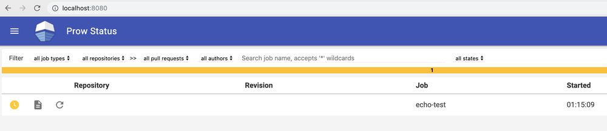
发送一个空的 POST 请求给 `hook` 访问地址的 `/hook` 目录（比如 [http://prow.example.com/hook](http://prow.example.com/hook) ）应该看到如下 `400` 的返回结果。

```shell
$ curl -i -d "" http://localhost:8088/hook
HTTP/1.1 400 Bad Request
Content-Type: text/plain; charset=utf-8
X-Content-Type-Options: nosniff
Date: Wed, 12 Jun 2019 04:37:12 GMT
Content-Length: 47

400 Bad Request: Missing X-GitHub-Event Header
```

## 给本地 k8s 集群接入公网 Webhook 访问

如果你是本地 k8s 集群，必须给 `hook` 服务接入可被 Github 访问的公网访问地址，如果是公网 k8s 集群可以跳过这一步。

先去 [www.ultrahook.com](http://www.ultrahook.com/) 首页点击 `Get Start Now!` 注册完成即可免费获得 API Key，然后按提示安装 UltraHook 启动代理。

```shell
# 本地安装 UltraHook 客户端
sudo gem install ultrahook
# 将申请到的API Key 保存到 UltraHook 配置文件
echo "api_key: nYKv6q6X9lJUbDCGXIRQfJ6yNuip1234" > ~/.ultrahook
# 新开一个窗口启动 UltraHook 代理，因为期间不能结束 ultrahook 进程，转发 Webhook 请求到已经转发到 hook 服务的本地8088端口
ultrahook prow 8088
```

UltraHook 代理启动后会输出一个公网地址，复制这个地址用于在 Github 中添加 Webhook。

```shell
Authenticated as seanz
Forwarding activated...
http://prow.seanz.ultrahook.com -> http://localhost:8088
```

测试发送一个空的 POST 请求到 Webhook 地址，ultrahook 应该输出一个日志返回400，如果没有日志输出则说明没有代理成功，请检查 ultrahook。
> 注意：不管 hook 后端是否实际接受成功或者验证失败，ultrahook 请求的返回码都是200，所以我们只能通过 ultrahook 日志来查看 hook 后端的实际处理结果。

```shell
curl -i -d "" http://prow.seanz.ultrahook.com/hook
...
[2019-06-12 13:30:36] POST http://localhost:8088/hook - 400
```

## 给 Github 仓库添加 Webhook

以仓库 `zhangsean/prow-test` 为例，在项目 Settings → Webhooks 配置中点击 `Add webhook` 按钮，按如下提示填写相关信息并保存 webhook：

```yaml
Payload URL: http://prow.seanz.ultrahook.com/hook  # 上一步 UltraHook 生成的外网地址，加上 /hook 路径，这个路径是重点
Content type: application/json
Secret: `68f58d2dd9aa4ecd5fae8c0c0ac8cb8057e123456` # 通过 `cat hmac-token` 命令查看 hmac-token 的值
Which events would you like to trigger this webhook?: Send me everything.
```

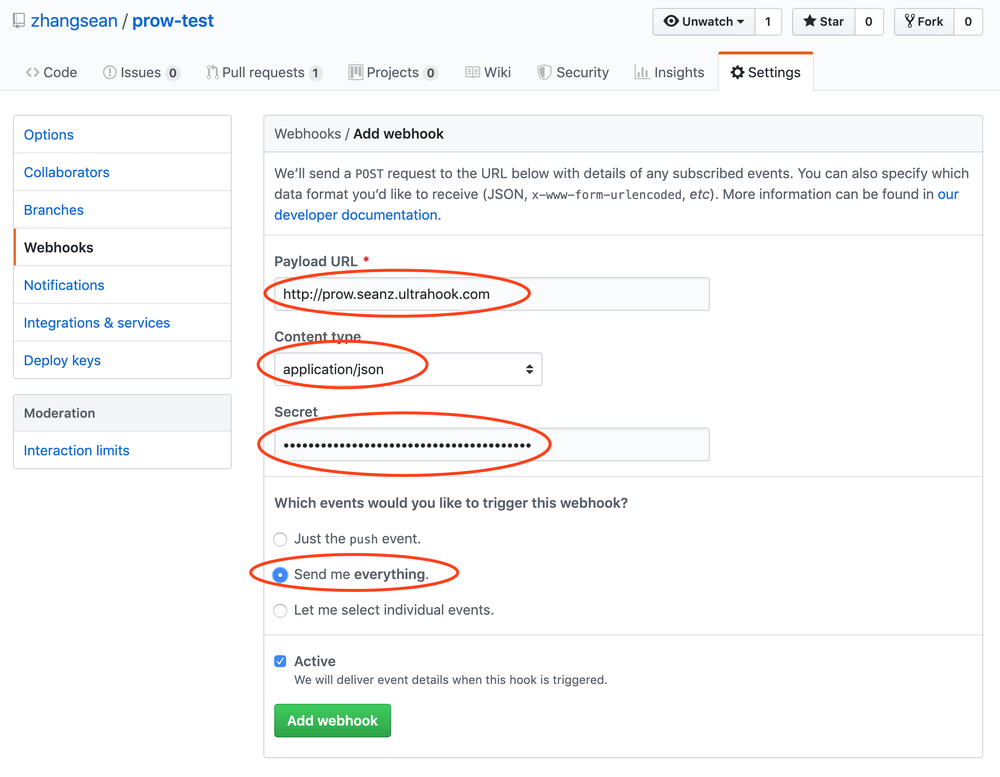
添加 webhook 成功后，新添加的 webhook 地址前会显示一个图标显示 webhook 接收端状态是否正常，确保状态为绿色的`√`。  
如果状态为`×`说明 webhook 地址配置不正确，点击 webhook 地址进入 webhook 管理界面，下方`Recent Deliveries`会显示最近事件列表，点击事件UUID可以查看当前事件的推送请求和返回结果。在每个请求的 `Reponse` 标签中能查看Webhook请求返回的状态码和返回内容，有助于定位问题。  
这里还可以通过点击 `Redeliver` 按钮重复推送这个事件，可以测试 webhook 接收端能否正常接收事件。
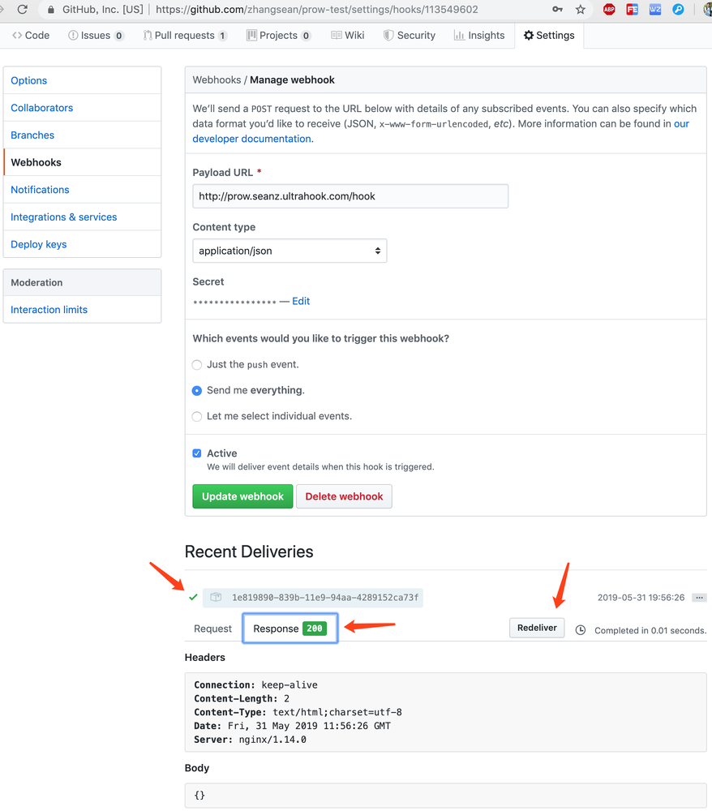

## 启用插件

Prow 自带了丰富的插件，可以通过 `Prow Status` 界面，左上角选择 `Plugins` 界面查看插件列表，点击某个插件的 `DETAILS` 按钮可以查看插件详情、适用场景、交互命令等。  
插件仓库上方切换仓库列表即可过滤指定仓库启用了哪些插件，这里可以检查仓库的插件配置是否生效。

默认部署是没有启用任何插件的，需要通过修改k8s的 `plugins.yaml` 配置为指定的项目仓库启用所需插件。  
创建一个名为 `plugins.yaml` 的文件并参照如下内容配置需要的插件。  
我已经列出了几个便于测试的常用插件，注释后面是交互命令格式。

```yaml
plugins:
  zhangsean/prow-test: # 项目仓库名，只填写组织则可以应用到组织下的所有仓库
  - size
  - welcome
  - owners-label
  - wip
  - cat # /meow
  - dog # /woof
  - pony # /pony
  - yuks # /joke
  - help # /help
  - label # /key value, /kind bug, /language zh
  - skip # /skip
  - lgtm # /lgtm
  - assign # /assign @user, /cc @user
  - approve # /approve
```

官方建议通过 `checkconfig` 命令来验证配置文件是否正确。如果你没有大的改动，可以跳过。

```shell
# 安装 checkconfig
go get k8s.io/test-infra/prow/cmd/checkconfig
# 检查配置是否有语法错误
checkconfig --plugin-config=./plugins.yaml
```

保存 `plugins` 配置到 k8s：

```shell
kubectl create configmap plugins \
  --from-file=plugins.yaml=./plugins.yaml --dry-run -o yaml \
  | kubectl replace configmap plugins -f -
# 验证配置是否保存成功
kubectl get cm plugins -o yaml
```

插件配置保存成功后，要过一会儿才能在 `Prow Plugin Catalog` 界面看到配置生效。
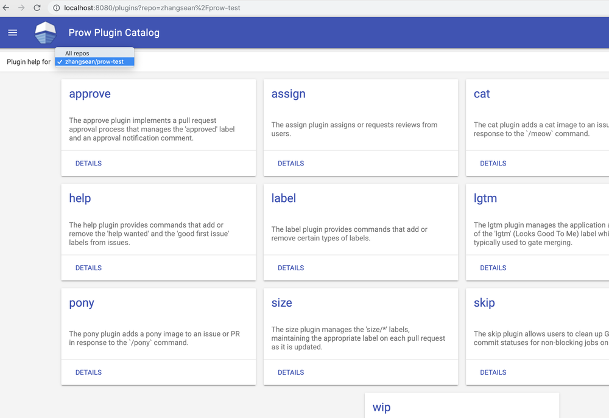

## 测试 Prow

插件配置生效以后就可以测试Prow效果了，在 Github 仓库中发起一个PR，稍后就会看到`size`，`approve`这几个插件的效果。

> 注意：如果没有创建机器人账号，直接在个人账号下添加的 Github Token，那么 Prow 的响应都会显示为个人账号的动作。

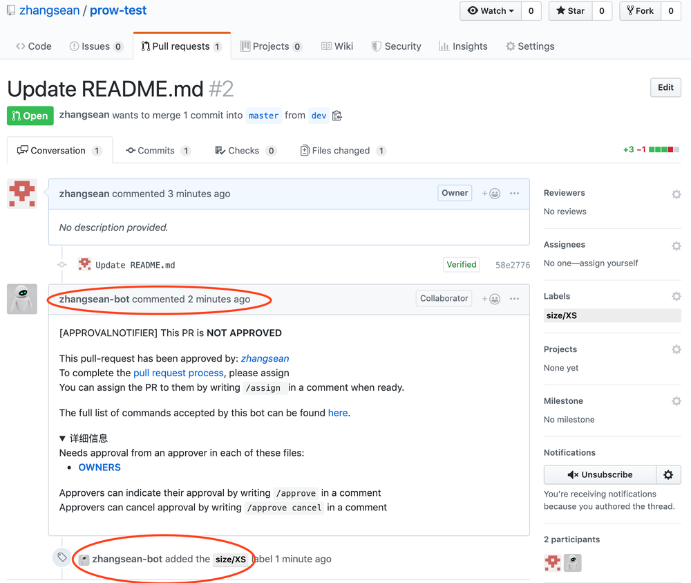

在 PR 中回复命令即可触发相关插件，比如回复 `/pony` 会自动插入一个马的图片。  
管理员在满足合并要求的情况下回复 `/lgtm` 会触发 Prow 自动合并PR，其他命令交互效果请查看插件详情。
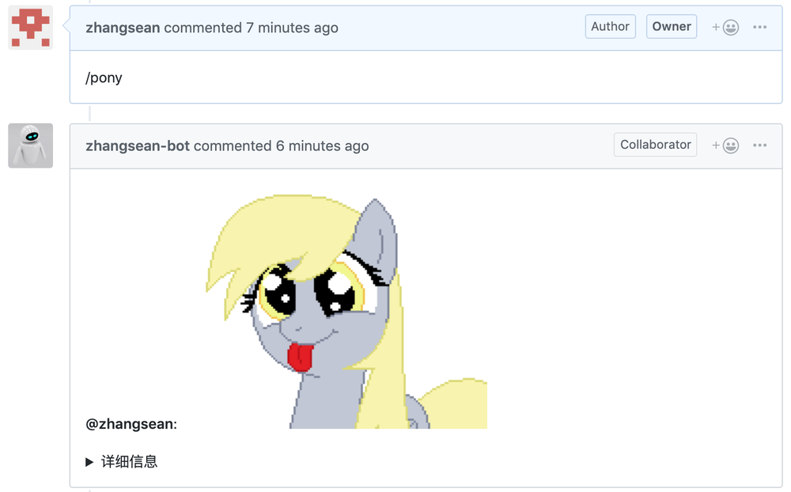

## 配置 Prow Job

配置 Prow Job 用于定时执行一些事务，比如定时执行 CI/CD 自动发布项目。  
Prow 默认部署了一个 `echo-test` 测试任务，每隔10分钟显示当前时间。  

通过查看k8s中 `config` 配置的 `config.yaml` 文件即可看到这个Job的配置内容:

```shell
kubectl get configmap config -o yaml
```

我们把 `config.yaml` 文件的内容提取出来，通过修改这个文件并应用到 k8s 集群来配置 Prow Job：

```yaml
prowjob_namespace: default
pod_namespace: test-pods
periodics:
- interval: 10m
  agent: kubernetes
  name: echo-test
  spec:
    containers:
    - image: alpine
      command: ["/bin/date"]
```

如果暂时不需要 Prow Job，可以把 `periodics` 配置清空，比如：

```yaml
prowjob_namespace: default
pod_namespace: test-pods
periodics:
```

官方建议通过 `checkconfig` 命令来验证配置文件是否正确，暂时可以跳过。

```shell
checkconfig --config-path=./config.yaml
```

保存 `config` 配置到 k8s 让 Prow Job 生效：

```shell
kubectl create configmap config \
  --from-file=config.yaml=./config.yaml --dry-run -o yaml \
  | kubectl replace configmap config -f -
```

Prow Job 应用后可以在 `Prow Status` 界面查看到执行记录：
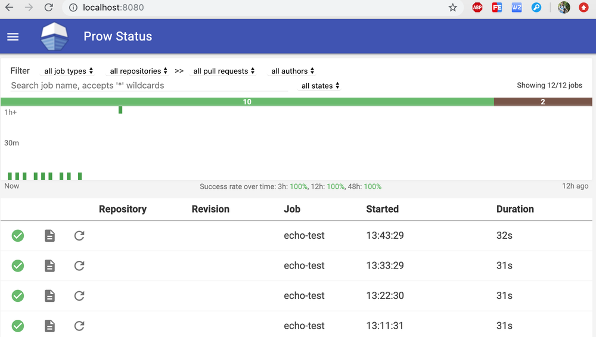

## 启用 Prow PR Status 功能

Prow PR Status 功能可以在 Prow 中查看个人相关的 PR 处于什么状态。Prow Starter集群默认没有启用 PR Status 功能，Prow 左侧看不到相关菜单，必须启用以后才会出现 `PR Status` 菜单。

由于 PR Status 是针对项目的所有贡献者的，所以当贡献者访问 Prow 的 PR Status 功能时，浏览器会跳转到 Github 使用 OAuth 认证获得用户的授权后，浏览器会自动跳转回 PR Status 界面显示该贡献者相关的 PR 列表。

> 注意：Prow 必须使用 https 访问才能正常使用 PR Status 功能。

在 Github 个人账号 Settings → Developer settings → [OAuth Apps](https://github.com/settings/developers) 中点击`New OAuth App`，参照如下信息添加一个 OAuth App.

```yaml
Application name: Prow PR Status
Homepage URL: https://localhost:8080
Authorization callback URL: https://localhost:8080
```

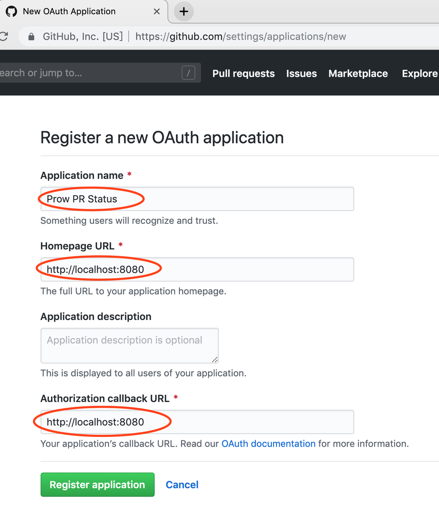
OAuth App 保存成功后，把生成的客户端ID和密钥填入 `github-oauth-config.yaml` 文件.

```yaml
client_id: e6403c9b594929axxxxx
client_secret: 933edc0ed4f91db12ebc26165f40cd49b02xxxxx
redirect_url: https://localhost:8080/github-login/redirect
final_redirect_url: https://localhost:8080/pr
```

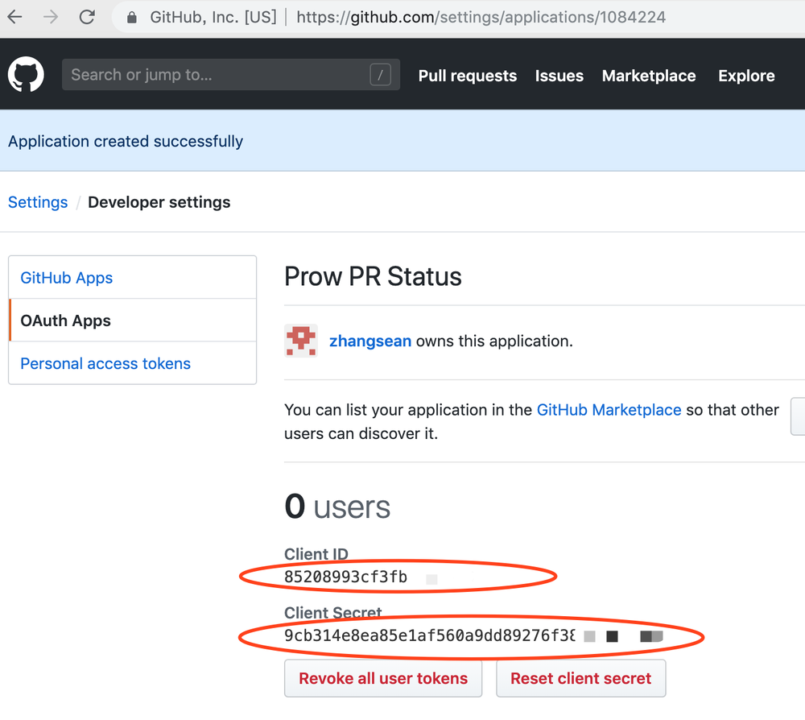

再创建一个用于保存 cookie 的 `cookie.txt` 文件。

```shell
openssl rand -out cookie.txt -base64 64
```

把以上2个配置文件保存到 k8s 集群。

```shell
kubectl create secret generic github-oauth-config --from-file=secret=github-oauth-config.yaml
kubectl create secret generic cookie --from-file=secret=cookie.txt
```

获取当前 deck 部署并添加配置以便启用 `PR Status` 功能。

```shell
kubectl get deploy deck -o yaml > deck_deployment.yaml
```

在 `args` 中添加1个参数，务必注意缩进:

```yaml
- --oauth-url=/github-login
```

在 `volumeMounts` 下面添加2个挂载路径，务必注意缩进:

```yaml
- name: oauth-config
  mountPath: /etc/github
  readOnly: true
- name: cookie-secret
  mountPath: /etc/cookie
  readOnly: true
```

在 `volumes` 下面添加2个卷引用，务必注意缩进:

```yaml
- name: oauth-config
  secret:
    secretName: github-oauth-config
- name: cookie-secret
  secret:
    secretName: cookie
```

在 k8s 集群中更新 deck 部署：

```shell
kubectl apply -f deck_deployment.yaml
# 检查 deck 的 pod 状态，直到所有 pod 都是 Running
kubectl get po
```

等 deck 的所有 pod 都重建以后，刷新 `Prow Status` 界面，左侧菜单会多出一个 `PR Status` 菜单。  
点击这个菜单会执行 OAuth 认证过程，跳转到 Github 中根据提示授权 Prow 读取 Github 的信息，授权成功后会回到 `PR Status` 界面显示当前用户开启的 PR 列表及其状态。
