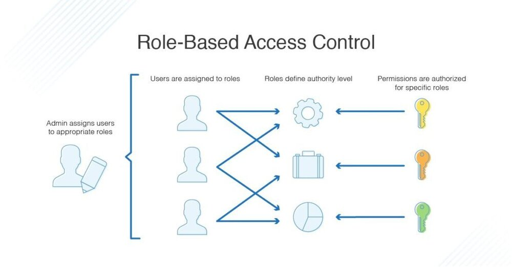
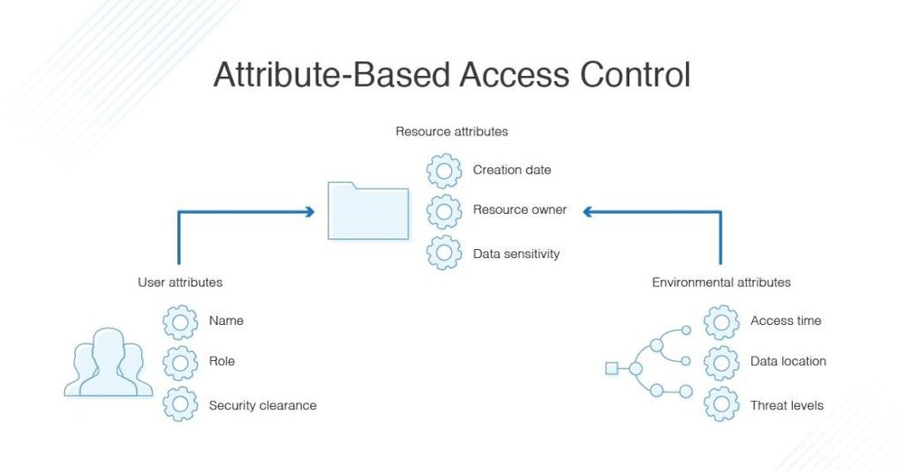

在任何公司，网络用户必须经过认证和授权，才能访问系统中可能导致安全漏洞的部分。获得授权的过程称为访问控制。在本指南中，我将讨论管理系统访问控制的两种主要方法 —— 基于角色的访问控制（RBAC）和基于属性的存取控制（ABAC）它们的差异，以及使用访问权限管理工具的重要性。

## 认证和授权

安全的两个基本方面是认证和授权。在您输入凭证登录电脑或登录应用程序或软件后，设备或应用程序会进行身份验证，以确定您的授权级别。授权可能包括您可以使用哪些账户，您可以访问哪些资源，以及允许您执行哪些功能。

## 基于角色的访问控制（RBAC）与基于属性的访问控制（ABAC）

基于角色的访问控制（RBAC）和基于属性的访问控制（ABAC）是控制认证过程和授权用户的两种方法。RBAC 和 ABAC 之间的主要区别是 RBAC 基于用户角色提供对资源或信息的访问，而 ABAC 基于用户、环境或资源属性提供访问权限。从本质上讲，当考虑 RBAC 与 ABAC 时，RBAC 控制整个组织的广泛访问，而 ABAC 则采取细粒度的方法。

### 什么是 RBAC？

RBAC 是基于角色的，所以根据你在组织中的角色而拥有不同的访问权限。这是由管理员决定的，管理员会设置一个角色应该拥有的访问权限，以及用户与角色的对应关系。例如，有的用户可能被分配到一个角色，可以编辑特定的文件，而其他用户可能被限制在一个角色中，只能读取该文件而不能编辑。

用户与角色是一对多的关系，这使得用户拥有可以访问许多不同的文件或能力。比如说有一个团队在做一个大型项目。项目经理可以访问和编辑所有的文件，而开发团队可能只被允许访问代码文件，而无法看到或编辑项目的财务和员工信息。人力资源或管理团队可以访问所有的员工和财务信息，而不能访问编程文件。

组织可能会将 RBAC 用于这样的项目，因为有了 RBAC，不需要在每次一有人离职或更换岗位时都进行更改：他们可以简单地从角色组中删除或分配一个新的角色。这也意味着新员工可以根据他们所履行的组织角色，相对快速地被授予访问权限。

### 什么是 ABAC？

基于属性的访问控制利用了一组称为 “属性 “的特征。这包括**用户属性**、**环境属性**和**资源属性**。

- 用户属性包括用户的姓名、角色、组织、ID 和安全许可等内容。
- 环境属性包括访问时间、数据的位置和当前组织的威胁等级。
- 资源属性包括诸如创建日期、资源所有者、文件名和数据敏感性。

基本上，ABAC 比 RBAC 有更多可能的控制变量。ABAC 的实施是为了降低因未经授权的访问而产生的风险，因为它可以在更细粒度地控制安全和访问。例如，ABAC 可以对他们的访问进行进一步的限制，比如只允许在特定的时间或与相关员工相关的某些分支机构进行访问，而不是让人力资源部门的人员总是能够访问员工和工资信息。这样可以减少安全问题，也可以帮助以后的审计过程。

### RBAC 与 ABAC 的比较

一般来说，有 RBAC 就足够了，应该在设置 ABAC 优先考虑使用它。这两个访问控制过程都是过滤器，ABAC 是两个过程中比较复杂的，需要更多的处理能力和时间。如果你不需要，就没有必要使用这种更强大的过滤器 —— 这会产生相应的资源成本。

无论哪种方式，使用最少数量的 RBAC 和 ABAC 过滤器来构建你的访问和安全环境是很重要的。它可以帮助仔细规划你的目录数据和访问方法，以确保你没有使用不必要的过滤器或使事情过于复杂。在许多情况下，RBAC 和 ABAC 可以分级地一起使用，广泛的访问由 RBAC 协议执行，更复杂的访问由 ABAC 管理。这意味着系统将首先使用 RBAC 来确定谁可以访问一个资源，然后由 ABAC 来确定他们可以对资源做什么以及何时可以访问。

## 使用访问管理工具

无论你是使用 RBAC 还是 ABAC，或者是两者的结合，我都强烈建议使用访问权限管理工具。一个好的工具可以简化设置并减少设置和管理过滤器所涉及的管理费用。 当涉及到安全问题时，认真规划和监控您的访问控制流程是至关重要的。使用强大的访问管理工具来帮助您设置访问控制，并定期审查您的设置，以确保它仍然符合您的组织需求。
