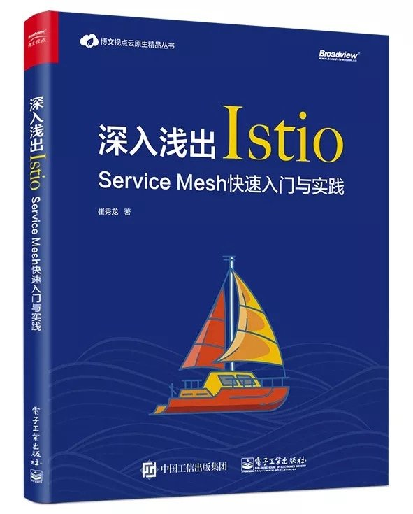

《深入浅出Istio》这本书这两天开始卖了，我也第一时间入手了以后到现在已经基本上全部翻完了。在这里记录一下看完这本书的读后感。
总体来说，这本书是一本既适合Istio本身有一定了解程度的使用者，也适合对ServiceMesh初学者的去学习Istio的书籍。这本书比较全面的介绍并总结了Istio的各个组件及其使用方法，并给出了许多具体的场景。

作为一名接触ServiceMesh领域和Istio快小半年的我来说，对于书中一些比较基础的章节和内容快速翻了一翻，同时也对部分对我帮助非常大的章节做了一些总结和心得。在这里用一篇读后感记录我读完以后的感受。

## 关于书籍作者

作者在ServiceMesher社区里面是一个非常活跃的人，对istio.io的中文化工作做了非常大的贡献。作为一个大部分时间在社区内处于一个围观群众，在这里对作者对国内ServiceMesh领域做出的贡献表示由衷的感谢。

## 全书结构

整本书分为十章，整本书我重点看了第1,2,3,5,8,10。第七章重点看了后半部分。

1. 服务网格历史
2. 服务网格的特性
3. 介绍istio
4. 安装istio
5. 详解Helm部署istio
6. Istio插件服务
7. Http流量管理
8. Mixer应用
9. Istio安全
10. 生产环境使用Istio的建议

## 正文

作者从微服务的诞生和发展谈起，简略谈了一下在微服务架构为我们解决了许多老问题时，它所给我们带来的一些新的问题。为了解决这些问题，Kubernetes为代表的容器云系统出现提供了部署、调度、伸缩等功能,,而ServiceMesh则应运而生去解决如何管理、控制、保障微服务之间的通信。随后，作者挑了几个重要的产品与事件来梳理了ServiceMesh的发展历史。从SpringCloud确定微服务治理的标准特性，到Linkerd发布后受人关注，再到Istio横空出世。ServiceMesh领域中目前发展的最好的毫无疑问是Istio。这不仅是因为Istio吸取了前面产品的经验，同样也背靠了Google,IBM和Lyft这三个公司共同组成的开发团队。由于我接触ServiceMesh领域时，Istio都已经发布到0.7版本了，所以这块的内容让我了解了整个ServiceMesh领域的发展历史。

在第二章，作者着重聊了一下Istio官网首页所印着的四个特性：连接、安全、策略、观察，所分别代表的意义和场景。然后在第三章介绍了Istio整体架构和每个组件所承载的意义和功能以及一些Istio自定义的CRD。关于Istio的架构设计和功能组件Istio官网本身就有非常详细的介绍了，直接看官网介绍就行，对于部分CRD的介绍挺好的，可以帮助理解每个Istio组件对应了哪些Istio配置文件。

第四章和第五章这块都是关于安装Istio的，这一块我比较熟悉就直接跳过了。同时对于个人开发者学习Istio而言，需要的是一个更快的本地搭建Istio环境的教程，这里推荐一个更简单的[快速本地搭建istio教程](https://github.com/AliyunContainerService/k8s-for-docker-desktop)。

第五章着重介绍了Istio安装文件种的Helm结构，以及每个参数所代表的意义。这一块我觉得对我的帮助非常大，由于之前我在生产环境安装istio都是通过我本地开发机helm template一个完整的安装文件，然后一并apply到生产环境上。
这给我至少带来了两个大问题：

1. 我的本地开发机拥有一个具有读写权限的生产环境k8s账号
2. 修改各个部件相关参数变得十分麻烦

目前在这上周我已经全部回收了我们开发组内所有人的生产环境权限，统一通过K8S DashBoard进行操作。当然，这也意味一旦需要更新istio就不能再走本地apply安装文件的方式。一个更加科学的方法则是通过CICD系统，用helm install/upgrade来管理生产环境的istio配置。所以，掌握istio的helm文件结构就显得非常重要，这块第五章给我的帮助很大。

第六章作者介绍了Istio的一些官方推荐的插件服务如Prometheus,Grafana,Jaeger这些。我就直接跳了。

第七第八章作者介绍了通过Istio进行网格的Http管理和Mixer应用。这两张是本书的两个大头，当然同样也是Istio应用的两个大头。
对于第七章，作者介绍了VirtualService,HttpRoute，Gateway这些相关概念，以及通过这些组件进行负载，转发，灰度这些内容，基本上我就快速看了过去。我个人在istio的实践上，也已经在生产环境上通过istio进行灰度发布，所以对于这块内容我已经比较熟悉了。

> 相关资料: [coohom在生产环境上使用istio的实践与经验](http://www.servicemesher.com/blog/practice-for-coohom-using-istio-in-production/)

第七章的后半段提到了通过Istio在生产环境进行故障演练的方案，这一块挺让我耳目一新的.一方面是没想到还能这么玩，一方面是在生产环境的故障演练同样也是我今年上半年将要去做的一个目标之一，这块对于故障注入与故障演练的场景方案对我帮助很大。

第八章作者着重介绍了通过Mixer来进行一些黑白名单、限流、自定义监控指标这些操作。在Istio官网上关于Mixer的大部分内容我也已经全部看完并实践过了，所以这块内容我看的比较快。一个比较遗憾的一点是没有看到关于如何自定义Adapter相关的介绍，这一块是Mixer有着非常大潜力与价值的一块内容，但同时也有着不小的门槛。这一块我前不久一直在花时间调研并通过自定义Istio Mixer Adapter完成了一个比较常见的需求，这次放假有空将会整理一下。

第九章讲了Istio安全认证这块，我暂时直接跳过了，在我目前的场景中，生产环境集群内所有服务都将长期处于互相信任的状态，所以我暂且并不关心这方面内容。

第十章作者给了一些在生产环境上使用Istio的建议，有大部分内容和我在生产环境上实践所的出来的结论相同，以及Istio目前的一些发展问题。

关于生产环境使用Istio的建议，这里我摘录几条我深表赞同的：

1. 永远准备一套不用Istio的备用环境，（ 目前我们服务的生产环境长期保留了主备服务，主服务使用Istio，备用业务则不使用Istio，每当进行istio升级或者是部分参数调整时都会提前进行主备切换，等升级调整验证完毕后才切换回来）
2. 确定使用Istio的功能范围 （在我们的场景中，只有真正的业务服务才被服务网格管理，其余不需要网格管理的服务绝对不强上网格）
3. 时刻考虑Istio功能的性价比 （不为了用功能而用功能，Istio Citadel安全功能对于我们来说目前收益接近于零，但风险极大，所以就坚决不用）

同时对于Istio这个产品发展的现状，作者给出了一定的担心，即目前Istio团队，发布的产品API稳定性太不稳定，不向后兼容，很多API全部改写。另一方面在发布质量上也出现过比较大的问题，造成了版本回退，发布延期等问题。同时Istio组件目前本身也有着一些瓶颈与问题如Mixer的复杂性与高成本学习，Pilot的性能瓶颈，SideCar的性能消耗。以上这些都有待Istio团队去解决。

最后整体来看，对于Istio，我个人认为Istio目前的发展状况在ServiceMesh领域中还并没有像K8S取得事实胜利，可能Istio也有可能步Linkerd的后路，为未来的产品开路和经验，但是ServiceMesh这条路无疑是正确的，我也会继续关注ServiceMesh和istio在2019年新的表现。
