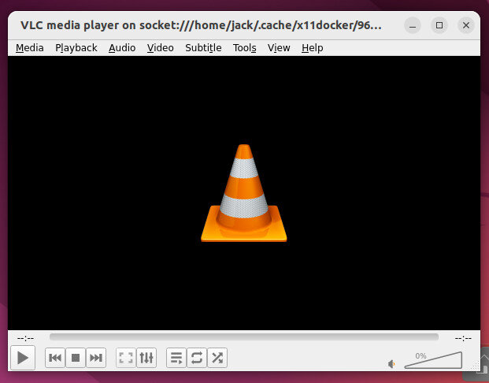

摘要：本文介绍了如何在 Docker 容器中运行 GUI 应用程序。通过使用 x11docker 应用程序，可以轻松启动带有桌面环境的 GUI 容器，并提供了许多功能，如 GPU 硬件加速、声音、剪贴板共享等。文章还提供了安装 Docker 运行时引擎和 x11docker 的详细步骤，并演示了使用 VLC 媒体播放器在容器中运行 GUI 应用程序的示例。

------

本文译自：<https://thenewstack.io/run-gui-applications-as-containers-with-x11docker/>

作为开发人员，您可能需要使用 GUI 容器进行工作。如果是这种情况，您会很快发现，传统的 Docker 运行时引擎并不支持运行 GUI 应用程序（除非它们是基于 Web 的类型）。当您想要开发容器化的 GUI 应用程序时，您该怎么办呢？

幸运的是，有许多第三方应用程序可以在桌面上轻松启动 GUI 容器。正如您可能预期的那样，这需要一个桌面环境（否则，您将在更传统的基于服务器的设置上进行开发）。其中一个应用程序叫做 [x11docker](https://github.com/mviereck/x11docker)。顾名思义，此应用程序与 Linux X 显示服务器配合使用（这意味着您需要一个 Linux 发行版才能使其正常工作）。

x11docker 应用程序包括以下功能：

- GPU 硬件加速
- PulseAudio 或 ALSA 声音
- 剪贴板共享
- 打印机和摄像头访问
- 持久的主目录
- Wayland 支持
- 语言区域设置创建
- 容器内的多个 init 系统和 DBus
- 支持多个容器运行时和后端（包括 Podman）

您可能会问：“X11 不安全吗？”是的，确实。幸运的是，x11docker 通过使用多个 X 服务器来避免 X 服务器泄漏。因此，您可以放心使用该工具，而不必担心会暴露自己、系统或容器给典型的 X11 服务器弱点。

需要记住的一件事是，x11docker 创建了一个非特权容器用户。该用户的密码为 x11docker，并限制了容器的功能。因此，某些应用程序可能无法按预期方式运行。例如，当尝试从容器内运行 Tor 浏览器时，它无法访问 /dev/stdout，这意味着容器将无法运行。但并不是所有容器都是如此。我将用 VLC 媒体播放器进行演示，该播放器可以按预期运行。

接下来，我将向您展示如何在运行中的基于 Ubuntu 的桌面操作系统实例上安装 x11docker。当然，首先您必须安装 Docker 运行时引擎。为此，我将向您展示两种不同的方法。

准备好了吗？我们开始吧。

## 所需的工具

正如我已经提到的，您需要运行中的基于 Ubuntu 的 Linux 桌面发行版实例。您还需要一个具有 sudo 权限的用户。就这些。

## 安装 Docker

首先，我们将使用传统的方法安装 Docker 运行时引擎。首先要做的是使用以下命令将官方 Docker GPG 添加到系统中：

```bash
curl -fsSL <https://download.docker.com/linux/ubuntu/gpg> | sudo gpg --dearmor -o /usr/share/keyrings/docker-archive-keyring.gpg
```

接下来，我们必须添加 Docker 仓库，以便安装软件。使用以下命令完成此操作：

```bash
echo "deb [arch=amd64 signed-by=/usr/share/keyrings/docker-archive-keyring.gpg] <https://download.docker.com/linux/ubuntu> $(lsb_release -cs) stable" | sudo tee /etc/apt/sources.list.d/docker.list &gt; /dev/null
```

添加仓库后，我们将使用以下命令安装一些依赖项：

```bash
sudo apt-get install apt-transport-https ca-certificates curl gnupg lsb-release -y
```

使用以下命令更新 apt：

```bash
sudo apt-get update
```

现在，我们可以使用以下命令安装 Docker：

```bash
sudo apt-get install docker-ce docker-ce-cli containerd.io -y
```

为了能够在不使用 *sudo* 的情况下运行 Docker 命令（这可能存在安全风险），请使用以下命令将您的用户添加到 docker 用户组中：

```bash
sudo usermod -aG docker $USER
```

注销并重新登录以使更改生效。

如果您希望采用快速方式，可以使用以下命令安装 Docker：

```bash
sudo apt-get install curl wget uidmap -y
wget -qO- https://get.docker.com/ | sudo sh
```

要能够以无特权方式运行 Docker，请执行以下命令：

```bash
dockerd-rootless-setuptool.sh install
```

## 如何安装 x11docker

在安装 x11docker 之前，我们必须安装一些依赖项。可以使用以下命令完成此操作：

```bash
sudo apt-get install xpra xserver-xephyr xinit xauth xclip x11-xserver-utils x11-utils -y
```

接下来，使用以下命令安装 x11docker：

```bash
curl -fsSL https://raw.githubusercontent.com/mviereck/x11docker/master/x11docker | sudo bash -s -- --update
```

然后，您可以使用以下命令更新 x11docker：

```bash
sudo x11docker --update
```

## 如何使用 x11docker

安装了 x11docker 之后，就可以开始测试了。让我们使用 VLC 应用程序容器进行测试。首先，使用以下命令拉取镜像：

```bash
docker pull jess/vlc
```

拉取镜像后，使用以下命令（借助 x11docker）运行 VLC：

```bash
x11docker --pulseaudio --share=$HOME/Videos jess/vlc
```

您应该会看到 VLC 窗口打开，准备好供使用（图 1）。它的速度比直接安装在您的桌面上要慢一些，但除此之外，它应该按预期工作。



当然，如果您是开发人员，这对您帮助不大，因为您想要开发自己的容器。您可以始终创建要使用的映像，对其进行标记，将其推送到您选择的存储库，使用 docker pull 命令将其拉到开发系统上，然后使用 x11docker 部署容器。

就是这样。现在，您可以通过 x11docker 在 Docker 容器中运行 GUI 应用程序了。借助自己的图像部署自己的定制容器，看看它的工作原理。
