## AI 是否存在隔离问题？

在过去的几个月里，我们 Wiz 研究团队对多个 AI 服务提供商进行了广泛的租户隔离研究。我们认为这些服务更容易受到租户隔离漏洞的影响，因为它们允许用户运行 AI 模型和应用程序，这等同于执行任意代码。随着 AI 基础设施越来越成为许多商业环境的标配，这些攻击的影响正变得越来越重要。

我们将在即将举行的 Black Hat 会议上展示这个研究项目的发现，在我们的会议“隔离还是幻觉？为乐趣和权重黑客攻击 AI 基础设施提供商”。

在这个项目的最新一期中，我们研究了 SAP 的 AI 产品，恰当地命名为“SAP AI Core”。这是我们系列中的第三份报告，继我们对 Hugging Face 和 Replicate 平台的研究之后。本博客将探索漏洞链并详细介绍我们的发现，称为“SAPwned”，同时也将观察到确保管理 AI 平台安全的潜在影响和更广泛的启示。

## 执行摘要

AI 训练过程需要访问大量敏感客户数据，这使 AI 训练服务成为攻击者的诱人目标。SAP AI Core 提供与 HANA 及其他云服务的集成，通过云访问密钥访问客户的内部数据。这些凭据非常敏感，我们的研究目标是确定潜在的恶意行为者是否能够访问这些客户秘密。

我们对 SAP AI Core 的研究始于使用 SAP 的基础设施执行合法的 AI 训练程序。通过执行任意代码，我们能够横向移动并接管服务——获取客户的私有文件以及客户云环境的凭据：AWS、Azure、SAP HANA Cloud 等。我们发现的漏洞可能允许攻击者访问客户数据并污染内部工件——蔓延到相关服务和其他客户环境。

具体来说，我们获得的访问权限允许我们：

- 在 SAP 的内部容器注册表上读取和修改 Docker 镜像

- 在 Google 容器注册表上读取和修改 SAP 的 Docker 镜像

- 在 SAP 的内部 Artifactory 服务器上读取和修改工件

- 获得 SAP AI Core 的 Kubernetes 集群的集群管理员权限

- 访问客户的云凭证和私有 AI 工件

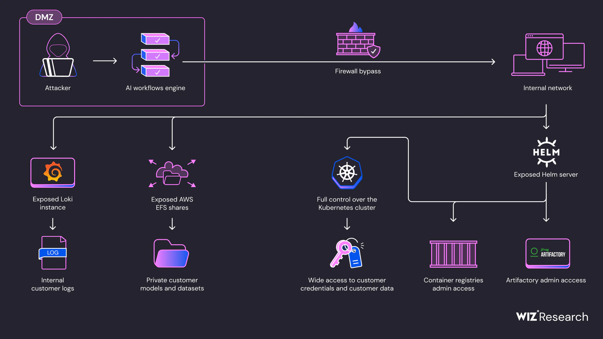

我们发现这些问题的根本原因是攻击者可以运行恶意 AI 模型和训练程序，这本质上是代码。在审查了几个主要 AI 服务之后，我们认为行业必须改进其在运行 AI 模型时的隔离和沙箱标准。

所有漏洞已报告给 SAP 的安全团队，并由 SAP 修复，如其网站所确认。我们感谢他们的合作。没有客户数据受到泄露。

## 介绍：研究开始

SAP AI Core 是一项服务，允许用户以可扩展和管理的方式在 SAP 的庞大云资源上开发、训练和运行 AI 服务。类似于其他云提供商（和 AI 基础设施提供商），客户的代码在 SAP 的共享环境中运行——构成跨租户访问的风险。

我们的研究始于作为 SAP 客户，基本权限允许我们创建 AI 项目。因此，我们首先在 SAP AI Core 上创建了一个常规 AI 应用程序。SAP 的平台允许我们提供一个 Argo Workflow 文件，该文件反过来生成了一个根据我们的配置的新 Kubernetes Pod。

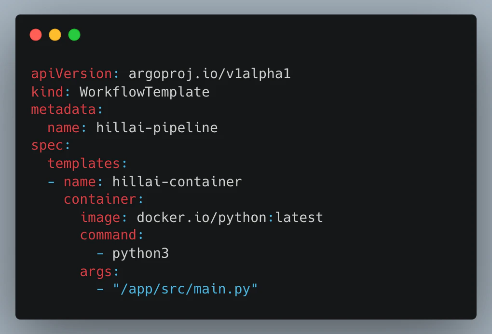

这允许我们在 Pod 中按设计运行我们自己的任意代码——不需要任何漏洞。然而，我们的环境受到了相当大的限制。我们很快意识到，我们的 Pod 的网络访问非常有限，这是由 Istio 代理 sidecar 强制执行的——因此，扫描内部网络对我们来说不是一个选项。至少现在不是。

## Bug #1: 通过 1337 的力量绕过网络限制

我们首先尝试的是为我们的 Pod 配置“有趣”的权限。然而，SAP 的准入控制器阻止了我们尝试的所有危险安全选项——例如，以`root`身份运行我们的容器。

尽管如此，我们发现准入控制器未能阻止两种有趣的配置。

第一个是`shareProcessNamespace`，它允许我们与我们的 sidecar 容器共享进程命名空间。由于我们的 sidecar 是 Istio 代理，我们获得了对 Istio 的配置的访问权限，包括对集群的集中式 Istiod 服务器的访问令牌。

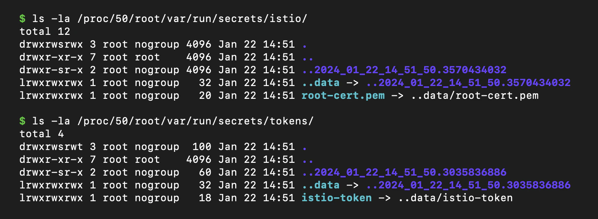

另一个是`runAsUser`（和`runAsGroup`）。虽然我们不能成为 root，但所有其他 UID 都是允许的——包括 Istio 的 UID，讽刺的是，这个 UID 是`1337`（是的，真的）。我们将我们的 UID 设置为 1337，并成功地以 Istio 用户的身份运行。由于 Istio 本身是[从 Istio 的 iptables 规则中排除的](https://istio.io/latest/docs/reference/config/analysis/ist0144/)——我们现在运行时没有任何流量限制！

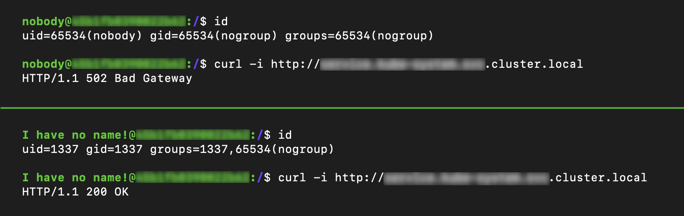

我们摆脱了流量束缚，开始扫描我们 Pod 的内部网络。使用我们的 Istio 令牌，我们能够从 Istiod 服务器读取配置并了解内部环境——这引导我们进行了以下发现。

## Bug #2: Loki 泄露 AWS 令牌

我们在集群中找到了一个 Grafana Loki 的实例，因此我们请求了`/config`端点以查看 Loki 的配置。API 响应了完整的配置，包括 Loki 用来访问 S3 的 AWS 密钥：

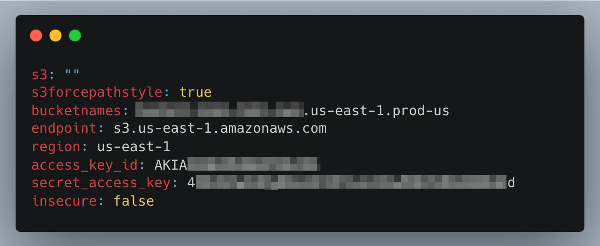

这些密钥授予访问 Loki 的 S3 存储桶的权限，其中包含 AI Core 服务（SAP 称其不敏感）和客户 Pods 的大量日志。

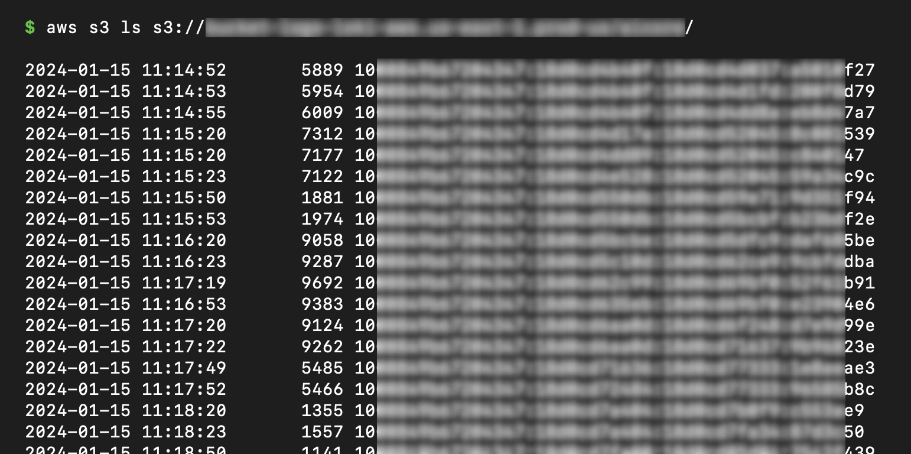

## Bug #3: 未经身份验证的 EFS 共享暴露用户文件

在内部网络中，我们发现了 6 个 AWS Elastic File System（EFS）实例，监听端口 2049。EFS 实例的一个[常见问题](https://youtu.be/HcNmkCRXFdE)是它们默认配置为公共的——这意味着只要您可以访问其 NFS 端口，就不需要凭据即可查看或编辑文件。这些实例也不例外，我们使用简单的开源 NFS 工具，可以自由访问共享的内容。

列出这些 EFS 实例上存储的文件，揭示了大量 AI 数据，包括代码和训练数据集，按客户 ID 分类：

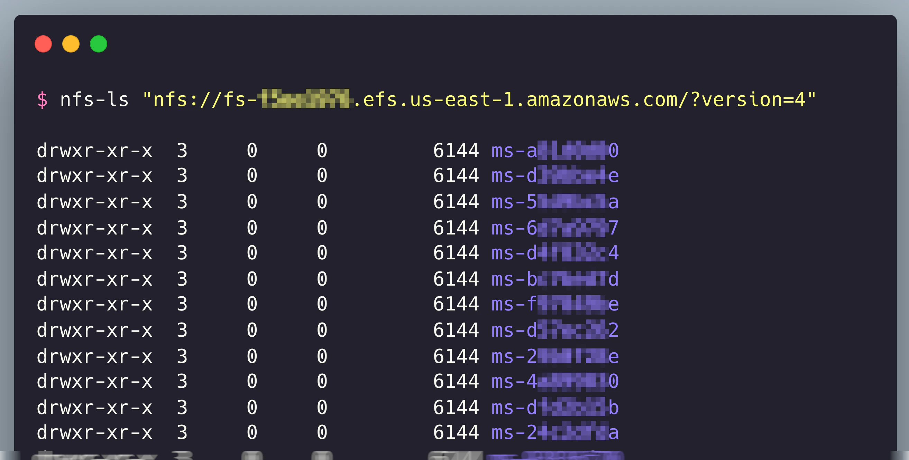

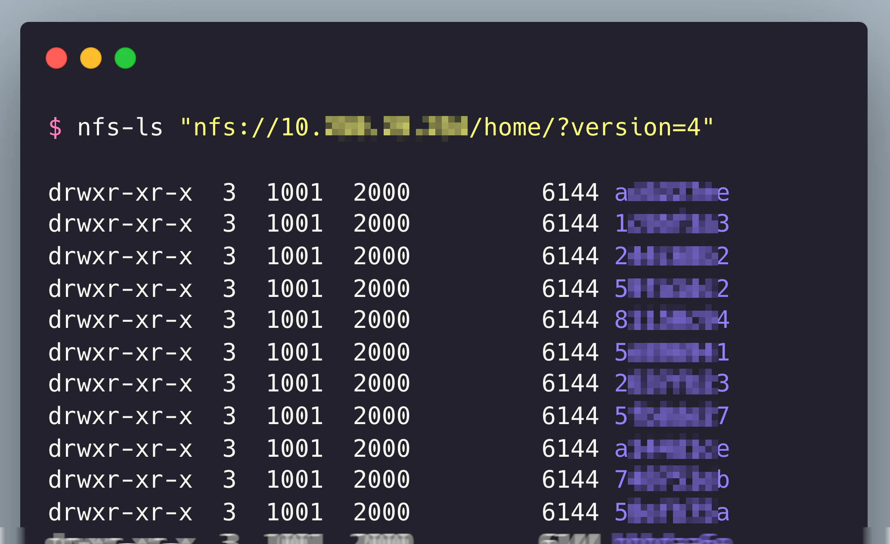

## Bug #4: 未经身份验证的 Helm 服务器危及内部 Docker 注册表和 Artifactory

我们在网络上最有趣的发现是一个名为 Tiller 的服务，这是 Helm 包管理器的服务器组件（版本 2）。

与 Tiller 的通信是通过其 gRPC 接口在端口 44134 进行的，该端口默认是未经身份验证的。

在我们的内部网络上查询这个服务器，揭示了对 SAP 的 Docker 注册表以及其 Artifactory 服务器的高权限密钥：

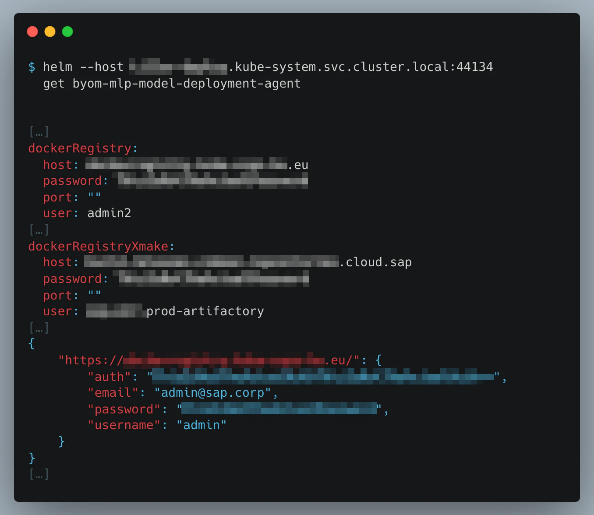

使用这些密钥的读取权限，潜在的攻击者可以读取内部图像和构建，提取商业秘密，可能还包括客户数据。

使用这些密钥的写权限，攻击者可以篡改图像和构建，对 SAP AI Core 服务进行供应链攻击。

## Bug #5: 未经身份验证的 Helm 服务器危及 K8s 集群，暴露 Google 访问令牌和客户秘密

Helm 服务器暴露了读写操作。尽管读取权限暴露了敏感的秘密（如上所示），但服务器的写权限允许完全接管集群。

Tiller 的`install`命令接受一个 Helm 包并将其部署到 K8s 集群。我们创建了一个恶意 Helm 包，生成了一个具有`cluster-admin`权限的新 Pod，并运行了安装命令。

现在我们在集群上运行具有完全权限！

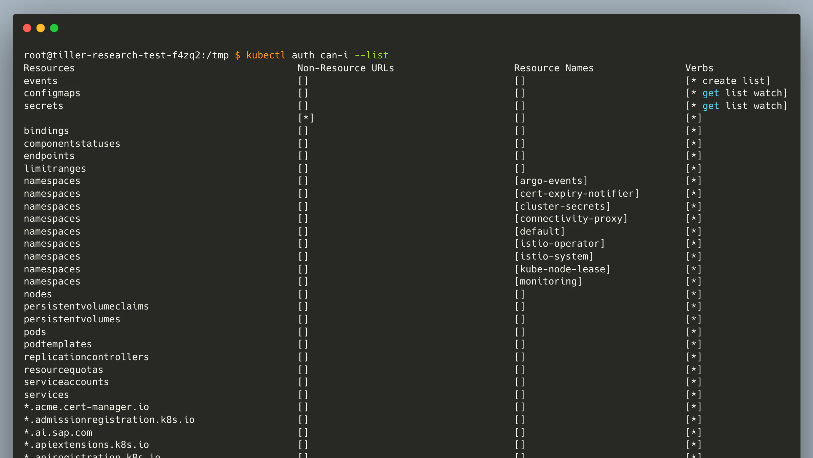

使用这种访问级别，攻击者可以直接访问其他客户的 Pods 并窃取敏感数据，如模型、数据集和代码。这种访问还允许攻击者干扰客户的 Pods，污染 AI 数据并操纵模型的推理。

此外，这种访问级别还将允许我们查看客户自己的秘密——甚至超出 SAP AI Core 范围的秘密。例如，我们的 AI Core 账户包含了我们的 AWS 账户（用于 S3 数据访问）、我们的 SAP HANA 账户（用于 Data Lake 访问）和我们的 Docker Hub 账户（用于拉取我们的镜像）的秘密。使用我们新获得的访问级别，我们查询了这些秘密，并设法以纯文本形式访问它们所有：

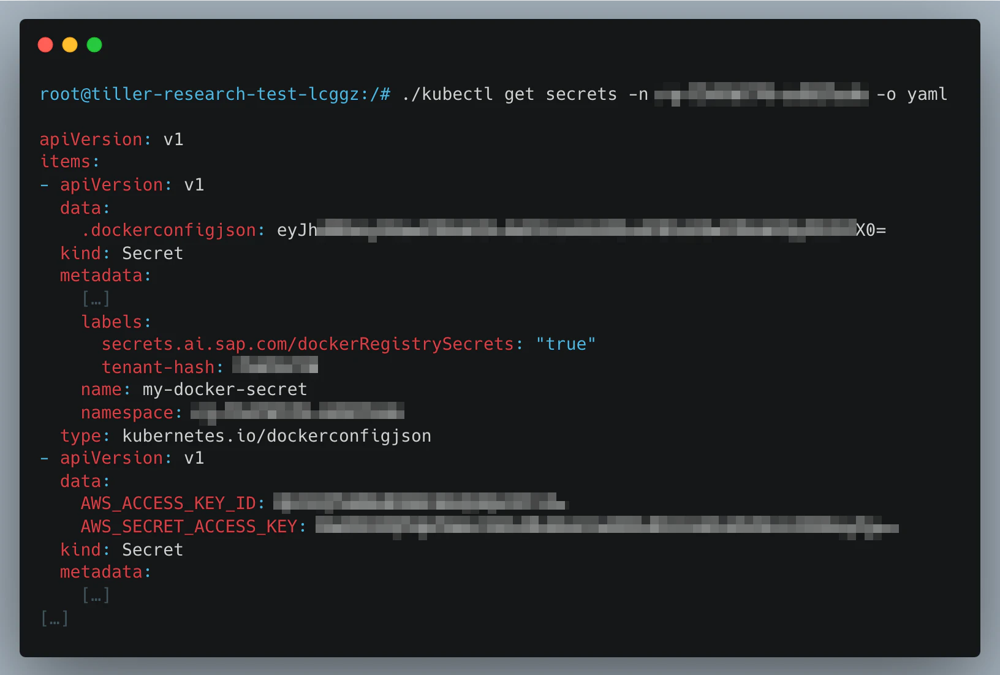

同样的查询还揭示了一个名为`sap-docker-registry-secret`的 SAP 访问 Google 容器注册表的密钥。我们已经确认这个密钥授予了读写权限——进一步扩大了潜在供应链攻击的范围。

## 启示

我们对 SAP AI Core 的研究表明，深度防御的重要性。我们面临的主要安全障碍是 Istio 阻止我们的流量到达内部网络。一旦我们能够绕过这个障碍，我们就获得了对几个内部资产的访问权限，这些资产不需要任何其他身份验证——这意味着内部网络被视为可信的。加固这些内部服务本可以将这次攻击的影响降至最低，将其从完全服务接管降级为轻微的安全事件。

符合我们之前与 K8s 相关的漏洞，这项研究还展示了在管理服务中使用 K8s 的租户隔离陷阱。控制平面（服务逻辑）和数据平面（客户计算）之间的关键分离受到了 K8s 架构的影响，该架构通过 API、身份、共享计算和软件分段网络允许它们之间的逻辑连接。

此外，这项研究表明，AI R&D 过程引入的独特挑战。AI 培训本质上需要运行任意代码；因此，应该有适当的保护措施，确保不受信任的代码与内部资产和其他租户正确分离。

## 披露时间线

-   **2024 年 1 月 25 日** – Wiz 研究报告安全发现给 SAP

-   **2024 年 1 月 27 日** – SAP 回复并分配了一个案件编号

-   **2024 年 2 月 16 日** – SAP 修复了第一个漏洞并旋转了相关的秘密

-   **2024 年 2 月 28 日** – Wiz 研究绕过补丁使用 2 个新漏洞，报告给 SAP

-   **2024 年 5 月 15 日** – SAP 部署修复了所有报告的漏洞

-   **2024 年 7 月 17 日** – 公开披露

## 保持联系！

嗨，我们是 Wiz 研究团队的 Hillai Ben-Sasson（[@hillai](https://twitter.com/hillai)），Shir Tamari（[@shirtamari](https://twitter.com/shirtamari)），Nir Ohfeld（[@nirohfeld](https://twitter.com/nirohfeld)），Sagi Tzadik（[@sagitz_](https://twitter.com/sagitz_)) 和 Ronen Shustin（[@ronenshh](https://twitter.com/ronenshh)）。我们是一群资深白帽黑客，我们的目标是让云成为每个人更安全的地方。我们主要关注在云中找到新的攻击向量并揭露云供应商的隔离问题。

我们很想听听您的意见！欢迎通过 Twitter 或电子邮件与我们联系：[research@wiz.io](mailto:research@wiz.io)。