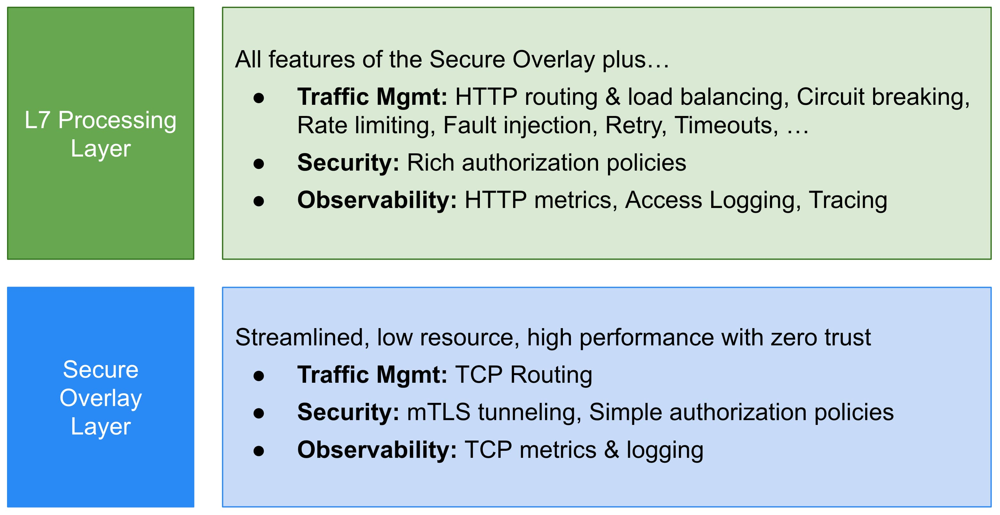
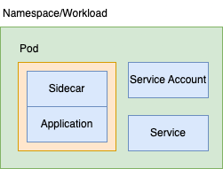
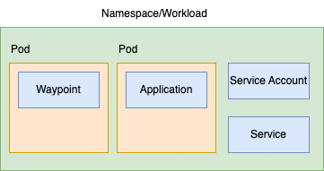
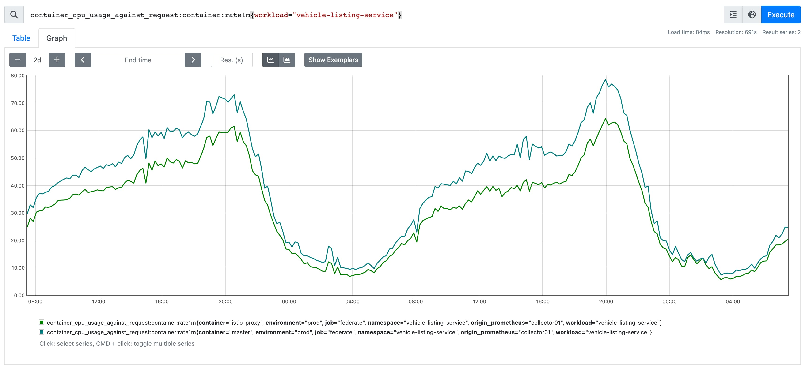
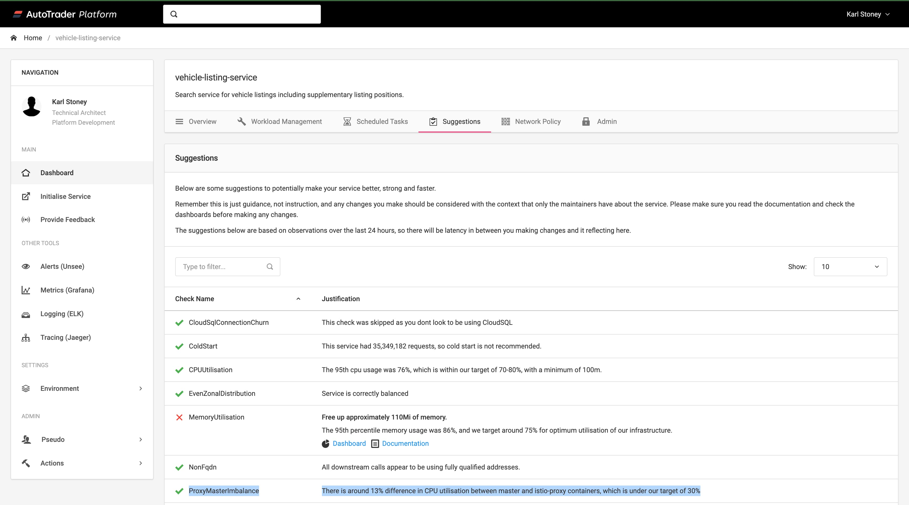

本文译自：[Scaling the Sidecar](https://karlstoney.com/scaling-and-sizing-the-sidecar/)。

本文讨论我们如何在工作负载中扩展 Istio Sidecar，以及如何考虑 Sidecar 资源与应用程序紧密耦合的关系。

目前有很多关于 Istio 新的 [Ambient Mesh](https://istio.io/v1.15/blog/2022/introducing-ambient-mesh/) 的讨论。这种部署服务网格的新方法放弃了 Sidecar，而采用了两个新组件，`ztunnel`，一个用于处理核心 L4 网络问题的每节点组件，以及（如果需要）`waypoint proxy` 来处理 L7 问题。



来源：<https://istio.io/v1.15/blog/2022/introducing-ambient-mesh>

我听到的远离 Sidecar 的一个主要原因是，扩展 Sidecar 很复杂。如果只使用 L4 功能，我同意这一观点。然而，作为 L7 功能的重度用户，对我来说，似乎我们只是在管理 Waypoint 代理的规模，而不是 Sidecar。对我个人而言，也许有点自私，它感觉像是一个横向（充其量）的步骤，而不是前进。

此外，我并不觉得管理 Sidecar 资源很痛苦，所以我很难产生共鸣。这部分是因为我从早期就开始使用 Istio，并建立了有助于这一过程的工具和流程。我意识到我从未真正分享过关于我们如何管理这一过程的信息，所以在这里分享一下。

### 一些背景

背景很重要，你如何思考监控和伸缩将取决于你如何构建你的 Kubernetes 设置，以及你的组织结构。也没有一种大小适合所有情况，这只是对我们有效的方法。因此我相信 Ambient 模式将减少某些 Operator 的复杂性，但可能会增加其他 Operator 的复杂性（我承认，这可能是少数情况）。

我们运行大约 700 个个别服务（“工作负载”）。每个服务都有：

- 在自己的 `Namespace` 中运行
- 使用自己的 `Service Account`
- 拥有自己的 `Service`
- 由自己的隔离 CI/CD 流水线部署
- 从 Istio 和网络策略的角度来看，都在默认拒绝的设置中运行



对于我们来说，命名空间是工作负载的边界，这是一种一对一的关系，而且是一条坚决的规则。因此，我相信我们也会为每个命名空间创建一个 waypoint 代理。我们不会在多个工作负载之间共享 waypoint 代理，因为这会导致耦合（风险/冲击范围）。因此，我们将得到类似于这样的结果：



与其扩展 `Sidecar`，我们将扩展 `Waypoint` - 这就是我所说的对于我们来说，是横向的。我们仍然需要考虑某种规模的问题。

### 可观测性：只是另一个容器

这基本上总结了我对 Sidecar 的看法。它只是你的工作负载中的另一个容器。为了[有效管理](https://karlstoney.com/managing-your-costs-on-kubernetes/)成本（"合适大小"），你应该已经在监控你的工作负载时监控关键指标，这些指标自然扩展到涵盖 `istio-proxy`。对我来说，这些指标包括：

- CPU 和内存 **请求**（例如 `kube_pod_container_resource_requests`）
- CPU 和内存 **使用**（例如 `container_memory_working_set_bytes`）
- CPU 和内存 **计算利用率**（Usage / Requests）。

暂时忽略 Istio，如果你没有做上述操作，那么你应该开始做。为了帮助你，这是我用于 CPU 计算利用率的指标：

```yaml
 - record: "container_cpu_usage_against_request:pod:rate1m"
   expr: |
    (   
      count(kube_pod_container_resource_requests{resource="cpu", container!=""}) by (container, pod, namespace)
      *   
      avg(
        irate(
          container_cpu_usage_seconds_total{container!=""}[1m]
        )   
      ) by (container, pod, namespace)
    )   
    /   
    avg(
      avg_over_time(
        kube_pod_container_resource_requests{resource="cpu", container!=""}[1m]
      )   
    ) by (container, pod, namespace) * 100 
    *   
    on(pod) group_left(workload) (
      avg by (pod, workload) (
        label_replace(kube_pod_info{created_by_kind=~"ReplicaSet|Job"}, "workload", "$1", "created_by_name", "^(.*)-([^-]+)$")
        or  
        label_replace(kube_pod_info{created_by_kind=~"DaemonSet|StatefulSet"}, "workload", "$1", "created_by_name", "(.*)")
        or  
        label_replace(kube_pod_info{created_by_kind="Node"}, "workload", "node", "", "") 
        or  
        label_replace(kube_pod_info{created_by_kind=""}, "workload", "none", "", "") 
      )   
    )
```

你会注意到在这个指标中，我还与 `kube_pod_info` 进行了关联，这为我的指标提供了一些额外的维度，特别是 `workload`。这仅在我们有一个部署与一个命名空间相对应，等于一个工作负载的关系时才有效。这是可选的，只是帮助我在各个级别查看这个指标，包括 `container`、`pod`、`node` 或 `workload`。这样做将自然地为你的所有容器提供数据，当然也包括你的 Sidecar：



### Sidecar 与工作负载一起扩展

对于 HTTP 工作负载，我们观察到 Sidecar 的扩展方式与底层应用程序非常相似。你可以在上面的截图中看到 `istio-proxy` 容器的 "计算利用率" 如何紧密跟随 `master` 容器。

这就是我真正喜欢 Sidecar 模式的地方。你的 Sidecar 利用率与你的工作负载利用率紧密耦合，而工作负载利用率与工作负载的副本数量紧密耦合。在上面的示例中，如果我们需要水平扩展工作负载，利用率将保持大致相同。例如，你可以看到 `master` 容器的利用率峰值为 75%，而 `istio-proxy` 的利用率为 60%，如果我们将副本数量加倍，这两个值会松散减半，但保持大致一致。我们只是水平扩展一个 `Deployment` 对象，而不是两个。我们认为这更容易理解。

我们向应用程序所有者提供的指导是，我们希望利用率在峰值时保持在 75% 左右。在这里，人们自然会问为什么我们不使用自动扩展。自动扩展依赖于底层云提供商提供的计算资源。我们曾经遇到过多次影响客户的事件，因为我们无法按需扩展，原因是底层云提供商的容量存在问题。此外，自动扩展会带来延迟，很难对突然的负载急剧增加做出响应，因此它只对具有明显逐渐季节性的工作负载有效，就像上面的工作负载一样。我们认为与自动扩展相关的成本节省不值得与不能对需求做出反应的风险相匹配，因此我们会略微过度配置我们的工作负载（因此是 75%）。

但是，如果你对自动扩展感到满意，你可以在自动扩展配置中设置目标 CPU，然后就可以了。你有一个工作负载，以及一个与之紧密相关的 Sidecar，它们一起扩展。

这就是我对 Waypoint 的看法。因为在我们的设置中，我们每个工作负载都有一个 waypoint 代理，我们将创建两个需要以不同方式但同步扩展的独立部署，这将解耦了我们自身有意关联的东西。

### 设置正确的 CPU 和内存值

在上面的示例中，你可以看到我们有一个相对健康的工作负载。`istio-proxy` 容器被分配了适合工作负载配置文件的 `CPU` 量，允许其利用率紧密跟踪底层应用程序的利用率。经验告诉我，一旦你将这两者对齐，它们就不会松散对齐。它们会漂移的唯一时间是如果任一容器的性能配置发生了显著变化（例如，如果开发人员将应用程序性能提高了 2 倍，则 `master` 的利用率会下降）。

在 AutoTrader，我们的平台团队负责构建“交付平台”，开发人员将应用程序部署到其中，但应用程序开发人员负责确定其工作负载的大小（CPU 和 RAM）。平台团队构建了帮助他们做出明智决策的工具，涉及这些值。

这意味着简单的抽象。我们不让开发人员编写 100 个 Kubernetes 清单来部署工作负载。他们不需要关心 Istio `VirtualServices`、`Sidecars`、Kubernetes `Deployments` 或记住在哪里放置注释以正确设置 Sidecar 的规模。相反，我们要求在他们的存储库中提供一个 yaml 文件，其内容如下：

```yaml
deployment:
  istio:
    resources:
      cpu: 500m
      memory: 80Mi
  container:
    replicas: 6
    resources:
      cpu: 1000m
      memory: 956Mi
```

因此，你可以看到，服务的所有者负责设置其 `master` 容器和其 `istio-proxy` 的资源。我们的责任是构建工具，帮助他们在选择这些值时做出明智决策。

你已经看到了我们如何在上面的 Grafana 仪表板中使用 "Utilisation" 等指标来做到这一点，但我们还做了一些称为 "建议" 的事情。这些是我们向应用程序所有者提供的有关优化配置其服务的提示：



因此，你可以在这里看到我们有一个名为 `ProxyMasterImbalance` 的建议。如果我们检测到给定工作负载内的 `master` 和 `istio-proxy` 容器之间的漂移超过 30%，则此建议将处于活动状态。以下是此建议触发的示例：


### 总结

希望你可以看到在大小调整 Sidecar 方面，它如何可以轻松地融入到你现有的用于大小调整工作负载的业务流程中。无论如何，你都应该这样做，以保持你的基础架构的健康利用率。

我们已经建立了一种文化，小组关心并拥有他们的软件在生产环境中运行，其中包括关键的 CFR（成本），他们知道通过掌握这些事物，他们正在为更大的目标做出贡献，总体而言，他们做到了。至关重要的是，他们已经关心他们的 `master` 容器利用率，因此 `istio-proxy` 只是他们需要设置 2 个值（CPU/内存）的另一个容器，我们提供了使其尽可能容易的数据，而在绝大多数情况下 - 这只是你需要调整一次的事情。

我还想指出，这篇文章专门思考了规模的问题。将代理与应用程序分离出来还存在其他潜在优势（例如隔离升级）。不过再次强调，我个人认为这有利有弊（就像技术中的大多数决策一样），但这是另一天的博客文章。