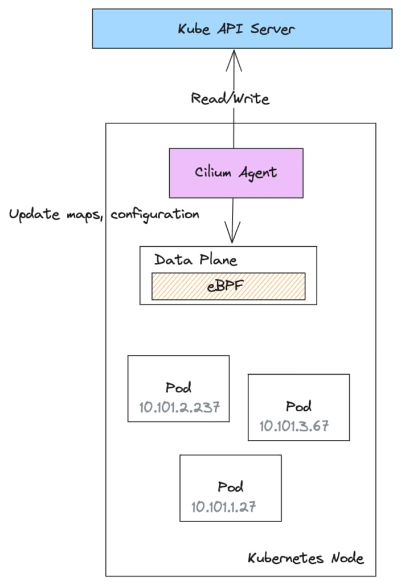
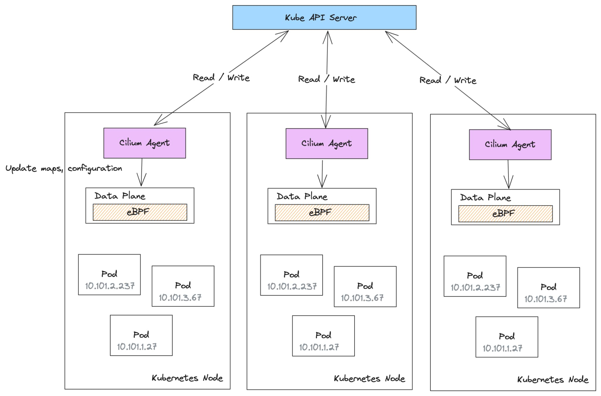
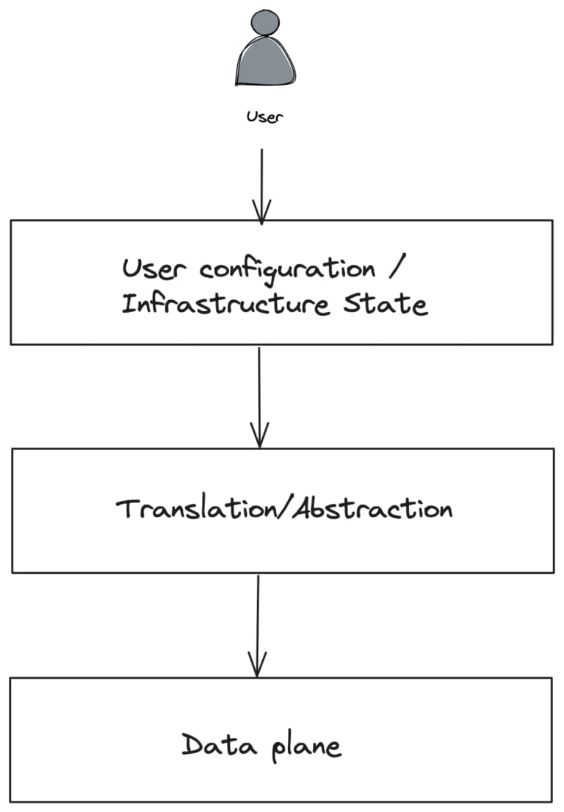
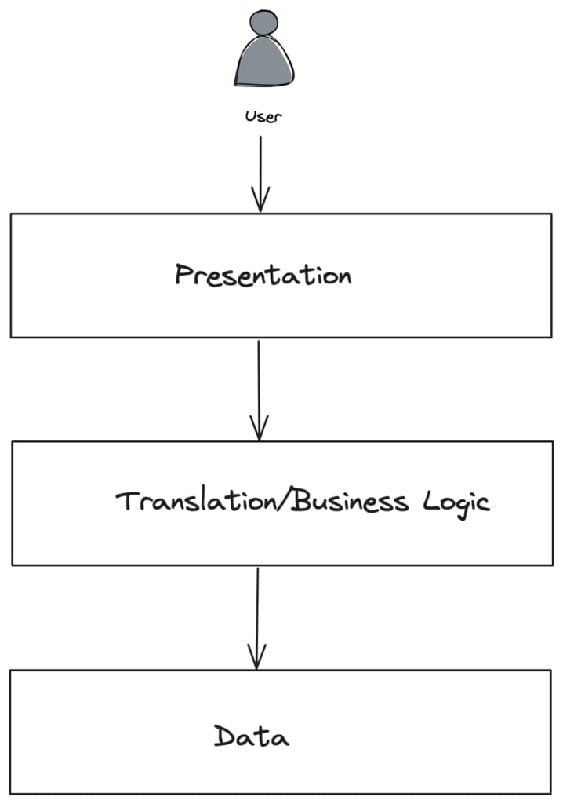
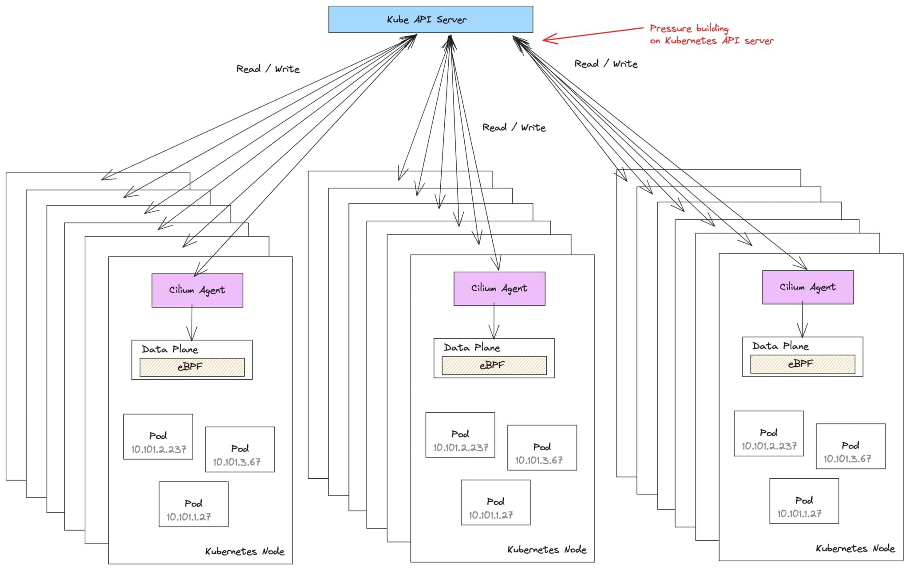
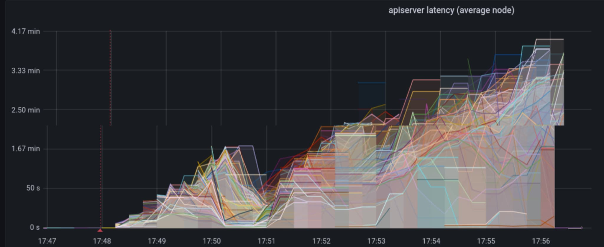
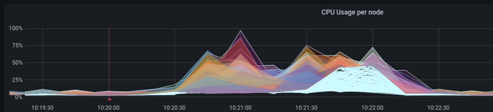
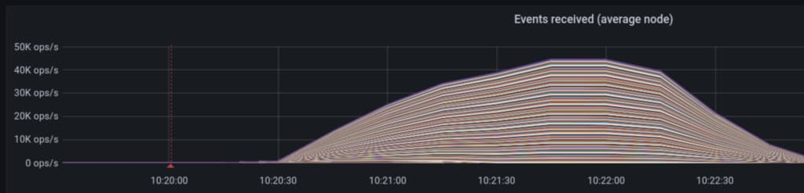
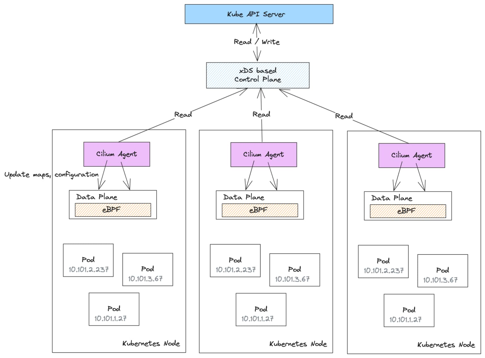
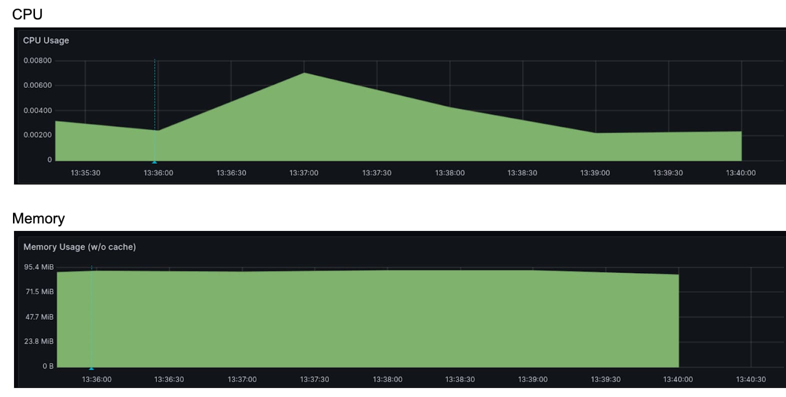

在这篇博客中，我们将探讨当前的 Cilium 控制平面设计，[大规模部署可能出现的限制的位置和原因](https://github.com/cilium/cilium/issues/30283)，以及社区如何使用 CNCF 的 [通用数据平面 (xDS) API](https://github.com/cncf/xds) 推进这个架构。

## 了解 Cilium 的控制平面架构

Cilium 遵循基于“数据平面”和“控制平面”的常见网络架构。在 Cilium 中，数据平面部署在每个主机（或 Kubernetes 节点）上，包括用于处理 L3/L4 连接和策略的 eBPF 程序。为了简化起见，对于完整性，Cilium 还在其数据平面中使用 Envoy 代理处理 L7 策略，但我们将省略这部分。



Cilium 控制平面以 cilium-agent 守护程序的形式实现，部署在每个 Kubernetes 节点上。每个 cilium-agent 都是控制平面的单独、独立的实例。

cilium-agent 连接到 Kubernetes API 服务器，监视配置更改，然后使用它来配置数据平面。cilium-agent 还将配置写入 Kubernetes API，表示正在其各自节点上创建的端点或标识。

例如，当在 Kubernetes 节点上启动一个 Pod 时，cilium-agent 负责编写一个 CiliumEndpoint 自定义资源（CR），并可能是一个表示 Pod 网络标识的 CiliumIdentity CR。cilium-agent 还会更新与标识和端点映射相关的节点上的 eBPF 映射。其他 Kubernetes 节点上的 cilium-agent 也会监视这些新的 CiliumEndpoint 和 CiliumIdentity CR 的创建，并更新其本地的 eBPF 数据平面以执行策略。这种机制能够协调每个节点上的全局策略执行配置，以便所有节点看到相同的执行行为。



## 构建控制平面的最佳实践

我们以前 [曾多次在博客中](https://www.solo.io/blog/building-a-control-plane-for-envoy/) [讨论过构建](https://www.solo.io/blog/guidance-for-building-a-control-plane-for-envoy-part-3-domain-specific-configuration/) [可扩展、安全、高效的控制平面的最佳实践](https://www.solo.io/blog/why-the-control-plane-matters/)。在深入研究如何扩展 Cilium 的控制平面之前，我们应该回顾一些这些最佳实践。

网络架构中的数据平面应该尽可能简单，性能高，以及高效完成它需要做的事情：在本例中，来回传输字节，实施策略，并执行安全性。控制平面的作用是保护数据平面免受复杂性的干扰，以及任何分散数据平面核心任务的事物。

另一方面，用户需要能够以最适合他们用户体验的形式指定配置和策略。很多时候，通过某种 [特定领域的配置格式](https://www.solo.io/blog/guidance-for-building-a-control-plane-for-envoy-part-3-domain-specific-configuration/) 来实现。然后需要将这种更高级别的用户配置与基础设施状态相结合，并将其转化为较低级别的数据平面格式。转译是一半的战斗。还需要将较低级别的配置分发到数据平面，并高效地执行。这就是控制平面出现在画面中的地方。



控制平面允许配置解耦并与平台的其他部分集成，这些部分随后可以通知数据平面。在许多方面，这个图表与我们构建应用程序时使用的 [三层架构](https://learn.microsoft.com/en-us/azure/architecture/guide/architecture-styles/n-tier) 类似：表示层，解耦的业务逻辑层和数据存储。



在网络架构的情况下，控制平面层将处理读取/写入 Kubernetes API 和创建网络标识等敏感数据。由于它是一个单独的层，我们可以对其进行安全和硬化处理，并消除数据平面需要执行这些任务的权限。在许多情况下，虽然开始时更简单，但合并一些层会导致效率低下、安全问题和扩展/耦合问题。

## Cilium 控制平面架构的扩展考虑

集群中的每个 cilium-agent 负责将全局集群配置更新到其本地数据平面配置。每个 cilium-agent 可能会监视多达 15 种 CRD 类型。

随着集群在节点、Pod、命名空间和网络策略方面的规模增长，每个 cilium-agent 需要执行的工作量也会增加。为了服务和更新所有这些状态，会对 Kubernetes apiserver 造成压力，可能导致 [问题](https://github.com/cilium/cilium/issues/29127)。



在大规模部署中，这种对 Kubernetes API 服务器的压力可能最终会减慢 *甚至导致* 集群中的所有操作。

在查看集群中的常见操作以及 cilium-agent 处理它的方式时，全局配置状态对每个节点的影响确实开始放大：工作负载和命名空间被标记、重新标记或取消标记。

cilium-agent 负责为调度到其节点上的 Pod 编写 CiliumEndpoint 和 CiliumIdentity 资源。由于这些资源依赖于 Pod 和命名空间标签的组合，标签的更改将导致所有依赖资源的更新。这会导致大量的写操作和相应的读取操作，因为此状态随后会传播到所有 cilium-agent，它们必须做出反应并重新配置其本地数据平面。

```yaml
apiVersion: cilium.io/v2
kind: CiliumIdentity
name: "50568"
metadata:
  labels:
    app: sleep
    io.cilium.k8s.policy.cluster: default
    io.cilium.k8s.policy.serviceaccount: sleep-v1
    io.kubernetes.pod.namespace: default
    version: v1
security-labels:
  k8s:app: sleep
  k8s:io.cilium.k8s.namespace.labels.team: loyalty
  k8s:io.cilium.k8s.namespace.labels.version: v10.45
k8s:io.cilium.k8s.namespace.labels.kubernetes.io/metadata.name: default
  k8s:io.cilium.k8s.policy.cluster: default
  k8s:io.cilium.k8s.policy.serviceaccount: sleep-v1
  k8s:io.kubernetes.pod.namespace: default
  k8s:version: v1
```

**代码清单 1：`CiliumIdentity` 资源结合了 *Pod* 和 *命名空间* 标签。对任一者的更改都会强制重新计算并生成新的 `CiliumIdentity`。**

对集群中的命名空间进行标记等操作对于 Cilium 可能非常昂贵，并且有可能导致 API 服务器操作减慢到爬行的程度（[请参阅用于标识目的包括/排除标签的建议](https://docs.cilium.io/en/stable/operations/performance/scalability/identity-relevant-labels/)）。例如，在中等规模集群中更改命名空间的标签可能会导致足够多的 cilium-agent 导致 Kubernetes API 服务器响应延迟约 **4 分钟**。这将有效地使集群上的所有操作停滞不前。

考虑以下环境：

- 200 个节点的 Kubernetes 集群
- 5 个命名空间
- 每个命名空间有 50 个部署
- 每个部署有 80 个副本（总共 20,000 个 Pod）

在一次更新跨命名空间的标签的测试中，我们看到 CPU 利用率急剧上升，约为 150%，并且内存在整个集群的所有节点上升到约 1 GB。


在整个集群的所有节点上同时提高 CPU 和内存是不希望看到的行为，然而更严重的是 cilium-agent 事件的读写如何影响 Kubernetes API 服务器的延迟。在下图中，我们看到延迟增长到 3 到 4 *分钟*。这肯定会导致各种类型的停机！不幸的是，由于这种控制平面架构，通过增加容量来处理扩展问题的典型方法不起作用；实际上，添加更多节点和/或更多工作负载会放大这种行为。



## 减轻 Kubernetes API 服务器的压力

对于较大的 Cilium 集群，您可以通过使用[专用的键值存储](https://docs.cilium.io/en/latest/kvstore/) 来减轻 Kubernetes API 服务器上的压力。键值存储用于存储工作负载标识、端点和 IP 到标识映射等内容。Cilium 不再将此信息存储在 Kubernetes 自定义资源（CRD）中，而是在其自己的数据库中直接监视、操作和写入对象。Cilium Helm 图表支持将 etcd 作为专用键值存储来进行安装，以满足此目的。

随着集群的增长，使用 kv-store 来卸载 Cilium 对象的读/写操作可能是一个好主意，而不是给 Kubernetes API 服务器施加压力。

注意：Cilium 还进行了其他优化，以减轻 Kubernetes API 服务器的压力，例如策略状态更新。有关更多信息，请参阅[k8s-events-handover 文档](https://docs.cilium.io/en/stable/internals/cilium_operator/#policy-status-update)。

如果我们在存在 kv-store 的情况下重新运行先前的测试，我们会看到对 Kubernetes API 服务器的压力减轻，尽管 CPU 可能没有减轻。



与先前情况下的 150% CPU 消耗不同，CPU 在大约 100% 左右波动，而内存保持在大约 300 到 400 MB 的范围内。这是因为对每个 Pod 和每个标识（Cilium 在更改标签时创建所有新标识，并且必须更新引用旧标识的所有 eBPF 映射的 CiliumEndpoint 和 CiliumIdentity 对象的重新计算和生成需要 CPU 计算资源来完成，无论使用何种后备存储（CRD、kv-store 等）。

如果我们观察 kv-store，我们会看到在此命名空间标签事件期间，事件操作/秒和延迟会急剧上升：



在这种特殊情况下，我们看到 kv-store 承受了相当大的负载，通过事件 IO，我们看到 kv-store 调用的延迟降低到约 15 秒左右。总之，这对于整个集群操作而言要好得多，而不是用请求使 Kubernetes API 服务器饱和。事实上，在图 5 中，我们可以看到 Kubernetes API 服务器的延迟保持在 10 到 40 毫秒的可接受范围内，而在先前的示例中，延迟升高到 4 分钟。


使用 kv-store 后端来存储 Cilium 对象是一种缓解 Kubernetes API 服务器压力的好方法，但它也有其缺点。现在有两个持久存储需要维护，而且随着规模的增加，运维负担也增加。在生产环境中运行数据库或持久存储（总体来说）以支持规模化并非易事。如果失去一致性，恢复过程是必需的，因为现在有两个“真相源”。许多平台完全管理 Kubernetes API 服务器及其存储，但 kv-store 并不是如此。由于绝大多数负载是读取操作，缓存将在减少运维复杂性的同时产生相同的改进。

## 使用 xDS 改进 Cilium 的控制平面扩展、安全性和效率

如果我们可以兼顾两全呢？既减轻 Kubernetes API 服务器的压力，又消除维护单独数据存储的昂贵生产操作的需要？甚至可能解决一些其他尚未解决的 Cilium 扩展和安全性问题？

在 Solo.io，我们很高兴为 Cilium 社区中更广泛的 xDS 工作作出贡献，并帮助推动该项目朝着可扩展、安全和高效的控制平面迈进。使用[xDS 协议](https://github.com/cncf/xds)使我们能够在集群中扩展到数千甚至数万个节点。这种方法解决了上面讨论的许多问题，以及其他问题，如单节点妥协影响范围和规模上的 CiliumIdentity 重复。让我们看看它是如何工作的。

[xDS 协议](https://github.com/cncf/xds)最初是一种动态配置[Envoy 代理](https://www.envoyproxy.io/)的方式，但是它建立的理念是可以用来支持“通用数据平面”。该协议已成为在多个节点之间同步状态的有效方式，[现在由 CNCF 工作组管理](https://github.com/cncf/xds)。

最终，我们希望消除每个 cilium-agent 所做的冗余工作，将诸如标识创建之类的复杂且权限敏感的操作集中在一起，并以高效的方式为代理提供状态，同时不损害 Kubernetes 作为整体的可靠性。

为了做到这一点，我们将不再让每个 cilium-agent 充当独立的控制平面，而是考虑让 cilium-agent 充当智能集中控制平面的简单只读客户端。控制平面将保护代理免受复杂和权限敏感的操作。

cilium-agent（现在属于数据平面的一部分）与控制平面之间的通信将采用[xDS 协议](https://github.com/cncf/xds)。数据平面不允许从数据平面到控制平面的写操作，因此 cilium-agent 不需要对后端存储（CRD/kv-store）具有写入访问权限。xDS 控制平面服务可以得到安全加固，是唯一需要支持对 Kubernetes API 服务器进行读/写操作的组件。



这种架构减轻了 Kubernetes API 服务器的负载，并且不需要任何外部管理的数据存储。它看起来也更接近之前讨论的三层控制平面架构。



在这种架构中，我们确实看到了 xDS 控制平面 pods 中的 CPU 和内存开销，正如预期的那样，每个节点仍然需要处理 eBPF 数据平面的一些 CPU/内存处理开销。

这种模型带来的其他好处包括在节点受损时更小的影响范围，以及消除了 cilium-agent 创建的重复标识。在原始架构（CRD 或 kv-store）中，每个节点都有一个完整的控制平面，需要特殊权限来读取和写入``CiliumEndpoints``和``CiliumIdentity``。如果某个节点上的 cilium-agent 受到妥协，那么整个控制平面将受到威胁，并使攻击者能够影响其他节点。这可能导致整个集群妥协。在 xDS 模型中，cilium-agent 被允许从控制平面读取数据（不允许写入），单个 cilium-agent 的妥协不会给予对整个控制平面或集群的访问权限。正如前面提到的，xDS 控制平面被视为特权组件，可以进行锁定和安全设置，甚至可以完全在集群之外运行。

xDS 方法的另一个好处是通过集中标识创建来消除 Cilium 中重复标识的生成。在现有模型中，每个 cilium-agent 都独立充当控制平面，与其他节点隔离，正如在现有模型中，它试图做出可能是重复的决策。例如，当 Pod 分配到节点时，CNI 负责设置网络端点，当 cilium-agent 识别到一个新的端点，它没有现有的``CiliumIdentity``时，它将尝试创建它。如果命名空间标签发生更改并且需要重新计算所有标识，那么也会发生相同的情况。由于标识创建在多个节点上独立进行，因此有很大机会为相同标识创建多个``CiliumIdentity``（在极端情况下，[如此描述的易于重现](https://docs.google.com/document/d/1Hcc_2mB9OOUxrqQgZ-gSYDPnLYE_If_TCzVbUGDOdGM/edit?pli=1#heading=h.yzvq0akbw7z9)）。在 xDS 方法中，``CiliumIdentity``在集中创建，从而消除了这种情况。

## 结论

Cilium 在 eBPF 基础上构建了强大的数据平面，但要使 Cilium 在规模上有效运行，我们可以利用 xDS 协议来改进控制平面架构。xDS 是一种高效的协议，允许我们利用多年来学到的构建控制平面的最佳实践。事实上，如果我们将 xDS 控制平面 [直接构建到 cilium-operator 中](https://docs.google.com/document/d/1U4pO_dTaHERKOtrneNA8njW19HSVbq3sBM3x8an4878/edit#heading=h.ghzkbpzc9oea)，那么从这个实施中不会增加新的复杂性。