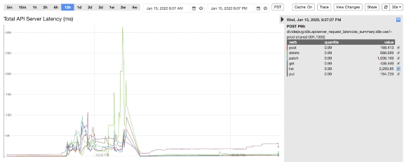
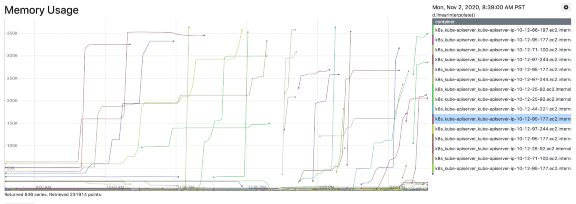
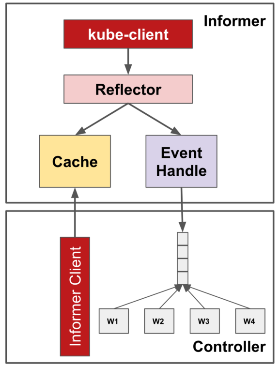
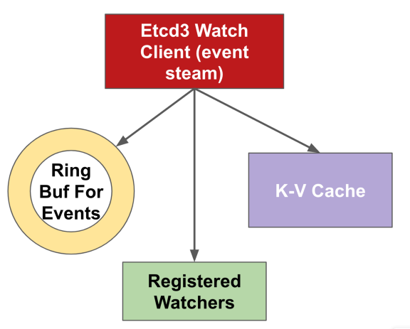
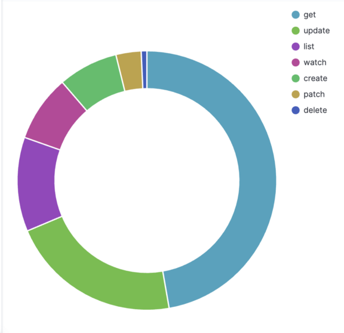
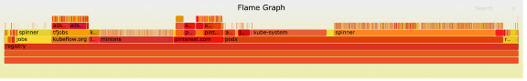
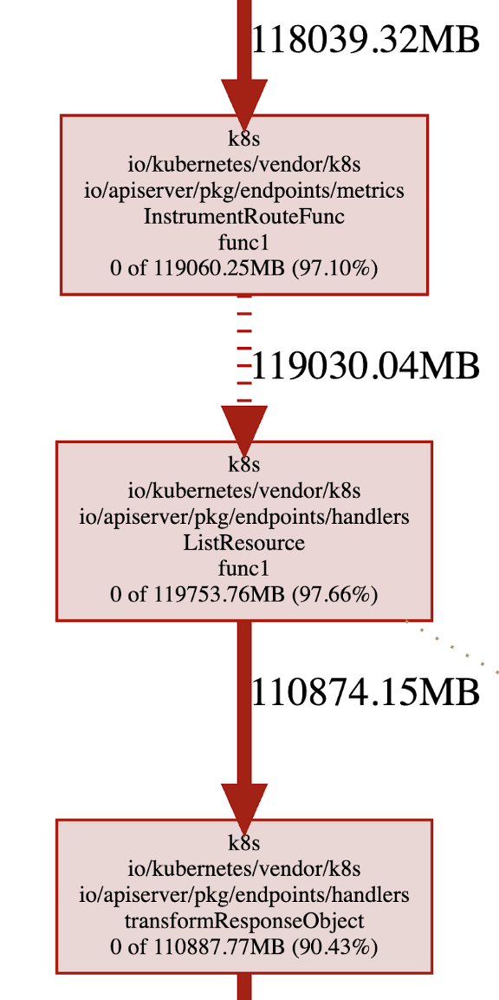
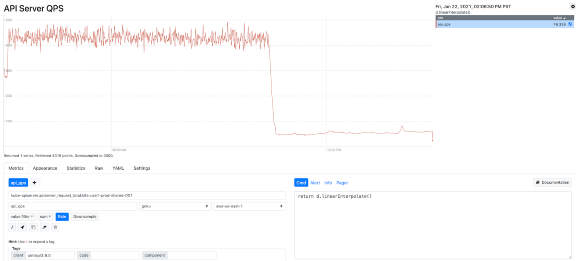

## 前言

自上次我们分享 [Pinterest 的 Kubernetes 之旅](https://medium.com/pinterest-engineering/building-a-kubernetes-platform-at-pinterest-fb3d9571c948)已过去一年有多。从那时起，我们已交付了许多功能以促进客户采用，确保可用性和可伸缩性，并建立运维经验和最佳实践。

总体来看，Kubernetes 平台用户都给予了积极的反馈。根据我们的用户调查，我们的用户分享的前三大好处有，减少了管理计算资源的负担，更好的资源和故障隔离，以及更灵活的容量管理。

到 2020 年底，我们的 Kubernetes 集群上已编排了 35K+Pod，运行了 2500 + 个节点。这支撑了我们 Pinterest 的绝大部分业务，并且有机增长仍如火箭般迅速。

### 简单概括 2020 年

随着用户采用率增长，工作负载的多样性和数量也不断增加。这要求 Kubernetes 平台需要更具可扩展性才能跟上工作负载管理，Pod 调度以及节点分配上持续增长的负载。随着越来越多的关键业务登上 Kubernetes，对平台可靠性的期望自然而然地提升到了一个新的水平。

平台范围内的中断确实发生过。2020 年初，我们的一个集群由于 Pod 创建数猛增（比计划容量高出 3 倍），导致了集群的 autoscaler 一下就启动了 900 个节点。kube-apiserver 组件开始出现延迟峰值和错误率增加，然后由于资源的限制引发了 OOMKilled。来自 Kubelet 的非绑定重试导致了 kube-apiserver 负载跃升了 7 倍。爆发性的写入操作使 etcd 达到其总数据量大小限制并开始拒绝所有的写入请求，于是平台在工作负载管理方面丢失了可用性。为了缓解这一事故，我们不得不在 etcd 上执行一些操作，如执行版本压缩，整理过多碎片的空间，以及禁用告警来恢复它（参考 [Maintenance|etcd](https://etcd.io/docs/v3.4/op-guide/maintenance/) 章节）。此外，我们不得不暂时扩大承载 kube-apiserver 和 etcd 的 Kubernetes 主节点，以减少资源限制影响。

2020 年晚些时候，一个基础组件在与 kube-apiserver 集成时出现 bug，导致向 kube-apiserver 发起大量请求（获取所有 Pod 跟节点）。这引起 Kubernetes 主节点资源使用率激增，然后触发 OOMKilled。幸运的是这个有问题的组件很快被发现并回退。但此次事件中，平台的性能下降了，包括工作负载执行延迟和请求状态过期。

## 为扩展规模做好准备

在整个过程中，我们不断反思我们的平台治理、弹性和可操作性问题，尤其是当事件发生并重创我们最薄弱的地方时。在一个工程资源有限的灵活团队中，我们必须深入挖掘，找出根本原因，并根据回报与成本确定解决方案的优先级。我们处理复杂的 Kubernetes 生态系统的策略是尽量减少与社区提供的差异，并回馈给社区，但绝不排除自己编写内部组件的可能性。

## 治理

### 强制资源配额

Kubernetes 已提供[资源配额](https://kubernetes.io/docs/concepts/policy/resource-quotas/)管理，以确保没有任何命名空间可以请求或占用大部分维度的未被占用的资源，例如 Pod 个数，CPU，内存等等。在之前的事故中提及到，在单个命名空间中创建大量 Pod 可能使 kube-apiserver 超负荷并导致级联故障。为了确保稳定性，在每个命名空间中对资源的使用进行约束是关键。

强制在每个命名空间中执行资源配额面临的一个挑战是所有 Pod 都需要显式地指定[资源请求与限制](https://kubernetes.io/docs/concepts/configuration/manage-resources-containers/#requests-and-limits)。在 Pinterest 的 Kubernetes 平台上，不同命名空间的工作负载是由不同项目的不同团队所拥有，平台用户使用 Pinterest CRD 来配置他们的工作负载。我们通过在 CRD 的转换层给所有 Pod 和容器都添加上默认的资源请求与限制，额外的，我们在 CRD 校验层就拒绝任何没有配置资源请求与限制定义的 Pod。

我们克服的另一个挑战是简化团队与组织的配额管理。为了安全地启用资源配额，我们通过研究历史资源使用情况，在峰值的基础上增加了 20% 的缓冲，将其设定为每个项目的资源配额初始值。同时我们创建了一个定时任务去监控配额使用情况并在项目使用达到一定限制时向该项目团队发送警报。该措施鼓励项目所有者更好地进行能力规划，并提出资源配额变更需求。资源配额变更会在人工审查通过后自动完成。

### 客户端访问

我们强制所有 KubeAPI 客户端遵从 Kubernetes 已提供的最佳实践：

#### Controller Framework

[Controller framework](https://github.com/operator-framework) 利用 [informer-reflector-cache 架构](https://godoc.org/k8s.io/client-go/informers)提供了一个可共享的缓存以优化读请求。 **Informers** 用以从 kube-apiserver 获取并监视感兴趣的对象。**Reflector** 反映对象对底层 **缓存**的修改并将监视到的事件传播给事件处理器（eventHandlers）。在同个控制器中的多个组件可以从 Informer 注册 OnCreate，OnUpdate，OnDelete 事件的处理器，并直接从缓存中获取对象而不是从 kube-apiserver。因此，它减少了构建不必要的多余的请求调用的机会。

#### 限流

Kubernetes API 客户端通常由不同的客户端共享，API 调用也通常是由不同的线程发起。Kubernetes 通过将其 API 客户端与可配置 QPS 和突发的[基于令牌桶的限流器](https://en.wikipedia.org/wiki/Token_bucket)结合。超过阈值的 API 请求将被限制，所以单个控制器将不会阻塞整个 kube-apiserver 的带宽。

### 可共享缓存

除了控制器框架附带的 kube-apiserver 内置缓存外，我们还在平台 API 层添加了基于写缓存的 informer。这是为了防止不必要的读调用对 kube-apiserver 的硬冲击。服务端的缓存重用也避免了应用代码中的厚客户端。

对于**来自应用程序**到 kube-apiserver 的访问，我们强制要求所有请求通过平台 API，以利用共享缓存，并为访问控制和流控指定安全身份。对于**来自工作负载控制器**对 kube-apiserver 的访问，我们强制所有控制器实现都要基于有流控的控制器框架。

## 弹性恢复能力

### 增强加固 kubelet

Kubernetes 控制平面进入级联故障的一个关键原因是，传统的反射器实现在处理错误时进行了**无限次**的重试。这种不完善可能会被放大，特别是当 apiserver 被 OOMKilled 时，很容易导致整个集群反射器的同步。

为了解决这个问题，我们与社区进行了非常密切的合作，通过报告 [issues](https://github.com/kubernetes/kubernetes/issues/87794)，讨论解决方案，最后让 PR ([1](https://github.com/kubernetes/kubernetes/pull/87829), [2](https://github.com/kubernetes/kubernetes/pull/87795)) 通过审查并合并。我们的想法是在 jitter reflector 的 ListWatch 重试逻辑中加入指数后退，这样 kubelet 和其他控制器就不会在 kube-apiserver 过载和请求失败时试图反复请求 kube-apiserver。这种弹性改进一般情况是有用的，但我们发现随着 Kubernetes 集群中节点和 pods 数量的增加，它在 kubelet 方面至关重要。

### 优化调整并发请求

当我们管理的节点越多，创建和销毁的工作负载越快，服务需要处理的 API 请求 QPS 就越高。我们首先根据预估的工作负载，增加了可变和不可变操作的最大并发 API 调用设置。这两个设置将强制要求处理中的 API 调用量不超过配置的数量，从而使 kube-apiserver 的 CPU 和内存消耗保持在一定的阈值内。

在 Kubernetes 中的 API 请求处理链中，每个请求一开始就将经过一组过滤器。过滤器链是强制最大执行中 API 调用数的地方。对于超过配置阈值的 API 调用，“too many requests”（HTTP 429）响应将被返回给客户端，以触发适当的重试。未来的工作，我们计划对 [EventRateLimit 特性](https://kubernetes.io/docs/reference/access-authn-authz/admission-controllers/#eventratelimit)进行更多的研究，进行更精细的准入控制，提供更好的服务质量。

### 缓存更多历史数据

Watch 缓存是 kube-apiserver 内部的一种机制，它将每种类型的资源的过去事件缓存到环缓冲区中，以尽最大努力处理来自特定版本的监视调用。缓存越大，服务器中可保留的事件就越多，并且更有可能在连接中断时无缝地为客户端提供事件流。鉴于这一事实，我们还改进了 kube-apiserver 的目标 RAM 大小，该内存最终根据启发式传输到监视缓存容量，用于提供更强大的事件流。Kube-apiserver 提供了[更详细的方法](https://kubernetes.io/docs/reference/command-line-tools-reference/kube-apiserver/)来配置细粒度的 watch 缓存大小，可以进一步利用它来满足特定的缓存要求。

## 可操作性

### 可观测性

为了减少事故的检测和缓解时间，我们不断致力于改善 Kubernetes 控制平面的可观测性。如何平衡故障覆盖率和信号灵敏度是一个很大的挑战。对于现有的 Kubernetes 指标，我们分流并挑选重要的指标进行监控和报警，以便我们能更主动地发现问题。此外，我们对 kube-apiserver 进行监测以覆盖更详细的领域，从而快速缩小根源。最后，我们调整警报统计和阈值来减少噪音和错误警报。

在高层面上，我们通过查看 QPS 和并发请求、错误率和请求延迟来监控 kube-apiserver 的负载。我们可以通过资源类型、请求类型和相关服务账户来细分流量。对于像 listing 这样昂贵的流量，我们还通过对对象计数和字节大小来测量请求的有效载荷，因为它们即使是很小的 QPS 也很容易超过 kube-apiserver 的负荷。最后，我们监测 etcd watch 事件处理的 QPS 和延迟处理计数，作为重要的服务器性能指标。

## 可调试性

为了更好地了解 Kubernetes 控制平面的性能和资源消耗情况，我们还利用了 [boltdb](https://github.com/etcd-io/bbolt) 库和 [flamegraph ](https://github.com/brendangregg/FlameGraph)构建了 etcd 数据存储分析工具，以可视化数据存储故障。数据存储分析的结果为平台用户提供了优化使用率的洞察力。

此外，我们还启用了 golang profiling 工具 [pprof](https://blog.golang.org/pprof) 和可视化堆内存占用。我们能够快速识别资源最密集的代码路径和请求模式，例如，在调用 List 资源时转换响应对象。作为 kube-apiserver OOM 调查的一部分，我们发现的另一个大问题是，kube-apiserver 使用的 [page cache](https://www.kernel.org/doc/Documentation/cgroup-v1/memory.txt) 也被计入了 cgroup 的内存限制，匿名内存的使用可以窃取同一 cgroup 下的 page cache。因此，即使 kube-apiserver 只有 20GB 的堆内存使用量，整个 cgroup 也会看到有 200GB 的内存使用量将触发限制。虽然目前的内核默认设置是不主动回收分配的页面以有效地重新使用，但我们目前正在研究设置基于 memory.stat 文件的监控，并强制 cgroup 在内存使用接近极限时尽可能多地回收页面。

## 总结

通过我们在治理、弹性和可操作性方面的努力，我们能够大大减少计算资源、控制平面带宽的突然使用激增，并确保整个平台的稳定性和性能。在优化措施推出后，kube-apiserver 的 QPS（主要是读请求）减少了 90%（如下图所示），这使得 kube-apiserver 的使用更加稳定、高效和稳健。我们对 Kubernetes 内部的深入了解和获得的额外见解将使团队能够更好地进行系统操作和集群维护。

以下是一些关键要点，希望能在你解决 Kubernetes 可扩展性和可靠性问题的下一个旅程中帮助到你。

1. 诊断问题以找到**其根源**。在决定“如何处理”之前，先关注“为何引起”。解决问题的第一步是了解瓶颈是什么以及为何出现瓶颈。如果你找到了根本原因，就等于你找到了一半的解决方案。
2. 绝大多数时候，首先查找微乎其微的改进都是值得的，而不是立即致力于彻底地改变架构。这一点尤为重要，尤其是当你有一只很灵活的团队时。
3. 当计划调查和修复时，做出**以数据驱动**的决策。正确的遥测技术可以帮助做出更好的决策，确定首先需要关注和优化什么。
4. 关键的基础设施组件在设计时应考虑到弹性。分布式系统有可能出现故障，最好是**始终为最坏的情况做准备**。正确的保护措施能帮助防止级联故障，并使故障覆盖面更小。

## 展望未来

### 联邦（Federation）

随着我们的规模稳步增长，单集群架构已经不足以支撑不断增加的工作负载。在确保了高效和稳健的单集群环境之后，使我们的计算平台能够水平扩展是我们前进的下一个里程碑。通过利用联邦框架，我们的目标是以最小的操作开销将新集群接入环境中，同时保持平台接口对终端用户的稳定。目前我们的联邦集群环境正在开发中，期待着它在产品化后所带来的更多可能性。

### 容量规划

我们当前针对强制资源配额的方法是一种简单的、反应式的容量规划方法。随着我们添加更多的用户负载和系统组件，平台的动态变化和项目级别或集群范围内的容量限制将会过时。我们需要探索一种更具前瞻性的容量规划方式，基于历史数据，增长轨迹和复杂的容量模型进行预测，不仅可以涵盖资源配额，还可以涵盖 API 配额。我们期待有更积极和准确的容量规划来防止平台出现过载或是交付能力不足。

## 鸣谢

Pinterest 的许多工程师在扩展 Kubernetes 平台以赶上业务增长这过程中做出了很多努力。除了 Cloud Runtime 团队，包括 June Liu、Harry Zhang、Suli Xu、Ming Zong 和 Quentin Miao 为实现可扩展和稳定的计算平台而努力外，领导 SRE 工作的 Balaji Narayanan、Roberto Alcala 和 Rodrigo Menezes 也共同致力于确保计算平台的坚实基础。Kalim Moghul 和 Ryan Albrecht 负责领导容量规划工程工作，他们为项目的“身份管理”模块和系统层面的分析做出了贡献。领导安全工程工作的 Cedric Staub 和 Jeremy Krach 一如既往保持了高标准，使我们的工作负载能够在多租户平台上安全地运行。最后，我们的平台用户 Dinghang Yu、Karthik Anantha Padmanabhan、Petro Saviuk、Michael Benedict、Jasmine Qin 和其他许多人，提供了很多有用的反馈和需求，并与我们一起努力使业务持续增长。
