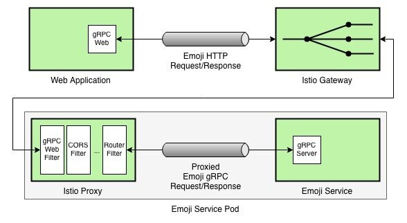
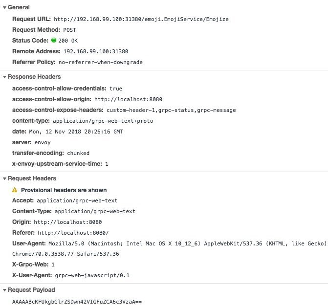

[gRPC-Web](https://github.com/grpc/grpc-web)使 Web 应用能够通过类似于 Envoy 的代理访问 gRPC 后端。Envoy 是 Istio 的默认代理，因此，我们可以利用 Istio 的[EnvoyFilter](https://istio.io/docs/reference/config/istio.networking.v1alpha3/#EnvoyFilter)构件来创建无缝连接的云原生应用。

 


## 介绍

在这篇文章中，我将引导你构建一个简单的 Web 应用，使用 emoji 替换用户输入文本中的关键字，并使用 gRPC-Web 和 Istio 与 gRPC 后端进行通信。

以下是我们创建 emoji 应用的步骤大纲：

1. 使用[Protobuf](https://developers.google.com/protocol-buffers/)定义协议格式；
2. 编译 Protobuf 定义文件，来生成 Go 和 JavaScript 文件；
3. 构建并测试基于 Go 的 gRPC 服务，该服务使用 emoji 替换输入文本中的关键字；
4. 使用 gRPC-Web 为 emoji 服务创建 Web 界面；
5. 配置 EnvoyFilter 并通过 Istio 部署后端；
6. 部署 Web 应用程序并测试我们的 emoji 服务。

## 架构

让我们进一步理解 emoji 服务的最终架构是什么样子。



简而言之，只要用户提供一些文本，Web 应用就会利用 gRPC-Web 库向 Istio Gatway 发送 HTTP 请求。然后，Istio 网关将 HTTP 请求路由到 emoji 服务旁运行的 Proxy sidecar，后者使用 Envoy 的[gRPC-Web](https://www.envoyproxy.io/docs/envoy/latest/configuration/http_filters/grpc_web_filter) filter 将 HTTP 调用转换成 gRPC 调用。

## 定义协议格式

首先，让我们使用 Protobuf 定义协议格式。

```protobuf
syntax = "proto3";

package emoji;

service EmojiService {
  rpc Emojize (EmojizeRequest) returns (EmojizeReply);
}

message EmojizeRequest {
  string text = 1;
}

message EmojizeReply {
  string emojized_text = 1;
}
```

我们定义一个名为`EmojiService`的`service`，处理名为`Emojize`的`rpc`调用，该调用接受`EmojizeRequest`对象参数并返回一个`EmojizeReply`实例。

`EmojizeRequest`消息参数包含一个名为`text`的`string`类型的字段，表示用户输入的文本。同样，`EmojizeReply`包含一个名为`emojized_text`的`string`类型的字段，表示最终输出的字符，也即服务端将 emoji 关键字替换为 emoji 表情符号的输出内容。

## 编译 Protobuf 定义文件

我们先创建一个名为`grpc-web-emoji/emoji/`的项目目录结构，然后把前面的定义内容写入名为`emoji.proto`的文件。

然后编译 emoji.proto 文件并生成所需要的 Go 文件。

```bash
$ protoc -I emoji/ emoji/emoji.proto --go_out=plugins=grpc:emoji
```

同样，我们也生成 JavaScript 文件。

```bash
$ protoc -I emoji/ emoji/emoji.proto --js_out=import_style=commonjs:emoji \
         --grpc-web_out=import_style=commonjs,mode=grpcwebtext:emoji
```

此时，您将获得如下所示的目录结构。

```
── grpc-web-emoji
   └── emoji
       ├── emoji.pb.go
       ├── emoji.proto
       ├── emoji_grpc_web_pb.js
       └── emoji_pb.js
```

## 构建和测试 Go 后端程序

现在让我们创建一个实现`EmojiService` API 的 Go 程序。为此，我们使用以下内容创建一个名为`main.go`的文件。

```go
package main

import (
	"context"
	"log"
	"net"

	proto "github.com/venilnoronha/grpc-web-emoji/emoji"
	"google.golang.org/grpc"
	"google.golang.org/grpc/reflection"
	emoji "gopkg.in/kyokomi/emoji.v1"
)

// server is used to implement the EmojiService interface
type server struct{}

// Emojize takes a input string via EmojizeRequest, replaces known keywords with
// actual emoji characters and returns it via a EmojizeReply instance.
func (s *server) Emojize(c context.Context, r *proto.EmojizeRequest)
			(*proto.EmojizeReply, error) {
	return &proto.EmojizeReply{EmojizedText: emoji.Sprint(r.Text)}, nil
}

func main() {
	// listen to TCP requests over port 9000
	lis, err := net.Listen("tcp", ":9000")
	if err != nil {
		log.Fatalf("failed to listen: %v", err)
	}
	log.Printf("listening on %s", lis.Addr())

	// register the EmojiService implementation with the gRPC server
	s := grpc.NewServer()
	proto.RegisterEmojiServiceServer(s, &server{})
	reflection.Register(s)
	if err := s.Serve(lis); err != nil {
		log.Fatalf("failed to serve: %v", err)
	}
}
```

我已经使用 `kyokomi/emoji` 库来完成繁重的工作，即将输入文本中的关键字转换为表情符号。

启动服务后如下所示：

```bash
$ go run -v main.go
2018/11/12 10:45:12 listening on [::]:9000
```

我们创建一个名为 emoji_client.go 的客户端，来实现通过程序测试 emoji 服务。

```go
package main

import (
	"log"
	"time"

	proto "github.com/venilnoronha/grpc-web-emoji/emoji"
	"golang.org/x/net/context"
	"google.golang.org/grpc"
)

func main() {
	// connect to the server
	conn, err := grpc.Dial("localhost:9000", grpc.WithInsecure())
	if err != nil {
		log.Fatalf("could not connect to the service: %v", err)
	}
	defer conn.Close()

	// send a request to the server
	ctx, cancel := context.WithTimeout(context.Background(), time.Second)
	defer cancel()

	c := proto.NewEmojiServiceClient(conn)
	resp, err := c.Emojize(ctx, &proto.EmojizeRequest{
		Text: "I like :pizza: and :sushi:!",
	})
	if err != nil {
		log.Fatalf("could not call service: %v", err)
	}
	log.Printf("server says: %s", resp.GetEmojizedText())
}
```

我们现在可以运行 emoji 服务客户端，如下所示。

```bash
$ go run emoji_client.go
2018/11/12 10:55:52 server says: I like 🍕  and 🍣 !
```

瞧！gRPC 版本的 emoji 服务如期工作了，现在是时候让 Web 前端启动并运行了。

## 使用 gRPC-Web 创建 Web 界面

首先，让我们创建一个名为`index.html`的 HTML 页面。该页面向用户显示一个文本编辑器，并调用一个`emojize`函数（我们稍后将定义）将用户输入发送到后端 emoji 服务。`emojize`函数还将消费后端服务返回的 gRPC 响应，并使用服务端返回的数据更新用户输入框。

```html
<!DOCTYPE html>
<html>
<body>
  <div id="editor" contentEditable="true" hidefocus="true" onkeyup="emojize()"></div>
  <script src="dist/main.js"></script>
</body>
</html>
```

我们将如下所示的 JavaScript 代码放入名为 client.js 的前端文件。

```js
const {EmojizeRequest, EmojizeReply} = require('emoji/emoji_pb.js');
const {EmojiServiceClient} = require('emoji/emoji_grpc_web_pb.js');

var client = new EmojiServiceClient('http://192.168.99.100:31380');
var editor = document.getElementById('editor');

window.emojize = function() {
  var request = new EmojizeRequest();
  request.setText(editor.innerText);

  client.emojize(request, {}, (err, response) => {
    editor.innerText = response.getEmojizedText();
  });
}
```

请注意，`EmojiServiceClient`与后端 emoji 服务的连接地址是`http://192.168.99.100:31380`，而非`http://localhost:9000`。这是因为 Web 应用程序无法直接与 gRPC 后端通信，因此，我们将通过 Istio 部署我们的后端 emoji 服务。Istio 将在 Minikube 上运行，其 IP 地址为`192.168.99.100`，默认的 Istio Ingress HTTP 端口为`31380`。

现在，我们需要一些库来生成`index.html`中引用的`dist/main.js`文件。为此，我们使用如下的[npm](https://www.npmjs.com/) `package.json`配置。

```json
{
  "name": "grpc-web-emoji",
  "version": "0.1.0",
  "description": "gRPC-Web Emoji Sample",
  "devDependencies": {
    "@grpc/proto-loader": "^0.3.0",
    "google-protobuf": "^3.6.1",
    "grpc": "^1.15.0",
    "grpc-web": "^1.0.0",
    "webpack": "^4.16.5",
    "webpack-cli": "^3.1.0"
  }
}
```

此时，我们使用如下命令来安装库并生成`dist/main.js`。

```bash
$ npm install
$ npx webpack client.js
```

## 通过 Istio 部署后端服务

我们现在可以将后端 emoji 服务打包到一个容器，并通过 Istio 进行部署。我们需要安装 gRPC-Web `EnvoyFilter`，以便将后端 gRPC 服务的调用在 gRPC 和 HTTP 间转换。

我们使用如下内容的`Dockerfile`构建 Docker image。

```dockerfile
FROM golang:1.11 as builder
WORKDIR /root/go/src/github.com/venilnoronha/grpc-web-emoji/
COPY ./ .
RUN CGO_ENABLED=0 GOOS=linux go build -a -installsuffix cgo -v -o emoji-service main.go

FROM scratch
WORKDIR /bin/
COPY --from=builder /root/go/src/github.com/venilnoronha/grpc-web-emoji/emoji-service .
ENTRYPOINT [ "/bin/emoji-service" ]
CMD [ "9000" ]
EXPOSE 9000
```

我们可以如下所示 build image，并将其推送到 Docker Hub：

```bash
$ docker build -t vnoronha/grpc-web-emoji .
$ docker push vnoronha/grpc-web-emoji
```

接下来，我们定义 Kubernetes `Service`和`Deployment`配置，如下所示，并命名为`backend.yaml`。

```yaml
apiVersion: v1
kind: Service
metadata:
  name: backend
  labels:
    app: backend
spec:
  ports:
  - name: grpc-port
    port: 9000
  selector:
    app: backend
---
apiVersion: extensions/v1beta1
kind: Deployment
metadata:
  name: backend
spec:
  replicas: 1
  template:
    metadata:
      labels:
        app: backend
        version: v1
    spec:
      containers:
      - name: backend
        image: vnoronha/grpc-web-emoji
        imagePullPolicy: Always
        ports:
        - containerPort: 9000
```

注意，一旦我们通过 Istio 部署此服务，由于`Service` ports `name`中的`grpc-`前缀，Istio 会将其识别为 gRPC 服务。

由于我们希望将 gRPC-Web filter 安装在`backend` sidecar 代理上，因此我们需要在部署`backend`服务之前安装它。`EnvoyFilter`配置如下所示，我们将其命名为`filter.yaml`。

```yaml
apiVersion: networking.istio.io/v1alpha3
kind: EnvoyFilter
metadata:
  name: grpc-web-filter
spec:
  workloadLabels:
    app: backend
  filters:
  - listenerMatch:
      listenerType: SIDECAR_INBOUND
      listenerProtocol: HTTP
    insertPosition:
      index: FIRST
    filterType: HTTP
    filterName: "envoy.grpc_web"
    filterConfig: {}
```

接下来，我们需要定义一个 Istio `Gateway`来将 HTTP 流量路由到后端服务。为此，我们将以下配置写入名为`gateway.yaml`的文件。

```yaml
apiVersion: networking.istio.io/v1alpha3
kind: DestinationRule
metadata:
  name: backend
spec:
  host: backend
  subsets:
  - name: v1
    labels:
      version: v1
---
apiVersion: networking.istio.io/v1alpha3
kind: Gateway
metadata:
  name: gateway
spec:
  selector:
    istio: ingressgateway
  servers:
  - port:
      number: 80
      name: http
      protocol: HTTP
    hosts:
    - "*"
---
apiVersion: networking.istio.io/v1alpha3
kind: VirtualService
metadata:
  name: vs
spec:
  hosts:
  - "*"
  gateways:
  - gateway
  http:
  - match:
    - port: 80
    route:
    - destination:
        host: backend
        port:
          number: 9000
        subset: v1
    corsPolicy:
      allowOrigin:
        - "*"
      allowMethods:
        - POST
        - GET
        - OPTIONS
        - PUT
        - DELETE
      allowHeaders:
        - grpc-timeout
        - content-type
        - keep-alive
        - user-agent
        - cache-control
        - content-type
        - content-transfer-encoding
        - custom-header-1
        - x-accept-content-transfer-encoding
        - x-accept-response-streaming
        - x-user-agent
        - x-grpc-web
      maxAge: 1728s
      exposeHeaders:
        - custom-header-1
        - grpc-status
        - grpc-message
      allowCredentials: true
```

注意，为了能让 gRPC-Web 正常工作，我们在这里定义了一个复杂的`corsPolicy`。

我们现在可以按以下顺序简单地部署上述配置。

```bash
$ kubectl apply -f filter.yaml
$ kubectl apply -f <(istioctl kube-inject -f backend.yaml)
$ kubectl apply -f gateway.yaml
```

`backend` pod 启动之后，我们可以验证 gRPC-Web filter 在 sidecar 代理中的配置是否正确，如下所示：

```bash
$ istioctl proxy-config listeners backend-7bf6c8f67c-8lbm7 --port 9000 -o json
...
    "http_filters": [
        {
            "config": {},
            "name": "envoy.grpc_web"
        },
...
```

## 部署和测试 Web 前端

我们现在已经到了实验的最后阶段。我们通过 Python 启动一个 HTTP 服务，来为我们的 Web 应用提供服务。

```bash
$ python2 -m SimpleHTTPServer 8080
Serving HTTP on 0.0.0.0 port 8080 ...
```

让我们前往 emoji web 页面`http://localhost:8080`.

如果一切顺利，你将拥有一个功能完整的基于 gRPC-Web 的 Web 应用，如下所示。


如果你在 Chrome 等浏览器上打开开发者工具，你将会看到如下所示的 gRPC-Web HTTP 请求。



## 结论

gRPC-Web 提供了一种将 gRPC 服务的优势带给 Web 应用的好方法。它目前需要一个中间代理，如 Istio 数据平面（即 Envoy 代理），以便将数据在 HTTP 和 gRPC 之间转换。然而，一旦我们准备好了基础架构，开发人员就可以无缝使用 gRPC 构建 Web 应用。

## 参考

- gRPC-Web [Hello World 指南](https://github.com/grpc/grpc-web/tree/master/net/grpc/gateway/examples/helloworld)
- WebpageFx [Emoji 清单](https://www.webpagefx.com/tools/emoji-cheat-sheet/)

