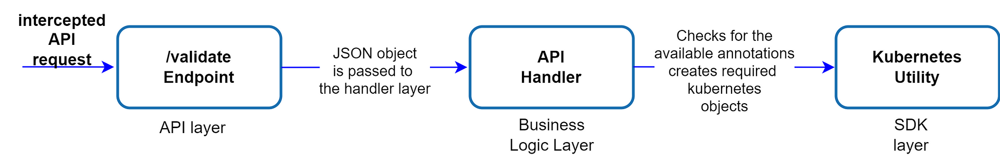
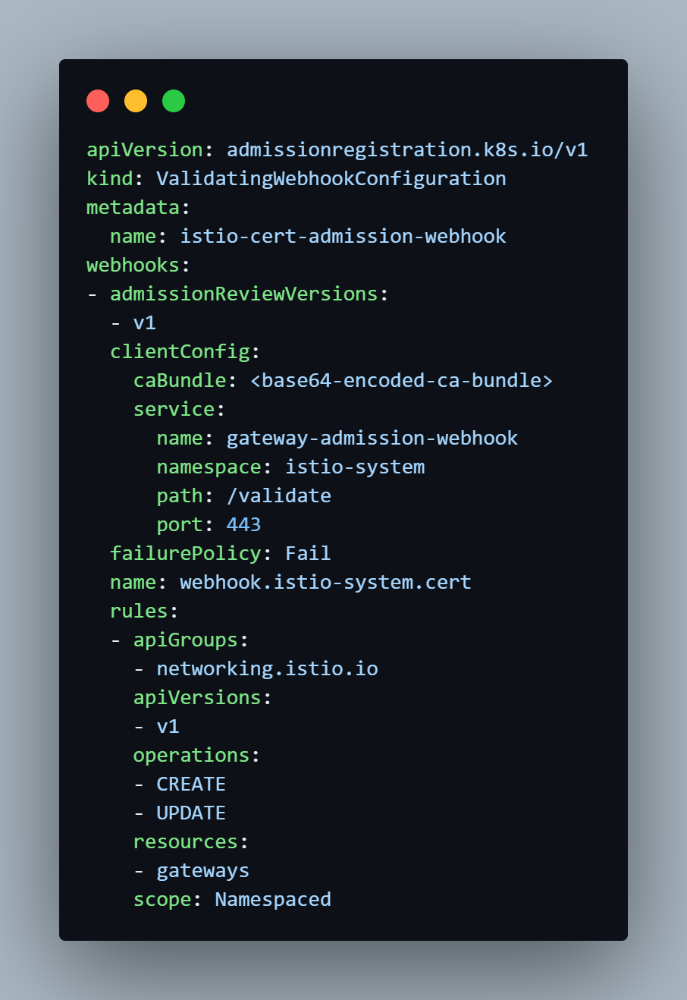

Istio 已经成为 Kubernetes 中服务间通信管理的事实标准，提供了强大的流量治理、安全防护和可观测性能力。然而，当我们在 **Google Kubernetes Engine (GKE)** 上通过 Istio Gateway 暴露服务时，TLS 证书的管理仍然是一项挑战。

尽管 **cert-manager** 在 Kubernetes 中简化了证书的签发过程，但目前它并不支持基于注解自动为 Istio Gateway 签发证书。这使得用户需要手动创建 `Certificate` 和 `Issuer` 等资源，不仅繁琐，还容易产生配置不一致，增加了运维负担。

为了填补这一空缺，本文提出了一种基于 **Kubernetes Admission Controller** 的自动化方案，实现证书的自动签发与注入。

## GKE 用户为何需要关注？

对于在 GKE 上运行 Istio 的团队而言，尤其是在大规模多微服务场景下，手动管理证书效率低下。虽然 GKE 支持 Google 托管证书，但出于灵活性和对多种 CA 支持的考虑，许多团队依然倾向于使用 **cert-manager**。本文介绍的解决方案，正是为了让 cert-manager 能无缝与 Istio Gateway 集成，在保持安全性与可靠性的前提下，实现自动化证书管理。

## 技术栈

Admission Controller 采用以下技术实现：

- **FastAPI**：高性能 Python Web 框架，作为 Webhook 服务的主干。
- **Uvicorn**：轻量级 ASGI 服务器，用于部署 FastAPI 应用。
- **Kubernetes Python SDK**：用于与 K8s API 交互，动态创建证书资源。
- **Docker**：用于容器化 webhook 服务，方便部署与交付。
- **Google Kubernetes Engine (GKE)**：控制器的运行平台。

项目地址：[Istio-Cert Admission Controller](https://github.com/Sayed-Imran/istio-cert-manager-webhook)

在进入具体实现前，我们先了解一下 Kubernetes 中的 webhook 机制。

## Kubernetes Admission Webhook：验证与修改

Admission Webhook 可拦截 Kubernetes API 请求，在资源落库前进行校验或修改，是实现策略控制与自动化的关键机制。Kubernetes 支持两种主要类型的 Webhook：

### 1. Validating Webhook（验证型）

用于在资源创建或修改前进行校验，若不符合预期规范可直接拒绝该请求。

**典型场景**：校验每个 Istio Gateway 是否包含合法的 `host` 字段。

### 2. Mutating Webhook（变更型）

可对资源进行修改，如注入默认值或自动添加注解。

**典型场景**：为 Istio Gateway 自动添加 `cert-manager.io/issuer` 注解，触发证书自动签发。

在本文中，我们实现的是一个 **Validating Webhook**，它不仅校验 `issuer` 是否存在，还在条件满足时自动创建对应的 `Certificate` 资源；若 `issuer` 不存在，则直接拒绝请求。

## 架构设计概览



Admission Controller 主要分为三个层次：

### **API 层**

负责接收来自 K8s API Server 的 AdmissionReview 请求，提取 JSON Payload 并转交给 Handler 层进行处理。

### **Handler 层**

核心校验逻辑所在，判断 Istio Gateway 是否包含以下注解：

- `cert-manager.io/issuer`
- `cert-manager.io/cluster-issuer`

#### 场景 1：未包含注解

直接返回允许响应（`allowed: true`），跳过进一步处理：

```json
{
  "apiVersion": "admission.k8s.io/v1",
  "kind": "AdmissionReview",
  "response": {
    "allowed": true,
    "uid": "xxx-xxx",
    "status": {
      "message": "Validation passed"
    }
  }
}
```

> 注意：返回响应的 `uid` 字段必须与请求中的完全一致。

#### 场景 2：包含注解

Webhook 会进一步查询指定的 `Issuer` 或 `ClusterIssuer` 是否存在：

- 若存在：放行请求。
- 若不存在：返回 `allowed: false`，并提示该 Issuer 不存在，防止错误引用导致证书无法生成。

这一机制确保了 Gateway 不会引用不存在的 CA，提高配置安全性。

## Kubernetes 工具层：实现证书自动创建

不同于传统 webhook 仅验证请求，该层进一步实现了 **资源创建功能**。一旦校验通过，将自动创建 `Certificate` 资源，并配置以下特性：

- 根据注解设定 `issuerRef`。
- 支持注解配置有效期（`duration`）、续期时间（`renewBefore`）等字段。
- 自动注入 `ownerReference`，绑定到原始 Gateway 对象上，实现生命周期联动，当 Gateway 删除时自动清理证书。

通过这一机制，原本繁琐的证书配置过程被自动化处理，极大减少人为错误：

1. 无需手动创建 Gateway 后再手动生成证书。
2. 不需手动填写各种元数据或维护引用关系。

## 与 Kubernetes 对接：注册 ValidatingWebhookConfiguration

最后一步是将 Admission Controller 注册为 Kubernetes 的 Validating Webhook，配置拦截哪些操作。具体设置为监听对 Istio Gateway 的 `CREATE` 与 `UPDATE` 操作。

示意配置如下：



> 注意：Webhook 服务必须通过 HTTPS 提供服务，K8s API Server 仅支持加密通信。

## 总结

通过扩展传统 Admission Controller 的功能，实现了与 Istio Gateway 紧密集成的 TLS 自动签发方案。它兼具自动化与生命周期感知，不仅提升了配置一致性，也减少了证书管理的复杂性。

尽管此方案主要面向 Istio + cert-manager，但该模式也适用于其他资源的自动创建与治理场景。只需结合合理的校验逻辑、资源绑定策略与安全机制，Admission Controller 就能成为 Kubernetes 中强大的自动化利器。

如果你对云原生安全治理、证书生命周期管理或 Istio Gateway 的自动化感兴趣，可以进一步参考项目代码并进行实践部署：https://github.com/Sayed-Imran/istio-cert-manager-webhook
