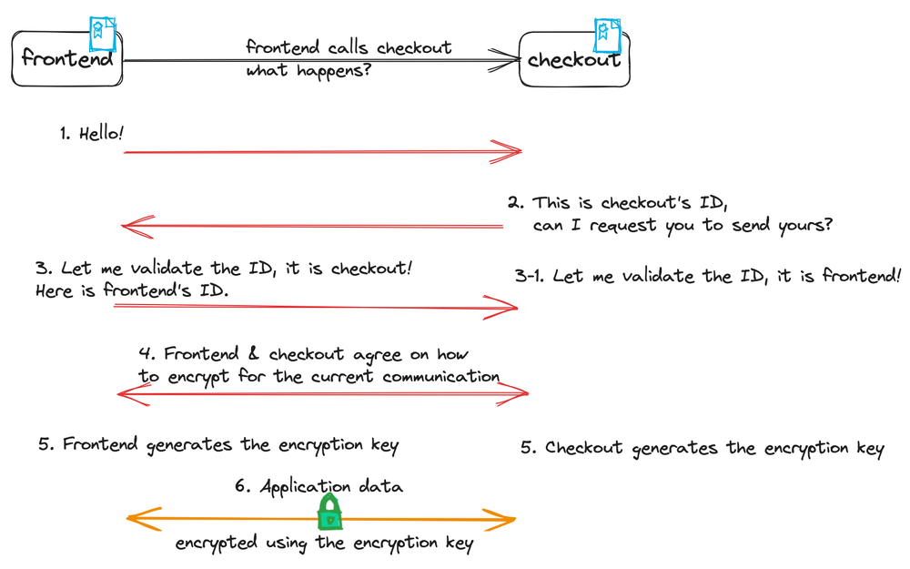
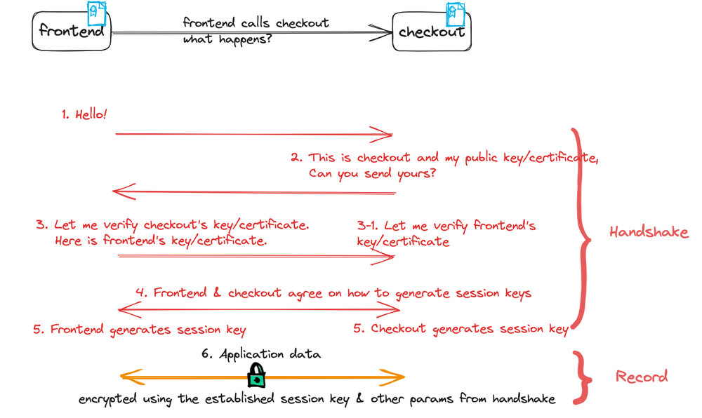

本文译自：<https://istio.io/latest/blog/2023/secure-apps-with-istio/>

> 摘要：本文讨论了使用相互 TLS (mTLS) 和 Istio 保护应用程序通信的重要性。mTLS 提供了端到端的安全性，只有源和目标可以解密数据，从而防止中间人攻击。然而，如果源或目标的身份没有加密，可能会出现问题。Istio 中的 mTLS 可以简单地启用，并为每个应用程序 pod 提供身份证书。为了强制执行严格的 mTLS，可以使用 Istio 的 PeerAuthentication 策略和 AuthorizationPolicy。最后，TLS 协议是最广泛审查、专家批准、经过战斗测试的数据安全协议之一，Istio 默认在内网应用程序通信中使用 TLS 1.3 版本。

用户采用服务网格的最大原因之一是使用相互 TLS（mTLS）基于可通过加密验证的身份来启用应用程序之间的安全通信。在此博客中，我们将讨论应用程序之间安全通信的要求，以及 mTLS 如何实现并满足所有这些要求，以及使用 Istio 启用应用程序之间 mTLS 的简单步骤。

## 您需要什么来保护应用程序之间的通信？

现代云原生应用程序经常分布在多个 Kubernetes 集群或虚拟机中。新版本经常进行阶段性部署，它们可以根据用户请求快速扩展和缩小。由于现代应用程序通过不依赖共同定位来提高资源利用效率，因此能够应用访问策略并保护这些分布式应用程序之间的通信至关重要，因为增加的多个入口点导致了更大的攻击面。忽视这一点将邀请数据丢失、数据盗窃、伪造数据或简单处理等巨大的业务风险。

以下是应用程序之间安全通信的常见关键要求：

### 身份

身份是任何安全架构的基本组成部分。在您的应用程序可以安全地发送数据之前，必须为应用程序建立**身份**。这个建立身份的过程被称为**身份验证** - 它涉及由某个知名的，受信任的**权威机构**对应用程序工作负载进行一次或多次检查，以确认它是它所声称的那样。一旦权威机构满意，它就会授予工作负载一个身份。

考虑出示护照的行为 - 你会向某个权威机构请求一个，那个权威机构可能会要求你提供几个不同的身份验证证明你是你所说的那个人 - 出生证明、现住址、医疗记录等。一旦你满足了所有的身份验证要求，你将（希望）被授予身份证件。你可以将那个身份证件给别人作为你已经满足了发证机构的所有身份验证要求的证据，如果他们信任发证机构（和身份证件本身），他们就可以信任关于你的所有内容（或者他们可以联系受信任的权威机构并验证该文件）。

身份可以采取任何形式，但是，就像任何形式的身份证明一样，身份验证越弱，伪造就越容易，身份证明对于使用它进行决策的任何人来说就越无用。这就是为什么在计算中，密码可验证的身份非常重要 - 它们由可验证的权威机构签署，类似于您的护照和驾驶执照。基于任何较少的身份都是一个可以相对容易地利用的安全弱点。

您的系统可能具有源自网络属性（例如 IP 地址）的身份，具有分布式身份缓存，跟踪身份与这些网络属性之间的映射。这些身份不像密码可验证的身份那样具有强大的保证，因为 IP 地址可能被重新分配给不同的工作负载，并且身份缓存可能并不总是更新到最新的状态。

您希望应用程序使用密码可验证的身份，因为在建立连接时交换应用程序的密码可验证身份本质上比依赖于将 IP 地址映射到身份的系统更可靠，更安全。这些系统依赖于具有最终一致性和过时问题的分布式身份缓存，这可能在 Kubernetes 中创建结构性弱点，其中高频率的自动 pod 转换是常态。

### 机密性

加密应用程序之间传输的数据至关重要 - 因为在破坏常见、成本高昂和实际上微不足道的世界中，完全依赖于*安全的*内部环境或其他安全边界早已不再适用。为了防止[中间人攻击](https://en.wikipedia.org/wiki/Man-in-the-middle_attack)，你需要为源 - 目标对创建一个唯一的加密通道，因为你希望有强大的身份唯一性保证以避免[混淆副手问题](https://en.wikipedia.org/wiki/Confused_deputy_problem)。换句话说，仅仅加密通道是不够的 - 它必须使用直接从唯一源和目标身份派生的唯一密钥进行加密，以便只有源和目标可以解密数据。此外，您可能需要根据安全团队的要求定制加密，例如通过选择特定的密码。

### 完整性

从源发送到目标的加密数据在发送后不能被除源和目标之外的任何身份修改。换句话说，接收到的数据与发送的数据相同。如果你没有[data integrity](https://en.wikipedia.org/wiki/Data_integrity)，那么中间的人可能在源和目标之间的通信过程中修改一些位或整个数据的内容。

### 访问策略执行

应用程序所有者需要对其应用程序应用访问策略，并正确、一致且不含糊地执行它们。为了对通信渠道的两端应用策略，我们需要为每一端确定一个应用程序身份。一旦我们为可能的通信渠道的两端都有了一个可以通过密码验证的身份，并且来源链条明确，我们就可以开始确定谁可以与何物进行通信的策略。标准的 TLS，这是一种广泛使用的密码协议，用于保护客户端（例如，Web 浏览器）和服务器（例如，Web 服务器）之间的通信，只真正验证并要求一方的身份 - 服务器。但是，对于全面的端到端策略执行，对双方 - 客户端和服务器都有一个可靠、可验证、明确的身份至关重要。这对内部应用程序来说是一个共同的需求 - 想象一下，只有一个 `frontend` 应用程序应该调用后端 `checkout` 应用程序的 **GET** 方法，但是不应该被允许调用 `POST` 或 `DELETE` 方法。或者，只有那些由特定 JWT 发行者发出 JWT 令牌的应用程序才能调用 `checkout` 应用程序的 `GET` 方法。通过利用双端的密码身份，我们可以确保强大的访问策略被正确地、安全地、可靠地执行，而且有可验证的审计轨迹。

### FIPS 合规性

[联邦信息处理标准 (FIPS)](https://www.nist.gov/standardsgov/compliance-faqs-federal-information-processing-standards-fips) 是由 [国家标准与技术研究院 (NIST)](https://www.nist.gov/) 制定的联邦计算机系统的标准和指南。并非每个人都需要 FIPS 合规性，但 FIPS 合规性意味着满足了美国政府为保护敏感信息而设立的所有必要安全要求。与联邦政府合作时需要它。为了遵循美国政府制定的与网络安全相关的指南，许多私营部门都自愿使用这些 FIPS 标准。

为了说明上述安全应用程序要求（身份、机密性和完整性），让我们使用 `frontend` 应用程序调用 `checkout` 应用程序的例子。记住，您可以把图中的 **ID** 看作是任何类型的身份证明，比如政府颁发的护照、照片识别器：

## mTLS 如何满足上述要求？

TLS 1.3（在撰写本文时的最新 TLS 版本） [规范](https://datatracker.ietf.org/doc/html/rfc8446) 的主要目标是在两个通信对等方之间提供一个安全通道。TLS 安全通道具有以下属性：

1. 验证：通道的服务器端始终被验证，客户端可选地被验证。当客户端也被验证时，安全通道成为一个相互的 TLS 通道。
2. 机密性：数据被加密且只对客户端和服务器可见。必须使用与源和目标身份证明无歧义地密码绑定的密钥来加密数据，以便可靠地保护应用程序层的流量。
3. 完整性：通过通道发送的数据无法在未被检测到的情况下进行修改。这是通过只有源和目标拥有给定会话的加密和解密密钥的事实来保证的。

### mTLS 内部逻辑

我们已经确定了，使用可以通过加密验证的身份标识对于保护通道和支持访问策略执行至关重要，我们也已经确定了，mTLS 是一种经过严密测试的协议，它为在通道的两端使用可以通过加密验证的身份标识提供了一些极其重要的保证 - 让我们深入了解一下 mTLS 协议在实际运行中是如何工作的。

### 握手协议

[握手协议](https://datatracker.ietf.org/doc/html/rfc8446#section-4) 验证了通信双方的身份，协商了加密模式和参数，并建立了共享的密钥材料。换句话说，握手的角色是验证通信双方的身份并协商会话密钥，以便连接的其余部分可以根据会话密钥进行加密。当您的应用程序建立 mTLS 连接时，服务器和客户端协商一个密码套件，该套件规定了您的应用程序将用于连接其余部分的加密算法，您的应用程序还协商了要使用的加密会话密钥。整个握手过程都被设计为能抵抗篡改 - 任何未持有与源和/或目标相同的独特，能够通过加密验证的身份文档的实体的干扰都会被拒绝。因此，在任何通信方继续进行应用程序数据之前，都有必要检查整个握手过程并验证其完整性。

握手可以被认为是按照 TLS 1.3 规范中的[握手协议概述](https://datatracker.ietf.org/doc/html/rfc8446#section-2)有三个阶段 - 再次使用`frontend`应用程序调用后端`checkout`应用程序的例子：

1. 第一阶段：`frontend`和`checkout`协商可以用来保护握手和流量数据的加密参数和密钥。
2. 第二阶段：在此阶段和之后的所有内容都是加密的。在这个阶段，`frontend`和`checkout`建立其他握手参数，并确定是否也对客户端进行身份验证 - 也就是说，mTLS。
3. 第三阶段：`frontend`通过其可通过加密验证的身份验证`checkout`（在 mTLS 中，`checkout`以相同的方式验证`frontend`）。

自 TLS 1.2 以来，与握手相关的有几个主要区别，有关更多详细信息，请参考 TLS 1.3 规范：

1. 所有握手消息（第二阶段和第三阶段）都使用在第一阶段协商的加密密钥进行加密。
2. 已经削减了遗留的对称加密算法。
3. 添加了零往返时间（0-RTT）模式，节省了连接设置的一个往返时间。

### 记录协议

在握手阶段协商了 TLS 协议版本、会话密钥和[HMAC](https://en.wikipedia.org/wiki/HMAC)后，双方现在可以通过[记录协议](https://datatracker.ietf.org/doc/html/rfc8446#section-5)安全地交换被分块的加密数据。使用握手中协商的完全相同的参数对流量进行加密是至关重要的（并且是规范的一部分），以确保流量的机密性和完整性。

将 TLS 1.3 规范中的两个协议放在一起，并使用`frontend`和`checkout`应用程序来说明以下流程：

谁为`frontend`和`checkout`发出身份证书？它们通常由具有自己的[根证书](https://en.wikipedia.org/wiki/Root_certificate)或使用其根 CA 的中间证书的[证书颁发机构（CA）](https://en.wikipedia.org/wiki/Certificate_authority)发出。根证书基本上是一份标识根 CA 的公钥证书，您的组织可能已经拥有此证书。根证书会与`frontend`（或`checkout`）的自己的根签名身份证书一起分发到`frontend`。这就是基本的公钥基础设施（PKI）的工作方式 - CA 负责验证实体的身份文档，然后以证书的形式授予它一个无法伪造的身份文档。

您可以依赖您的 CA 和中间 CA 作为身份**真理**的来源，以一种维持高可用性并提供稳定、持久可验证的身份保证的结构化方式，而一个庞大的分布式 IP 和身份映射缓存则无法做到这一点。当`frontend`和`checkout`的身份证书由同一个根证书发出时，`frontend`和`checkout`可以始终以一致且可靠的方式验证其对等身份，无论它们运行在哪个集群或节点或规模中。

您了解了 mTLS 如何提供加密身份、机密性和完整性，那么当您的应用程序数量增长到数千个或更多，并且跨多个集群时，其可扩展性如何呢？如果您在多个集群中建立一个单一的根证书，那么只要它被根证书信任，系统就不需要在应用程序收到来自另一个集群的连接请求时进行处理 - 系统知道连接上的身份已经通过加密进行了验证。当您的应用程序 pod 更改 IP 或被重新部署到另一个集群或网络时，您的应用程序（或代表其行动的组件）只需使用其由 CA 铸造的受信任证书向目标发起流量即可。无论是 500+网络跳转还是直接连接，您的访问策略都会以相同的方式执行，无需跟踪身份缓存并计算哪个 IP 地址映射到哪个应用程序 pod。

那么关于 FIPS 合规性呢？根据 TLS 1.3 规范，TLS 兼容的应用程序必须实现`TLS_AES_128_GCM_SHA256`密码套件，并建议实现`TLS_AES_256_GCM_SHA384`，这两者都在 NIST 的[TLS 指南](https://nvlpubs.nist.gov/nistpubs/SpecialPublications/NIST.SP.800-52r2.pdf)中。RSA 或 ECDSA 服务器证书也被 TLS 1.3 规范和 NIST 的 TLS 指南推荐。只要您为 mTLS 连接使用 FIPS 140-2 或 140-3 合规的加密模块，您就会走上[FIPS 140-2 或 140-3 验证](https://csrc.nist.gov/projects/cryptographic-module-validation-program/validated-modules)的正确路径。

## 可能出现的问题

按照 TLS 1.3 规范正确实施 mTLS 至关重要。如果不按照 TLS 规范正确使用 mTLS，以下是一些可能在未被检测的情况下出现的问题：

### 如果有人在连接中间静默地捕获加密数据会怎么样？

如果连接没有按照 TLS 规范中概述的握手和记录协议来进行，例如，连接遵循握手协议，但在记录协议中没有使用握手中协商的会话密钥和参数，您可能会发现您的连接的握手和记录协议之间没有关联，握手和记录协议之间的身份可能不同。TLS 要求握手和记录协议在同一连接中共享，因为将它们分开会增加中间人攻击的攻击面。

mTLS 连接从握手开始到结束都具有一致的端到端安全性。加密数据是用证书中公钥协商的会话密钥加密的。只有源和目标可以使用私钥解密数据。换句话说，只有拥有私钥的证书所有者才能解密数据。除非黑客控制了证书的私钥，否则他或她没有办法搞乱 mTLS 连接以成功执行中间人攻击。

### 如果源或目标身份没有加密安全怎么办？

如果身份基于网络属性，如 IP 地址，这些属性可能会重新分配给其他 pod，就无法使用加密技术验证该身份。由于此类身份不基于加密身份，因此您的系统可能有一个身份缓存，用于跟踪身份、pod 的网络标签、相应的 IP 地址和部署 pod 的 Kubernetes 节点信息之间的映射。使用身份缓存，您可能会遇到 pod IP 地址被重用和身份错误，当身份缓存在短时间内同步出现问题时，策略可能无法正确执行。例如，如果您的连接之间的对等方没有加密身份，您的系统将不得不从可能过时或不完整的身份缓存中获取身份。

将身份映射到工作负载 IP 的这些身份缓存不是 ACID（原子性、一致性、隔离性和持久性），您希望您的安全系统应用于具有强保证的事物。考虑以下属性和您可能想要问自己的问题：

- 过时：对等方如何验证缓存中的条目是否是**当前**的？
- 不完整：如果缓存未命中并且系统未能关闭连接，只有缓存**同步器**失败时网络才会变得不稳定吗？
- 如果某个东西根本没有 IP 怎么办？例如，默认情况下，AWS Lambda 服务没有公共 IP。
- 非事务性：如果您读取两次身份，会看到相同的值吗？如果在访问策略或审计实施中不小心，这可能会导致真正的问题。
- 谁将守护守护者自己？是否有既定的实践来保护缓存，就像 CA 有的那样？您有什么证据证明缓存没有被篡改吗？您是否被迫对一些不是您的 CA 的复杂基础设施的安全性进行推理（和审计）？

以上问题中有些比其他问题更糟。您可以应用**失败关闭**原则，但这并不能解决所有问题。

身份也用于执行访问策略，例如授权策略，这些访问策略在请求路径中，您的系统必须快速做出决定，允许或拒绝访问。每当身份出现错误时，访问策略可能会被绕过，而无法被检测或审计。例如，您的身份缓存可能将您的`checkout` pod 的先前分配的 IP 地址作为`checkout`身份之一。如果`checkout` pod 被回收，同一 IP 地址刚刚被分配给一个`frontend` pod，那么在缓存更新之前，该`frontend` pod 可能具有`checkout`的身份，这可能导致错误的访问策略被执行。

让我们假设以下大规模多集群部署，说明身份缓存过时问题：

1. 100 个集群，每个集群有 100 个节点，每个节点有 20 个 pod。总的 pod 数量是 200,000。
2. 0.25% 的 pod 一直在变动（滚动更新，重启，恢复，节点变动等），每次变动的窗口是 10 秒。
3. 每 10 秒有 500 个正在变动的 pod 分布到 10,000 个节点（缓存）。
4. 如果缓存同步器停滞，系统在 5 分钟后过时的%可能高达**7.5%**！

以上假设缓存同步器处于稳态。如果缓存同步器出现问题，会影响其健康检查，增加变动率，导致级联不稳定。

CA 也可能被攻击者[攻击](https://en.wikipedia.org/wiki/Certificate_authority#CA_compromise)，攻击者假装是别人，欺骗 CA 发出证书。然后，攻击者可以使用该证书与其他对等方通信。这是[证书撤销](https://en.wikipedia.org/wiki/Certificate_authority#Certificate_revocation)可以通过撤销证书使其无效来解决问题。否则，攻击者可以利用被攻击的证书直到其过期。保持根证书的私钥在 HSM 中至关重要，该 HSM 应保持[离线](https://en.wikipedia.org/wiki/Online_and_offline)，并使用中间证书签署工作负载证书。在 CA 停顿或停滞 5 分钟的情况下，您将无法获得新的或续期的工作负载证书，但之前发出的有效证书将继续为您的工作负载提供强大的身份保证。为了提高发行的可靠性，您可以将中间 CA 部署到不同的区域和地区。

## Istio 中的 mTLS

### 启用 mTLS

在 Istio 中为内网应用程序启用 mTLS 非常简单。您需要做的就是将您的应用程序添加到网格中，这可以通过为您的命名空间标记侧车注入或环境来完成。在侧车的情况下，需要进行滚动重启，以便侧车被注入到您的应用程序 pod 中。

### 加密身份

在 Kubernetes 环境中，[Istio](https://istio.io/latest/docs/concepts/security/#istio-identity)根据其服务帐户创建应用程序的身份。将应用程序添加到网格后，将向网格中的每个应用程序 pod 提供身份证书。

默认情况下，您的 pod 的身份证书在 24 小时后过期，Istio 每 12 小时旋转一次 pod 身份证书，以便在出现妨害行为的情况下（例如，被攻击的 CA 或被盗的 pod 的私钥），被攻击的证书只能在证书过期并因此限制其可能造成的损害的非常有限的时间内工作。

### 强制执行严格的 mTLS

默认的 mTLS 行为是尽可能使用 mTLS，但并不强制执行。要严格强制您的应用程序只接受 mTLS 流量，您可以使用 Istio 的[PeerAuthentication](https://istio.io/latest/docs/reference/config/security/peer_authentication/)策略，对整个网格或每个命名空间或工作负载进行操作。此外，您还可以应用 Istio 的[AuthorizationPolicy](https://istio.io/latest/docs/reference/config/security/authorization-policy/)来控制您的工作负载的访问。

### TLS 版本

TLS 版本 1.3 是 Istio 在内网应用程序通信中的默认设置，使用 Envoy 的[默认密码套件](https://www.envoyproxy.io/docs/envoy/latest/api-v3/extensions/transport_sockets/tls/v3/common.proto)（例如，对于 Istio 1.19.0，为`TLS_AES_256_GCM_SHA384`）。如果您需要旧的 TLS 版本，您可以为您的工作负载[配置不同的网格范围内的最小 TLS 协议版本](https://istio.io/latest/docs/tasks/security/tls-configuration/workload-min-tls-version/)。

## 结束语

由互联网工程任务组（IETF）制定的 TLS 协议是存在的最广泛审查、专家批准、经过战斗测试的数据安全协议之一。TLS 也在全球广泛使用 - 每当您访问任何安全网站，您都可以放心购物，部分原因是因为锁定图标表明您正在使用 TLS 安全连接到受信任的网站。TLS 1.3 协议设计具有端到端的身份验证、保密性和完整性，以确保您的应用程序的身份和通信不被破坏，并防止中间人攻击。为了实现这一点（并被认为是符合标准的 TLS），正确验证通信对等方并使用从握手协商的密钥加密流量不仅重要，而且至关重要。现在您知道 mTLS 在满足您的安全应用程序通信要求（加密身份、保密性、完整性和访问策略执行）方面表现优秀，您可以简单地使用 Istio 将您的内网应用程序通信升级到 mTLS - 配置非常少！

*特别感谢 Louis Ryan、Ben Leggett、John Howard、Christian Posta、Justin Pettit 花费大量时间审查和提出博客的更新！*
