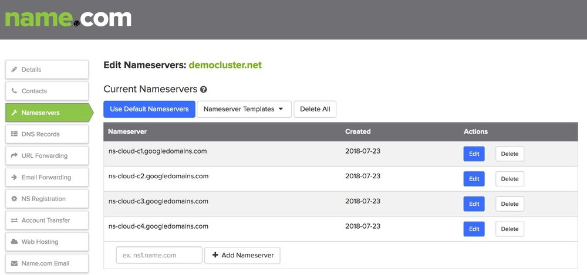
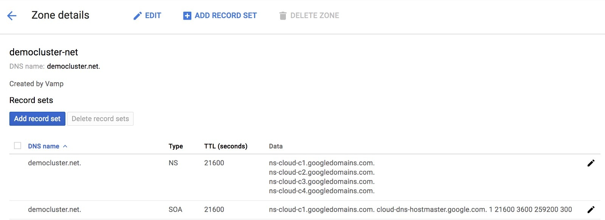
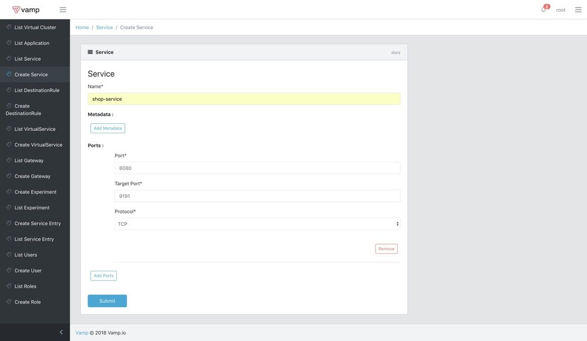
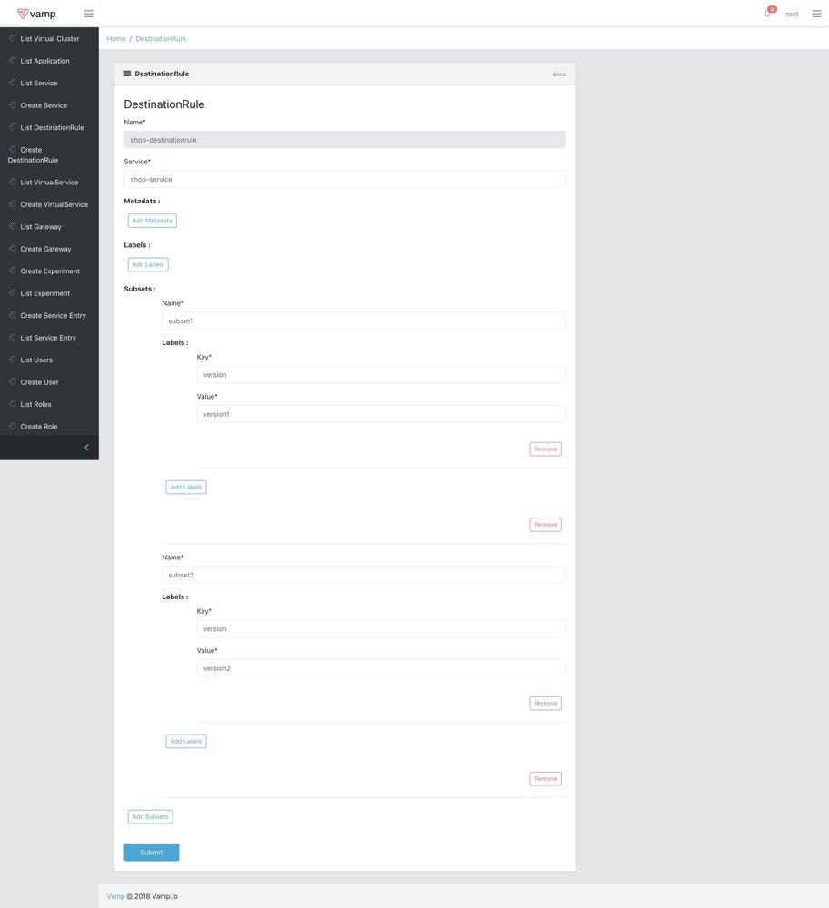
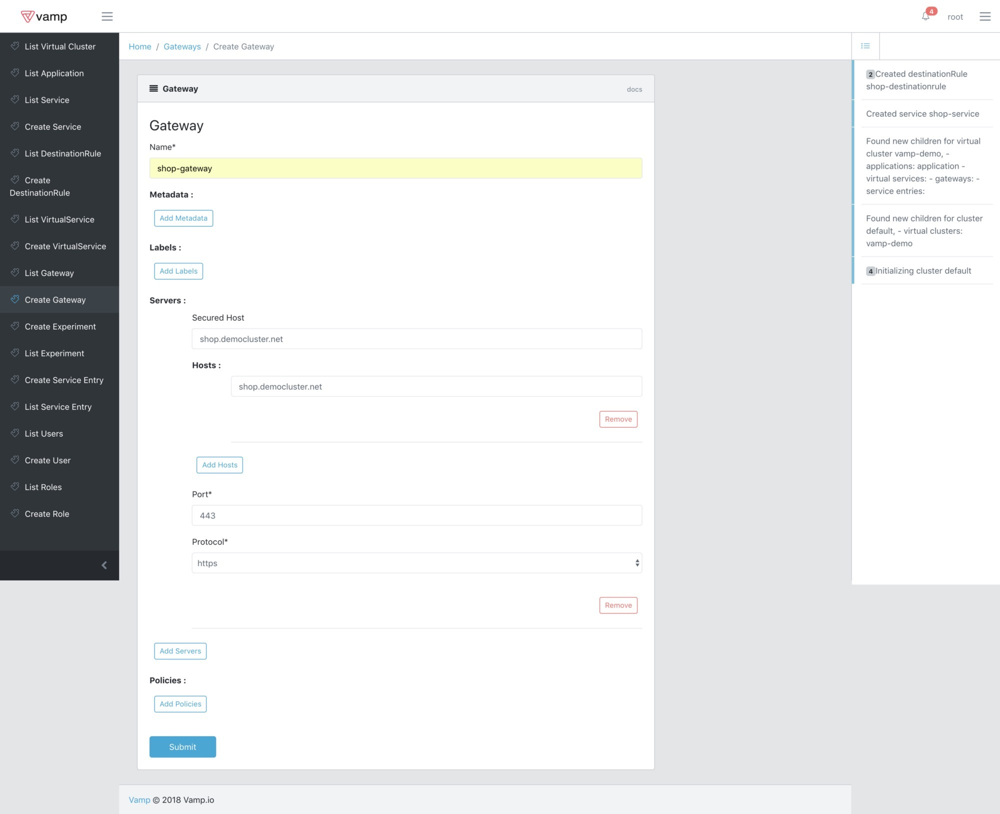
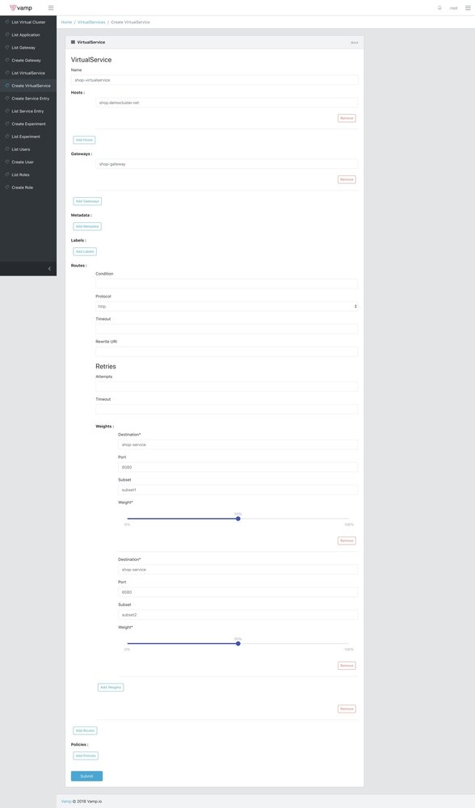
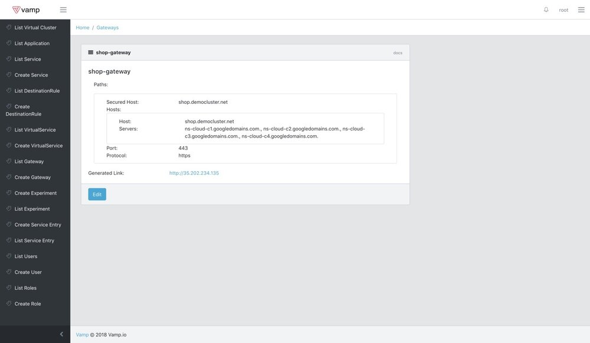
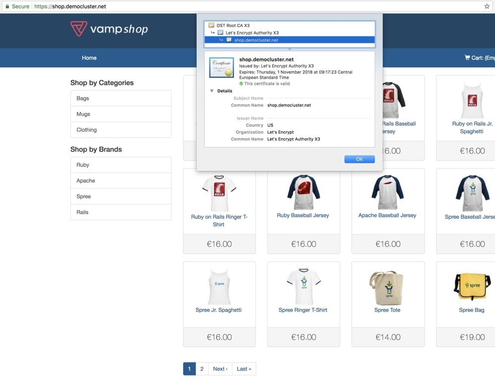
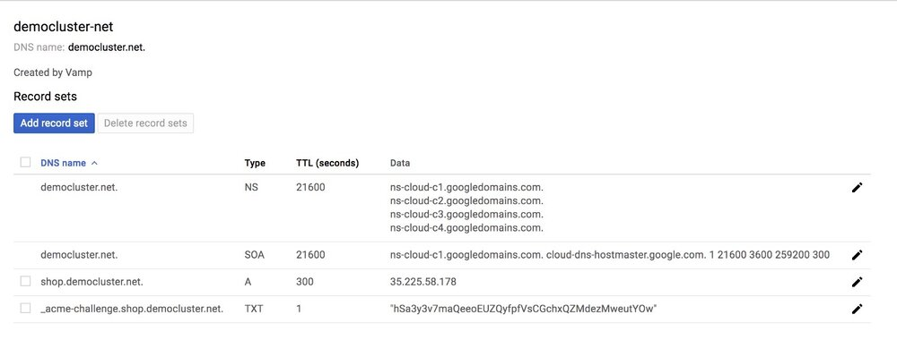

这是我在 kubernetes 之上部署 Istio 系列文章中的第三篇，内容是关于我们试图通过 Vamp Lamia 实现的更多细节以及我们为什么选择 Istio 的原因，可以查看我的[第一篇](https://medium.com/vamp-io/putting-istio-to-work-8513f5218c51)和[第二篇](https://medium.com/vamp-io/a-b-testing-on-kubernetes-with-istio-0-8-6323efa2b4e2)文章。

在 Vamp.io，我们正在开发 Vamp Lamia，以帮助您轻松地将您的服务连接到需要 SSL/TLS 连接的现实世界。最近，许多浏览器和其他技术开始强制实施 SSL 连接。用户使用谷歌浏览器访问 HTTP 链接将给予警告，Android 现在默认也需要安全连接。

在过去，从权威机构获取证书是一项艰难而费事的过程。所以需要一种简便常规的解决方案。Let’s Encrypt免费提供了SSL/TLS认证获取的最佳实践。以下是Let’s Encrypt 的官方使命。

> Let’s Encrypt 是一个免费、自动化和开放的证书颁发机构（CA），为公众的利益而运行。它是由 Internet Security Research Group（ISRG）提供的服务。我们为用户提供所需的数字证书，以便以更友好的方式免费为网站启用 HTTPS（SSL/TLS）。我们这样做是因为我们想要创建一个更安全、更尊重隐私的 Web。

> 来源：https://letsencrypt.org/

在 Istio 中，可以[通过向网关添加证书来保护 ingress service](https://istio.io/docs/tasks/traffic-management/secure-ingress/)。但这是一个多步骤过程，证书授权没有记录。为了使这个过程自动化，我们为 Let's Encrypt 集成 Vamp Lamia。

Let’s Encrypt 接受证书授权有两种方法：HTTP 和 DNS。我们决定首先实现 DNS 方法，因为它可以与其他 TCP 协议（如 gRPC）一起使用，并且还允许使用通配符域证书。

对于 DNS 授权，您仍需要拥有托管 DNS 服务提供程序。我们的开发环境主要在 Google Cloud Platform 上，因此我们开始是集成 Google Cloud DNS 上的，但我们的系统是模块化的，因此很容易与其他 DNS 提供商集成，例如 Amazon Route 53、CloudFlare 等。作为旁注，您的 DNS 服务提供商不需要与您的 Kubernetes 集群服务提供商相同。您的群集可以在 AWS 上，您仍然可以使用 Google Cloud DNS 服务。如果您需要一些帮助可以联系我们。

我们通过公开安全的主机名参数将 Let’s Encrypt 集成到网关。使用此主机名，我们创建 DNS 服务条目和证书授权。

这是通过多个步骤完成的，因此首先我们将解释先决条件。

## 先决条件

第一步是创建领域，这是域名服务器重定向所必需的。这是最初的步骤，它可能需要一个手动步骤，所以我会尝试尽可能地解释它。

某些域名服务提供商具有固定域名服务器，但 Google Cloud DNS 会为每个区域创建一套 4 个域名服务器。您需要在域名提供商的设置中将这些域名服务器设置为你的域名服务器。对于每个域名这是一次性操作。

我们在[name.com](https://www.name.com/)注册了域名 democluster.net。您还可以在 Google 域名服务里创建域名，但我们已经为此博客帖子提供了一个域名。这是 name.com 中的域名服务器配置示例。

检查您的域名服务配置是否已更新。域名通过互联网缓存，实际更新可能需要 48 小时。在我们的案例中花了大约 2 个小时。

请注意，Google DNS 提供了多套名称服务，因此在创建 zone 时，您应该检查域名服务并更新它们。

您可以转到 Google DNS 页面并打开您的 zone，将会有 NS 类型下的域名服务器列表。

创建网关后，Vamp Lamia 将为您设置 zone 记录，然后在 UI 中列出域名服务。Let’s Encrypt 身份验证需要更新域名服务。

现在我们可以继续使用 Vamp Lamia 了。

## 设置网关和服务

要安装 Vamp Lamia，请按照我们的[github](https://github.com/magneticio/vamp2setup)中的说明进行操作

对于这篇文章，我们将使用 vamp-shop 作为 deployment，它包含在我们的样本包中。Vamp Shop 是一个虚构的电子商务网站，我们在那里测试我们的金丝雀发布功能。我们在[A/B测试](https://medium.com/vamp-io/a-b-testing-on-kubernetes-with-istio-0-8-6323efa2b4e2)博客文章中提到过，我们在这篇文章中使用了几乎相同的架构。请运行[demo-setup.sh](https://github.com/magneticio/vamp2setup/blob/master/samples/experiment-demo/demo-setup.sh)将 Vamp Shop 部署到您的 kubernetes 集群。

Vamp Lamia 定期检查群集并安装缺少的 Istio 组件并检测新的 deployments，建议等待“List Virtual Cluster”页面，直到看到`vamp-demo` namespace 出现，当它可用时你可以编辑它。

对于此 demo，您需要添加`google_project_id`和`google_service_account`作为元数据。为此，您必须创建服务帐户并将 json 文件的内容复制到值区域。

我们要创建：

- 一个 service
- 一个 destination rule
- 一个 gateway
- 一个 virtual service

创建如下 service：

创建如下 destination rule：

创建如下 gateway。

请注意，您需要使用您拥有的 domain 中的其他主机名。 “Secured Host”将用于注册 DNS 和 Let's Encrypt。由于 TCP 协议限制，每个端口只能有一个安全主机。HTTPS 的默认端口是 443。

创建一个如下 virtual service，在这协议是 http，SSL/TLS 终止发生在集群边缘，内部服务可以继续使用 http。

您可能需要等待获取 UI 中已更新网关的通知。您可以查看“Gateway Details”页面以查看当前域名服务的列表。

如果一切顺利，您可以在浏览器上看到你的网站：

## 了解原理

当定义安全主机时，Vamp Lamia 首先设置网关并获取公网 IP，然后尝试与您的 DNS 提供商通信并设置 A 记录，以便通过 IP 地址访问您的服务。最后，为 Vamp Lamia 准备设置证书。

Vamp Lamia 将生成证书，Let's Encrypt 使用 DNS Challenge 进行认证，并使用您的 DNS 提供商进行设置。此过程的结果也会在 Google DNS 页面上显示，如下所示：

当客户端要求证书注册时，Let's Encrypt 会要求对该 domain 进行授权。有两种可能的方式:HTTP challenge 和 DNS challenge。我们正在使用 DNS challenge，因为它更灵活。Let’s Encrypt 给出一个摘要哈希，我们在`_acme-challenge.shop.democluster.net`下插入了一条 TXT 记录。

最后，Vamp Lamia 将证书插入 Istio 网关。

请注意，当您拥有像`service-name.domain-name.com`等服务主机名时，Vamp Lamia 会对主机名做出一些假设。我们假设`domain-name.com`将用作您的 zone 名称。我们目前为每个主机名创建一个证书，但我们计划在以后的版本中添加智能域名证书。

对于当前的互联网状态，拥有 SSL/TLS 证书至关重要。正如我们所提到的，由于拥有安全服务至关重要，因此谷歌和许多其他软件提供商都在推动浏览器默认使用 HTTPS。借助此功能，在 Vamp Lamia 托管集群中，可以非常轻松地设置安全服务并将其暴露给现实世界。

在下一篇文章中见到你并查看[我们的 github](https://github.com/magneticio/vamp2setup)。
