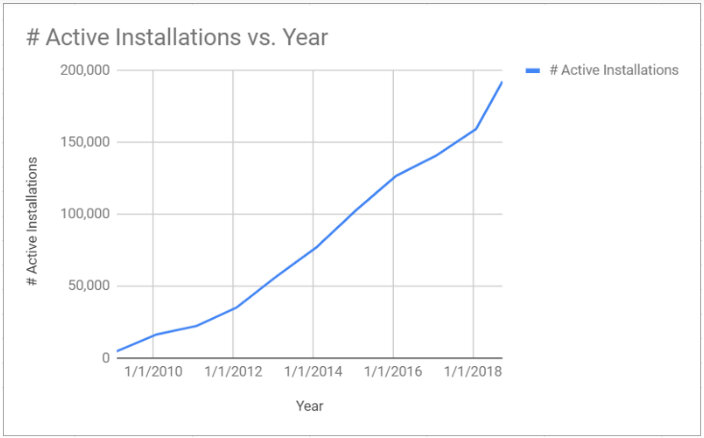
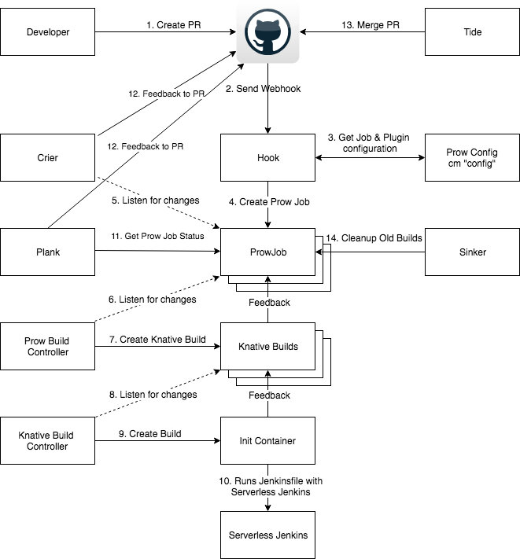

本文为翻译文章，[点击查看原文](https://medium.com/@jdrawlings/serverless-jenkins-with-jenkins-x-9134cbfe6870)。

Jenkins 服务来源于创建自 2004 年的 Hudson。在软件行业中，Jenkins 已经是家喻户晓的明星产品，并且已经是 CI 和 CD 的领头羊。到目前为止有超过 2050 万的 Jenkins 任务，以及将近 20 万的 Jenkins 服务在运行中。这真的是非常惊人的增长速度。



上面的增长图说明在技术领域已经有很大的进步，列如云计算和容器，这些变化说明 Jenkins 在很多方面已经起到了很好的作用，我们应该很好的利用这些影响力。如今，很多公司都开始进行容器化改造，我们希望 jenkins 能跟上时代的步伐，开始自己的云原生之路。Jenkins 应当继续成长，提供更多大家需要的自动化，可靠性，以及更好的开发体验。

Jenkins 在取得巨大成功的同时，也产生了一些问题。

下面让我们来简要描述一些我们了解到的比较重要的问题。

1. Jenkins 服务的单点问题。特别是在服务维护期间，git webhook 的操作都会被丢失。
2. Jenkins 服务经常将磁盘跑满，需要脚本或者人工清理之后，才能继续运行。
3. 在服务升级之后，plugin 的版本会匹配不上。
4. 多分支扫描，经常导致 GitHub 的速率被限制。
5. 在没有任何任务执行时，也需要占用巨大的内存，从基于使用情况来看，这是一种巨大的浪费。

未来的改进：

1. 降低云计算开销，只在有任务需要被构建时才执行 jenkins 服务。
2. 尽量使用上一次的临时构建通道，避免磁盘被耗尽。
3. 通过持续集成进行插件的安装和插件的升级更新。
4. 提供高可用性和可伸缩性的 webhook 操作，来解决 spof 问题。
5. 避免由于 GitHub 的 API 扫描导致的速度风险。
6. 提供灾难恢复策略，用来恢复存储在 git 上的所有配置信息。

Jenkins x 项目在今年早些时候对外宣布为基于 kubernetes 的 pull 请求和 gitops 自动升级提供了 CI 和 CD（Testing-->Staging-->Production）。Jenkins X 同样继承了 kubernetes 的 CRD 特性 ([custom resource definitions](https://kubernetes.io/docs/concepts/extend-kubernetes/api-extension/custom-resources/ "custom resource definitions"))，并为你的 Jenkins 服务和作业提供了编排功能。

Jenkins x 和 Jenkins 激动的宣布无服务的 Jenkins。Jenkins x 既能编排无服务的 jenkins，一个静态的 jenkins master，也能为每一个 team 提供 Knative 构建；因此现在开源的 Jenkins 云拥有完整的 Knative 构建支持。

无服务 Jenkins 使用成功的并且创新开源项目来解决和上述静态 Jenkins master 的问题。Kubernetes 现在是事实的云实现，因此现在让我们专注在那些不太有名的，却能使得无服务的 Jenkins 成为可能的项目：Prow and Knative build。

在这篇博客的底部，有一个链接到未经编辑的 Youtube，它演示了这系列的操作。

## Prow 是什么？

Prow 来源于 google 的电子商务系统。被一帮纠结于是否需要使用 Jenkins 来构建那些基于 kubernetes 的 GitHub repos 的优秀群体所创建。Kubernetes 是 GitHub 上最成功的项目之一。Prow 被用于[Istio](https://github.com/istio "Istio")和[Jetstack](https://github.com/jetstack/ "Jetstack")的同时，还被 140 个项目使用。有许多不同的职责的微服务组成的基于事件的解决方案——为云原生提供了理想的松散耦合架构。对于 merge 到 master 上请求，有了更加有力的方式（不管是在构建请求之前，还是之后），可以使用 ChatOps 和构建系统进行交互。

Prow 提供了可伸缩的，高可用的 webhook 事件处理器，可以将 ProwJobs 的 CRDs 请求写入到 kubernetes，以至于像正在运行中的持续集成或者发布服务等其它微服务收到响应，并执行操作（kubernetes controller 对于 ProwJob 事件进行了监听）。Git 事件可以是新的 PR、issue、评论、merge、push 等操作都会触发 git event，因此我们能对更多的事件请求响应。

对于一些已经提供了一组配置规则的目录，我们提供了自动 merge pull request 功能。对于 Prow 组件和描述参考如下链接[https://github.com/kubernetes/test-infra/tree/master/prow](https://github.com/kubernetes/test-infra/tree/master/prow)。

Prow 同样也将它的配置信息存储在 git 上，这样在出现问题时可以进行恢复。Jenkins X 项目在向用户发布前已经进行了广泛的测试和验证。你能在如下地址上看到 Jenkins X项目对于CI/CD提供了很多基于yaml的Prow配置[https://github.com/jenkins-x/prow-config](https://github.com/jenkins-x/prow-config)。

## Knative Build

[Knative Build](https://github.com/knative/build "Knative Build")是一个继承自 Kubernetes 项目的云原生解决方案。让用户可以直接从源码进行构建。Knative Build 最大的特色就是可以将一些简单的操作在同一个 pod 中的串联起来的执行，还可以在容器间进行状态的共享。这个特性通过[Kubernetes init containers](https://kubernetes.io/docs/concepts/workloads/pods/init-containers/ "Kubernetes init containers")进行初始化。

[Build Templates](https://github.com/knative/build-templates "Build Templates")是可以通过 Kubernetes pod 来直接运行你构建的项目。这个允许你在构建项目时，事先指定要需要运行的 docker image，构建时需要用到的环境变量、service accounts、secret 以及需要 mount 的存储卷。build template 是 kubernetes CRD 的集合。可以使用 Jenkins x 进行自动升级。通过 build template 创建或者引入一个应用时，可以使用 jenkins x 产生 Prow 配置。在 Jenkins x 项目中有一个列子是在[BuildTemplate](https://github.com/jenkins-x-charts/jx-build-templates/blob/81fd333/jx-build-templates/templates/jenkins-go-buildtemplate.yaml#L4 "BuildTemplate")中配置[prow config pointing](https://github.com/jenkins-x/prow-config/blob/7dcda43/prow/config.yaml#L138-L139 "prow config pointing")。

## 什么是无服务 Jenkins

现在您已经了解了我们正在做的事情的背景，我们可以看看无服务 Jenkins。云原生 Jenkins 正在努力帮助开发人员、团队和组织迁移到云，并确保 Jenkins 不仅与云相关，还允许我们利用云和 Jenkins 最擅长的东西。

详情：



使用基于 Kubernetes 的 Jenkins X 将会帮你自动安装和配置 Prow 和 Knative，下面我们开始准备进行安装。当创建项目或者引入项目时，jx cli 生成了所有需要的配置，并且更新 git repo webhook endpoint。

现在，每个 pull 请求或合并到 master 的请求都会触发使用 Knative 在 Kubernetes 中产生一个临时的 Jenkins 操作，checkout git revision，配置所需的凭证，并使用 Jenkinsfile 运行应用程序构建管道。一旦构建完成，它将丢弃 Jenkinsfile 运行程序 pod。

多亏了[War Packager](https://github.com/jenkinsci/custom-war-packager "War Packager")（CWP），Jenkins X 发布过程构建了不同风格的 Jenkins 服务器，其中包含必要的构建工具。语言检测确保使用正确的风格。我们还使用[Configuration as Code plugin](https://github.com/jenkinsci/configuration-as-code-plugin "Configuration as Code plugin")（CasC）在构建时添加必要的 Jenkins 配置。CWP 很棒的特性之一是它提取 Jenkins 插件再构建 serverless Jenkins（而不是当 serverless Jenkins），所以在基于 Jenkins image 的容器和 JVM 中启动 Jenkins X 耗时 5 秒——相比之下，要花几分钟启动基于 Kubernetes 的 Jenkins server。

每当我们发布 Jenkins X 时，我们有一个[monorepo](https://github.com/jenkins-x/jenkins-x-serverless "monorepo")，它用于自动构建和发布这些程序指定的 Jenkins image。

这也意味着，因为插件是在[yaml](https://github.com/jenkins-x/jenkins-x-serverless/blob/master/packager-config.yml#L29-L170 "yaml")中定义的，并存储在 git 中，所以我们可以为 CI 和 CD 工具提供 CI 和 CD。当我们想要升级一个插件时，我们发出一个 pull 请求，它会触发 CI 并构建一个预览 Jenkins image，确保没有插件冲突，我们甚至可以运行模拟作业作为自动化测试（尽管我们还没有完成这一部分）。每个人都可以采用完全相同的方法，构建定制的 Serverless Jenkins images，以相同的方式在管道中使用。

突出的一件事是，当你切换到 Serverless Jenkins，进行构建是没有状态存储（这意味着为每个 Job 构建的编号总是 1）。在 Jenkins X 中，我们为了 PipelineActivity 创建的 CRD，所以这就允许我们在单个 Jenkins 构建完成之后想象先前的构建管道可以生成下一个构建编号和存储信息。

当 Prow 收到 webhook 事件时，它将在 Kubernetes 中创建一个 Knative 构建资源。接下来，监视构建的 Knative 构建控制器将创建一个 Kubernetes pod，并自动添加一个克隆 PR 或发布分支源代码的 init 容器。接下来，利用[Jenkinsfile runner](https://github.com/jenkinsci/jenkinsfile-runner "Jenkinsfile runner")，在一个单独的步骤中启动 Jenkins 可以访问 Knative 克隆的源代码并处理应用程序 Jenkinsfile。

## 如何开始尝试？

今天，含有 Prow 的 Jenkins X 在使用 terraform via 在 GKE 上创建集群时开箱即用

```bash
jx create terraform
```

或者在其他创建集群或安装命令上使用功能标志时，即：

```bash
jx create cluster gke --prow 
jx install — prow
```

## FAQ

**如果没有运行中的 Jenkins 服务，如何访问 UI？**

有一个非常重要的问题是 Serveless Jenkins 没有开源的 Jenkins UI。下面我们来解释一下，Jenkins X 具有可以使 Jenkins X 开发人员感到友好的 IDE 和 CLI 工具，但 UI 已经消失了。Prow 有一个名为 Deck 的开源 UI，Jenkins X 安装了 OOTB。CloudBees 可能很快也将提供免费增值 UI，但有关详细信息，请自行查找。

**从哪里可以看到构建的日志**

目前 Jenkinsfile runner 将构建日志发送到标准输出，但是一个允许我们利用 Kubernetes 集群集中日志记录的更好的解决方案将被开发，如 Stackdriver，CloudWatch。我们还提供`jx logs -k`（在构建运行时可用）和`jx get build log`（可用几个小时）

**我是否需要更改依赖于特定 Jenkins multibranch 插件环境变量（如`$ JOB_NAME`）的 Jenkinsfile？**

不，我们已经尝试确保所有与 MBP 相关的环境变量仍然以相同的格式添加。如果还有什么没有被添加的。请让我们知道。

## 如何将 Jenkinsfiles 迁移到 Serveless Jenkins？

Jenkins X 项目本身已经从使用静态（永远在线）Jenkins 服务器迁移到 Serveless Jenkins。是的，我们将 Jenkins 服务器缩小到 0 并将我们所有的 Git 存储转移到 Prow 和 Serverless Jenkins。您可以在<https://github.com/jenkins-x/>组织上查看任何拉取请求，以查看它的实际运行情况。我们使用的是[declarative style Jenkinsfile](https://github.com/jenkins-x/draft-packs/blob/prow/packs/javascript/Jenkinsfile)（这是我们在将新项目导入 Jenkins X 时添加的），这意味着迁移到 Serverless Jenkins 只需要对 Jenkins 文件进行一些调整：

1. 将代理类型更改为“any”，以便在一个临时的单独的 Jenkins 上执行管道
2. 现在删除所有 Jenkinsfile 容器块，假设所有步骤都在一个单独的 Jenkins 管道引擎中执行。
3. 对于任何发布分支管道都应该有一个标记（它们都应该创建一个 git 标签！），然后我们必须进行从 checkout scm 到 git'github / foo.git'的切换，因为重新使用来自 Knative 和 Jenkinsfile runner 的克隆 repo 有问题，好像是因为将 repo 添加到 Jenkins 工作区时使用的是符号链接。我们希望解决这个问题。

[这里](https://github.com/jenkins-x/jenkins-x-platform/commit/ca9e0a58a76519193a2c7a0d8cf277dfc11babe4 "这里")可以看到上述变化的一个例子。要启用 prow 的 ChatOps `/approve`注释，您还需要一个类似的 OWNERS 文件到该链接，该文件使用批准者 GitHub ID。

## 当前的限制

- 目前只有 GitHub，我们将为多个 git 提供者提供支持
- Jenkins X 使用了另一个分支，但是在接下来的几周内它将被切换回使用上游的 prow repo
- 默认情况下，Jenkins X 会创建一个声明性管道 Jenkinsfiles，这尚未在脚本和共享库 Jenkinsfile 管道上进行测试，但如果按预期工作，我们很想收到反馈。
- Kubernetes Plugin PodTemplates 尚不支持。我们不确定这是否是一个好主意。这意味着如果要迁移具有多个不同容器{...}块的现有 Jenkinsfiles，则需要将每个容器的构建工具添加到上面由 CWP 创建的单个一次性 Jenkins 中。

还有工作要做，所以如果你想参与其中，请在[Jenkins X Kubernetes slack rooms](https://jenkins-x.io/community/)打个招呼来帮助解决问题，或先试试，让我们知道你是怎么做到的。

现在和我们一起参加[ Jenkins World Nice](https://www.cloudbees.com/devops-world/nice " Jenkins World Nice")并不会太晚，我们将在现场演示中展示这个以及其他精彩的演讲！

## 总结

Jenkins X 是可供团队使用的一站式服务，可用来进行 Prow ChatOps 编排静态、无服务器或 Knative 构建作业，其中包括用于 Kubernetes 工作负载的自动化 CI/CD 以及更多自动化。

