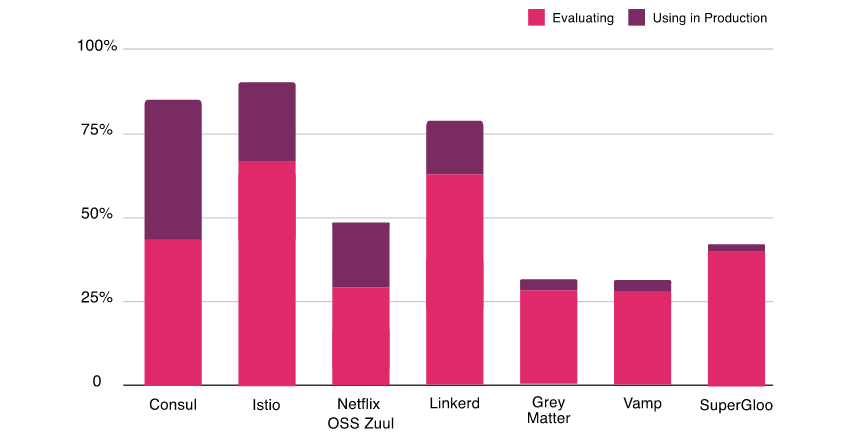
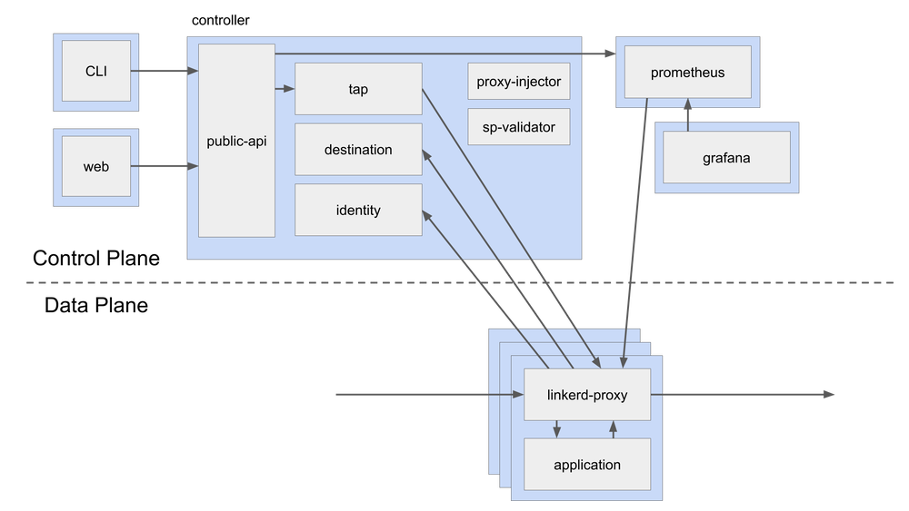

本文译自 [Service Mesh Comparison: Istio vs Linkerd](https://dzone.com/articles/service-mesh-comparison-istio-vs-linkerd)。

根据 [CNCF](https://www.cncf.io/wp-content/uploads/2020/03/CNCF_Survey_Report.pdf) 的[最新年度调查](https://www.cncf.io/wp-content/uploads/2020/03/CNCF_Survey_Report.pdf)，很明显，很多人对在他们的项目中使用服务网格表现出了极大的兴趣，并且许多人已经在他们的生产中使用它们。将近 69％ 的人正在评估 Istio，64％ 的人正在研究 Linkerd。Linkerd 是市场上第一个服务网格，但是 Istio 的服务网格更受欢迎。这两个项目都是最前沿的，而且竞争非常激烈，因此选择哪一个是一个艰难的选择。在此博客文章中，我们将了解有关 Istio 和 Linkerd 的架构，其及组件的更多信息，并比较其特性以帮你做出明智的决定。

## 服务网格简介

在过去的几年中，微服务架构已经成为设计软件应用程序的流行风格。在这种架构中，我们将应用程序分解为可独立部署的服务。这些服务通常是轻量级的、多语言的，并且通常由各种职能团队进行管理。直到这些服务的数量变得庞大且难以管理之前，这种架构风格效果很好。突然之间，它们不再简单了。这在管理各个方面（例如安全性、网络流量控制和可观察性）带来了挑战。**服务网格**可以帮助应对这些挑战。

术语**服务网格**用于描述组成此类应用程序的微服务网络及其之间的交互。随着服务数量和复杂性的增加，其扩展和管理变得越来越困难。服务通常提供服务发现、负载均衡、故障恢复、指标和监控。服务网格通常还具有更复杂的操作要求，例如 A/B 测试、金丝雀发布、限流、访问控制和端到端身份验证。服务网格为负载均衡、服务到服务的身份验证、监控等提供了一种创建服务网络的简单方法，同时对服务代码的更改很少或没有更改。

让我们看一下 Istio 和 Linkerd 的架构。请注意，这两个项目都在快速演进，并且本文基于 Istio 1.6 版本和 Linkerd 2.7 版本。

## Istio

Istio 是一个提供了作为服务网格的整套解决方案的开源平台，提供了安全、连接和监控微服务的统一方法。它得到了 IBM、Google 和 Lyft 等行业领军者的支持。Istio 是最流行、最完善的解决方案之一，其高级特性适用于各种规模的企业。它是 Kubernetes 的一等公民，被设计成模块化、平台无关的系统。有关 Istio 的快速演示，请参考我们[以前的文章](https://www.infracloud.io/blogs/service-mesh-demo-istio-sockshop/)。

### 架构

*Istio 架构来源：[istio.io](https://istio.io/latest/docs/concepts/what-is-istio/)*

### 组件

[Envoy](http://envoyproxy.io/) 是由 Lyft 用 C++ 编写的高性能代理，它可以协调服务网格中所有服务的所有入站和出站流量。它作为 Sidecar 代理与服务一起部署。

Envoy 提供以下功能：

  * 动态服务发现
  * 负载均衡
  * TLS 终止
  * HTTP/2 和 gRPC 代理
  * 断路器
  * 健康检查
  * 按百分比分配流量实现的分阶段发布
  * 故障注入
  * 丰富的指标

在较新的 Istio 版本中，Sidecar 代理对 Mixer 的工作承担了额外的责任。在早期版本的 Istio（<1.6）中，使用 Mixer 从网格收集遥测信息。

**Pilot** 为 Sidecar 代理提供服务发现、流量管理功能和弹性。它将控制流量行为的高级路由规则转换为 Envoy 的特定配置。

**Citadel** 通过内置的身份和凭证管理实现了强大的服务到服务和最终用户身份验证。它可以在网格中启用授权和零信任安全性。

**Galley** 是 Istio 配置验证、提取、处理和分发组件。

### 核心功能

  * **流量管理** — 智能流量路由规则、流量控制和服务级别属性（如断路器、超时和重试）的管理。它使我们能够轻松设置 A/B测试、金丝雀发布和并按比例分配流量的分阶段发布。
  * **安全性** — 在服务之间提供安全的通信通道，并管理大规模身份验证、授权和加密。
  * **可观察性** — 强大的链路跟踪、监控和日志功能提供了深度洞察（deep insights）和可见性。它有助于有效地检测和解决问题。

**Istio** 还具有一个附加组件基础结构服务，该服务支持对微服务的监控。Istio 与 Prometheus、Grafana、Jaeger 和服务网格仪表盘 Kiali 等应用程序集成。 

## Linkerd

Linkerd 是 Buoyant 为 Kubernetes 设计的开源超轻量级的服务网格。用 Rust 完全重写以使其超轻量级和高性能，它提供运行时调试、可观察性、可靠性和安全性，而无需在分布式应用中更改代码。

### 架构

Linkerd 具有三个组件 — UI、数据平面和控制平面。它通过在每个服务实例旁边安装轻量级透明代理来工作。

### 控制平面

Linkerd 的控制平面是一组提供了服务网格的核心功能的服务。它聚合了遥测数据、提供面向用户的 API，并为数据平面代理提供控制数据。以下是控制平面的组件：

  * **控制器** — 它包含一个公共 API 容器，该容器为 CLI 和仪表盘提供 API。
  * **目标** — 数据平面中的每个代理都将访问此组件以查找将请求发送到的位置。它有用于每个路由指标、重试和超时的服务描述信息。
  * **身份** — 它提供了一个*证书颁发机构*，该*证书颁发机构*接受来自代理的 CSR 并返回以正确身份签发的证书。它提供了 mTLS 功能。
  * **代理注入器** — 它是一个准入控制器，用于查找注解（`linkerd.io/inject: enabled`）并更改 pod 规范以添加 `initContainer` 和包含代理本身的 sidecar。
  * **服务配置文件验证器** — 这也是一个准入控制器，用于在保存新[服务描述](https://linkerd.io/2/reference/service-profiles/)之前对其进行验证。
  * **Tap** — 它从 CLI 或仪表盘接收实时监控请求和响应的指令，以在应用程序中提供可观察性。
  * **Web**  — 提供 Web 仪表盘。
  * **Grafana** — Linkerd 通过 Grafana 提供开箱即用的仪表盘。
  * **Prometheus**  — 通过 `/metrics` 在端口 4191 上代理的断点来收集和存储所有 Linkerd 指标。

### 数据平面

Linkerd 数据平面由轻量级代理组成，这些轻量级代理作为边车容器与服务容器的每个实例一起部署。在具有特定注解的 Pod 的初始化阶段，将代理注入（请参见上面的代理注入器）。自从 2.x 由 Rust 中完全重写以来，该代理一直非常轻量级和高性能。这些代理拦截与每个 Pod 之间的通信，以提供检测和加密（TLS），而无需更改应用程序代码。

**代理功能：**

  * HTTP、HTTP/2 和任意 TCP 协议的透明、零配置代理。
  * 自动为 HTTP 和 TCP 流量导出 Prometheus 指标。
  * 透明的零配置 WebSocket 代理。
  * 自动的、可感知延迟的 7 层负载均衡。
  * 非 HTTP 流量的自动的 4 层负载均衡。
  * 按需诊断 tap API。

## 比较

| **特点**         | **Istio**                                                                                         | **Linkerd**                                                                                                  |
|----------------|---------------------------------------------------------------------------------------------------|--------------------------------------------------------------------------------------------------------------|
| 易于安装           | 由于各种配置选项和灵活性，对于团队来说可能不堪重负。                                                                        | 因为有内置和开箱即用的配置，适配起来是相对容易的                                                                                     |
| 平台             | Kubernetes、虚拟机                                                                                    | Kubernetes                                                                                                   |
| 支持的协议          | gRPC、HTTP/2、HTTP/1.x、Websocket 和所有 TCP 流量。                                                        | gRPC、HTTP/2、HTTP/1.x、Websocket 和所有 TCP 流量。                                                                   |
| 入口控制器          | Envoy，Istio 网关本身。                                                                                 | 任何 – Linkerd 本身不提供入口功能。                                                                                      |
| 多集群网格和扩展支持     | 通过各种配置选项以及在 Kubernetes 集群外部扩展网格的稳定版本支持多集群部署。                                                      | 2.7 版本，多群集部署仍处于试验阶段。根据最新版本 2.8，多群集部署是稳定的。                                                                    |
| 服务网格接口（SMI）兼容性 | 通过第三方 CRD。                                                                                        | 原生的流量拆分和指标，而不用于流量访问控制。                                                                                       |
| 监控功能           | 功能丰富                                                                                              | 功能丰富                                                                                                         |
| 追踪支持           | Jaeger、Zipkin                                                                                     | 所有支持 OpenCensus 的后端                                                                                          |
| 路由功能           | 各种负载均衡算法（轮训、随机最少连接），支持基于百分比的流量拆分，支持基于标头和路径的流量拆分。                                                  | 支持 EWMA（指数加权移动平均）负载均衡算法，通过 SNI 支持基于百分比的流量拆分。                                                                 |
| 弹性             | 断路、重试和超时、故障注入、延迟注入。                                                                               | 无断路、无延迟注入支持。                                                                                                 |
| 安全             | mTLS 支持所有协议、可以使用外部 CA 证书/密钥、支持授权规则。                                                                | 除了 TCP 之外，还支持 mTLS，可以使用外部 CA/密钥，但尚不支持授权规则。                                                                   |
| 性能             | 在最新的 1.6 版本中，Istio 的资源占用越来越好并且延迟得到了改善。                                                            | Linkerd 的设计非常轻巧 - 根据第三方[基准测试](https://linkerd.io/2019/05/18/linkerd-benchmarks/index.html)，它比 Istio 快 3-5 倍。 |
| 企业支援           | 不适用于 OSS 版本。如果您将 Google 的 GKE 与 Istio 一起使用，或者将 Red Hat OpenShift 与 Istio 作为服务网格使用，则可能会得到各个供应商的支持。 | 开发了 Linkerd OSS 版本的 Buoyant 提供了完整的企业级工程、支持和培训。                                                               |

## 结论

服务网格正成为云原生解决方案和微服务架构中必不可少的组成部分。它完成了所有繁重的工作，例如流量管理、弹性和可观察性，让开发人员专注于业务逻辑。Istio 和 Linkerd 都已经成熟，并已被多家企业用于生产。对需求的计划和分析对于选择要使用哪个服务网格至关重要。请在分析阶段投入足够的时间，因为在游戏的后期从一个迁移到另一个很复杂。

选择与服务网格一样复杂和关键的技术时，不仅要考虑技术，还要考虑使用技术的背景。缺少背景，很难说 A 是否比 B 好，因为答案确实是“取决于”。我喜欢 Linkerd 的简单，包括入门和以后管理服务网格。此外，多年来，Linkerd 与来自企业公司的用户一起得到了加强。 

一个中可能有一些功能看起来不错，但请确保检查另一个是否计划在不久的将来发布该功能，并基于不仅是理论上的评估，而且还要在概念验证沙箱中对它们进行尝试，做出明智的决定。这种概念验证应集中在易用性、功能匹配以及更重要的是技术的操作方面。引入技术相对容易，最困难的部分是在其生命周期中运行和管理它。

请让我们知道你的想法和意见。

## 参考文献

  1. [https://dzone.com/articles/what-is-a-service-mesh-and-why-do-you-need-one](https://dzone.com/articles/what-is-a-service-mesh-and-why-do-you-need-one)
  2. [https://martinfowler.com/articles/microservices.html](https://martinfowler.com/articles/microservices.html)
  3. [https://istio.io/docs/concepts/traffic-management/](https://istio.io/docs/concepts/traffic-management/)
  4. [服务网格](http://servicemesh.es/)
  5. [Freepik.com 的标题和特色图片](https://www.freepik.com/free-vector/versus-vs-fight-battle-screen-background_6972702.htm#page=1&query=versus&position=0)

*架构图来自 [Istio](https://istio.io/latest/docs/) 和 [Linkerd](https://linkerd.io/2/reference/architecture/) 的文档。*
