2020 年 2 月 4 日到 2 月 11 日，ServiceMesher 社区发起了 Service Mesh 终端用户调查，以下为问卷调查结果。

## 参与问卷调查的人员情况

共收集到 516 份问卷结果，问卷填写者 94.2% 来自 ServiceMesher 社区，21.7% 的人参与过社区线上活动，27.5% 的人参与过社区 meetup，86.6% 看好 Service Mesh 的未来发展前景。

下面是参与问卷调查人员的基本情况。

**公司所属行业**

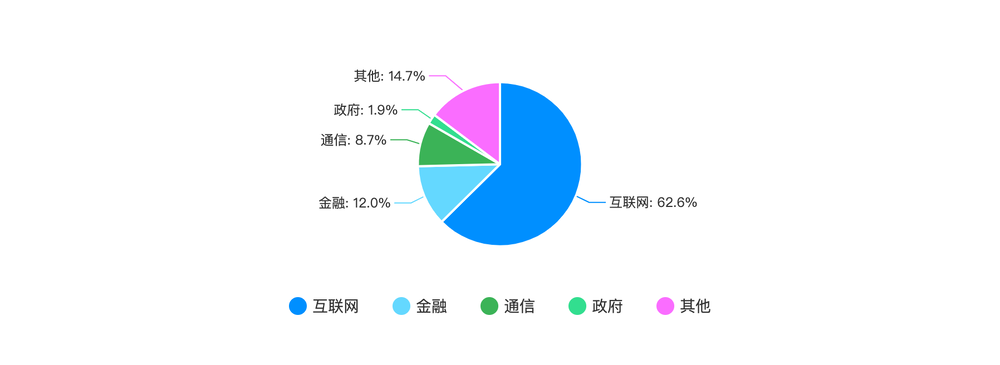

**所在公司的 Service Mesh 使用情况**

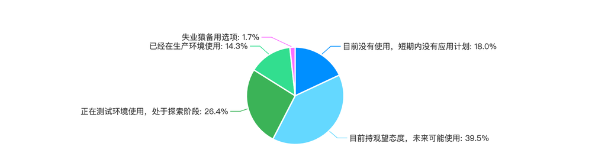

**工作年限**

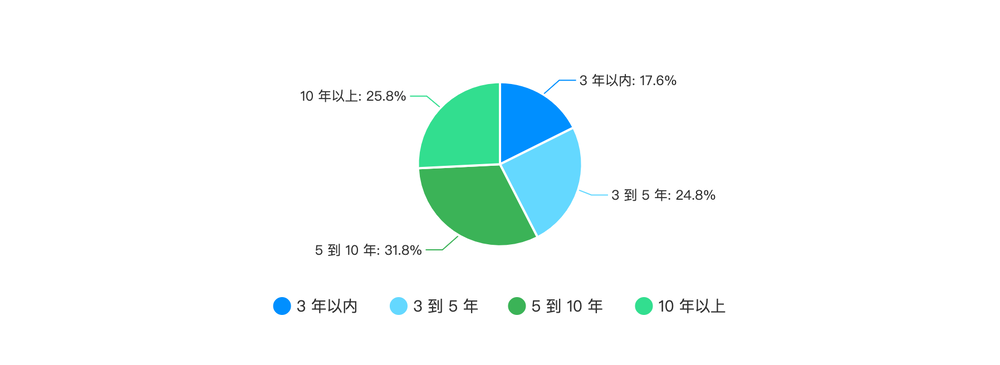

**在公司中担任的职务**

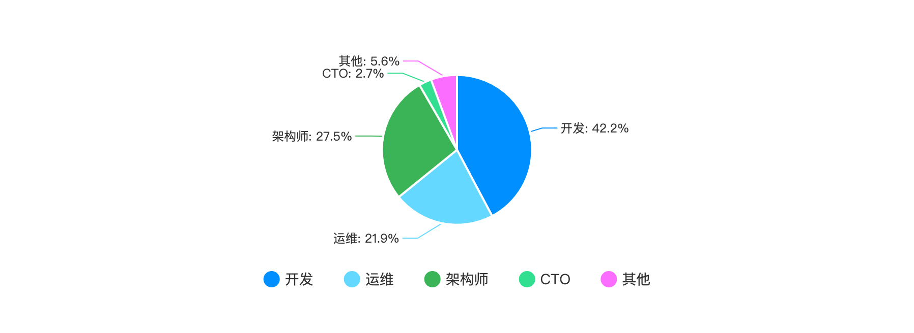

**关注 Service Mesh 技术的时长**

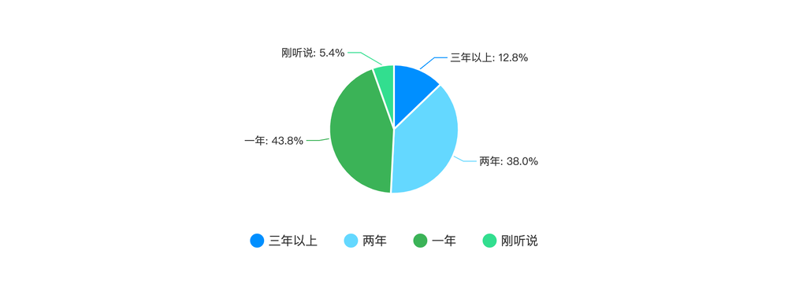

**周围关注或了解 Service Mesh 技术的人员情况**

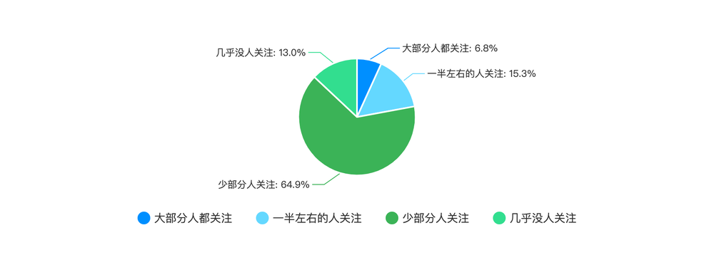

**学习 Service Mesh 技术的方式**

**关注的 Service Mesh 相关开源项目**

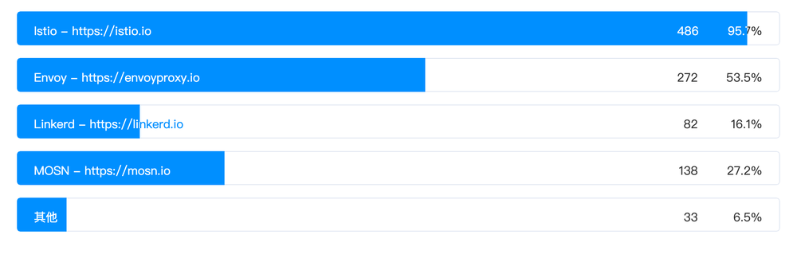

**除了 Service Mesh 外关注的其他云原生领域**

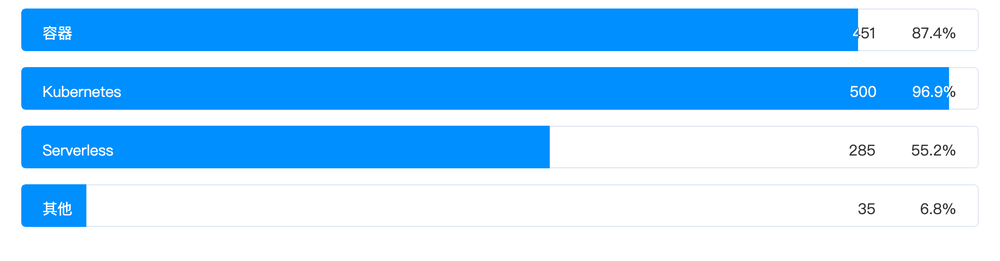

**对 Service Mesh 的了解程度**

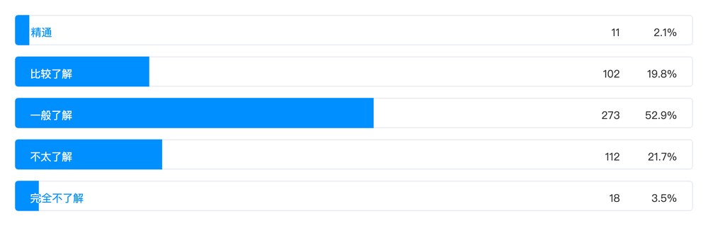

**关注 Service Mesh 技术中的哪部分**

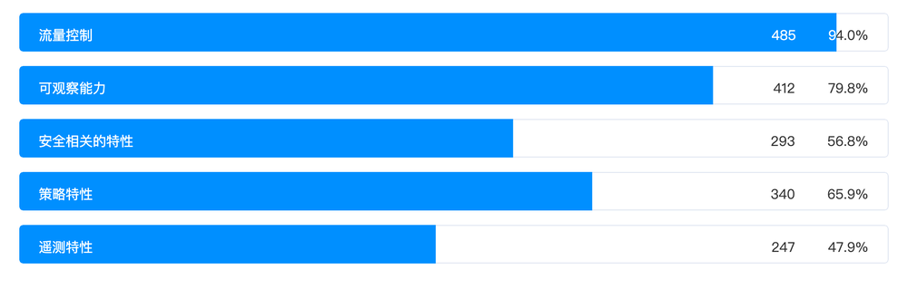

## 社区参与

**了解社区活动的情况**

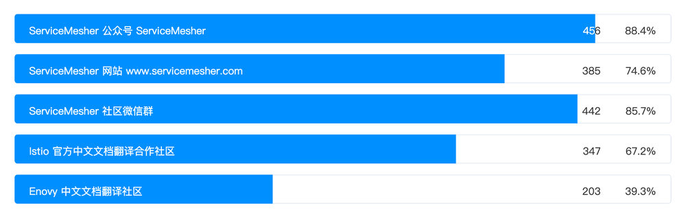

**对社区的建议**

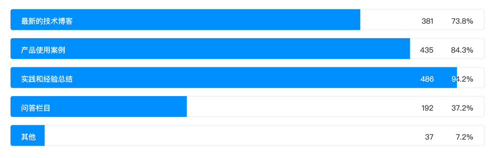

还有很多对社区的建议，反馈比较多的如下：

- 更多落地实践和指南
- 发布一些入门级的文章，结合案例，让技术在中小企业中落地
- 组织一些线上或线下活动
- 对普通开发者的职业发展的建议
- 出系列教程

## 结论

从结果中可以看出，Service Mesh 在互联网公司中关注的比例最高，但是它仍然还在高速发展中，还缺乏完善的教程和案例。

本次问卷调查旨在了解 ServiceMesher 社区成员对 Service Mesh 的了解及社区参与程度，帮助 ServiceMesher 社区做的更好，还需要社区成员们共同的努力。

欢迎关注 Service Mesh 技术的小伙伴们[加入 ServiceMesher 社区](https://www.servicemesher.com/contact/)，共同交流学习和成长。

关于本次调查问卷的最终解释权归 ServiceMesher 社区所有。
