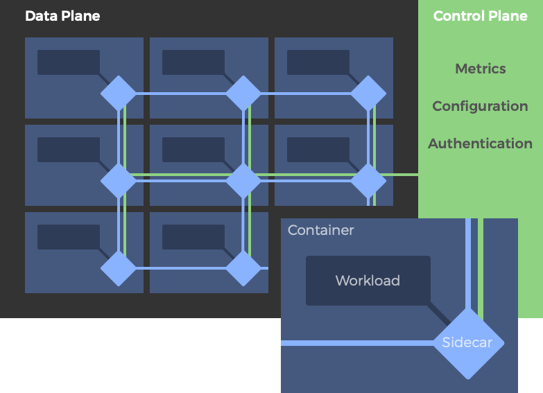
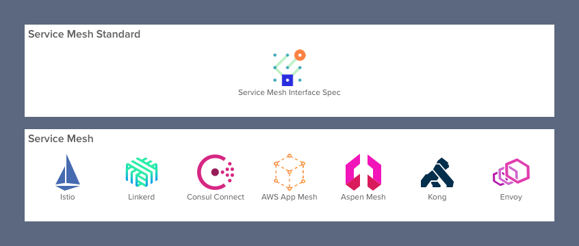
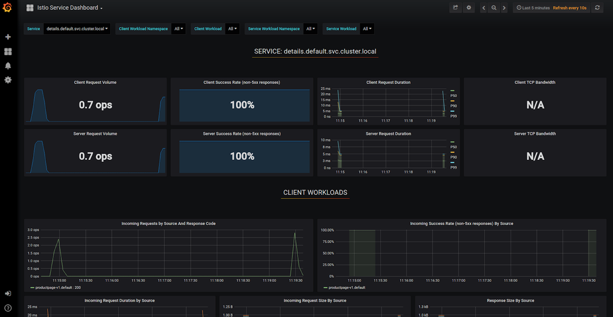

本文为翻译文章，[点击查看原文](https://glasnostic.com/blog/service-mesh-istio-limits-and-benefits-part-1)。

## 编者按

本文作者洞察全局，高屋建瓴，结合当前服务网格的形势，分析了服务网格普遍的局限性，以及从开发者角度讲述服务网格带来的三个有价值的好处：可观测性、流量控制和安全。本文的观点阐述详细而深刻，涵盖了服务网格的关键性技术与架构，以及许多备受瞩目与广泛探讨的话题。

## 前言

今天的应用程序架构师实际上已经放弃了单一的设计，转而改用云原生微服务架构，这样他们就可以充分利用云的灵活性更快地响应不断变化的业务需求，加快开发人员的敏捷迭代。当然，采用微服务架构也有成本。由于应用程序的个数比单个应用程序多得多，所以微服务架构需要更多的管理、监控和安全。像[Istio和Linkerd](https://glasnostic.com/blog/comparing-service-meshes-linkerd-vs-istio)这样的服务网格技术近年来已经相继出现，它们承诺将使微服务的管理、监控和安全的实现更容易。除了[管理服务间连接](https://glasnostic.com/blog/what-is-a-service-mesh-istio-linkerd-envoy-consul)最基本的好处，即将来源服务的请求路由到最佳目的地服务实例，服务网格还为开发人员提供三个有价值的关键领域的好处：可观测性、流量控制和安全。

在本系列的第1部分中，我们将探讨开发人员获得的这些好处。在[第2部分](https://glasnostic.com/blog/service-mesh-istio-limits-and-benefits-part-2)中，我们将从运维的角度来研究它们的局限性。

## 什么是服务网格？

服务网格是一个专用的基础设施层，它的目标是 “[在微服务架构中实现可靠、快速和安全的服务间调用](https://buoyant.io/2017/04/25/whats-a-service-mesh-and-why-do-i-need-one/)”。 它不是一个“服务的网格”，而是一个服务可以插入其中的“代理的网格”，以实现网络的完全抽象化。在典型的服务网格中，这些代理作为sidecar(边车)注入到每个服务部署中。服务不直接通过网络调用服务，而是调用它们的本地sidecar代理，后者代表服务管理请求，从而封装了服务间调用的复杂性。相互连接的sidecar代理实现了所谓的“数据平面”。这与用于配置代理和收集指标的服务网格组件形成对比，这些组件称为服务网格控制平面。

*一个典型的服务网格架构：数据平面代理部署为sidecar，控制平面单独部署。*

简而言之，服务网格旨在解决开发人员在与远程端点通信时面临的许多挑战。服务网格对[运行在容器编排器的“greenfield” 应用](https://glasnostic.com/blog/should-i-use-a-service-mesh)特别有用，例如Kubernetes.

*服务网格形势*

## 目前有哪些服务网格可用?

目前，最受开发者欢迎的服务网格是[Istio](https://glasnostic.com/blog/kubernetes-service-mesh-what-is-istio)项目，该项目最初由谷歌、IBM和Lyft开发。虽然不像Istio那么流行，Buoyant公司的[Linkerd](https://glasnostic.com/blog/an-introduction-to-what-is-linkerd-service-mesh) 才是“原始的”服务网格，今天仍然被广泛使用着。几个部署了大型微服务的网络级公司已经开发了自己的基于[Envoy](https://www.envoyproxy.io/)代理的内部服务网格，巧合的是，Istio也是基于该代理构建的。其他的服务网格也出现了，包括F5的AspenMesh、HashiCorp的Consul Connect、Kong、AWS的AppMesh和微软发起的一项标准化各种服务网格接口的倡议SMI。要了解微服务生态系统的当前状态，请查看我们的文章[“2019微服务生态系统”](https://glasnostic.com/blog/the-2019-microservices-ecosystem)获取更详细的信息。

## 服务网格的局限性

像服务网格这样雄心勃勃的技术，其目标是解决许多或者大部分的由于运行一个庞大的微服务架构而导致的问题，也难免受到批评。有些批评集中在服务网格可能会带来以下不良影响:

- **增加的复杂性**: 在一个已经很复杂的环境中引入代理、sidecar和其他组件会极大地增加开发和运维的复杂性。
- **需要的专业知识**: 在容器编排器(如Kubernetes)之上添加Istio之类的服务网格通常需要运维人员成为这两种技术的专家。
- **延迟**: 服务网格是一种入侵的、复杂的技术，它能向服务架构中添加[显著的延迟](https://istio.io/docs/concepts/performance-and-scalability/#latency-for-istio-hahahugoshortcode-s2-hbhb)。
- **平台的依赖性**: 服务网格的侵入性迫使开发人员和运维人员适应一个高度自治的平台，并遵守其规则。

尽管存在这些限制，但在正确的环境中，服务网格显然不是没有它们的优点，尤其是运行在Kubernetes上的微服务。尽管运营团队仍保持谨慎，但开发人员已经开始迎头赶上，他们被其看似全面的可观察性、流量控制和安全特性所吸引。在接下来的几节中，我们将详细探讨这些优点。

## 可观察性

将应用程序分解为多个微服务并不会自动将其转换为独立服务的网络。应用程序仍然像以前一样作为一个单一的、独立的应用程序—它只是变成了“分布式的”。它的各个微服务通常共享相同的代码库，并且是单个架构蓝图的一部分。它们更像是父应用程序的“组件”，而不是跨多个应用程序共享的服务。

因为这样的微服务程序仍然作为一个独立的应用程序，而不是作为独立服务的网络，所以开发团队对它们进行故障排查，就像他们对一个整体进行故障排查一样。当然，调试这样的微服务程序变得更加困难，因为应用程序组件现在是分布式的。这正是为什么工程师非常希望能够跨远程服务追踪请求以进行调试的原因。与这种分布式调试相关的术语通常被称为“可观察性”。

因为服务网格是一个专用的基础设施层，所有的服务间通信都要通过它，所以它在技术堆栈中处于独特的位置，以便在服务调用级别上提供统一的遥测指标。这意味着，无论好坏，服务都被监控为“黑匣子”。服务网格捕获诸如来源、目的地、协议、URL、状态码、延迟、持续时间等线路数据。这本质上等同于web服务器日志可以提供的数据，但是当然，服务网格可以为所有服务捕获这些数据，而不仅仅是单个服务的web层。

*由Grafana可视化的Istio遥测数据 (图片来源: istio.io).*

一旦捕获，度量(metrics)和日志(logs)将由服务网格的控制平面收集并传递给后端所选择的监控工具。对于严重依赖开源技术的公司来说，Prometheus和Grafana分别是存储和可视化的热门选择。

除了度量服务间的调用之外，一些服务网格还支持请求追踪。通过有效的追踪，工程师能够排除各种问题，如排序问题、服务调用树异常和特定请求的问题等。由于使用了[span标识符](https://opentracing.io/docs/overview/spans/)和[转发的上下文标头](https://www.envoyproxy.io/docs/envoy/latest/configuration/http_conn_man/headers)，服务网格可以进行追踪。当然，要使追踪工作正常，需要修改每个服务，以便在输入时读取追踪头信息，将它们传递给所有相关的执行线程，然后将它们添加到对其他服务的每个请求调用中。

需要指出的是，收集数据仅仅是解决微服务应用程序中可观察性问题的一部分。收集和存储度量需要额外能力的机制的补充，借此来分析数据，然后通过作用于警报、实例自动伸缩或者应用程序的一个操作模式[断路器](https://glasnostic.com/blog/preventing-systemic-failure-circuit-breaking-part-1)来发挥这些数据的作用。

## 流量控制

当涉及到满足服务级别目标(如延迟和正常运行时间)时，管理服务之间通信的能力是至关重要的。这是因为它允许运营团队实现像[circuit breaking](https://glasnostic.com/blog/preventing-systemic-failure-circuit-breaking-part-1)或[backpressure](https://glasnostic.com/blog/preventing-systemic-failure-backpressure)这样的操作模式，以补偿行为不佳的服务。

服务网格可以提供这种类型的流量控制。因为它们的主要功能是管理服务间通信，所以它们能够相当容易地提供这些特性。然而，由于它们的设计目的是有效地将来源请求调用连接到其最优目标服务实例，所以这些流量控制特性是*面向目的地的*。换句话说，服务网格适合在一些目的地实例之间平衡*单个请求调用*，而不合适来控制来源为多个而目的地为一个的流量，或控制整个[服务架构](https://glasnostic.com/blog/microservices-architecture-patterns-service-mesh-glossary#Service-Landscape)的流量。

服务网格通过其控制平面提供对服务间调用的控制，控制平面最终实现组成其数据平面的代理的配置。尽管具体功能可能因服务网格的不同而有所不同，但大多数支持智能配置，即延迟感知负载均衡(也称为“智能路由”)和基于请求属性的路由规则。由于服务网格控制从第4层扩展到第5层及以上，有些还为开发团队提供了实现弹性模式(如重试、超时和截止时间)的能力，以及更高级的模式(如断路、金丝雀发布和A/B发布)。

例如，使用超时，开发人员可以限制微服务等待另一个服务完成请求所需的时间。如果这被证明是一个太粗糙的阈值，超时作为替代可以用来启动断路器。当断路器以这种方式“跳闸”时，它将保持“打开”一段时间，直到服务网格再次认为该服务可用为止。这样，下游客户端就不会受到上游服务过于缓慢的影响，反过来，服务也不会因积压的请求而过载。或者，如果特定客户端的请求行为从服务级别来看，威胁到向相同共享服务发出请求的其他客户端，那么开发人员可以限制高容量客户端的速率，这样其他客户端就不会被淹没。最后，服务网格可以通过强制执行配额来帮助控制流量。例如，运维人员可以根据请求向客户端收费，或者希望在给定的时间范围内限制客户端请求。

## 安全

在某种程度上，单一应用程序受其单地址空间的保护。然而，一旦单一应用程序被分解为多个微服务，网络就会成为一个重要的攻击面。更多的服务意味着更多的网络流量，这对黑客来说意味着更多的机会来攻击信息流。这就是为什么服务要网格化，因为网格提供了保护网络调用的能力(和基础设施)。

服务网格的安全相关的好处体现在以下三个核心领域:

- 服务的认证。
- 服务间通讯的加密。
- 安全相关策略的强制执行。

例如，Istio为开发人员提供了一个证书授权来管理密钥和证书。使用Istio，您可以为每个服务生成证书，并透明地管理这些证书的分发、轮换和撤销。有了这些功能，服务可以彼此进行身份验证并实现适当的访问控制。通常，这以白名单和黑名单的形式出现，因此服务网格知道是否接受传入的请求。在加密方面，服务网格可以使用相互传输层安全协议(mTLS)锁定数据平面通信，从而使服务到服务的通信更加安全。最后，一些服务网格能够执行适用于特定pod、特定命名空间或特定服务的各种安全策略。

## 结论

服务网格是一种新颖但有益的技术，对于那些渴望解决由于运行容器化的微服务架构而导致许多问题的开发人员来说是更是如此。从根本上说，服务网格解决了服务发现和请求路由到最佳服务实例的问题。然而，除了“链接”服务之外，服务网格还可以为开发人员提供有价值的可观察性、流量控制和安全性等好处。

服务网格也是有局限性的。首先，它们是复杂且高度自治的技术，这在很大程度上限制了它们对Kubernetes上“greenfield”应用程序的适用性。它们也可能带来很大的延迟，这限制了它们能够支持的应用程序的规模和复杂性。因此，它们最适合运行在容器调度器(如Kubernetes)上的相当小的、容器化的微服务应用程序。

然而，服务网格在可观测性、流量控制和安全领域提供的价值也是有限的。可观察性实际上只在自包含的分布式应用程序中起作用，这些应用程序由一个公共蓝图管理(并托管在一个git存储库中)。流量控制受到面向路由设计的限制，这使得在任意端点集之间执行策略实际上是不可能的。最后，服务网格的孤立性限制了安全性。自动加密是迈向零信任环境的一大步，但如果没有异构架构的大规模支持，最终的价值将是有限的。

在本系列的[第2部分](https://glasnostic.com/blog/service-mesh-istio-limits-and-benefits-part2)中，我们将从运维的角度研究这三个有价值的领域的局限性：可观察性、流量控制和安全性。
